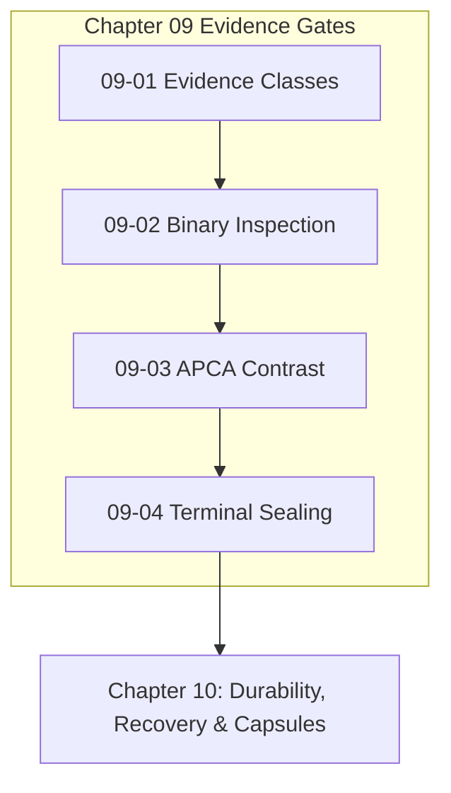

# Chapter 09: Falsifiable Evidence & Completion Gates

---

[Previous: Chapter 08 Index](../08-adversarial-validation-repair/index.md) | [Chapter Index](index.md) | [All Chapters Index](../index.md) | [Next: 09-01 Falsifiable Evidence Classes](09-01-falsifiable-evidence-classes.md)

---

## 1. Chapter Overview & Evidence Architecture

Welcome to Chapter 09 of the OLT Architecture Book. This chapter codifies the four classes of empirical evidence, binary inspection techniques, perceptual color contrast mathematics, and terminal completion gate provers governing completion certification in the OLT (Orchestrating Long Tasks) engine.

Prose claims of task completion are meaningless without cryptographic and empirical verification. Chapter 09 establishes The Four Falsifiable Evidence Classes ($\mathcal{E}_1 \dots \mathcal{E}_4$), details Anti-Mock PNG Binary & Shannon Entropy Inspection, formalizes APCA Perceptual Contrast Mathematics (WCAG 3.0), and defines the Gate Prove & Terminal Completion Sealing Protocol.

```text
+--------------------------------------------------------------------------------------------------+
│                             CHAPTER 09: EVIDENCE GATES TOPOLOGY                                  │
+--------------------------------------------------------------------------------------------------+
│                                                                                                  │
│    ┌───────────────────────────┐                    ┌───────────────────────────┐                │
│    │ 09-01: Falsifiable        │                    │ 09-02: Anti-Mock Binary   │                │
│    │ Evidence Classes          │ ══════════════════►│ & Entropy Inspection      │                │
│    └─────────────┬─────────────┘                    └─────────────┬─────────────┘                │
│                  │                                                │                              │
│                  ▼                                                ▼                              │
│    ┌───────────────────────────┐                    ┌───────────────────────────┐                │
│    │ 09-03: APCA Perceptual    │                    │ 09-04: Gate Prove &       │                │
│    │ Contrast Mathematics      │ ══════════════════►│ Terminal Completion Seal  │                │
│    └───────────────────────────┘                    └───────────────────────────┘                │
│                                                                                                  │
+--------------------------------------------------------------------------------------------------+
```

---

## 2. Chapter Table of Contents & Learning Path

```text
+--------------------------------------------------+--------------+--------------------------------+
│ Document                                         │ Classification│ Core Architectural Focus       │
+--------------------------------------------------+--------------+--------------------------------+
│ 09-01 Falsifiable Evidence Classes               │ Standards    │ 4 classes, receipts & schemas  │
│ 09-02 Anti-Mock Binary & Entropy Inspection      │ Verification │ PNG IHDR, magic & H(X) >= 3.0  │
│ 09-03 APCA Perceptual Contrast Mathematics       │ Mathematics  │ Luminance Y, L_c >= 60 & WCAG3 │
│ 09-04 Gate Prove & Terminal Completion           │ Operations   │ gate:prove & Merkle run seals  │
+--------------------------------------------------+--------------+--------------------------------+
```

### [09-01: Falsifiable Evidence Classes & Verification Proofs](09-01-falsifiable-evidence-classes.md)

Deconstructs the 4 evidence classes: Class 1 (Terminal Receipts), Class 2 (Static AST Invariants), Class 3 (Binary & Entropy Proofs), and Class 4 (Perceptual Contrast). Explains cryptographic evidence bundles.

### [09-02: Anti-Mock PNG Binary & Shannon Entropy Inspection](09-02-anti-mock-png-ihdr-binary-inspection.md)

Details byte-level PNG parsing (magic numbers, 32-byte IHDR header, CRC-32) and Shannon entropy calculation ($H(X) \ge 3.0$) to permanently eliminate placeholder mock images.

### [09-03: APCA Perceptual Contrast Mathematics & WCAG 3.0 Engine](09-03-apca-perceptual-contrast-mathematics.md)

Formalizes non-linear human eye luminance modeling, soft-clipping power transformations, asymmetric contrast calculations ($L_c$), and WCAG 3.0 contrast scorecards.

### [09-04: Gate Prove & Terminal Completion Sealing](09-04-gate-prove-and-terminal-completion.md)

Explains the `gate:prove` CLI command, the terminal completion predicate $\Phi_{\text{run}}$, clean working tree verification, and generational archival rotation.

---

## 3. Core Evidence Formulations Reference Table

$$ \begin{array}{|l|l|l|}
\hline
\textbf{Evidence Class} & \textbf{Formal Equation / Check} & \textbf{Acceptance Standard} \\ \hline
\text{Class 1 (Terminal)} & \text{ExitCode} = 0 \land |\text{Stdout}| > 0 & \text{Clean runtime test execution} \\ \hline
\text{Class 2 (AST)} & |\text{any}| = 0 \land |\text{Suppressions}| = 0 & \text{100\% TypeScript AST purity} \\ \hline
\text{Class 3 (Binary)} & H(X) = -\sum P(x) \log_2 P(x) \ge 3.0 & \text{Non-mock rendered UI assets} \\ \hline
\text{Class 4 (APCA)} & L_c = (Y_{\text{txt}}^{0.56} - Y_{\text{bg}}^{0.56}) \times 1.14 \ge 60.0 & \text{WCAG 3.0 accessible contrast} \\ \hline
\text{Terminal Seal} & \Phi_{\text{run}}(G) = \bigwedge \mathcal{P}_{\text{gate}}(T_i) \equiv 1 & \text{100\% verified DAG completion} \\ \hline
\end{array}$$



---

## 4. Summary & Transition

The falsifiable evidence standards and binary inspection algorithms codified in Chapter 09 guarantee that every completed task and run is mathematically certified and impossible to fake.

Proceed to [09-01: Falsifiable Evidence Classes](09-01-falsifiable-evidence-classes.md) or advance directly to [Chapter 10: Durability, Recovery & Merkle Chains](../10-durability-recovery-capsules/index.md).

---

[Previous: Chapter 08 Index](../08-adversarial-validation-repair/index.md) | [Chapter Index](index.md) | [All Chapters Index](../index.md) | [Next: 09-01 Falsifiable Evidence Classes](09-01-falsifiable-evidence-classes.md)

---
$$
