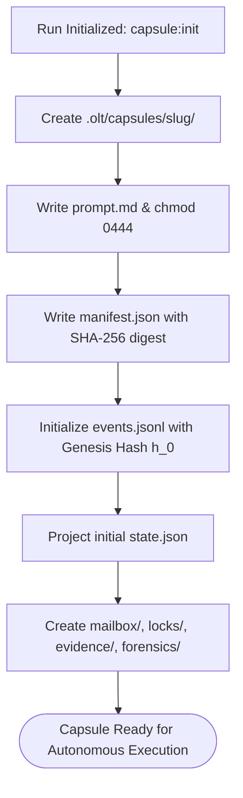

# Capsule Filesystem Anatomy & Directory Hierarchy

---

[Previous: Chapter 10 Index](index.md) | [Chapter Index](index.md) | [All Chapters Index](../index.md) | [Next: 10-02 SHA-256 Merkle Chains](10-02-sha256-merkle-event-chains.md)
---

## 1. Executive Summary & The SSoT Filesystem Model

In long-running autonomous workflows, storing runtime metadata in temporary memory or remote databases introduces failure modes: process crashes lose in-flight transactions, network partitions corrupt state, and external databases prevent hermetic local execution.

The **OLT (Orchestrating Long Tasks)** engine implements the **On-Disk Capsule Filesystem Architecture**. Under this model:

1. **The Capsule Directory as SSoT**: Every run operates within an isolated, self-contained directory under `.olt/capsules/<slug>/`.
2. **Immutable Artifacts & Append-Only Ledgers**: Crucial metadata files (`prompt.md`, `manifest.json`, `events.jsonl`) are strictly append-only or read-only, preventing retrospective state tampering.
3. **Structured Subdirectory Tree**: Dedicated subdirectories isolate inter-agent mailboxes, POSIX concurrency locks, cryptographic evidence bundles, and forensic crash dumps.

```text
┌──────────────────────────────────────────────────────────────────────────────────────────────────┐
│                                 CAPSULE DIRECTORY ANATOMY TOPOLOGY                               │
├──────────────────────────────────────────────────────────────────────────────────────────────────┤
│                                                                                                  │
│   .olt/capsules/<slug>/                                                                          │
│   ├── manifest.json              # Immutable run identity, timestamps, and prompt SHA-256 hash   │
│   ├── prompt.md                  # Verbatim ingested prompt (Mode 0444 read-only)                 │
│   ├── state.json                 # Materialized projection of active DAG & worker leases          │
│   ├── events.jsonl               # Chronological, Merkle-hashed append-only event stream         │
│   ├── mailbox/                   # Inter-agent non-blocking message queues & heartbeat receipts   │
│   │   ├── orch-main/             # Tier 1 Orchestrator incoming/outgoing message queue            │
│   │   └── coord-core/            # Tier 2 Domain Coordinator queue                                │
│   ├── locks/                     # POSIX advisory concurrency locks                               │
│   │   ├── writer.lock            # Exclusive writer lock token (flock LOCK_EX)                    │
│   │   └── observer.lock          # Shared reader inspection token (flock LOCK_SH)                 │
│   ├── evidence/                  # Cryptographic task evidence receipts & test proof bundles      │
│   │   └── TASK-01.json           # Class 1–4 falsifiable evidence bundle for Task 1               │
│   └── forensics/                 # Crash dumps, stalled worktree diffs, and AST failure traces    │
│                                                                                                  │
└──────────────────────────────────────────────────────────────────────────────────────────────────┘
```

---

## 2. File Roles, Permissions & Invariants Matrix

```text
┌──────────────────┬───────────┬──────────────┬────────────────────────────────────────────────────┐
│ File / Directory │ Unix Mode │ Mutation Rule│ Primary Architectural Role                         │
├──────────────────┼───────────┼──────────────┼────────────────────────────────────────────────────┤
│ `manifest.json`  │ 0444 (RO) │ Write-Once   │ Sealed metadata root; binds prompt SHA-256 digest  │
├──────────────────┼───────────┼──────────────┼────────────────────────────────────────────────────┤
│ `prompt.md`      │ 0444 (RO) │ Write-Once   │ Canonical user requirement source of truth         │
├──────────────────┼───────────┼──────────────┼────────────────────────────────────────────────────┤
│ `events.jsonl`   │ 0644 (RW) │ Append-Only  │ Immutable Merkle-hashed chronological event stream │
├──────────────────┼───────────┼──────────────┼────────────────────────────────────────────────────┤
│ `state.json`     │ 0644 (RW) │ Overwrite    │ Materialized projection folded from `events.jsonl` │
├──────────────────┼───────────┼──────────────┼────────────────────────────────────────────────────┤
│ `mailbox/`       │ 0755 (DRW)│ Isolated Dir │ Inter-agent message passing & heartbeat receipts   │
├──────────────────┼───────────┼──────────────┼────────────────────────────────────────────────────┤
│ `locks/`         │ 0755 (DRW)│ Advisory Lock│ POSIX flock file descriptors for mutual exclusion  │
├──────────────────┼───────────┼──────────────┼────────────────────────────────────────────────────┤
│ `evidence/`      │ 0644 (RW) │ Write-Once   │ Falsifiable evidence proofs sealed per task        │
├──────────────────┼───────────┼──────────────┼────────────────────────────────────────────────────┤
│ `forensics/`     │ 0644 (RW) │ Write-Once   │ Diagnostic traces & stale worktree diff snapshots  │
└──────────────────┴───────────┴──────────────┴────────────────────────────────────────────────────┘
```



---

## 3. Capsule Lifecycle & Compaction

A capsule transitions through three distinct storage phases:

1. **Active Phase** (`.olt/capsules/<slug>/`): Full concurrency, active locking, real-time event streaming.
2. **Completed Phase**: Terminal Merkle root sealed, state transitioned to `COMPLETED`, working trees cleanly merged.
3. **Archived Phase** (`.olt/archive/<slug>/`): Compacted into immutable historical storage; completed objectives recorded in `ARCHIVED_OBJECTIVES.jsonl`.

---

## 4. Architectural Invariants Summary

1. **Self-Contained SSoT**: All operational data resides within the capsule directory, ensuring zero external database dependencies.
2. **Write-Once Manifest**: `manifest.json` and `prompt.md` are sealed upon creation and never modified.
3. **Append-Only Ledger**: `events.jsonl` is the canonical truth; state reconstruction is always reproducible.

---

[Previous: Chapter 10 Index](index.md) | [Chapter Index](index.md) | [All Chapters Index](../index.md) | [Next: 10-02 SHA-256 Merkle Chains](10-02-sha256-merkle-event-chains.md)
---
