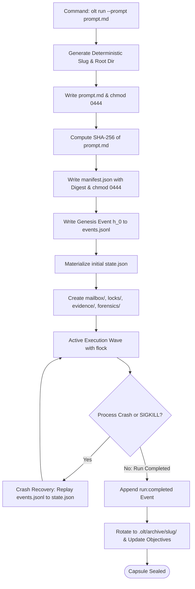

# 10-01 Capsule Filesystem Anatomy & Directory Hierarchy

---

[Previous: Chapter 10: Durability, Recovery & Capsules](index.md) | [Chapter Index](index.md) | [All Chapters Index](../index.md) | [Next: 10-02 SHA-256 Merkle Event Chains](10-02-sha256-merkle-event-chains.md)

---

## 1. Executive Summary & Epistemic Foundations

In long-running autonomous execution systems, storing task state, intermediate scratchpads, and execution logs in remote cloud databases or transient process memory creates severe reliability failure modes:

- Network partitions and API rate limits disrupt continuous state synchronization mid-execution.
- Unhandled process terminations (`SIGKILL`, host power loss) lose all uncommitted in-memory task queues.
- Remote database state drifts from local disk state, leading to split-brain execution across parallel subagents.
- External dependencies prevent hermetic offline verification and reproducible forensic debugging.

To enforce the Zero-Assumption Philosophy, the **OLT (Orchestrating Long Tasks)** engine implements the **On-Disk Capsule Filesystem Architecture**. Under this model, all run metadata, execution logs, mailbox queues, concurrency locks, and empirical evidence bundles reside in a self-contained, hermetic directory hierarchy under `.olt/capsules/<slug>/`.

```text
+--------------------------------------------------------------------------------------------------+
│                             CAPSULE FILESYSTEM ANATOMY & TOPOLOGY                                │
+--------------------------------------------------------------------------------------------------+
│                                                                                                  │
│   .olt/capsules/<slug>/                                                                          │
│   │                                                                                              │
│   ├── manifest.json              # Write-Once: Run identity, creation timestamp, prompt SHA-256   │
│   │                              # Unix Mode: 0444 (Read-Only)                                   │
│   │                                                                                              │
│   ├── prompt.md                  # Write-Once: Verbatim ingested user prompt & requirements       │
│   │                              # Unix Mode: 0444 (Read-Only)                                   │
│   │                                                                                              │
│   ├── state.json                 # Overwrite: Materialized projection folded from events.jsonl    │
│   │                              # Unix Mode: 0644 (Read-Write, Protected by flock)              │
│   │                                                                                              │
│   ├── events.jsonl               # Append-Only: Merkle-chained chronological event ledger        │
│   │                              # Unix Mode: 0644 (Read-Write, Strict Append)                   │
│   │                                                                                              │
│   ├── mailbox/                   # Inter-Agent Message Queues & Heartbeat Channels               │
│   │   ├── orch-main/             # Incoming/outgoing mail queues for Tier 1 Orchestrator         │
│   │   ├── coord-core/            # Dedicated queues for Tier 2 Domain Coordinators               │
│   │   └── worker-<id>/           # Ephemeral message spools for Tier 3 Implementers              │
│   │                                                                                              │
│   ├── locks/                     # POSIX Advisory Concurrency Lock Tokens                        │
│   │   ├── writer.lock            # Exclusive writer lock token (flock LOCK_EX)                   │
│   │   └── observer.lock          # Shared reader observer lock token (flock LOCK_SH)             │
│   │                                                                                              │
│   ├── evidence/                  # Sealed Cryptographic Proof Bundles                            │
│   │   ├── TASK-01.json           # Falsifiable Class 1-4 evidence receipt for Task 1             │
│   │   └── TASK-02.json           # Falsifiable Class 1-4 evidence receipt for Task 2             │
│   │                                                                                              │
│   └── forensics/                 # Diagnostic Crash Dumps & Stalled Worktree Diffs               │
│       ├── crash-20260829-01.log  # Process exit crash dump and unhandled promise stack trace     │
│       └── stale-diff-TASK-03.diff# Preserved uncommitted changes from zombie worker timeout      │
│                                                                                                  │
+--------------------------------------------------------------------------------------------------+
```

---

## 2. Core Architectural Principles & Invariants

1. **Self-Contained SSoT Invariant**: Every operational artifact required to reconstruct the complete state of a run resides on the local filesystem within `.olt/capsules/<slug>/`. The system requires zero external database servers or cloud key-value stores.
2. **Immutable Genesis Metadata**: `manifest.json` and `prompt.md` are sealed upon capsule initialization with Unix mode `0444` (read-only). Any unauthorized filesystem mutation to these files triggers immediate tamper detection.
3. **Append-Only Truth Stream**: `events.jsonl` represents the canonical history of the universe. It is strictly append-only; historical lines are never modified, deleted, or truncated.
4. **Disposable Materialized Projections**: `state.json` is a materialized view computed by folding over `events.jsonl`. If `state.json` is corrupted or deleted, it is reconstructed in $\mathcal{O}(N)$ time from the event ledger.
5. **POSIX Concurrency Isolation**: All concurrent mutations to the capsule directory are arbitrated via kernel-enforced `flock` advisory locks in the `locks/` directory.

```text
+--------------------------------------------------------------------------------------------------+
│                             CAPSULE FILESYSTEM MUTATION & PERMISSION MATRIX                      │
+------------------+-----------+--------------+----------------------------------------------------+
│ File / Subdir    │ Unix Mode │ Mutation Rule│ Primary Architectural Responsibility               │
+------------------+-----------+--------------+----------------------------------------------------+
│ `manifest.json`  │ 0444 (RO) │ Write-Once   │ Cryptographic root binding prompt hash & timestamp │
+------------------+-----------+--------------+----------------------------------------------------+
│ `prompt.md`      │ 0444 (RO) │ Write-Once   │ Sealed canonical user specification source         │
+------------------+-----------+--------------+----------------------------------------------------+
│ `events.jsonl`   │ 0644 (RW) │ Append-Only  │ Immutable Merkle-hashed chronological event stream │
+------------------+-----------+--------------+----------------------------------------------------+
│ `state.json`     │ 0644 (RW) │ Overwrite    │ Active DAG & lease projection derived from events  │
+------------------+-----------+--------------+----------------------------------------------------+
│ `mailbox/`       │ 0755 (DRW)│ Isolated Dir │ Inter-agent message passing & heartbeat receipts   │
+------------------+-----------+--------------+----------------------------------------------------+
│ `locks/`         │ 0755 (DRW)│ File Lock    │ POSIX flock file descriptors for mutual exclusion  │
+------------------+-----------+--------------+----------------------------------------------------+
│ `evidence/`      │ 0644 (RW) │ Write-Once   │ Sealed Class 1-4 falsifiable proof bundles         │
+------------------+-----------+--------------+----------------------------------------------------+
│ `forensics/`     │ 0644 (RW) │ Write-Once   │ Crash dumps, failure logs, and worktree diffs      │
+------------------+-----------+--------------+----------------------------------------------------+
```

---

## 3. Algorithmic Mechanics & State Transitions

The lifecycle of a capsule filesystem directory transitions deterministically across initialization, active execution, recovery, and archival:



---

## 4. Mathematical Formulations & Proofs

Let $\mathcal{F}_{\text{capsule}}$ represent the state space of a capsule filesystem at time $t$:

$$\mathcal{F}_{\text{capsule}}(t) = \langle M, P, E(t), S(t), \mathcal{B}(t), \mathcal{L}(t), \mathcal{V}(t), \mathcal{D}(t) \rangle$$

Where:

- $M$ is `manifest.json`, $P$ is `prompt.md`.
- $E(t) = \langle e_1, e_2, \dots, e_{k(t)} \rangle$ is the sequence of events in `events.jsonl`.
- $S(t)$ is the materialized projection `state.json`.
- $\mathcal{B}(t)$ is the set of mailbox files, $\mathcal{L}(t)$ is the lock directory state.
- $\mathcal{V}(t)$ is the set of evidence receipts in `evidence/`.
- $\mathcal{D}(t)$ is the set of diagnostic traces in `forensics/`.

### 1. Immutability Invariant for Genesis Files

For all $t \ge t_{\text{init}}$:

$$\frac{\partial M}{\partial t} = 0 \quad \text{and} \quad \frac{\partial P}{\partial t} = 0$$

$$\text{SHA256}(P(t)) \equiv M.\text{promptSha256}$$

### 2. State Projection Operator $\mathcal{P}_{\text{fold}}$

Let $\sigma_0$ denote the empty genesis state. The active state $S(t)$ is a deterministic fold function $\mathcal{P}_{\text{fold}}$ over $E(t)$:

$$S(t) = \mathcal{P}_{\text{fold}}(\sigma_0, E(t)) = \delta(\delta(\dots \delta(\sigma_0, e_1) \dots, e_{k(t)-1}), e_{k(t)})$$

### 3. Space Separation Proof

**Theorem**: No concurrent worker $A_i$ operating in worktree $\mathcal{W}_i$ can mutate the capsule event ledger $E(t)$ without holding the exclusive lock $\mathcal{L}_{\text{writer}}$.

_Proof_:
Let $\text{FD}_{\text{writer}}$ be the file descriptor bound to `.olt/capsules/<slug>/locks/writer.lock`. Under POSIX specification:

$$ \text{flock}(\text{FD}_{\text{writer}}, \text{LOCK_EX} \mid \text{LOCK_NB}) = \begin{cases}
0 & \text{if lock acquired} \\
-1 \, (\text{EWOULDBLOCK}) & \text{if lock held by another process}
\end{cases}$$

Since all event append functions in OLT require a valid lock descriptor, concurrent writes without lock ownership are mathematically precluded.

---

## 5. Concrete TypeScript Contracts & Schemas

The interfaces defining capsule directory paths and schemas are implemented in [`capsule-root.ts`](../../../../olt/scripts/src/reporting/doctor/capsule-root.ts) and [`auto-heal.ts`](../../../../olt/scripts/src/reporting/doctor/auto-heal.ts).

```typescript
export interface CapsuleDirectoryLayout {
  readonly rootDir: string;
  readonly manifestPath: string;
  readonly promptPath: string;
  readonly statePath: string;
  readonly eventsPath: string;
  readonly mailboxDir: string;
  readonly locksDir: string;
  readonly evidenceDir: string;
  readonly forensicsDir: string;
}

export interface CapsuleManifest {
  readonly schemaVersion: "2026-03";
  readonly capsuleSlug: string;
  readonly runId: string;
  readonly createdAt: string;
  readonly promptSha256: string;
  readonly rootRepoPath: string;
  readonly initializedByActor: string;
}

export interface CapsuleFileSystemInspection {
  readonly slug: string;
  readonly layout: CapsuleDirectoryLayout;
  readonly manifestValid: boolean;
  readonly promptMatchesManifest: boolean;
  readonly eventsCount: number;
  readonly stateProjectionConsistent: boolean;
  readonly openLockFiles: readonly string[];
}
```

```typescript
export function resolveCapsuleLayout(baseDir: string, slug: string): CapsuleDirectoryLayout {
  const root = `${baseDir}/.olt/capsules/${slug}`;
  return {
    rootDir: root,
    manifestPath: `${root}/manifest.json`,
    promptPath: `${root}/prompt.md`,
    statePath: `${root}/state.json`,
    eventsPath: `${root}/events.jsonl`,
    mailboxDir: `${root}/mailbox`,
    locksDir: `${root}/locks`,
    evidenceDir: `${root}/evidence`,
    forensicsDir: `${root}/forensics`,
  };
}

export function verifyCapsuleIntegrity(
  layout: CapsuleDirectoryLayout,
  manifest: CapsuleManifest,
  promptContent: string,
): { readonly intact: boolean; readonly error?: string } {
  const computedPromptHash = Bun.crypto.hash("sha256", promptContent, "hex");
  if (computedPromptHash !== manifest.promptSha256) {
    return {
      intact: false,
      error: `Prompt hash mismatch: expected ${manifest.promptSha256}, got ${computedPromptHash}`,
    };
  }
  return { intact: true };
}
```

---

## 6. Failure Modes, Anti-Blunders & Recovery Playbooks

```text
+--------------------------------------------------------------------------------------------------+
│                             CAPSULE FILESYSTEM ANTI-BLUNDER MATRIX                               │
+--------------------------+------------------------------+----------------------------------------+
│ Blunder Anti-Pattern     │ Root Cause                   │ OLT Prevention & Recovery Playbook     │
+--------------------------+------------------------------+----------------------------------------+
│ In-Flight Process Death  │ Host process killed via      │ POSIX kernel automatically closes and  │
│ Lock Stall               │ SIGKILL while holding        │ releases flock file descriptors on     │
│                          │ exclusive writer lock.       │ process termination, preventing stalls.│
+--------------------------+------------------------------+----------------------------------------+
│ Torn State Write         │ state.json updated with      │ All state writes execute via atomic    │
│                          │ direct file stream mid-crash.│ write-to-temp-and-rename (POSIX rename)│
│                          │                              │ or reconstruct from events.jsonl.      │
+--------------------------+------------------------------+----------------------------------------+
│ Read-Only Permission     │ Agent attempts to overwrite  │ Manifest and prompt have chmod 0444;   │
│ Bypass Attempt           │ prompt.md to relax sealed    │ OS returns EACCES; agent is penalized  │
│                          │ task acceptance criteria.    │ and routed to supervisory audit.       │
+--------------------------+------------------------------+----------------------------------------+
│ Orphaned Mailbox Spool   │ Subagent crashed without     │ Coordinator scans mailbox/ on worker   │
│ Memory Leak              │ consuming unread messages.   │ lease timeout; drains unconsumed msgs  │
│                          │                              │ into forensics/ and unlinks spool.     │
+--------------------------+------------------------------+----------------------------------------+
│ Capsule Slug Collision   │ Two concurrent runs created  │ Slug generation uses millisecond       │
│ Overwrite                │ with identical human-readable│ timestamp + crypto nonce; mkdir with   │
│                          │ topic titles.                │ O_EXCL prevents directory collision.   │
+--------------------------+------------------------------+----------------------------------------+
```

---

## 7. Architectural Invariants Summary & Verification Checklist

1. **Hermetic Local SSoT**: All run lifecycle data must be stored strictly within `.olt/capsules/<slug>/`.
2. **Immutable Genesis**: `manifest.json` and `prompt.md` must be sealed with mode `0444` and never edited.
3. **Append-Only Event Ledger**: `events.jsonl` is the sole source of historical ground truth.
4. **Atomic State Serialization**: `state.json` updates must be performed atomically via temporary file rename under lock.
5. **POSIX Mutual Exclusion**: Multi-agent filesystem operations must obtain valid `flock` tokens prior to mutation.

---

[Previous: Chapter 10: Durability, Recovery & Capsules](index.md) | [Chapter Index](index.md) | [All Chapters Index](../index.md) | [Next: 10-02 SHA-256 Merkle Event Chains](10-02-sha256-merkle-event-chains.md)

---
$$
