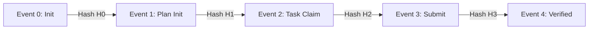

# SHA-256 Merkle Event Chains & Tamper Detection

[OLT Documentation Hub](../../README.md) > [Architecture Index](../index.md) > [Chapter 10](./index.md) > 10-02 Merkle Chains

---

[⏮️ Previous: 10-01 Capsule Filesystem Anatomy](10-01-capsule-filesystem-anatomy.md) | [📂 Chapter Index](index.md) | [📚 All Chapters Index](../index.md) | [⏭️ Next: 10-03 POSIX Flock Advisory Locking](10-03-posix-flock-advisory-locking.md)
---

## 1. Cryptographic Event Chaining

Every event record appended to `events.jsonl` incorporates the cryptographic hash of the preceding event:

$$H_0 = \text{SHA256}(\text{manifest.json})$$

$$H_i = \text{SHA256}(H_{i-1} \mathbin{\Vert} E_i \mathbin{\Vert} \text{timestamp})$$

If an adversary or rogue agent deletes, inserts, or mutates any line in `events.jsonl`, the hash chain breaks, triggering an immediate security halt (`AUDIT_HASH_CHAIN_MUTATED`).

---

[⏮️ Previous: 10-01 Capsule Filesystem Anatomy](10-01-capsule-filesystem-anatomy.md) | [📂 Chapter Index](index.md) | [📚 All Chapters Index](../index.md) | [⏭️ Next: 10-03 POSIX Flock Advisory Locking](10-03-posix-flock-advisory-locking.md)
---
