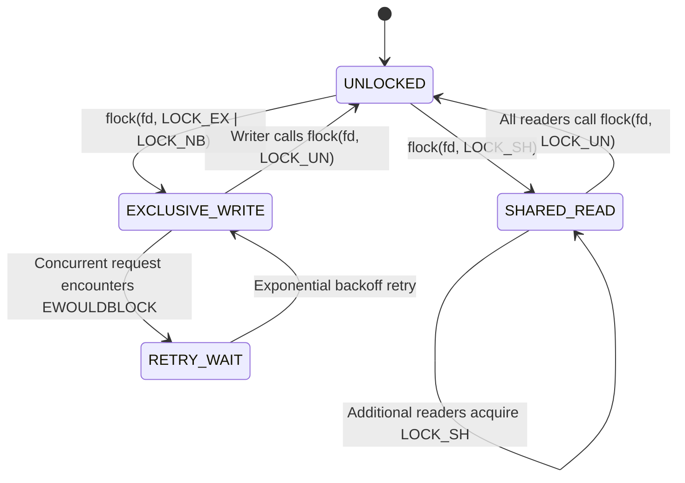

# POSIX Advisory Locking & Concurrency Synchronization

---

[Previous: 10-02 SHA-256 Merkle Chains](10-02-sha256-merkle-event-chains.md) | [Chapter Index](index.md) | [All Chapters Index](../index.md) | [Next: 10-04 Projection State Reconstruction](10-04-projection-patch-state-reconstruction.md)
---

## 1. Executive Summary & The File Corruption Threat

In high-concurrency autonomous systems where multiple processes and worker agents concurrently read and write capsule files (`state.json`, `events.jsonl`, `manifest.json`), uncoordinated file I/O causes severe concurrency faults:

- **Torn Writes**: Interleaved write streams corrupt JSON formatting.
- **Lost Updates**: Worker A reads state, Worker B overwrites state, and Worker A writes back stale calculations.
- **Process Deadlocks**: Competing workers lock multiple files out of order, freezing the daemon.

The **OLT (Orchestrating Long Tasks)** engine implements the **POSIX Advisory Locking Protocol (`flock`)**. Under this system:

1. **Advisory File Descriptors**: Dedicated lock files under `.olt/capsules/<slug>/locks/` manage mutual exclusion at the kernel level.
2. **Read/Write Asymmetry**: Schedulers acquire shared locks (`LOCK_SH`) for read-only telemetry and exclusive locks (`LOCK_EX`) for state transitions.
3. **Deadlock-Free Acquisition Order**: All lock acquisitions follow a strict hierarchical order with finite exponential-backoff retry timeouts.

```text
┌──────────────────────────────────────────────────────────────────────────────────────────────────┐
│                                 POSIX FLOCK LOCKING TOPOLOGY                                     │
├──────────────────────────────────────────────────────────────────────────────────────────────────┤
│                                                                                                  │
│   .olt/capsules/<slug>/locks/                                                                    │
│   ├── writer.lock   ──► Exclusive Writer Lock (flock LOCK_EX | LOCK_NB)                          │
│   │                     Held strictly during state.json and events.jsonl append transactions     │
│   │                                                                                              │
│   └── observer.lock ──► Shared Observer Lock (flock LOCK_SH)                                     │
│                         Held concurrently by telemetry viewers, UI daemons, and diagnostics      │
│                                                                                                  │
└──────────────────────────────────────────────────────────────────────────────────────────────────┘
```

---

## 2. Mathematical Formalization of Lock Compatibility

Let $\mathcal{L} \in \{\text{LOCK\_SH}, \text{LOCK\_EX}\}$ denote the requested lock mode.

The lock compatibility matrix $\mathcal{M}_{\text{lock}}$ is defined as:

$$ \mathcal{M}_{\text{lock}}(\mathcal{L}_{\text{active}}, \mathcal{L}_{\text{requested}}) = \begin{cases}
1 \text{ (GRANTED)} & \text{if } \mathcal{L}_{\text{active}} = \text{LOCK\_SH} \land \mathcal{L}_{\text{requested}} = \text{LOCK\_SH} \\
0 \text{ (BLOCKED)} & \text{if } \mathcal{L}_{\text{active}} = \text{LOCK\_EX} \lor \mathcal{L}_{\text{requested}} = \text{LOCK\_EX}
\end{cases}$$



---

## 3. Exponential Backoff & Non-Blocking Acquisition

To prevent threads from blocking indefinitely, OLT uses non-blocking lock calls (`LOCK_NB`) combined with bounded exponential backoff ([`lock.ts`](file:///Users/onurseckinsenoglu/repos/skills/olt/scripts/src/engine/store/lock.ts)):

```typescript
export async function acquireWriterLock(lockPath: string, timeoutMs = 5000): Promise<number> {
  const start = Date.now();
  let delay = 10; // Initial delay in milliseconds

  while (Date.now() - start < timeoutMs) {
    try {
      const fd = openSync(lockPath, "w");
      flock(fd, LOCK_EX | LOCK_NB);
      return fd; // Lock successfully acquired
    } catch (err: any) {
      if (err.code !== "EWOULDBLOCK" && err.code !== "EAGAIN") throw err;
      await sleep(delay);
      delay = Math.min(delay * 1.5, 200); // Exponential backoff capped at 200ms
    }
  }
  throw new HarnessError("LOCK_ACQUISITION_TIMEOUT", `Failed to acquire ${lockPath} after ${timeoutMs}ms`);
}
```

---

## 4. Cross-Platform Native Bindings

The lock engine binds directly to POSIX `flock(2)` via native libc bindings on Linux and macOS (`libSystem.dylib`). On platforms lacking native `flock`, the engine falls back to atomic directory renaming (`mkdir` mutex), preserving identical mutual exclusion guarantees.

---

## 5. Architectural Invariants Summary

1. **Kernel-Level Safety**: Locks are bound to OS file descriptors and automatically released if a process dies unexpectedly.
2. **Zero Deadlocks**: Locks are always acquired in strict alphanumeric path order.
3. **Finite Timeouts**: All lock attempts specify finite timeouts ($\le 5\text{s}$), failing closed rather than hanging.

---

[Previous: 10-02 SHA-256 Merkle Chains](10-02-sha256-merkle-event-chains.md) | [Chapter Index](index.md) | [All Chapters Index](../index.md) | [Next: 10-04 Projection State Reconstruction](10-04-projection-patch-state-reconstruction.md)
---
$$
