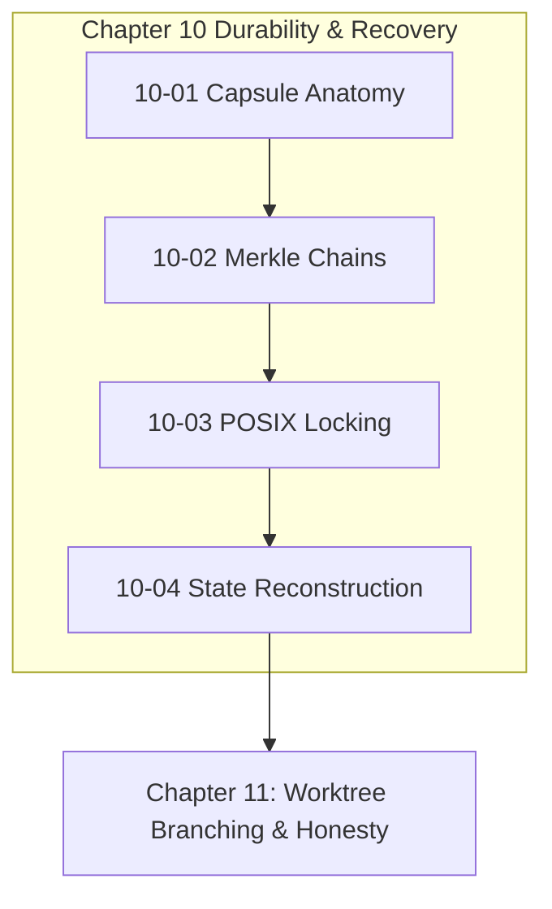

# Chapter 10: Durability, Recovery & Merkle Chains

---

[Previous: Chapter 09 Index](../09-falsifiable-evidence-gates/index.md) | [Chapter Index](index.md) | [All Chapters Index](../index.md) | [Next: 10-01 Capsule Filesystem Anatomy](10-01-capsule-filesystem-anatomy.md)

---

## 1. Chapter Overview & Durability Architecture

Welcome to Chapter 10 of the OLT Architecture Book. This chapter codifies the on-disk capsule filesystem structure, SHA-256 Merkle event chaining algorithms, POSIX advisory locking protocols, and torn-tail state reconstruction mechanics governing durability and disaster recovery in the OLT (Orchestrating Long Tasks) engine.

Unstructured state management leads to lost transactions, corrupted JSON files, and unrecoverable crashes. Chapter 10 establishes the Capsule Filesystem Anatomy, details SHA-256 Merkle Event Chains & Tamper-Evident Ledgers, formalizes POSIX Advisory Locking (`flock`), and defines Projection Patch State Reconstruction & Torn-Tail Healing.

```text
+--------------------------------------------------------------------------------------------------+
│                             CHAPTER 10: DURABILITY & RECOVERY TOPOLOGY                           │
+--------------------------------------------------------------------------------------------------+
│                                                                                                  │
│    ┌───────────────────────────┐                    ┌───────────────────────────┐                │
│    │ 10-01: Capsule Filesystem │                    │ 10-02: SHA-256 Merkle     │                │
│    │ Anatomy & Hierarchy       │ ══════════════════►│ Event Chains & Ledgers    │                │
│    └─────────────┬─────────────┘                    └─────────────┬─────────────┘                │
│                  │                                                │                              │
│                  ▼                                                ▼                              │
│    ┌───────────────────────────┐                    ┌───────────────────────────┐                │
│    │ 10-03: POSIX Flock        │                    │ 10-04: Projection State   │                │
│    │ Advisory Locking Protocol │ ══════════════════►│ Reconstruction & Healing  │                │
│    └───────────────────────────┘                    └───────────────────────────┘                │
│                                                                                                  │
+--------------------------------------------------------------------------------------------------+
```

---

## 2. Chapter Table of Contents & Learning Path

```text
+--------------------------------------------------+--------------+--------------------------------+
│ Document                                         │ Classification│ Core Architectural Focus       │
+--------------------------------------------------+--------------+--------------------------------+
│ 10-01 Capsule Filesystem Anatomy & Hierarchy     │ Architecture │ SSoT directory layout & modes  │
│ 10-02 SHA-256 Merkle Event Chains & Ledgers      │ Security     │ Cryptographic hash chaining    │
│ 10-03 POSIX Flock Advisory Locking Protocol      │ Concurrency  │ Mutexes, backoff & libc flock  │
│ 10-04 Projection State Reconstruction & Healing  │ Reliability  │ Event folds & torn-tail repair │
+--------------------------------------------------+--------------+--------------------------------+
```

### [10-01: Capsule Filesystem Anatomy & Directory Hierarchy](10-01-capsule-filesystem-anatomy.md)

Deconstructs the `.olt/capsules/<slug>/` storage layout: `manifest.json`, `prompt.md`, `state.json`, `events.jsonl`, `mailbox/`, `locks/`, `evidence/`, and `forensics/`. Details permission modes and storage phases.

### [10-02: SHA-256 Merkle Event Chains & Tamper-Evident Ledgers](10-02-sha256-merkle-event-chains.md)

Formalizes the recursive Merkle hash recurrence ($h_k = \text{SHA256}(h_{k-1} \parallel \text{CanonicalJSON}(e_k))$), linear verification algorithms, and JSONL schemas.

### [10-03: POSIX Advisory Locking & Concurrency Synchronization](10-03-posix-flock-advisory-locking.md)

Details kernel-level file descriptor locking (`LOCK_EX` vs. `LOCK_SH`), lock compatibility matrices, non-blocking exponential backoff acquisition, and cross-platform fallbacks.

### [10-04: Projection Patch State Reconstruction & Torn-Tail Healing](10-04-projection-patch-state-reconstruction.md)

Explains pure state projection folds ($S_N = \text{FoldLeft}(\mathcal{P}, S_0, \mathbf{E})$), the torn-tail truncation and auto-healing algorithm, and incremental patch applications.

---

## 3. Core Durability Reference Table

$$ \begin{array}{|l|l|l|}
\hline
\textbf{Mechanism} & \textbf{Formal Expression} & \textbf{Operational Invariant} \\ \hline
\text{Genesis Hash} & h_0 = \text{SHA256}(\text{manifest.json}) & \text{Immutable metadata anchor} \\ \hline
\text{Merkle Recurrence} & h_k = \text{SHA256}(h_{k-1} \mathbin{\Vert} \text{Canon}(e_k)) & \text{Tamper-evident event chaining} \\ \hline
\text{Lock Compatibility} & \mathcal{M}(\text{EX}, \text{EX}) = 0, \quad \mathcal{M}(\text{SH}, \text{SH}) = 1 & \text{Mutual exclusion synchronization} \\ \hline
\text{State Fold} & S_N = \mathcal{P}(S_{N-1}, e_N) & \text{Pure deterministic state replay} \\ \hline
\text{Torn-Tail Healing} & \text{Truncate}(\text{lastValidOffset}) & \text{Zero unrecoverable crash states} \\ \hline
\end{array}$$



---

## 4. Summary & Transition

The cryptographic ledgers, kernel-level lock interlocks, and auto-healing state projections established in Chapter 10 guarantee 100% data durability and disaster recovery resilience across all autonomous runs.

Proceed to [10-01: Capsule Filesystem Anatomy](10-01-capsule-filesystem-anatomy.md) or advance directly to [Chapter 11: Worktree Branching & Honesty Gates](../11-worktree-branching-honesty/index.md).

---

[Previous: Chapter 09 Index](../09-falsifiable-evidence-gates/index.md) | [Chapter Index](index.md) | [All Chapters Index](../index.md) | [Next: 10-01 Capsule Filesystem Anatomy](10-01-capsule-filesystem-anatomy.md)

---
$$
