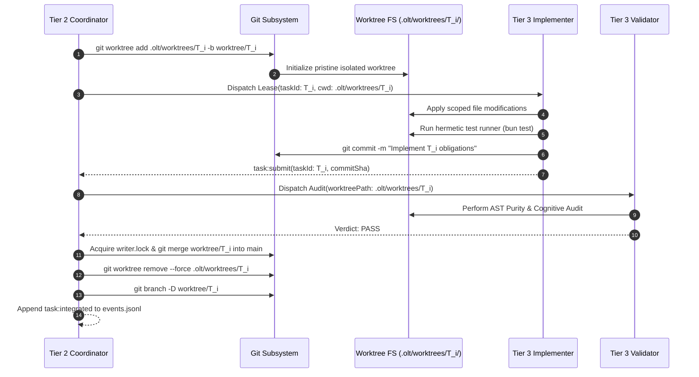

# 11-01 Out-of-Repo Git Worktree Isolation & Workspace Hygiene

---

[Previous: Chapter 11: Worktree Branching & Honesty Gates](index.md) | [Chapter Index](index.md) | [All Chapters Index](../index.md) | [Next: 11-02 Strict 1:1 Anti-Batching](11-02-strict-one-to-one-anti-batching.md)

---

## 1. Executive Summary & Epistemic Foundations

In concurrent multi-agent software engineering systems where multiple parallel worker subagents modify code simultaneously, allowing agents to operate within a single shared working directory introduces severe concurrency hazards and filesystem corruption:

- **Cross-Worker Race Collisions**: Worker A and Worker B modifying adjacent files concurrently overwrite each other's uncommitted edits, creating irrecoverable merge conflicts.
- **Root Workspace Pollution**: Test runners generate intermediate build artifacts, temporary log files, and scratchpad files that dirty the root repository.
- **Destructive Git Operations**: An autonomous agent attempting to run `git reset --hard` or `git checkout` disrupts all other concurrent worker processes in the shared repository.
- **Context Pollution in Mechanical Validation**: Test suites executing against dirty shared files cannot isolate whether failures originate from the current task diff or a concurrent peer's uncommitted modifications.
- **Lease Boundary Violations**: Unchecked filesystem access allows agents to read or edit unassigned modules outside their explicit task lease.

To eliminate workspace contention, the **OLT (Orchestrating Long Tasks)** engine enforces **Out-of-Repo Git Worktree Isolation**. Under this architecture, every parallel task executes in a dedicated, ephemeral Git worktree located outside the source tree under `.olt/worktrees/<task_id>/`.

```text
+--------------------------------------------------------------------------------------------------+
│                             OUT-OF-REPO GIT WORKTREE TOPOLOGY                                    │
+--------------------------------------------------------------------------------------------------+
│                                                                                                  │
│   PRIMARY REPOSITORY: /Users/repo/skills/ (Working Tree strictly Read-Only during Wave)          │
│   │                                                                                              │
│   └── .olt/worktrees/ (Out-of-Repo Isolation Root)                                              │
│       │                                                                                          │
│       ├── TASK-01/  ──► Checked out on branch: worktree/TASK-01                                  │
│       │   ├── Cwd assigned to Worker A (Lease Token: LEASE-A-01)                                 │
│       │   ├── Modifies strictly: olt/scripts/src/engine/runner/core/                             │
│       │   └── Executes hermetic bun test within isolated directory                               │
│       │                                                                                          │
│       ├── TASK-02/  ──► Checked out on branch: worktree/TASK-02                                  │
│       │   ├── Cwd assigned to Worker B (Lease Token: LEASE-B-02)                                 │
│       │   ├── Modifies strictly: docs/olt/architecture/11-worktree-branching-honesty/           │
│       │   └── Completely isolated from Worker A's edits                                          │
│       │                                                                                          │
│       └── TASK-03/  ──► Checked out on branch: worktree/TASK-03                                  │
│           └── Cwd assigned to Worker C (Lease Token: LEASE-C-03)                                 │
│                                                                                                  │
│   ════════════════════════════════════════════════════════════════════════════════════════════   │
│   SEQUENTIAL INTEGRATION MERGE: worktree/TASK-XX ──► Fast-Forward Merge into main under flock   │
│                                                                                                  │
+--------------------------------------------------------------------------------------------------+
```

---

## 2. Core Architectural Principles & Invariants

1. **Root Working Tree Immutability**: The primary repository working directory is strictly read-only for Tier 3 worker agents during active execution waves. All file modifications occur in isolated worktree paths.
2. **Strict Spatial Disjointness**: Every active worktree $\mathcal{W}_i$ resides in an independent directory path. No two agents ever share a working directory.
3. **Dedicated Transient Branches**: Each worktree checks out a dedicated branch `worktree/<task_id>` branched from the latest validated integration tip.
4. **Hermetic Test Execution**: Mechanical test runners execute within the worker's assigned worktree directory (`cwd = .olt/worktrees/<task_id>/`), ensuring that test assertions run against pure, unpolluted local file state.
5. **Deterministic Worktree Lifecycle**: Worktrees are provisioned on task claim, sealed on task submission, verified by validators, merged sequentially into `main`, and destroyed immediately with `git worktree remove --force`.

```text
+--------------------------------------------------------------------------------------------------+
│                             WORKTREE LIFECYCLE STATE TRANSITIONS                                 │
+------------------+------------------------------+------------------------------------------------+
│ Lifecycle State  │ Git Command Invocation       │ Filesystem Action & Security Constraint        │
+------------------+------------------------------+------------------------------------------------+
│ 1. ALLOCATE      │ `git worktree add <dir> -b`  │ Creates ephemeral directory under .olt/worktrees│
+------------------+------------------------------+------------------------------------------------+
│ 2. EXECUTE       │ `git commit -m "TASK-XX"`    │ Worker applies scoped diffs within worktree cwd│
+------------------+------------------------------+------------------------------------------------+
│ 3. VALIDATE      │ `git diff HEAD~1`            │ Validator audits diff without touching main    │
+------------------+------------------------------+------------------------------------------------+
│ 4. INTEGRATE     │ `git merge worktree/TASK-XX` │ Coordinator merges verified branch under lock  │
+------------------+------------------------------+------------------------------------------------+
│ 5. PRUNE         │ `git worktree remove --force`│ Directory scrubbed from disk; branch deleted   │
+------------------+------------------------------+------------------------------------------------+
```

---

## 3. Algorithmic Mechanics & State Transitions

The complete worktree lifecycle is orchestrated through the coordinator and git staging engine:



---

## 4. Mathematical Formulations & Proofs

Let $\mathcal{W}_{\text{root}}$ denote the primary repository filesystem tree.

Let $\mathcal{W}_1, \mathcal{W}_2, \dots, \mathcal{W}_m$ denote the isolated filesystem worktrees assigned to active workers $A_1, A_2, \dots, A_m$.

### 1. Spatial Disjointness Invariant

$$\forall i, j \in \{1, 2, \dots, m\} \text{ with } i \neq j: \quad \mathcal{W}_i \cap \mathcal{W}_j = \emptyset$$

$$\forall i \in \{1, 2, \dots, m\}: \quad \mathcal{W}_i \cap \mathcal{W}_{\text{root}} = \emptyset$$

### 2. Root Working Tree Invariance During Wave Execution

For any active wave interval $[t_{\text{start}}, t_{\text{end}})$, before integration merge:

$$\frac{\partial \mathcal{W}_{\text{root}}}{\partial t} = 0, \quad \forall t \in [t_{\text{start}}, t_{\text{end}})$$

### 3. Sequential Integration Merge Commutativity

Let $\Delta_i$ and $\Delta_j$ denote the patch sets committed in disjoint worktrees $\mathcal{W}_i$ and $\mathcal{W}_j$. If their file modification sets $\text{Files}(\Delta_i) \cap \text{Files}(\Delta_j) = \emptyset$, the integration merges commute:

$$\text{Merge}(\text{Merge}(\mathcal{W}_{\text{root}}, \Delta_i), \Delta_j) \equiv \text{Merge}(\text{Merge}(\mathcal{W}_{\text{root}}, \Delta_j), \Delta_i)$$

### 4. Proof of Race-Free Concurrency Under Disjoint Worktrees

**Theorem**: Let worker $A_i$ execute in worktree $\mathcal{W}_i$ and worker $A_j$ execute in worktree $\mathcal{W}_j$ with $i \neq j$. No file write performed by $A_i$ can alter the file read operations of $A_j$.

_Proof_:
Let $\text{Path}(f_i)$ be the absolute filesystem path written by $A_i$, and $\text{Path}(f_j)$ be the path read by $A_j$.
By spatial disjointness:

$$\text{Path}(f_i) \in \mathcal{W}_i \quad \text{and} \quad \text{Path}(f_j) \in \mathcal{W}_j \implies \text{Path}(f_i) \neq \text{Path}(f_j)$$

Since the underlying filesystem inodes and directory trees are strictly disjoint, write operations on $\text{Path}(f_i)$ have zero causal influence on $\text{Path}(f_j)$. Thus, concurrent worker execution is provably race-free.

---

## 5. Concrete TypeScript Contracts & Schemas

The TypeScript interfaces governing worktree lifecycle operations are defined in [`restricted-git-gate.ts`](file:///Users/onurseckinsenoglu/repos/skills/olt/scripts/src/engine/runner/core/restricted-git-gate.ts) and [`branch-ops.ts`](file:///Users/onurseckinsenoglu/repos/skills/olt/scripts/src/cli/commands/branch-ops.ts).

```typescript
export interface WorktreeAllocationRequest {
  readonly taskId: string;
  readonly baseBranch: string;
  readonly targetWorktreePath: string;
  readonly workerId: string;
}

export interface WorktreeDescriptor {
  readonly taskId: string;
  readonly branchName: string;
  readonly absolutePath: string;
  readonly createdAt: string;
  readonly headCommitSha: string;
  readonly isClean: boolean;
}

export interface WorktreeMergeReceipt {
  readonly taskId: string;
  readonly branchName: string;
  readonly mergedCommitSha: string;
  readonly integratedAt: string;
  readonly filesModifiedCount: number;
}
```

```typescript
export async function createIsolatedWorktree(
  baseDir: string,
  taskId: string,
  baseBranch: string = "main",
): Promise<WorktreeDescriptor> {
  const branchName = `worktree/${taskId}`;
  const worktreePath = `${baseDir}/.olt/worktrees/${taskId}`;

  // Execute isolated worktree creation via git CLI
  const proc = Bun.spawn(["git", "worktree", "add", worktreePath, "-b", branchName, baseBranch], {
    cwd: baseDir,
    stdout: "pipe",
    stderr: "pipe",
  });

  const exitCode = await proc.exited;
  if (exitCode !== 0) {
    const err = await new Response(proc.stderr).text();
    throw new Error(`WORKTREE_CREATION_FAILED for ${taskId}: ${err}`);
  }

  return {
    taskId,
    branchName,
    absolutePath: worktreePath,
    createdAt: new Date().toISOString(),
    headCommitSha: "",
    isClean: true,
  };
}

export async function removeIsolatedWorktree(baseDir: string, taskId: string): Promise<void> {
  const worktreePath = `${baseDir}/.olt/worktrees/${taskId}`;
  const branchName = `worktree/${taskId}`;

  // Remove worktree directory
  await Bun.spawn(["git", "worktree", "remove", "--force", worktreePath], {
    cwd: baseDir,
  }).exited;

  // Prune branch
  await Bun.spawn(["git", "branch", "-D", branchName], {
    cwd: baseDir,
  }).exited;
}
```

---

## 6. Failure Modes, Anti-Blunders & Recovery Playbooks

```text
+--------------------------------------------------------------------------------------------------+
│                             GIT WORKTREE ISOLATION ANTI-BLUNDER MATRIX                           │
+--------------------------+------------------------------+----------------------------------------+
│ Blunder Anti-Pattern     │ Root Cause                   │ OLT Prevention & Recovery Playbook     │
+--------------------------+------------------------------+----------------------------------------+
│ Direct Main Working Tree │ Agent ignores assigned cwd   │ File access validator intercepts write │
│ Modification             │ and edits files in root repo │ commands; verifies path is prefixed by │
│                          │ directory directly.          │ assigned .olt/worktrees/<task_id>/ cwd.│
+--------------------------+------------------------------+----------------------------------------+
│ Stale Worktree Disk      │ Worker crashes without       │ Stale lease sweeper executes git       │
│ Exhaustion               │ invoking worktree cleanup;   │ worktree prune and removes orphaned    │
│                          │ disk fills with dead clones. │ directories after lease expiry timeout.│
+--------------------------+------------------------------+----------------------------------------+
│ Uncommitted File Loss on │ Cleanup command called before│ Coordinator verifies git diff HEAD~1   │
│ Early Prune              │ worker commits changes,      │ and git status is clean before pruning;│
│                          │ destroying in-flight edits.  │ backs up uncommitted diff to forensics│
+--------------------------+------------------------------+----------------------------------------+
│ Concurrent Merge Race    │ Two coordinators attempt to  │ Integration merge into main strictly   │
│ Corruption               │ merge task branches into     │ requires holding writer.lock POSIX     │
│                          │ main at the same instant.    │ flock, enforcing serial merges.        │
+--------------------------+------------------------------+----------------------------------------+
│ Detached HEAD Lease      │ Worktree created without -b  │ Allocation command strictly mandates   │
│ Commit Disconnect        │ branch flag; commits become  │ named branch binding worktree/<task_id>│
│                          │ unreachable reflog orphans.  │ to ensure clean merge references.      │
+--------------------------+------------------------------+----------------------------------------+
```

---

## 7. Architectural Invariants Summary & Verification Checklist

1. **Absolute Worktree Isolation**: All worker modifications must occur within `.olt/worktrees/<task_id>/`.
2. **Main Tree Immutability**: The primary working directory must remain pristine throughout wave execution.
3. **Ephemeral Worktree Cleanup**: Completed or aborted worktrees must be pruned cleanly from disk.
4. **Serial Lock-Protected Integration**: Merging task branches into `main` requires exclusive POSIX locking.
5. **Fail-Closed Workspace Validation**: Tasks with uncommitted worktree state cannot be merged.

---

[Previous: Chapter 11: Worktree Branching & Honesty Gates](index.md) | [Chapter Index](index.md) | [All Chapters Index](../index.md) | [Next: 11-02 Strict 1:1 Anti-Batching](11-02-strict-one-to-one-anti-batching.md)

---
