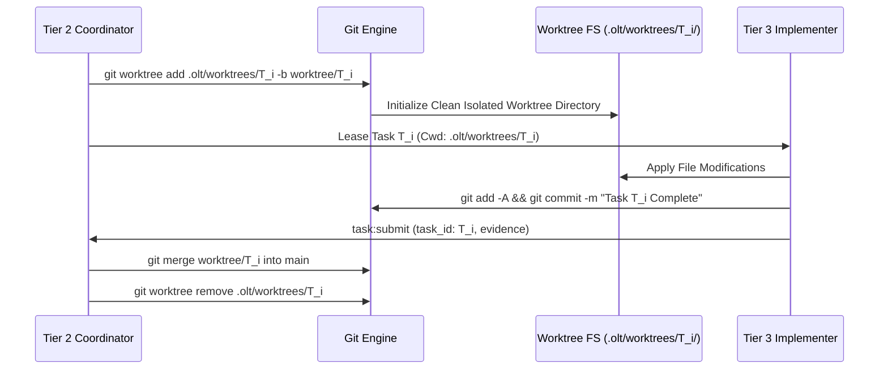

# Out-of-Repo Git Worktree Isolation

---

[Previous: Chapter 11 Index](index.md) | [Chapter Index](index.md) | [All Chapters Index](../index.md) | [Next: 11-02 Strict 1:1 Anti-Batching](11-02-strict-one-to-one-anti-batching.md)

---

## 1. Executive Summary & Workspace Contention

In parallel multi-agent development pipelines where multiple worker subagents modify files simultaneously, operating within a single shared working directory causes severe race conditions and state corruption:

- Concurrent file edits overwrite adjacent lines, creating unresolvable Git merge conflicts.
- Intermediate build artifacts and test temp files pollute the root working directory.
- An agent performing `git reset` or `git checkout` disrupts all other concurrent workers.

The OLT (Orchestrating Long Tasks) engine implements Out-of-Repo Git Worktree Isolation. Under this architecture:

1. **Isolated Worktree Paths**: Every parallel implementer operates in an isolated, ephemeral Git worktree located outside the primary source repository under `.olt/worktrees/<task_id>/`.
2. **Dedicated Branch Pointers**: Each worktree checks out a dedicated transient task branch `worktree/<task_id>`.
3. **Atomic Sequential Merging**: Upon successful dual-channel verification, completed task branches are merged sequentially into the main integration branch without workspace pollution.

```text
+--------------------------------------------------------------------------------------------------+
│                             OUT-OF-REPO WORKTREE TOPOLOGY                                        │
+--------------------------------------------------------------------------------------------------+
│                                                                                                  │
│   PRIMARY REPOSITORY: /path/to/repo/ (Main Working Tree - Read-Only during Wave)                 │
│                                │                                                                 │
│                                ▼                                                                 │
│   .olt/worktrees/ (Out-of-Repo Isolation Root)                                                   │
│   ├── TASK-01/  ──► Branch: worktree/TASK-01 (Worker A edits core/config.ts)                    │
│   ├── TASK-02/  ──► Branch: worktree/TASK-02 (Worker B edits engine/runner.ts)                  │
│   └── TASK-03/  ──► Branch: worktree/TASK-03 (Worker C edits docs/olt/arch/)                    │
│                                                                                                  │
+--------------------------------------------------------------------------------------------------+
```

---

## 2. Mathematical Formalization of Worktree Concurrency Isolation

Let $\mathcal{W}_{\text{root}}$ denote the primary working tree filesystem, and let $\mathcal{W}_i$ denote the filesystem assigned to worker $A_i$ executing task $T_i$.

Let $\text{Scope}(T_i) \subset \mathcal{F}_{\text{repo}}$ be the granted file scope for task $T_i$.

The Worktree Isolation Invariant enforces complete independence across concurrent execution lanes:

$$\forall i \neq j, \quad \mathcal{W}_i \cap \mathcal{W}_j = \emptyset \quad \text{and} \quad \mathcal{W}_i \cap \mathcal{W}_{\text{root}} = \emptyset$$

A mutation $\Delta_i$ committed by worker $A_i$ within worktree $\mathcal{W}_i$ affects only its local branch:

$$\text{Branch}(T_i) \leftarrow \text{Commit}(\Delta_i, \mathcal{W}_i)$$

The primary repository $\mathcal{W}_{\text{root}}$ remains completely clean and immutable during the active execution wave:

$$\text{State}(\mathcal{W}_{\text{root}}, t) = \text{State}(\mathcal{W}_{\text{root}}, t_0), \quad \forall t \in [t_{\text{wave\_start}}, t_{\text{wave\_end}})$$



---

## 3. Worktree Lifecycle & Cleanup Protocols

The worktree lifecycle is governed by strict deterministic state transitions:

1. **Allocation (`branch:open`)**: The coordinator provisions `.olt/worktrees/<task_id>/` and binds the worktree to the worker's lease.
2. **Execution**: The worker performs edits, runs isolation tests, and commits changes locally.
3. **Verification**: Validators inspect the isolated worktree without touching the primary tree.
4. **Merge & Scrub (`branch:merge`)**: Upon validation, the branch is merged into `main` and `git worktree remove --force` purges the isolated directory.

---

## 4. Architectural Invariants Summary

1. **Zero Main-Tree Dirtying**: Parallel workers never edit the root working tree directly.
2. **Complete Cross-Worker Isolation**: File mutations in one worktree are completely invisible to other workers until merged.
3. **Deterministic Cleanup**: Completed or aborted worktrees are scrubbed immediately to prevent disk exhaustion.

---

[Previous: Chapter 11 Index](index.md) | [Chapter Index](index.md) | [All Chapters Index](../index.md) | [Next: 11-02 Strict 1:1 Anti-Batching](11-02-strict-one-to-one-anti-batching.md)

---
