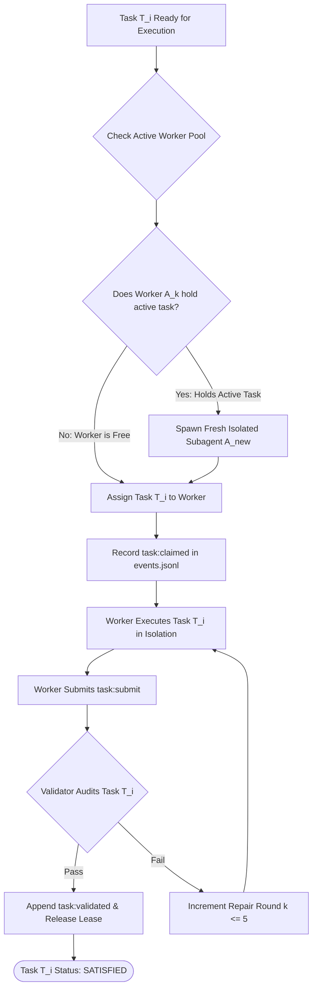

# 11-02 Strict 1:1 Anti-Batching & Atomic Task Granularity

---

[Previous: 11-01 Out-of-Repo Git Worktree Isolation](11-01-out-of-repo-git-worktree-isolation.md) | [Chapter Index](index.md) | [All Chapters Index](../index.md) | [Next: 11-03 Honesty Gates & Anti-Fabrication](11-03-honesty-gates-and-anti-fabrication.md)

---

## 1. Executive Summary & Epistemic Foundations

In multi-agent autonomous engineering architectures, a common anti-pattern is **task batching**: assigning multiple discrete tasks or user requirements to a single worker subagent in a single prompt turn. While superficially appearing efficient, task batching causes catastrophic failure modes in autonomous LLM execution:

- **Attribution Confusion**: When a batched test fails, the system cannot isolate which specific task obligation caused the regression, requiring full rollbacks of all bundled features.
- **Attention Degradation & Scope Dropping**: LLMs operating on large multi-task lists systematically drop intermediate requirements as context length expands (the "lost-in-the-middle" effect).
- **Compound Failure Cascades**: A single syntax error in task 5 corrupts the commit diff for tasks 1 through 4, stalling the entire wave.
- **Straggler Amplification**: Batched execution destroys pipeline concurrency, forcing downstream tasks to wait for the slowest subtask in the batch.
- **Verification Ambiguity**: Cognitive validators presented with monolithic multi-file diffs cannot discern whether changes satisfy task A or task B.
- **State Space Explosion**: Debugging a regression across $K$ combined tasks requires searching a combined state space $\mathcal{O}(\prod S_i)$ rather than isolated linear spaces $\mathcal{O}(\sum S_i)$.

The **OLT (Orchestrating Long Tasks)** engine implements **Strict 1:1 Anti-Batching & Atomic Task Granularity**. Under this invariant, exactly one worker subagent is leased to execute exactly one atomic DAG task obligation.

```text
+--------------------------------------------------------------------------------------------------+
│                             STRICT 1:1 ANTI-BATCHING TOPOLOGY                                    │
+--------------------------------------------------------------------------------------------------+
│                                                                                                  │
│   DAG SCHEDULER: Dispatches Atomic Task Obligations                                              │
│        │                                                                                         │
│        ├─────────────────────────────┬─────────────────────────────┐                             │
│        ▼ (Task 1: Scoped Diff)       ▼ (Task 2: Scoped Diff)       ▼ (Task 3: Scoped Diff)       │
│   +--------------------------+  +--------------------------+  +--------------------------+       │
│   │   TIER 3 IMPLEMENTER A   │  │   TIER 3 IMPLEMENTER B   │  │   TIER 3 IMPLEMENTER C   │       │
│   │  - Assigned: TASK-01     │  │  - Assigned: TASK-02     │  │  - Assigned: TASK-03     │       │
│   │  - Max Tasks: EXACTLY 1  │  │  - Max Tasks: EXACTLY 1  │  │  - Max Tasks: EXACTLY 1  │       │
│   │  - Clean Worktree 1      │  │  - Clean Worktree 2      │  │  - Clean Worktree 3      │       │
│   +------------+-------------+  +------------+-------------+  +------------+-------------+       │
│                │                             │                             │                     │
│                ▼                             ▼                             ▼                     │
│   +--------------------------+  +--------------------------+  +--------------------------+       │
│   │   COGNITIVE VALIDATOR A  │  │   COGNITIVE VALIDATOR B  │  │   COGNITIVE VALIDATOR C  │       │
│   │  - Audits TASK-01 Diff   │  │  - Audits TASK-02 Diff   │  │  - Audits TASK-03 Diff   │       │
│   │  - Isolated Verdict      │  │  - Isolated Verdict      │  │  - Isolated Verdict      │       │
│   +------------+-------------+  +------------+-------------+  +------------+-------------+       │
│                │                             │                             │                     │
│                ▼                             ▼                             ▼                     │
│   ════════════════════════════════════════════════════════════════════════════════════════════   │
│   ATOMIC GATE SEALS: Each Task Sealed Independently in Capsule Ledger (events.jsonl)             │
│                                                                                                  │
+--------------------------------------------------------------------------------------------------+
```

---

## 2. Core Architectural Principles & Invariants

1. **Strict 1:1 Bijection Invariant**: At any point in time, the cardinality of active tasks assigned to worker agent $A_i$ must be strictly at most 1 ($|\text{Tasks}(A_i)| \le 1$). Multi-task bundle assignments are mechanically rejected.
2. **Atomic Blast Radius Containment**: A failure in task $T_i$ triggers a repair cycle strictly for $T_i$. Parallel tasks $T_j$ ($j \neq i$) proceed unaffected in their independent worktrees.
3. **Granular Fault Attribution**: Every git commit, AST finding, and test receipt maps 1:1 to a single task identifier, ensuring unambiguous forensic auditing.
4. **Context Window Optimization**: By focusing on a single task, the worker's prompt context remains compact ($< 4000$ tokens), maximizing reasoning quality and eliminating hallucination drift.
5. **Independent Validation Auditing**: Cognitive and mechanical validation occur on a per-task basis, allowing verified tasks to integrate immediately without waiting for entire waves to complete.
6. **Zero Cross-Task Side Effects**: Worker subagents have zero visibility into concurrent worker leases, ensuring zero cross-task pollution.

```text
+--------------------------------------------------------------------------------------------------+
│                             BATCHING VS ATOMIC 1:1 COMPARISON MATRIX                             │
+-------------------------+-----------------------------------+------------------------------------+
│ Evaluation Metric       │ Batched Execution (Anti-Pattern)  │ OLT Strict 1:1 Architecture        │
+-------------------------+-----------------------------------+------------------------------------+
│ Task Assignment         │ N tasks assigned to 1 agent       │ Exactly 1 task per subagent lease  │
+-------------------------+-----------------------------------+------------------------------------+
│ Blast Radius on Failure │ All N tasks blocked on 1 error    │ Strictly isolated to 1 failed task │
+-------------------------+-----------------------------------+------------------------------------+
│ Context Window Size     │ Large, bloated (15k-30k tokens)   │ Compact, sharp (< 4k tokens)       │
+-------------------------+-----------------------------------+------------------------------------+
│ Validation Granularity  │ Monolithic, ambiguous audit       │ Granular, exact line-level audit   │
+-------------------------+-----------------------------------+------------------------------------+
│ Straggler Sensitivity   │ High (Blocks entire wave)         │ Low (Parallel decoupled execution) │
+-------------------------+-----------------------------------+------------------------------------+
```

---

## 3. Algorithmic Mechanics & State Transitions

The lease dispatch engine enforces the 1:1 invariant before delegating tasks to worker subagents:



---

## 4. Mathematical Formulations & Proofs

Let $\mathcal{A} = \{A_1, A_2, \dots, A_m\}$ be the set of active worker agents, and $V = \{T_1, T_2, \dots, T_N\}$ be the set of DAG tasks.

Let $\mu : \mathcal{A} \to \mathcal{P}(V)$ be the task assignment mapping.

### 1. The Strict 1:1 Invariant

$$\forall A_i \in \mathcal{A}, \quad |\mu(A_i)| \le 1$$

### 2. Mean Time To Repair (MTTR) Comparison

Let $p$ be the independent failure probability per subtask, and let $\tau$ be the repair latency.

Under batched execution of $K$ tasks by a single agent, the probability of batch failure $P_{\text{batch\_fail}}$ is:

$$P_{\text{batch\_fail}} = 1 - (1 - p)^K \approx K \cdot p \quad (\text{for small } p)$$

The expected repair latency for a batched failure scales with the total batch complexity:

$$\mathbb{E}[T_{\text{repair, batch}}] = \mathcal{O}(K \cdot \tau)$$

Under atomic 1:1 isolation, subtasks fail independently with probability $p$, and repair latency is bounded to the single failed unit:

$$\mathbb{E}[T_{\text{repair, isolated}}] = \mathcal{O}(\tau)$$

$$\frac{\mathbb{E}[T_{\text{repair, batch}}]}{\mathbb{E}[T_{\text{repair, isolated}}]} = K \gg 1$$

### 3. Theorem: Fault Localization Entropy

**Theorem**: Atomic 1:1 task assignment maximizes fault localization information and minimizes diagnostic uncertainty.

_Proof_:
Let $X \in \{T_1, \dots, T_K\}$ denote the true source of an observed error. Under batched execution with $K$ tasks, the prior entropy of the fault location is:

$$H_{\text{batch}}(X) = -\sum_{i=1}^K \frac{1}{K} \log_2 \frac{1}{K} = \log_2 K$$

Under strict 1:1 assignment ($K = 1$), the fault is uniquely bound to the single task:

$$H_{\text{isolated}}(X) = -\sum_{i=1}^1 1 \log_2 1 = 0 \text{ bits}$$

Zero entropy represents absolute deterministic fault attribution.

---

## 5. Concrete TypeScript Contracts & Schemas

The TypeScript interfaces enforcing anti-batching rules are defined in [`anti-batching.ts`](file:///Users/onurseckinsenoglu/repos/skills/olt/scripts/src/validation/anti-batching.ts) and [`anti-batching-engine.ts`](file:///Users/onurseckinsenoglu/repos/skills/olt/scripts/src/reporting/doctor/anti-batching-engine.ts).

```typescript
export interface TaskAssignmentLease {
  readonly leaseId: string;
  readonly workerId: string;
  readonly taskId: string;
  readonly grantedAt: string;
  readonly expiresAt: string;
  readonly active: boolean;
}

export interface AntiBatchingGuard {
  readonly maxConcurrentTasksPerWorker: 1;
  readonly validateAssignment: (
    workerId: string,
    activeLeases: readonly TaskAssignmentLease[],
  ) => boolean;
}

export interface BatchingViolationReport {
  readonly workerId: string;
  readonly attemptedTaskId: string;
  readonly currentActiveTaskId: string;
  readonly rejectedAt: string;
  readonly trapCode: "FATAL_ANTI_BATCHING_VIOLATION";
}
```

```typescript
export function assertSingleTaskAssignment(
  workerId: string,
  newTaskId: string,
  activeLeases: readonly TaskAssignmentLease[],
): void {
  const existingActiveLease = activeLeases.find((l) => l.workerId === workerId && l.active);

  if (existingActiveLease) {
    throw new Error(
      `FATAL_ANTI_BATCHING_VIOLATION: Worker ${workerId} already holds active lease for ${existingActiveLease.taskId}. Cannot assign ${newTaskId}.`,
    );
  }
}

export function releaseWorkerLease(
  workerId: string,
  taskId: string,
  activeLeases: readonly TaskAssignmentLease[],
): readonly TaskAssignmentLease[] {
  return activeLeases.map((lease) => {
    if (lease.workerId === workerId && lease.taskId === taskId) {
      return { ...lease, active: false };
    }
    return lease;
  });
}

export function inspectBatchingState(activeLeases: readonly TaskAssignmentLease[]): {
  readonly violations: readonly BatchingViolationReport[];
  readonly healthy: boolean;
} {
  const workerTaskCounts = new Map<string, string[]>();
  const violations: BatchingViolationReport[] = [];

  for (const lease of activeLeases) {
    if (!lease.active) continue;
    const current = workerTaskCounts.get(lease.workerId) || [];
    current.push(lease.taskId);
    workerTaskCounts.set(lease.workerId, current);

    if (current.length > 1) {
      violations.push({
        workerId: lease.workerId,
        attemptedTaskId: lease.taskId,
        currentActiveTaskId: current[0],
        rejectedAt: new Date().toISOString(),
        trapCode: "FATAL_ANTI_BATCHING_VIOLATION",
      });
    }
  }

  return {
    violations,
    healthy: violations.length === 0,
  };
}
```

---

## 6. Failure Modes, Anti-Blunders & Recovery Playbooks

```text
+--------------------------------------------------------------------------------------------------+
│                             ANTI-BATCHING ANTI-BLUNDER MATRIX                                    │
+--------------------------+------------------------------+----------------------------------------+
│ Blunder Anti-Pattern     │ Root Cause                   │ OLT Prevention & Recovery Playbook     │
+--------------------------+------------------------------+----------------------------------------+
│ Multi-Task Prompt Merge  │ Coordinator bundles 3 tasks  │ Lease allocator intercepts prompt;     │
│                          │ in single worker prompt to   │ enforces 1:1 mapping; splits bundles   │
│                          │ minimize subagent spawns.    │ into atomic single-task DAG nodes.     │
+--------------------------+------------------------------+----------------------------------------+
│ Cascading Scope Creep    │ Worker completes task 1 and  │ Validator checks git diff against task │
│                          │ starts editing task 2 files  │ obligation scope; rejects out-of-scope │
│                          │ without a valid lease.       │ file diffs as unprompted creep.        │
+--------------------------+------------------------------+----------------------------------------+
│ Hidden Subtask Drop      │ Long batched prompt causes   │ Atomic DAG decomposition assigns each  │
│                          │ LLM to overlook middle tasks │ requirement to an independent node with│
│                          │ during generation.           │ required evidence gates.               │
+--------------------------+------------------------------+----------------------------------------+
│ Mixed-Cause Test Failure │ Two unrelated changes tested │ Single-task worktree runs test suite   │
│ Confusion                │ together; developer cannot   │ only on single task diff; provides     │
│                          │ isolate root cause of bug.   │ 100% unambiguous error attribution.    │
+--------------------------+------------------------------+----------------------------------------+
│ Lease Reassignment Race  │ Coordinator reassigns task   │ Task lease transitions require POSIX   │
│                          │ before previous worker's     │ writer.lock; verifies lease release    │
│                          │ active lease is released.    │ event before issuing new claim.        │
+--------------------------+------------------------------+----------------------------------------+
│ Zombie Worker Overload   │ Dead worker's lease not      │ Heartbeat watchdog expires dead leases;│
│                          │ reclaimed, causing fake      │ frees capacity without batching tasks. │
│                          │ worker capacity starvation.  │                                        │
+--------------------------+------------------------------+----------------------------------------+
```

---

## 7. Architectural Invariants Summary & Verification Checklist

1. **Strict 1:1 Invariant**: An agent worker may never hold more than one active task lease simultaneously.
2. **Atomic Blast Radius**: Subtask failures must be isolated to individual DAG task repair loops.
3. **Deterministic Attribution**: Every commit and validation finding maps to exactly one task ID.
4. **Pure Scope Binding**: File modifications outside the assigned task scope are rejected fail-closed.
5. **No Monolithic Batches**: Pre-planning must decompose user requirements into discrete, atomic units.

---

[Previous: 11-01 Out-of-Repo Git Worktree Isolation](11-01-out-of-repo-git-worktree-isolation.md) | [Chapter Index](index.md) | [All Chapters Index](../index.md) | [Next: 11-03 Honesty Gates & Anti-Fabrication](11-03-honesty-gates-and-anti-fabrication.md)

---
