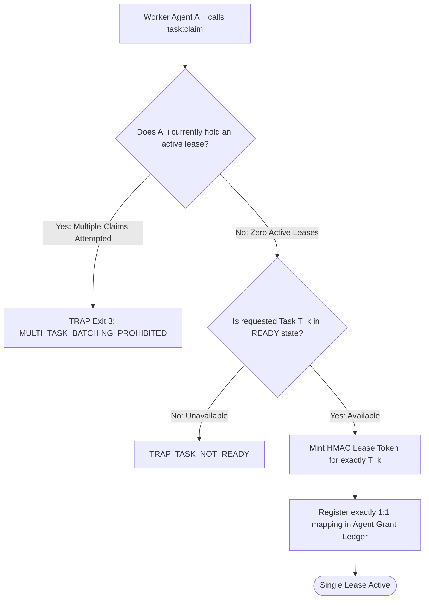

# Strict 1:1 Task Anti-Batching Invariant

---

[Previous: 11-01 Worktree Isolation](11-01-out-of-repo-git-worktree-isolation.md) | [Chapter Index](index.md) | [All Chapters Index](../index.md) | [Next: 11-03 Honesty Gates & Anti-Fabrication](11-03-honesty-gates-and-anti-fabrication.md)

---

## 1. Executive Summary & The Batching Anti-Pattern

In multi-agent architectures, naive coordinators frequently attempt to bundle multiple related tasks into a single worker assignment (known as "task batching") to reduce scheduling overhead. However, in autonomous software development, batching causes severe systemic failure modes:

- **Cascading Failure Blast Radius**: If a worker fails 1 out of 5 bundled tasks, all 5 tasks must be rolled back or re-evaluated.
- **Ambiguous Forensic Attribution**: It becomes impossible to map specific line diffs and test receipts to individual requirements.
- **Context Overload & Hallucination**: Workers managing multiple disparate tasks suffer context dilution and drop subtle edge cases.

The OLT (Orchestrating Long Tasks) engine enforces the **Strict 1:1 Task Anti-Batching Invariant ($\mathcal{I}_{\text{anti-batch}}$)**. Under this rule, every implementer agent is leased exactly one atomic task per lifecycle turn:

$$|\text{AssignedTasks}(A_i)| \equiv 1$$

```text
+--------------------------------------------------------------------------------------------------+
│                             TASK BATCHING VS STRICT 1:1 MODEL                                    │
+--------------------------------------------------------------------------------------------------+
│                                                                                                  │
│   PROHIBITED BATCHING MODEL (High Blast Radius):                                                 │
│   [Coordinator] ──► [Worker 1] ──► { Task A, Task B, Task C } (Batch: High Failure Risk)         │
│                                                                                                  │
│   OLT STRICT 1:1 ANTI-BATCHING MODEL (Atomic Confinement):                                       │
│   [Coordinator] ──┬──► [Worker 1] ──► [Task A (Isolated Worktree 1)]                             │
│                   ├──► [Worker 2] ──► [Task B (Isolated Worktree 2)]                             │
│                   └──► [Worker 3] ──► [Task C (Isolated Worktree 3)]                             │
│                                                                                                  │
+--------------------------------------------------------------------------------------------------+
```

---

## 2. Mathematical Formalization of the Anti-Batching Invariant

Let $\mathcal{A}_{\text{active}} = \{A_1, A_2, \dots, A_P\}$ denote the set of active worker agents, and let $\mathcal{T}_{\text{leased}} = \{T_1, T_2, \dots, T_P\}$ denote the set of currently leased tasks.

Let $\mathcal{M}_{\text{lease}}: \mathcal{A}_{\text{active}} \rightarrow \mathcal{P}(\mathcal{T}_{\text{leased}})$ map each worker to its set of assigned tasks.

The Anti-Batching Invariant is formally defined as a bijection:

$$\forall A_i \in \mathcal{A}_{\text{active}}, \quad |\mathcal{M}_{\text{lease}}(A_i)| = 1$$

$$\forall A_i, A_j \in \mathcal{A}_{\text{active}} \; (i \neq j) \implies \mathcal{M}_{\text{lease}}(A_i) \cap \mathcal{M}_{\text{lease}}(A_j) = \emptyset$$



---

## 3. Benefits of Atomic 1:1 Task Granularity

1. **Deterministic Rollbacks**: If task $T_i$ fails validation, only worktree $\mathcal{W}_i$ is reset. Unrelated tasks $T_j$ proceed uninterrupted.
2. **Precise Cowan Token Budgeting**: Each task operates within a fresh, uncontaminated token context ($< 150{,}000$ tokens).
3. **Exact Line-by-Line Attribution**: Diff records in `events.jsonl` link directly to single obligation IDs.

---

## 4. Architectural Invariants Summary

1. **Single-Task Cardinality**: A worker may never hold more than one active lease token simultaneously.
2. **Zero Scope Creep**: Implementers cannot expand their task scope to touch adjacent tasks during a lease.
3. **Fail-Closed Lease Interlock**: Any tool call attempting to claim multiple tasks is rejected immediately.

---

[Previous: 11-01 Worktree Isolation](11-01-out-of-repo-git-worktree-isolation.md) | [Chapter Index](index.md) | [All Chapters Index](../index.md) | [Next: 11-03 Honesty Gates & Anti-Fabrication](11-03-honesty-gates-and-anti-fabrication.md)

---
