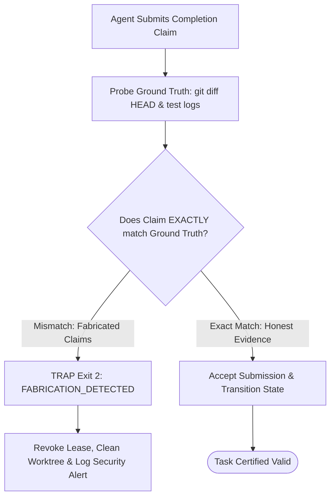

# Honesty Gates & Anti-Fabrication Mechanisms

---

[Previous: 11-02 Strict 1:1 Anti-Batching](11-02-strict-one-to-one-anti-batching.md) | [Chapter Index](index.md) | [All Chapters Index](../index.md) | [Next: 11-04 Agent Grant Ledger & Locks](11-04-agent-grant-ledger-and-authority-locks.md)

---

## 1. Executive Summary & Epistemic Honesty

In autonomous software development pipelines, agents occasionally emit dishonest or hallucinated status reports:

- Claiming that tests were executed when no shell process was spawned.
- Generating fabricated Git diffs that do not exist on disk.
- Falsifying test pass counts (e.g. reporting 50 passing tests when only 2 ran).

The OLT (Orchestrating Long Tasks) engine enforces the **Honesty Gates & Anti-Fabrication Protocol**. Under this system, no agent prose or unverified claim is ever trusted. Every assertion is cross-checked against immutable physical evidence on disk before being accepted by the scheduler.

```text
+--------------------------------------------------------------------------------------------------+
│                                 HONESTY GATE VERIFICATION TOPOLOGY                               │
+--------------------------------------------------------------------------------------------------+
│                                                                                                  │
│   ┌──────────────────────┐         ┌──────────────────────┐         ┌──────────────────────┐     │
│   │ Agent Prose Claim    │  ───►   │ Honesty Gate Interlock│ ───►   │ Verified Evidence    │     │
│   │ ("All tests passed") │         │ (Cross-Check on Disk)│         │ (Physical Receipt)   │     │
│   └──────────────────────┘         └──────────────────────┘         └──────────────────────┘     │
│              │                                 │                               │                 │
│              ▼                                 ▼                               ▼                 │
│      [Prose Assertion]               [Check git diff & exit]         [Commit or Trap Exit 2]     │
│                                                                                                  │
+--------------------------------------------------------------------------------------------------+
```

---

## 2. Mathematical Formalization of Honesty Predicates

Let $\mathcal{C}_{\text{claim}} = \langle \text{claimed\_diff}, \text{claimed\_exit}, \text{claimed\_pass\_count} \rangle$ be the claim tuple emitted by the agent.

Let $\mathcal{O}_{\text{disk}} = \langle \text{actual\_diff}, \text{actual\_exit}, \text{actual\_pass\_count} \rangle$ be the ground truth observed directly from the operating system and Git index.

The **Honesty Predicate** $\mathcal{H}_{\text{gate}}$ is defined as:

$$\mathcal{H}_{\text{gate}}(\mathcal{C}_{\text{claim}}, \mathcal{O}_{\text{disk}}) = \big( \text{SHA256}(\mathcal{C}.\text{claimed\_diff}) = \text{SHA256}(\mathcal{O}.\text{actual\_diff}) \big) \land \big( \mathcal{C}.\text{claimed\_exit} = \mathcal{O}.\text{actual\_exit} \big) \land \big( \mathcal{C}.\text{claimed\_pass\_count} \le \mathcal{O}.\text{actual\_pass\_count} \big)$$

$$\text{Verdict} = \begin{cases} \text{ACCEPT} & \text{if } \mathcal{H}_{\text{gate}} = 1 \\ \text{TRAP (FABRICATION\_DETECTED)} & \text{if } \mathcal{H}_{\text{gate}} = 0 \end{cases}$$



---

## 3. The 4 Anti-Fabrication Detection Sensors

1. **Git Working Tree Truth Sensor**: Executes `git diff HEAD` to verify modified byte ranges match claimed edits.
2. **Process Execution Sensor**: Inspects process exit codes and standard error streams directly from Bun/Node child process handles.
3. **AST Symbol Grounding Sensor**: Validates that all functions, classes, and types referenced in claims actually exist in the compiled TypeScript AST.
4. **Binary Asset Entropy Sensor**: Verifies that generated visual artifacts are not blank solid-color placeholders ($H(X) \ge 3.0$).

---

## 4. Architectural Invariants Summary

1. **Zero Trust in Agent Prose**: Text summaries written by LLMs are never used to determine state transitions.
2. **Ground-Truth Physical Verification**: All state changes must be verifiable through OS file descriptors and Git object hashes.
3. **Immediate Revocation on Fabrication**: Any detected falsification triggers lease revocation and quarantine.

---

[Previous: 11-02 Strict 1:1 Anti-Batching](11-02-strict-one-to-one-anti-batching.md) | [Chapter Index](index.md) | [All Chapters Index](../index.md) | [Next: 11-04 Agent Grant Ledger & Locks](11-04-agent-grant-ledger-and-authority-locks.md)

---
