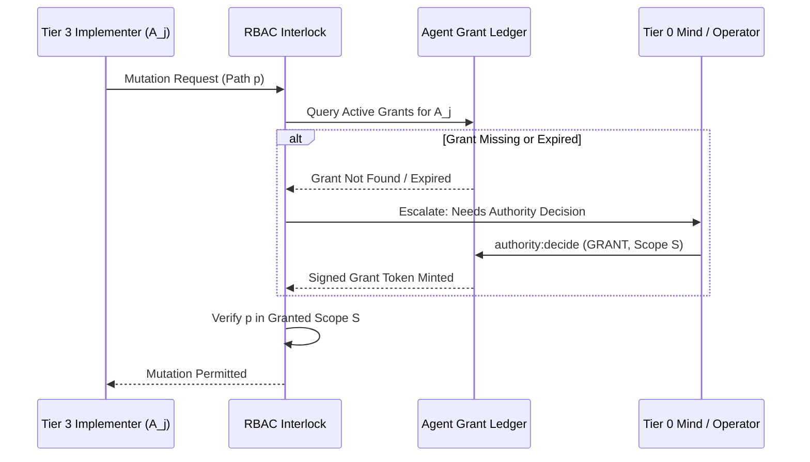

# Agent Grant Ledger & Authority Locks

---

[Previous: 11-03 Honesty Gates & Anti-Fabrication](11-03-honesty-gates-and-anti-fabrication.md) | [Chapter Index](index.md) | [All Chapters Index](../index.md) | [Next: Chapter 12 Index](../12-flock-mailboxes-and-tui/index.md)

---

## 1. Executive Summary & Authority Confinement

In large-scale distributed agent swarms, subagents must operate under least-privilege role boundaries. If an implementer agent can grant itself permissions, claim unassigned tasks, or bypass authority reviews, system security and operational integrity collapse.

The OLT (Orchestrating Long Tasks) engine implements the **Agent Grant Ledger & Authority Lock Architecture**. Under this model:

1. **The Agent Grant Ledger**: Every active agent session, task lease, authority grant, and parent-child relationship is immutably registered in `.olt/capsules/<slug>/state.json` and mirrored to `events.jsonl`.
2. **Authority Locks**: Modifying sensitive subsystems requires holding an explicit, cryptographically signed Grant Token minted exclusively by supervisory tiers (Tier 0 Mind or Human Operator).

```text
+--------------------------------------------------------------------------------------------------+
│                                 AGENT GRANT LEDGER TOPOLOGY                                      │
+--------------------------------------------------------------------------------------------------+
│                                                                                                  │
│   SUPERVISORY TIER (Mind / Operator)                                                             │
│   ├── Signs Authority Grant: { grant_id: "G-102", scope: "core/contracts/**", role: "admin" }   │
│   │                                                                                              │
│   ▼                                                                                              │
│   AGENT GRANT LEDGER (SSoT in state.json)                                                        │
│   ├── Active Grants: [ G-101 (Worker A), G-102 (Worker B) ]                                      │
│   └── Lineage Chain: Mind ──► Orch ──► Coord ──► Implementer                                     │
│                                                                                                  │
│   ▼                                                                                              │
│   EXECUTION INTERLOCK: File mutations outside active grants -> PERMISSION_DENIED                 │
│                                                                                                  │
+--------------------------------------------------------------------------------------------------+
```

---

## 2. Mathematical Formalization of the Grant Ledger

Let $\mathcal{G} = \{g_1, g_2, \dots, g_K\}$ denote the set of active grants registered in the capsule ledger.

Each grant $g_k$ is represented as a 6-tuple:

$$g_k = \Big\langle \text{id}_k, \quad \text{agent\_id}_k, \quad \text{role}_k, \quad \mathcal{S}_k \subset \mathcal{F}_{\text{repo}}, \quad \tau_{\text{expires}}, \quad \text{signature}_k \Big\rangle$$

Where $\text{signature}_k = \text{HMAC}_{K_{\text{auth}}}(\text{id}_k \mathbin{\Vert} \text{agent\_id}_k \mathbin{\Vert} \text{role}_k \mathbin{\Vert} \mathcal{S}_k)$.

A file mutation $\Delta$ targeting path $p$ by agent $A_j$ is authorized if and only if:

$$\exists g \in \mathcal{G} : \big( g.\text{agent\_id} = A_j \big) \land \big( p \subseteq g.\mathcal{S} \big) \land \big( \text{Now}() < g.\tau_{\text{expires}} \big) \land \text{VerifySignature}(g)$$



---

## 3. Agent Session Registry & Lineage Tracking

The session registry ([`session-registry.ts`](file:///Users/onurseckinsenoglu/repos/skills/olt/scripts/src/authority/session/session-registry.ts)) maintains complete hierarchical ancestry:

```json
{
  "sessionId": "sess-imp-402",
  "agentId": "implementer_core_task-01",
  "parentSessionId": "sess-coord-201",
  "ancestorChain": ["mind-gen-6", "orch-main", "sess-coord-201"],
  "role": "implementer",
  "grantedScope": ["olt/scripts/src/core/**"],
  "createdAt": "2026-08-29T03:18:00.000Z",
  "status": "ACTIVE"
}
```

---

## 4. Architectural Invariants Summary

1. **Explicit Grants Only**: No agent may perform actions without an active entry in the Agent Grant Ledger.
2. **Cryptographic Signatures**: Grants cannot be forged or modified by subordinate tiers.
3. **Automatic Expiration**: All grants carry finite lifespans bound to lease durations.

---

[Previous: 11-03 Honesty Gates & Anti-Fabrication](11-03-honesty-gates-and-anti-fabrication.md) | [Chapter Index](index.md) | [All Chapters Index](../index.md) | [Next: Chapter 12 Index](../12-flock-mailboxes-and-tui/index.md)

---
