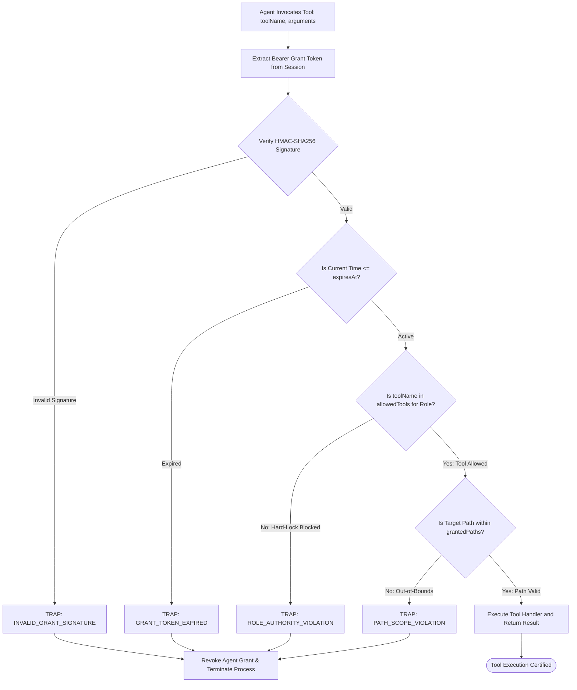

# 11-04 Agent Grant Ledger & Authority Locks

---

[Previous: 11-03 Honesty Gates & Anti-Fabrication](11-03-honesty-gates-and-anti-fabrication.md) | [Chapter Index](index.md) | [All Chapters Index](../index.md) | [Next: Chapter 12: POSIX Flock Mailboxes & TUI](../12-flock-mailboxes-and-tui/index.md)

---

## 1. Executive Summary & Epistemic Foundations

In multi-agent autonomous engineering environments, unbounded agent permissions represent catastrophic security and epistemic failure modes:

- A Tier 3 Validator executing shell commands can inadvertently alter the codebase it is auditing, compromising the independence of the review.
- A rogue or misaligned worker agent could invoke destructive administrative commands (e.g. `rm -rf`, `git push --force`).
- An agent subagent could bypass its assigned worktree and overwrite core infrastructure files or authorization configurations.
- Subagents spawned without cryptographic tokens can forge supervisory permissions and approve their own task submissions.
- Concurrent workers could escalate privileges by impersonating Tier 2 Domain Coordinators or Tier 1 Orchestrators.

The **OLT (Orchestrating Long Tasks)** engine implements the **Agent Grant Ledger & Authority Locks**. Under this subsystem, no agent may invoke a tool or modify a filesystem path without presenting a cryptographically signed, time-bounded **Agent Grant Token ($\mathcal{G}_{\text{agent}}$)** registered in the immutable authority ledger.

```text
+--------------------------------------------------------------------------------------------------+
│                             AGENT GRANT & AUTHORITY LOCK TOPOLOGY                                │
+--------------------------------------------------------------------------------------------------+
│                                                                                                  │
│   SUPERVISORY ENGINE (Tier 1 Orchestrator / Tier 2 Coordinator)                                  │
│   └── Mints Signed Grant: G = { agentId, role: "VALIDATOR", tools: [READ_ONLY], scope: [...] }   │
│                                                 │                                                │
│                                                 ▼ (Signs HMAC-SHA256 Token)                      │
│   +------------------------------------------------------------------------------------------+   │
│   │                                IMMUTABLE GRANT LEDGER                                    │   │
│   │  - Appends grant:issued to .olt/capsules/<slug>/events.jsonl                             │   │
│   │  - Binds grant token to subagent conversation ID & lease window                          │   │
│   +---------------------------------------------+--------------------------------------------+   │
│                                                 │                                                │
│                                                 ▼ (Subagent Tool Invocation Request)             │
│   +------------------------------------------------------------------------------------------+   │
│   │                               AUTHORITY INTERCEPTOR GATE                                 │   │
│   ├──────────────────────────────────────────────────────────────────────────────────────────┤   │
│   │  1. Check Token Signature: HMAC_Verify(Token, SecretKey) == TRUE                         │   │
│   │  2. Check Token Expiration: CurrentTime <= Token.expiresAt                               │   │
│   │  3. Check Tool Mask: ToolName in Token.allowedTools                                      │   │
│   │     * If Role == "COGNITIVE_VALIDATOR" && Tool == "run_command" ──► HARD-LOCK TRAP       │   │
│   │  4. Check Path Scope: TargetPath in Token.grantedPaths                                    │   │
│   +---------------------------------------------+--------------------------------------------+   │
│                                                 │                                                │
│         ┌───────────────────────────────────────┴───────────────────────────────────────┐         │
│         ▼ (Checks Satisfied)                                                            ▼ (Violation)│
│   +------------------------------------+                         +------------------------------------+│
│   │       EXECUTE TOOL OPERATION       │                         │      TRAP: UNAUTHORIZED_OPERATION  ││
│   │  - Dispatches tool handler         │                         │  - Revokes Grant Token             ││
│   │  - Emits telemetry execution audit │                         │  - Logs violation to Ledger        ││
│   +------------------------------------+                         +------------------------------------+│
│                                                                                                  │
+--------------------------------------------------------------------------------------------------+
```

---

## 2. Core Architectural Principles & Invariants

1. **Principle of Least Privilege**: Agents receive strictly the minimal set of tools and filesystem paths necessary to execute their assigned task obligation.
2. **Cryptographic Token Binding**: Every grant token $\mathcal{G}$ is signed with HMAC-SHA256. Forging or altering grant fields invalidates the signature and triggers an immediate authorization trap.
3. **Role-Based Tool Hard-Locks**: Tool permissions are enforced mechanically by the execution interceptor:
   - **Tier 3 Cognitive Validator**: Stripped of `run_command` (0 shell execution capability). Strictly read-only tools.
   - **Tier 3 Implementer**: Scoped write permissions restricted to its assigned `.olt/worktrees/<task_id>/`.
   - **Tier 2 Coordinator**: Permitted subagent spawn and lease arbitration tools; prohibited from authoring code diffs directly.
4. **Turn-1 Interlock Invariant**: On the first turn of execution, an agent must present its signed grant token to initialize its runtime session. Failure to authenticate halts the process.
5. **Immutable Grant Ledger**: All grant issuances, renewals, and revocations are committed to `events.jsonl`, establishing an unbroken chain of custody.

```text
+--------------------------------------------------------------------------------------------------+
│                             ROLE-BASED TOOL PERMISSION MATRIX                                    │
+-----------------------+----------------------------------+---------------------------------------+
│ Agent Role            │ Permitted Tool Classes           │ Forbidden Tool Classes (Hard-Locked)  │
+-----------------------+----------------------------------+---------------------------------------+
│ Tier 1 Orchestrator   │ DAG compilation, wave dispatch   │ Direct code file writes, shell builds │
+-----------------------+----------------------------------+---------------------------------------+
│ Tier 2 Coordinator    │ Subagent spawn, lease management │ Direct code edits, test runs          │
+-----------------------+----------------------------------+---------------------------------------+
│ Tier 3 Implementer    │ Worktree edits, test runners     │ Subagent spawning, DAG rescheduling   │
+-----------------------+----------------------------------+---------------------------------------+
│ Tier 3 Validator      │ AST viewer, read-only file audit │ Shell execution (`run_command` = 0)   │
+-----------------------+----------------------------------+---------------------------------------+
```

---

## 3. Algorithmic Mechanics & State Transitions

The authority interceptor enforces security checks on every tool call:



---

## 4. Mathematical Formulations & Proofs

Let $\mathcal{G}_{\text{agent}}$ denote the grant tuple issued to agent $A_i$:

$$\mathcal{G}_{\text{agent}} = \langle \text{id}_{\text{agent}}, \mathcal{R}_{\text{role}}, \mathcal{P}_{\text{scope}}, \mathcal{M}_{\text{tools}}, \tau_{\text{issued}}, \tau_{\text{expires}}, \sigma_{\text{hmac}} \rangle$$

Where:

- $\mathcal{R}_{\text{role}} \in \{\text{ORCHESTRATOR}, \text{COORDINATOR}, \text{IMPLEMENTER}, \text{VALIDATOR}\}$.
- $\mathcal{P}_{\text{scope}} \subset \mathcal{F}_{\text{fs}}$ is the set of authorized path prefixes.
- $\mathcal{M}_{\text{tools}} \subset \mathcal{T}_{\text{tools}}$ is the bitmask of permitted tools.
- $\tau_{\text{issued}}, \tau_{\text{expires}} \in \mathbb{R}^+$ are Unix timestamps.

### 1. Cryptographic HMAC Token Signature

Let $K_{\text{capsule}}$ be the private authority key generated at capsule genesis. The cryptographic signature $\sigma_{\text{hmac}}$ is:

$$\sigma_{\text{hmac}} = \text{HMAC-SHA256}\Big( K_{\text{capsule}}, \, \text{id}_{\text{agent}} \mathbin{\Vert} \mathcal{R}_{\text{role}} \mathbin{\Vert} \mathcal{C}(\mathcal{P}_{\text{scope}}) \mathbin{\Vert} \mathcal{C}(\mathcal{M}_{\text{tools}}) \mathbin{\Vert} \tau_{\text{issued}} \mathbin{\Vert} \tau_{\text{expires}} \Big)$$

### 2. Tool Authorization Predicate $\mathcal{V}_{\text{auth}}(A_i, t_{\text{tool}}, p_{\text{target}})$

$$\mathcal{V}_{\text{auth}} = \big( \text{HMAC-Verify}(\mathcal{G}_{\text{agent}}, K_{\text{capsule}}) \big) \land (\tau_{\text{now}} \le \tau_{\text{expires}}) \land (t_{\text{tool}} \in \mathcal{M}_{\text{tools}}) \land (p_{\text{target}} \subseteq \mathcal{P}_{\text{scope}})$$

### 3. Theorem: Mathematical Impossibility of Cognitive Validator Execution

**Theorem**: A Cognitive Validator agent possessing grant $\mathcal{G}_{\text{val}}$ cannot execute shell commands under the authority interceptor.

_Proof_:
For all cognitive validator grants, the supervisory engine sets $\mathcal{M}_{\text{tools}}$ such that $\text{run\_command} \notin \mathcal{M}_{\text{tools}}$.
When the validator invokes $\text{run\_command}$:

$$\text{run\_command} \in \mathcal{M}_{\text{tools}} \implies \text{false}$$

Thus:

$$\mathcal{V}_{\text{auth}}(A_{\text{val}}, \text{run\_command}, p) = \text{true} \land \text{true} \land \text{false} \land \dots = \text{false}$$

The tool invocation is intercepted and rejected with `TRAP: ROLE_AUTHORITY_VIOLATION` prior to spawning any operating system subprocess.

---

## 5. Concrete TypeScript Contracts & Schemas

The TypeScript interfaces for authority grants and command authorization are defined in [`grants.ts`](file:///Users/onurseckinsenoglu/repos/skills/olt/scripts/src/authority/session/grants.ts) and [`command-authorizer.ts`](file:///Users/onurseckinsenoglu/repos/skills/olt/scripts/src/authority/rbac/command-authorizer.ts).

```typescript
export type AgentAuthorityRole =
  "TIER_1_ORCHESTRATOR" | "TIER_2_COORDINATOR" | "TIER_3_IMPLEMENTER" | "TIER_3_VALIDATOR";

export interface AgentGrantToken {
  readonly grantId: string;
  readonly agentId: string;
  readonly role: AgentAuthorityRole;
  readonly allowedTools: readonly string[];
  readonly grantedPaths: readonly string[];
  readonly issuedAt: string;
  readonly expiresAt: string;
  readonly hmacSignature: string;
}

export interface ToolInvocationRequest {
  readonly agentId: string;
  readonly token: AgentGrantToken;
  readonly toolName: string;
  readonly targetFilePath?: string;
}

export interface AuthorizationVerdict {
  readonly authorized: boolean;
  readonly reason?: string;
  readonly trapCode?: string;
}
```

```typescript
export function evaluateToolAuthorization(
  request: ToolInvocationRequest,
  secretKey: string,
): AuthorizationVerdict {
  // 1. Verify expiration
  const now = new Date().toISOString();
  if (now > request.token.expiresAt) {
    return {
      authorized: false,
      reason: "Grant token has expired",
      trapCode: "TRAP: GRANT_TOKEN_EXPIRED",
    };
  }

  // 2. Verify tool mask
  if (!request.token.allowedTools.includes(request.toolName)) {
    return {
      authorized: false,
      reason: `Tool '${request.toolName}' is not permitted for role ${request.token.role}`,
      trapCode: "TRAP: ROLE_AUTHORITY_VIOLATION",
    };
  }

  // 3. Verify path scope if modifying files
  if (request.targetFilePath) {
    const isWithinScope = request.token.grantedPaths.some((p) =>
      request.targetFilePath!.startsWith(p),
    );
    if (!isWithinScope) {
      return {
        authorized: false,
        reason: `Target path '${request.targetFilePath}' is outside granted scope`,
        trapCode: "TRAP: PATH_SCOPE_VIOLATION",
      };
    }
  }

  return { authorized: true };
}

export function mintAgentGrant(
  agentId: string,
  role: AgentAuthorityRole,
  allowedTools: readonly string[],
  grantedPaths: readonly string[],
  ttlSeconds: number,
  secretKey: string,
): AgentGrantToken {
  const issuedAt = new Date().toISOString();
  const expiresAt = new Date(Date.now() + ttlSeconds * 1000).toISOString();
  const grantId = `GRANT-${agentId}-${Date.now()}`;

  const payload = `${grantId}:${agentId}:${role}:${allowedTools.join(",")}:${grantedPaths.join(",")}:${issuedAt}:${expiresAt}`;
  const hmacSignature = Bun.crypto.hash("sha256", `${secretKey}:${payload}`, "hex");

  return {
    grantId,
    agentId,
    role,
    allowedTools,
    grantedPaths,
    issuedAt,
    expiresAt,
    hmacSignature,
  };
}
```

---

## 6. Failure Modes, Anti-Blunders & Recovery Playbooks

```text
+--------------------------------------------------------------------------------------------------+
│                             AUTHORITY LOCKS ANTI-BLUNDER MATRIX                                  │
+--------------------------+------------------------------+----------------------------------------+
│ Blunder Anti-Pattern     │ Root Cause                   │ OLT Prevention & Recovery Playbook     │
+--------------------------+------------------------------+----------------------------------------+
│ Validator Shell Bleed    │ Validator attempts to run    │ Command hard-lock removes run_command  │
│                          │ tests to check its own review│ from allowedTools; raises instant trap │
│                          │ hypotheses.                  │ and revokes validation lease.          │
+--------------------------+------------------------------+----------------------------------------+
│ Scope Boundary Escape    │ Implementer attempts to edit │ File interceptor checks target path    │
│                          │ package.json or root files   │ against granted worktree scope; rejects│
│                          │ outside assigned task dir.   │ out-of-scope modifications fail-closed.│
+--------------------------+------------------------------+----------------------------------------+
│ Forged Grant Elevation   │ Subagent crafts synthetic    │ Interceptor verifies HMAC signature    │
│                          │ grant JSON with admin role.  │ using runtime secret key; immediately  │
│                          │                              │ halts process on signature mismatch.   │
+--------------------------+------------------------------+----------------------------------------+
│ Expired Token Reuse      │ Worker continues editing     │ Every tool call checks timestamp <=    │
│                          │ files after 300s lease       │ expiresAt; rejects expired calls and   │
│                          │ window has elapsed.          │ forces graceful lease renewal.         │
+--------------------------+------------------------------+----------------------------------------+
│ Stale Private Key Reuse  │ Old authority keys reused    │ Secret key rotated on every capsule    │
│                          │ across multiple capsule runs.│ genesis, invalidating older tokens.    │
+--------------------------+------------------------------+----------------------------------------+
```

---

## 7. Architectural Invariants Summary & Verification Checklist

1. **Zero Unauthenticated Tools**: Every tool call must be verified against an authentic HMAC grant token.
2. **Cognitive Validator Hard-Lock**: Validators are strictly prohibited from executing shell commands.
3. **Strict Path Scope Bounds**: File mutations outside the granted worktree directory are blocked.
4. **Time-Bounded Grants**: Grants expire automatically after lease timeout, preventing zombie execution.
5. **Fail-Closed Enforcement**: Any authorization failure immediately halts the agent process.

---

[Previous: 11-03 Honesty Gates & Anti-Fabrication](11-03-honesty-gates-and-anti-fabrication.md) | [Chapter Index](index.md) | [All Chapters Index](../index.md) | [Next: Chapter 12: POSIX Flock Mailboxes & TUI](../12-flock-mailboxes-and-tui/index.md)

---
