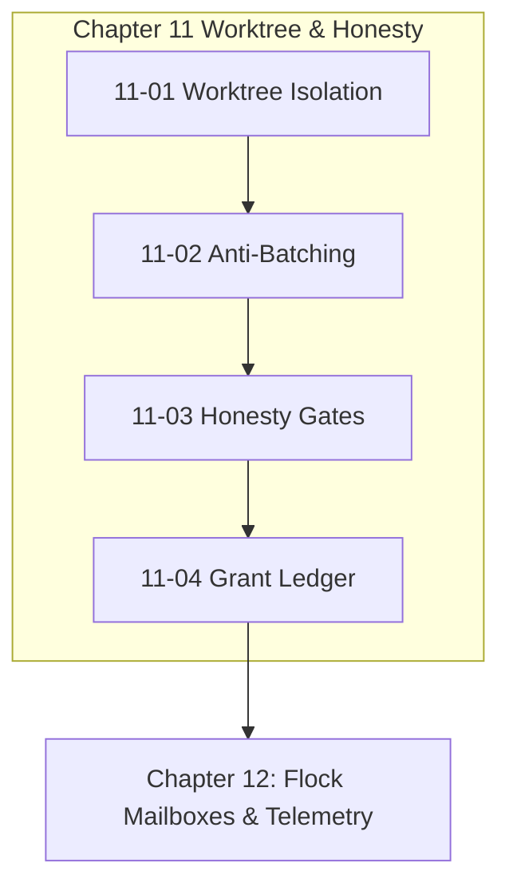

# Chapter 11: Worktree Branching & Honesty Gates

---

[Previous: Chapter 10 Index](../10-durability-recovery-capsules/index.md) | [Chapter Index](index.md) | [All Chapters Index](../index.md) | [Next: 11-01 Worktree Isolation](11-01-out-of-repo-git-worktree-isolation.md)

---

## 1. Chapter Overview & Worktree Architecture

Welcome to Chapter 11 of the OLT Architecture Book. This chapter codifies the out-of-repo Git worktree isolation mechanisms, strict 1:1 task anti-batching invariants, honesty verification gates, and agent grant ledgers governing workspace safety and provenance in the OLT (Orchestrating Long Tasks) engine.

Concurrent file edits in shared working trees produce race conditions and corrupted repositories. Chapter 11 establishes Out-of-Repo Git Worktree Isolation, details the Strict 1:1 Task Anti-Batching Invariant, formalizes Honesty Gates & Anti-Fabrication Detection, and defines the Agent Grant Ledger & Authority Locks.

```text
+--------------------------------------------------------------------------------------------------+
│                             CHAPTER 11: WORKTREE & HONESTY TOPOLOGY                              │
+--------------------------------------------------------------------------------------------------+
│                                                                                                  │
│    ┌───────────────────────────┐                    ┌───────────────────────────┐                │
│    │ 11-01: Out-of-Repo        │                    │ 11-02: Strict 1:1         │                │
│    │ Worktree Isolation        │ ══════════════════►│ Anti-Batching Invariant   │                │
│    └─────────────┬─────────────┘                    └─────────────┬─────────────┘                │
│                  │                                                │                              │
│                  ▼                                                ▼                              │
│    ┌───────────────────────────┐                    ┌───────────────────────────┐                │
│    │ 11-03: Honesty Gates      │                    │ 11-04: Agent Grant        │                │
│    │ & Anti-Fabrication        │ ══════════════════►│ Ledger & Authority Locks  │                │
│    └───────────────────────────┘                    └───────────────────────────┘                │
│                                                                                                  │
+--------------------------------------------------------------------------------------------------+
```

---

## 2. Chapter Table of Contents & Learning Path

```text
+--------------------------------------------------+--------------+--------------------------------+
│ Document                                         │ Classification│ Core Architectural Focus       │
+--------------------------------------------------+--------------+--------------------------------+
│ 11-01 Out-of-Repo Git Worktree Isolation         │ Concurrency  │ Isolated paths & branch merges │
│ 11-02 Strict 1:1 Task Anti-Batching              │ Invariants   │ Bijective worker:task mapping  │
│ 11-03 Honesty Gates & Anti-Fabrication           │ Verification │ Ground-truth physical checks   │
│ 11-04 Agent Grant Ledger & Authority Locks       │ Security     │ Session lineages & HMAC tokens │
+--------------------------------------------------+--------------+--------------------------------+
```

### [11-01: Out-of-Repo Git Worktree Isolation](11-01-out-of-repo-git-worktree-isolation.md)

Deconstructs out-of-repo worktrees (`.olt/worktrees/<task_id>/`), clean branch isolation, concurrent worker separation, and atomic sequential merging into the main repository.

### [11-02: Strict 1:1 Task Anti-Batching Invariant](11-02-strict-one-to-one-anti-batching.md)

Formalizes the bijective lease mapping $|\mathcal{M}(A_i)| \equiv 1$, eliminating blast radius cascades, context pollution, and ambiguous forensic diff attribution.

### [11-03: Honesty Gates & Anti-Fabrication Mechanisms](11-03-honesty-gates-and-anti-fabrication.md)

Details physical disk cross-checking, the mathematical honesty predicate $\mathcal{H}_{\text{gate}}$, and the four anti-fabrication sensors (Git diffs, process exits, AST grounding, image entropy).

### [11-04: Agent Grant Ledger & Authority Locks](11-04-agent-grant-ledger-and-authority-locks.md)

Explains session lineage tracking, least-privilege authority locks, cryptographic grant tokens, and RBAC interlocks.

---

## 3. Core Worktree & Honesty Specifications Table

$$ \begin{array}{|l|l|l|}
\hline
\textbf{Invariant / Policy} & \textbf{Formal Notation} & \textbf{Operational Guarantee} \\ \hline
\text{Worktree Isolation} & \mathcal{W}_i \cap \mathcal{W}_j = \emptyset & \text{Zero cross-worker file collisions} \\ \hline
\text{Anti-Batching} & |\text{Tasks}(A_i)| \equiv 1 & \text{Strict atomic task granularity} \\ \hline
\text{Honesty Predicate} & \text{Claim}(\text{diff}) \stackrel{?}{=} \text{Observed}(\text{diff}) & \text{Zero unverified agent prose accepted} \\ \hline
\text{Grant Signature} & \text{HMAC}_K(\text{id} \mathbin{\Vert} \text{scope} \mathbin{\Vert} \tau) & \text{Cryptographic authority locks} \\ \hline
\end{array}$$



---

## 4. Summary & Transition

The worktree isolation models and honesty verification interlocks established in Chapter 11 guarantee that parallel worker execution remains hermetic, honest, and mathematically accountable.

Proceed to [11-01: Out-of-Repo Git Worktree Isolation](11-01-out-of-repo-git-worktree-isolation.md) or advance directly to [Chapter 12: Flock Mailboxes & Telemetry](../12-flock-mailboxes-and-tui/index.md).

---

[Previous: Chapter 10 Index](../10-durability-recovery-capsules/index.md) | [Chapter Index](index.md) | [All Chapters Index](../index.md) | [Next: 11-01 Worktree Isolation](11-01-out-of-repo-git-worktree-isolation.md)

---
$$
