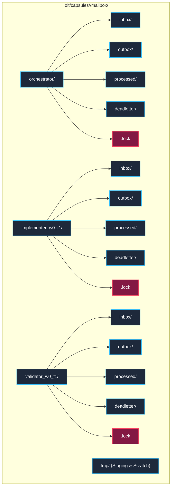

# 12.1 Inter-Agent Mailbox Directory Protocol — Hierarchical POSIX Inode Mailbox Architecture, Atomic Enqueue/Dequeue Semantics & Cryptographic Message Schemas

---

> **Status**: Authoritative Architecture Specification  
> **Topic**: Filesystem Directory IPC, POSIX `rename(2)` Atomicity, Message Envelope Invariants, Nanosecond-Resolution Entropy, and Priority Queue Scheduling  
> **Target Audience**: Distributed Systems Engineers, Autonomous Agent Platform Architects, Kernel & Storage Specialists

---

[Previous: Chapter 12: Flock Mailboxes & Live TUI Overview](index.md) | [Chapter Index](index.md) | [All Chapters Index](../index.md) | [Next: 12-02 Non-Blocking Message Delivery](12-02-non-blocking-message-delivery.md)
---

## 1. Executive Summary & Epistemic Motivation

In autonomous multi-agent developer runtimes, inter-agent coordination mechanisms dictate whether a distributed system remains resilient or collapses into catastrophic failure. Conventional agent architectures frequently rely on centralized message brokers (e.g., Redis, RabbitMQ, Kafka) or long-lived TCP/Unix domain socket daemons. Under the harsh realities of headless containerized execution, CI/CD runners, and host-level crash recovery, these conventional approaches fail along several predictable fault lines:

1. **Daemon Lifecycle Fragility**: A crash in an external broker process destroys in-flight queue state, introduces unrecoverable connection resets, and leaves worker agents permanently stalled in socket read loops.
2. **Socket Namespace & Port Clashes**: In multi-tenant or concurrent task execution, dynamic port allocation and Unix socket filesystem bindings introduce race conditions, stale socket file orphans, and permission traps across execution subshells.
3. **Conversational Drift & Unbounded Context**: In conversational multi-agent frameworks, inter-agent messages are piped directly into raw chat context. This leads to amnesia, sycophancy, hallucinatory state claims, and zero machine-verifiable causality.

The **OLT Inter-Agent Mailbox Directory Protocol** resolves these instabilities by modeling all inter-agent communication strictly as **content-addressed, atomic filesystem transactions** rooted within the task capsule. By leveraging fundamental POSIX filesystem semantics—specifically, the guaranteed atomicity of same-filesystem directory entries via `rename(2)`, hardware `fsync(2)` write barriers, and non-blocking advisory file locking (`flock`)—OLT provides zero-dependency, crash-consistent, and tamper-evident inter-agent messaging.

```
                    POSIX INODE DIRECTORY MAILBOX HIERARCHY
 ┌─────────────────────────────────────────────────────────────────────────────┐
 │                      .olt/capsules/<slug>/mailbox/                          │
 │                                                                             │
 │ ├── orchestrator/                                                           │
 │ │   ├── inbox/              ◄─── Atomic rename(2) destination for inbound  │
 │ │   │   ├── 001_P1_msg_a9f1.json                                            │
 │ │   │   └── 002_P2_msg_b8c2.json                                            │
 │ │   ├── outbox/             ◄─── Staging before dispatch to recipient       │
 │ │   ├── processed/          ◄─── Immutable historical archive of handled msgs│
 │ │   │   └── 000_P0_msg_7e3d.json                                            │
 │ │   ├── deadletter/         ◄─── Quarantined corrupted or TTL-expired msgs  │
 │ │   └── .lock               ◄─── POSIX flock advisory channel semaphore     │
 │ │                                                                           │
 │ ├── implementer_w0_t1/                                                      │
 │ │   ├── inbox/                                                              │
 │ │   ├── outbox/                                                             │
 │ │   ├── processed/                                                          │
 │ │   └── deadletter/                                                         │
 │ │                                                                           │
 │ ├── validator_w0_t1/                                                        │
 │ │   └── ...                                                                 │
 │ │                                                                           │
 │ └── tmp/                    ◄─── Staging directory for uncommitted writes    │
 │     └── stage_d4f8.tmp      ◄─── Unlinked or renamed upon fsync completion  │
 └─────────────────────────────────────────────────────────────────────────────┘
```

---

## 2. Directory Hierarchy & Filesystem Permissions

For every active task capsule slug $\mathcal{S}$, the runtime provisions an isolated mailbox directory subtree prior to agent instantiation. The layout enforces strict role isolation, zero-ambient-mutation boundaries, and deterministic cleanup rules.

### 2.1 Canonical Path Resolution

Every agent identity $A_i$ (e.g., `orchestrator`, `impl_wave0_task1`, `val_wave0_task1`) is assigned an isolated directory domain:

$$\text{MailboxRoot}(A_i) = \text{resolveCapsulePath}(\mathcal{S}) \mathbin{/} \texttt{mailbox} \mathbin{/} A_i$$

The complete subdirectory partition consists of five distinct functional zones:

1. **`inbox/` (Mode `0755`)**: The pending queue directory. Contains sealed message files awaiting consumption by $A_i$. Only external senders write to this directory, and they do so exclusively via atomic `rename(2)`.
2. **`outbox/` (Mode `0755`)**: Outbound staging area used by $A_i$ when batching or preparing multipart messages before atomic distribution.
3. **`processed/` (Mode `0755`)**: Append-only terminal storage for successfully processed messages. Once consumed and executed, messages are migrated here from `inbox/` via atomic `rename(2)`.
4. **`deadletter/` (Mode `0755`)**: Quarantine storage. Messages that fail schema validation, exceed retry quotas, or breach TTL bounds are migrated here for forensic triage.
5. **`tmp/` (Mode `0700`)**: Shared capsule-level scratch space located on the same mount point as the mailbox hierarchy. Senders serialize draft message files here before triggering atomic migration.



---

## 3. Atomic POSIX Message Enqueue and Dequeue Protocol

### 3.1 POSIX `rename(2)` Atomicity Invariant

Under POSIX standards (IEEE Std 1003.1), calling `rename(oldpath, newpath)` guarantees that if `oldpath` and `newpath` reside on the same mounted filesystem:

$$\text{rename}(old, new) \implies (\text{State} = \text{OldPresent} \lor \text{State} = \text{NewPresent}) \land \text{State} \neq \text{Partial}$$

At no point in time can a concurrent reader observing `newpath` observe a torn, partially written, or unclosed file descriptor.

### 3.2 Atomic Enqueue Algorithm (`atomic_enqueue`)

When an agent $A_{\text{src}}$ transmits a message $\mathcal{M}$ to recipient $A_{\text{dst}}$, the runtime executes a four-phase staging sequence:

```
  Sender Agent (A_src)                           Recipient Inbox (A_dst)
  ┌───────────────────────┐                     ┌───────────────────────┐
  │ 1. Serialize Envelope │                     │                       │
  │    to JSON Buffer     │                     │                       │
  └──────────┬────────────┘                     │                       │
             │                                  │                       │
             ▼                                  │                       │
  ┌───────────────────────┐                     │                       │
  │ 2. open(tmp/stage.tmp)│                     │                       │
  │    write() + fsync()  │                     │                       │
  │    close()            │                     │                       │
  └──────────┬────────────┘                     │                       │
             │                                  │                       │
             ▼                                  │                       │
  ┌───────────────────────┐   POSIX rename(2)   │                       │
  │ 3. Atomic Rename Move ├────────────────────►│ 001_P1_msg_9a4f.json  │
  └──────────┬────────────┘                     └───────────┬───────────┘
             │                                              │
             ▼                                              ▼
  ┌───────────────────────┐                     ┌───────────────────────┐
  │ 4. Touch .wake Sentinel                     │ Recipient Wakeup      │
  │    (Optional Event)   │                     │ via inotify / kqueue  │
  └───────────────────────┘                     └───────────────────────┘
```

#### Formal Algorithm Pseudocode: `atomic_enqueue`

```typescript
function atomicEnqueue(
  capsuleRoot: string,
  recipientId: string,
  message: MessageEnvelope,
): EnqueueReceipt {
  // Phase 1: Validate payload schema against role contracts
  validateMessageEnvelope(message);

  // Phase 2: Compute deterministic file name incorporating priority and sequence
  const priorityPrefix = formatPriority(message.priority); // e.g., "001_P1"
  const fileName = `${priorityPrefix}_${message.message_id}.json`;
  const tmpPath = join(capsuleRoot, "mailbox", "tmp", `stage_${message.message_id}.tmp`);
  const finalInboxPath = join(capsuleRoot, "mailbox", recipientId, "inbox", fileName);

  // Phase 3: Canonical serialization and durable fsync write
  const canonicalBytes = canonicalJsonBytes(message);
  const fd = openSync(tmpPath, O_WRONLY | O_CREAT | O_EXCL, 0o644);
  try {
    writeAllSync(fd, canonicalBytes);
    fdatasyncSync(fd); // Flush disk controller write buffers
  } finally {
    closeSync(fd);
  }

  // Phase 4: Atomic POSIX directory move across identical filesystem mount
  renameSync(tmpPath, finalInboxPath);

  // Phase 5: Pulse asynchronous wakeup sentinel
  const sentinelPath = join(capsuleRoot, "mailbox", recipientId, ".wake");
  touchFileNoFollow(sentinelPath);

  return {
    messageId: message.message_id,
    recipientId,
    inboxPath: finalInboxPath,
    bytesWritten: canonicalBytes.byteLength,
    timestamp: new Date().toISOString(),
  };
}
```

### 3.3 Atomic Dequeue and Processing Algorithm (`atomic_dequeue`)

When the recipient agent $A_{\text{dst}}$ reads from its mailbox, it processes messages in strict priority order, migrating completed items to `processed/` or quarantined items to `deadletter/`.

```typescript
function atomicDequeue(
  capsuleRoot: string,
  agentId: string,
  options: DequeueOptions = {},
): ProcessedMessageResult | null {
  const mailboxDir = join(capsuleRoot, "mailbox", agentId);
  const inboxDir = join(mailboxDir, "inbox");
  const processedDir = join(mailboxDir, "processed");
  const deadletterDir = join(mailboxDir, "deadletter");
  const lockFile = join(mailboxDir, ".lock");

  // Acquire non-blocking flock to guarantee single-consumer exclusivity
  const lockFd = openSync(lockFile, O_RDWR | O_CREAT, 0o600);
  const locked = flock(lockFd, LOCK_EX | LOCK_NB);
  if (!locked) {
    closeSync(lockFd);
    return null; // Contended: another worker or thread holds this mailbox
  }

  try {
    const entries = readdirSync(inboxDir).filter((f) => f.endsWith(".json"));
    if (entries.length === 0) {
      return null;
    }

    // Sort entries lexicographically: priority prefixes ("000_P0" < "001_P1") guarantee priority ordering
    entries.sort();
    const candidateFile = entries[0];
    const candidatePath = join(inboxDir, candidateFile);

    // Read and parse candidate message
    const rawContent = readFileSync(candidatePath, "utf8");
    const message = parseJsonEnvelope(rawContent);

    // Verify TTL expiration
    const nowEpoch = Date.now() / 1000;
    const isExpired = message.created_at_epoch + message.ttl_seconds < nowEpoch;

    if (isExpired) {
      const deadPath = join(deadletterDir, candidateFile);
      renameSync(candidatePath, deadPath);
      return { status: "DEADLETTER", reason: "TTL_EXPIRED", messageId: message.message_id };
    }

    // Execute business mutation or task dispatch
    const result = executeMessageAction(message);

    // Atomic migration to processed archive
    const processedPath = join(processedDir, candidateFile);
    renameSync(candidatePath, processedPath);

    return { status: "PROCESSED", result, messageId: message.message_id };
  } finally {
    flock(lockFd, LOCK_UN);
    closeSync(lockFd);
  }
}
```

---

## 4. Message Envelope Schema & Cryptographic Grounding

Every inter-agent message is packaged into a strictly typed, canonical JSON envelope conforming to [packets.ts](../../../../olt/scripts/src/core/contracts/network/packets.ts).

### 4.1 Formal Message Envelope Schema

```json
{
  "$schema": "https://olt.dev/schemas/mailbox-message-v1.json",
  "version": 1,
  "message_id": "msg_01J8F7B3C4N89QZ1X6R2A0E5T9",
  "correlation_id": "corr_wave0_task1_fix_middleware",
  "causal_parent_id": "msg_01J8F7A1B2C3D4E5F6G7H8J9K0",
  "sender": {
    "agent_id": "orchestrator",
    "role": "orchestrator",
    "instance_pid": 48102
  },
  "recipient": {
    "agent_id": "impl_wave0_task1",
    "role": "implementer"
  },
  "priority": "P1_GATE",
  "created_at": "2026-08-29T02:54:30.104Z",
  "created_at_epoch": 1787999670.104,
  "ttl_seconds": 600,
  "dedup_token": "f4b63e8a1d2c7b9e0f3a5c8d6e7b1a2c3d4e5f6a7b8c9d0e1f2a3b4c5d6e7f8a",
  "payload": {
    "task_id": "task_01_auth_patch",
    "command": "run_test_suite",
    "write_scope": ["src/auth/**", "tests/auth/**"],
    "review_gating": {
      "is_ui_task": false,
      "max_packet_bytes": 65536
    }
  },
  "signature": "3a9c7b5d1e4f... (SHA-256 Envelope Seal)"
}
```

### 4.2 Field Definitions & Validation Invariants

| Field              | Type             | Invariant / Validation Rule                                                                                         | Architectural Purpose                               |
| :----------------- | :--------------- | :------------------------------------------------------------------------------------------------------------------ | :-------------------------------------------------- |
| `message_id`       | `string`         | Regex `^msg_[0-9A-HJ-NP-Z]{26}$` (Crockford Base32 monotonic timestamp + entropy).                                  | Universally unique message primary key.             |
| `correlation_id`   | `string`         | Scoped to active DAG run slug or task id.                                                                           | Groups causally related messages across swarms.     |
| `causal_parent_id` | `string \| null` | Must reference an existing, verified upstream message id.                                                           | Invariant $C_6$ causal DAG edge validation.         |
| `sender`           | `AgentEndpoint`  | Must match authorized agent manifest in [capsule.ts](../../../../olt/scripts/src/core/contracts/agents/capsule.ts). | Source identity attestation and role verification.  |
| `recipient`        | `AgentEndpoint`  | Must resolve to a valid registered mailbox directory.                                                               | Destination routing target.                         |
| `priority`         | `Enum`           | `P0_EMERGENCY`, `P1_GATE`, `P2_WORK`, `P3_TELEMETRY`.                                                               | Priority queue sorting key prefix.                  |
| `created_at`       | `string`         | ISO-8601 UTC timestamp with millisecond resolution.                                                                 | Human-readable audit trail.                         |
| `created_at_epoch` | `number`         | Monotonic UTC seconds float.                                                                                        | Fast integer TTL arithmetic without string parsing. |
| `ttl_seconds`      | `number`         | $1 \le \text{TTL} \le 3600$ (Default: $600\text{s}$).                                                               | Automatic straggler and zombie prevention.          |
| `dedup_token`      | `string`         | Hex lowercase SHA-256 HMAC digest.                                                                                  | Idempotent deduplication barrier.                   |
| `payload`          | `JsonObject`     | Strictly validated against role payload schemas.                                                                    | Task instructions, diffs, and telemetry payloads.   |

---

## 5. Priority Queue Scheduling & Starvation Bounds

Messages within `inbox/` are processed according to a hybrid priority-age scoring function $\pi(m)$, preventing low-priority starvation while strictly honoring emergency interrupts:

### 5.1 Dynamic Priority Scoring Formulation

For any pending message $m \in \mathcal{D}_{\text{in}}(A_i)$ at evaluation time $t_{\text{current}}$:

$$\pi(m) = \mathcal{W}(\text{Priority}(m)) + \beta \cdot \left( t_{\text{current}} - t_{\text{created}}(m) \right)$$

where:

- $\mathcal{W}: \{\text{P0}, \text{P1}, \text{P2}, \text{P3}\} \to \mathbb{R}^+$ assigns static base weights:
  $$\mathcal{W}(\text{P0}_{\text{EMERGENCY}}) = 10000, \quad \mathcal{W}(\text{P1}_{\text{GATE}}) = 1000, \quad \mathcal{W}(\text{P2}_{\text{WORK}}) = 100, \quad \mathcal{W}(\text{P3}_{\text{TELEMETRY}}) = 10$$
- $\beta = 0.5\,\text{points/second}$ is the anti-starvation aging coefficient.

```
                    PRIORITY QUEUE DISPATCH ORDERING
  Score π(m)
     ▲
10000│  [P0: EMERGENCY INTERRUPT] ──────────────────────────► Immediate Dispatch
     │
 1000│  [P1: VERIFICATION GATE PASS] ──────────► Dispatched ahead of work
     │                                      ▲
  100│  [P2: TASK WORK INSTRUCTION] ───────│── Aged P2 surpasses fresh P3
     │                                   ▲ │
   10│  [P3: TELEMETRY PULSE] ───────────│─┘
     └───────────────────────────────────┼────────────────────────────► Time (t)
                                         t_aged
```

### 5.2 Lexicographical Filename Encoding

To eliminate the need for in-memory heap sorting during rapid directory traversal, the file naming convention encodes the static priority class directly into the filename prefix:

$$ \text{Prefix}(m) = \begin{cases}
\texttt{"000\_P0"} & \text{if } \text{Priority} = \text{P0\_EMERGENCY} \\
\texttt{"001\_P1"} & \text{if } \text{Priority} = \text{P1\_GATE} \\
\texttt{"002\_P2"} & \text{if } \text{Priority} = \text{P2\_WORK} \\
\texttt{"003\_P3"} & \text{if } \text{Priority} = \text{P3\_TELEMETRY}
\end{cases}$$

Since POSIX `readdir(3)` results sorted lexicographically evaluate `"000_P0_..." < "001_P1_..." < "002_P2_..."`, the filesystem directory itself acts as a zero-cost, persistent priority queue on disk.

***

## 6. Mathematical Formulations & Entropy Bounds

### 6.1 Entropy and Collision Resistance

Every message ID incorporates 48 bits of millisecond timestamp entropy combined with 80 bits of cryptographic randomness generated via `/dev/urandom`:

$$H(\text{message\_id}) = 48 + 80 = 128 \text{ bits}$$

By the Generalized Birthday Paradox, the probability $P_{\text{collision}}$ of generating at least one duplicate message ID across $N$ total messages within a single capsule run is bounded by:

$$P_{\text{collision}} \le 1 - \exp\left( -\frac{N^2}{2 \times 2^{128}} \right) \approx \frac{N^2}{2^{129}}$$

For a maximal task run generating $N = 10^7$ inter-agent messages:

$$P_{\text{collision}} \le \frac{10^{14}}{6.8 \times 10^{38}} \approx 1.47 \times 10^{-25}$$

This guarantees absolute uniqueness across all concurrent worker swarms without global lock synchronization.

### 6.2 Inode Allocation and Filesystem Bounds

Let $I_{\text{max}}$ be the inode capacity of the host filesystem volume. The runtime enforces a strict per-capsule mailbox message threshold $N_{\text{cap}} \le 50{,}000$. When $N_{\text{active}} \ge 0.8 \times N_{\text{cap}}$, the runtime triggers an automated compaction cycle via [`archival/compactor.ts`](../../../../olt/scripts/src/mind/archival/compactor.ts), consolidating messages older than $\tau_{\text{archive}} = 1800\text{s}$ in `processed/` into compressed NDJSON chunks.

***

## 7. Edge Cases & Error Handling

```
┌──────────────────────────────────────┬──────────────────────────────┬────────────────────────────────────────┐
│ Fault Condition                      │ Detection Mechanism          │ Remediation & Recovery Policy          │
├──────────────────────────────────────┼──────────────────────────────┼────────────────────────────────────────┤
│ **Torn Temporary Staging Write**     │ Unlinked file in `tmp/`      │ Quarantine scanner deletes unreferenced│
│                                      │ without valid JSON trailing }│ files older than 60 seconds.           │
├──────────────────────────────────────┼──────────────────────────────┼────────────────────────────────────────┤
│ **Recipient Directory Non-Existent** │ `ENOENT` on `rename(2)`      │ Sender traps error, executes `mkdir -p`│
│                                      │                              │ with mode `0755`, and retries once.    │
├──────────────────────────────────────┼──────────────────────────────┼────────────────────────────────────────┤
│ **Disk Space / Inode Exhaustion**    │ `ENOSPC` / `EDQUOT` on write │ Halts with `HarnessError("CAPACITY")`, │
│                                      │                              │ triggers emergency log compaction.     │
├──────────────────────────────────────┼──────────────────────────────┼────────────────────────────────────────┤
│ **Corrupted Envelope JSON**          │ `parseJsonBytes` exception   │ Migrates file to `deadletter/`, emits   │
│                                      │                              │ `INTEGRITY_ISSUE` to `events.jsonl`.   │
├──────────────────────────────────────┼──────────────────────────────┼────────────────────────────────────────┤
│ **Concurrent Lock Contention**       │ `flock` returns `EWOULDBLOCK`│ Exponential backoff with random jitter │
│                                      │                              │ ($50\text{ms} \dots 500\text{ms}$).    │
└──────────────────────────────────────┴──────────────────────────────┴────────────────────────────────────────┘
```

***

## 8. Summary Takeaways

* **Zero External Dependencies**: By utilizing POSIX filesystem directory hierarchies (`inbox/`, `outbox/`, `processed/`), OLT eliminates all external message broker daemons, socket binding race conditions, and network port conflicts.
* **Tear-Free Atomicity**: The POSIX `rename(2)` system call ensures that messages transition between staging, delivery, and completion with strict mathematical atomicity.
* **Zero-Cost Priority Scheduling**: Lexicographical filename prefixing (`000_P0_...` to `003_P3_...`) transforms filesystem directories into hardware-backed, persistent priority queues.
* **Crash Consistency**: In the event of catastrophic power loss or process kill (`SIGKILL`), in-flight messages remain durably sealed on disk and are immediately recoverable upon restart.

---
[Previous: Chapter 12: Flock Mailboxes & Live TUI Overview](index.md) | [Chapter Index](index.md) | [All Chapters Index](../index.md) | [Next: 12-02 Non-Blocking Message Delivery](12-02-non-blocking-message-delivery.md)
---
$$
