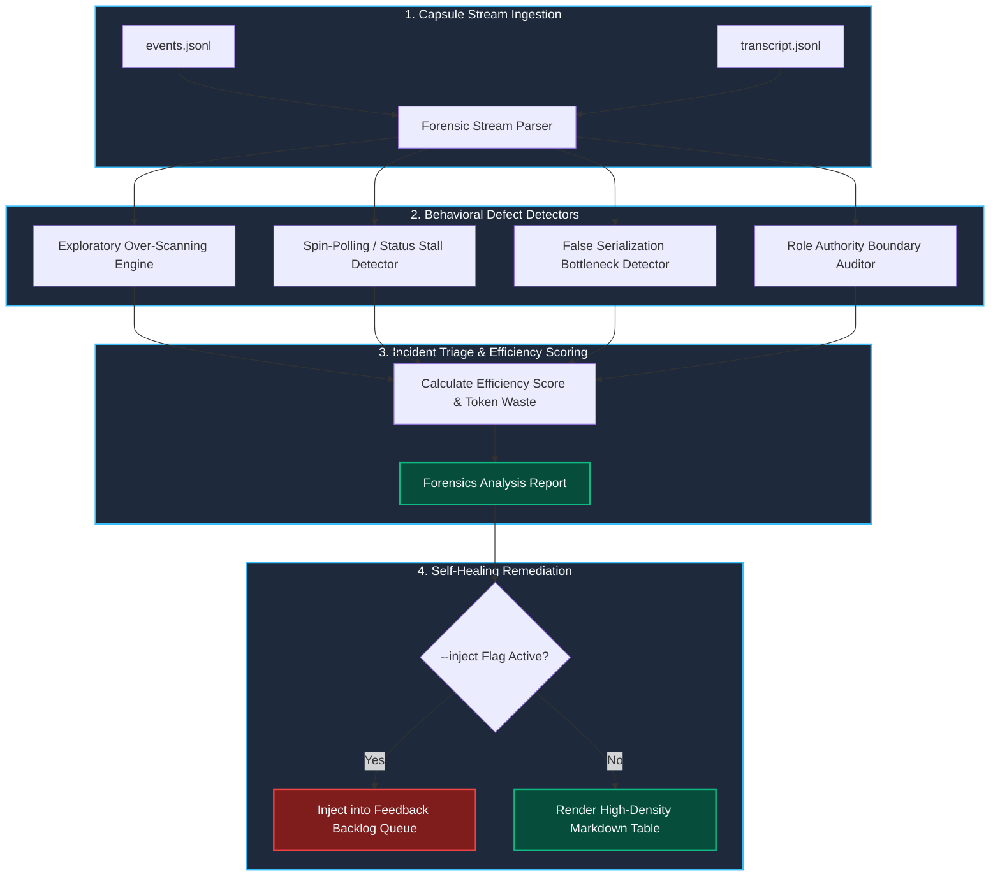

# 12.3 Audit Logging & Transcripts — Tamper-Evident Transcripts, Merkle-Linked Event Streams, Deterministic Replay & Forensic Post-Mortem Bundling

[OLT Documentation Hub](../../README.md) > [Architecture Index](../index.md) > [Chapter 12: Flock Mailboxes & Live TUI](./index.md) > 12.3 Audit Logging & Transcripts

---

> **Status**: Authoritative Architecture Specification  
> **Topic**: Cryptographic Event Chaining, Forward-Secure Merkle Logs, Dual-Stream Telemetry Architecture, Meta-Auditor Behavioral Forensics, and Deterministic State Replay  
> **Target Audience**: Distributed Systems Engineers, Security Architects, Forensic Auditors, Autonomous Runtime Engineers

---

[⏮️ Previous: 12-02 Non-Blocking Message Delivery](12-02-non-blocking-message-delivery.md) | [📂 Chapter Index](index.md) | [📚 All Chapters Index](../index.md) | [⏭️ Next: 12-04 Live TUI Telemetry & Diagnostics](12-04-live-tui-telemetry-and-diagnostics.md)
---

## 1. Executive Summary & Epistemic Architecture

In autonomous agent systems operating over extended horizons, execution integrity cannot rely on conversational memory or unstructured debug logs. Unstructured logs suffer from three critical deficiencies:

1. **Non-Verifiable Causality**: When an agent reports that a test suite passed or that a dependency was repaired, conversational logs cannot prove that the reported exit code originated from an actual kernel process execution rather than an LLM hallucination.
2. **Vulnerability to Retroactive Tampering**: If logs are stored as mutable flat files without cryptographic links, compromised worker agents or corrupted scripts can overwrite historical entries to mask errors or bypass verification gates.
3. **Replay Impossibility**: Without structured, canonical state diffs, reproducing the exact sequence of events that led to a regression or deadlock requires re-running non-deterministic LLM queries, which rarely follow the same path twice.

The **OLT Audit Logging & Transcript Architecture** solves these problems through a **dual-stream model** that strictly separates **authoritative state transitions** from **observability transcripts**, sealing every event into a forward-secure Merkle hash chain.

```
                    THE DUAL-STREAM AUDIT & TRANSCRIPT ENGINE
 ┌─────────────────────────────────────────────────────────────────────────────┐
 │                         TASK CAPSULE RUN DIRECTORY                          │
 │                                                                             │
 │  ┌─────────────────────────────────┐   ┌─────────────────────────────────┐  │
 │  │      AUTHORITATIVE STREAM       │   │      OBSERVABILITY STREAM       │  │
 │  │        events.jsonl             │   │       transcript.jsonl          │  │
 │  │  • Strict Canonical JSON       │   │  • Full LLM Prompts & Responses │  │
 │  │  • SHA-256 Merkle Hash Chain    │   │  • Tool Arguments & stdout/err  │  │
 │  │  • Monotonic Sequence/Revision  │   │  • Sub-Agent Sprout Telemetry   │  │
 │  │  • Projection Patch Operations  │   │  • Context Token Counter Log    │  │
 │  └────────────────┬────────────────┘   └────────────────┬────────────────┘  │
 │                   │                                     │                   │
 └───────────────────┼─────────────────────────────────────┼───────────────────┘
                     │                                     │
                     ▼                                     ▼
 ┌─────────────────────────────────────────────────────────────────────────────┐
 │                         FORENSIC ANALYSIS ENGINES                           │
 │                                                                             │
 │  ┌─────────────────────────────────┐   ┌─────────────────────────────────┐  │
 │  │    Living Tracer Event Replay   │   │     Meta-Auditor Forensics      │  │
 │  │  (living-tracer/event-replayer) │   │     (mind/auditing/meta)        │  │
 │  │  • Deterministic State Fold     │   │  • Over-Scanning Detection      │  │
 │  │  • Dynamic Sugiyama DAG Build   │   │  • False Serialization Alerts   │  │
 │  │  • Verification Gate Metrics    │   │  • Automated Remediation Queue  │  │
 │  └─────────────────────────────────┘   └─────────────────────────────────┘  │
 └─────────────────────────────────────────────────────────────────────────────┘
```

---

## 2. Tamper-Evident Merkle-Linked Event Streams (`events.jsonl`)

The authoritative ledger of every task capsule is `events.jsonl`. It stores a continuous, append-only sequence of discrete state transition records ($e_1, e_2, \dots, e_n$), strictly formatted as single-line canonical JSON.

### 2.1 Formal Cryptographic Hash-Chaining

Every event $e_k$ contains a cryptographic hash field $h_k$ binding it immutably to the entire prior history of the execution:

$$h_0 = \text{SHA-256}(\text{"GENESIS:"} \parallel \mathcal{S}.\text{run\_id} \parallel \mathcal{S}.\text{capsule\_id})$$

$$h_k = \text{SHA-256}\left( \text{canonicalJsonBytes}(e_k \setminus \{h_k\}) \right) \quad \text{where } e_k.\text{previous\_hash} = h_{k-1}$$

```
                FORWARD-SECURE MERKLE EVENT HASH CHAIN
  Event 1 (Sequence 1)           Event 2 (Sequence 2)           Event 3 (Sequence 3)
 ┌──────────────────────┐       ┌──────────────────────┐       ┌──────────────────────┐
 │ seq: 1               │       │ seq: 2               │       │ seq: 3               │
 │ kind: "TASK_SPROUT"  │       │ kind: "LEASE_CLAIM"  │       │ kind: "GATE_PASS"    │
 │ prev_hash: h_0       │       │ prev_hash: h_1 ◄─────┼───────┤ prev_hash: h_2 ◄─────┼──...
 │ hash: h_1 ───────────┼──────►│ hash: h_2            │       │ hash: h_3            │
 └──────────────────────┘       └──────────────────────┘       └──────────────────────┘
            ▲                              ▲                              ▲
      [fsync Mode]                   [fsync Mode]                   [fsync Mode]
```

### 2.2 Mathematical Proof of Tamper Evidence

**Theorem (Forward Integrity)**: Let $\mathcal{H} = \langle e_1, e_2, \dots, e_n \rangle$ be an event stream with hashes $\langle h_1, h_2, \dots, h_n \rangle$. If an adversary modifies, inserts, or deletes any event $e_j$ ($1 \le j \le n$), then for all subsequent events $k \ge j$, the verification predicate $\mathcal{V}(e_k)$ fails unless the adversary computes a pre-image for SHA-256.

**Proof**:

1. Suppose an attacker alters event $e_j$ to $e_j' \neq e_j$.
2. The canonical byte representation changes: $\text{bytes}(e_j') \neq \text{bytes}(e_j)$.
3. Under the Collision Resistance property of SHA-256, $\text{SHA-256}(\text{bytes}(e_j')) = h_j' \neq h_j$ with probability $1 - 2^{-256}$.
4. In event $e_{j+1}$, the stored field $e_{j+1}.\text{previous\_hash} = h_j \neq h_j'$.
5. Thus, $\text{validateEventChain}()$ halts at sequence $j+1$ with an `EVENT_CHAIN` integrity fault. $\blacksquare$

### 2.3 Event Stream Validation Algorithm

The validation engine implemented in [`engine/store/events/event-stream.ts`](file:///Users/onurseckinsenoglu/repos/skills/olt/scripts/src/engine/store/events/event-stream.ts) scans `events.jsonl` sequentially to verify cryptographic, sequence, and projection invariants:

```typescript
export function validateEventStream(
  eventLines: Iterable<string>,
  identity: { runId: string; capsuleId: string },
): ValidationResult {
  let expectedSeq = 1;
  let previousHash: string | null = null;
  let finalState: RunState = initialState();

  for (const [index, line] of enumerate(eventLines)) {
    if (!line.endsWith("\n")) {
      return { status: "TORN_TAIL", line: index + 1 };
    }

    const event: HarnessEvent = parseCanonicalJson(line);

    // 1. Sequence & Revision Monotonicity
    if (event.sequence !== expectedSeq || event.revision !== expectedSeq) {
      throw new HarnessError(
        "INTEGRITY",
        `Invalid sequence ${event.sequence} at line ${index + 1}`,
      );
    }

    // 2. Identity Verification
    if (event.run_id !== identity.runId || event.capsule_id !== identity.capsuleId) {
      throw new HarnessError("INTEGRITY", `Capsule identity mismatch at line ${index + 1}`);
    }

    // 3. Merkle Chain Link Verification
    if (event.previous_hash !== previousHash) {
      throw new HarnessError("INTEGRITY", `Broken hash chain link at sequence ${event.sequence}`);
    }

    // 4. Content Hash Verification
    const { hash, ...content } = event;
    const computedHash = sha256Bytes(canonicalJsonBytes(content));
    if (hash !== computedHash) {
      throw new HarnessError("INTEGRITY", `Hash mismatch at sequence ${event.sequence}`);
    }

    // 5. Monotonic State Projection Fold
    finalState = applyProjectionPatch(finalState, event.projection_patch ?? []);

    previousHash = hash;
    expectedSeq++;
  }

  return { status: "VALID", eventCount: expectedSeq - 1, finalState };
}
```

---

## 3. Observability Transcripts (`transcript.jsonl`)

While `events.jsonl` captures the high-level state machine progression, `transcript.jsonl` captures **verbatim agent cognitive traces**. This stream records every prompt assembled, tool call executed, subshell command output, and API token usage metric.

```json
{
  "timestamp": "2026-08-29T02:54:32.410Z",
  "actor": "impl_wave0_task1",
  "role": "implementer",
  "task_id": "task_01_auth_patch",
  "step_index": 4,
  "action": "TOOL_INVOCATION",
  "tool_name": "run_command",
  "parameters": {
    "CommandLine": "bun test tests/auth/middleware.test.ts",
    "Cwd": "/Users/.../repo"
  },
  "result": {
    "exit_code": 0,
    "stdout_bytes": 1420,
    "stderr_bytes": 0,
    "duration_ms": 312
  },
  "token_usage": {
    "input_tokens": 4210,
    "output_tokens": 184,
    "total_tokens": 4394
  },
  "context_depth_tokens": 34820
}
```

---

## 4. Forensic Behavioral Auditing & Meta-Auditor Protocol

Autonomous agent swarms frequently exhibit subtle behavioral regressions that do not trigger explicit syntax or exit code errors. The **Meta-Auditor Engine** ([`cli/commands/meta-audit.ts`](file:///Users/onurseckinsenoglu/repos/skills/olt/scripts/src/cli/commands/meta-audit.ts), [`mind/auditing/meta/index.ts`](file:///Users/onurseckinsenoglu/repos/skills/olt/scripts/src/mind/auditing/meta/index.ts)) scans `events.jsonl` and `transcript.jsonl` to detect four canonical behavioral anti-patterns:



### 4.1 Canonical Behavioral Defect Taxonomy

1. **Exploratory Over-Scanning (`DEFECT_OVERSCAN`)**:
   - _Symptom_: Subagent executes repetitive `list_dir` or `find_by_name` queries across broad repository trees instead of targeted file lookups.
   - _Metric_: Exploration reads exceed $25\%$ of total tool invocations.
   - _Remediation_: Inject targeted context pointers into subsequent prompt generation.
2. **Spin-Polling Stalls (`DEFECT_SPIN_POLL`)**:
   - _Symptom_: Agent repeatedly queries background task status in a tight loop without exponential backoff or sentinel waits.
   - _Metric_: Consecutive status queries with $\Delta t < 100\text{ms}$.
   - _Remediation_: Enforce reactive wakeup sentinels and throttle poll frequencies.
3. **False Serialization (`DEFECT_FALSE_SERIAL`)**:
   - _Symptom_: Sequential execution of independent tasks that declare disjoint write scopes ($\Omega(u) \cap \Omega(v) = \emptyset$).
   - _Metric_: Parallelism ratio $\mathcal{P} < 0.5 \times \mathcal{P}_{\text{ideal}}$.
   - _Remediation_: Emit edge decoupling patches to the topological graph scheduler.
4. **Role Authority Escapes (`DEFECT_ROLE_ESCAPE`)**:
   - _Symptom_: Supervisory or review agents (e.g., `orchestrator`, `validator`) attempting file-modifying tool calls (`write_to_file`, `replace_file_content`).
   - _Metric_: Non-implementer role emitting mutating filesystem commands.
   - _Remediation_: Immediate hard-lock revocation and task reassignment.

### 4.2 Forensic Efficiency Score Formulation

The Meta-Auditor computes an objective behavioral efficiency score $\mathcal{E} \in [0, 100]\%$:

$$\mathcal{E} = 100 \times \left( 1 - \frac{T_{\text{waste}}}{T_{\text{total}}} \right) \times \prod_{i=1}^m \left( 1 - w_i \cdot \mathbb{I}(\text{Incident}_i) \right)$$

where:

- $T_{\text{waste}}$ is the token count consumed by redundant exploratory reads and failed retry loops.
- $w_i$ is the severity penalty ($w_{\text{critical}} = 0.25, w_{\text{high}} = 0.10, w_{\text{medium}} = 0.05$).
- $\mathbb{I}(\text{Incident}_i)$ is the indicator function for detected forensic incidents.

---

## 5. Deterministic Execution Replay Engine

Because state mutations are logged as formal projection patch operations ($\Delta_k$), the OLT runtime reconstructs the exact state of any task capsule at any point in historical time without re-running agent LLMs.

### 5.1 Historical State Fold Formulation

Let $\mathcal{S}_0$ be the initial empty capsule state. The state at arbitrary sequence $k$ is given by:

$$\mathcal{S}_k = \bigodot_{i=1}^k \Delta_i(\mathcal{S}_0) = \Delta_k(\Delta_{k-1}(\dots \Delta_1(\mathcal{S}_0)\dots))$$

```
                         DETERMINISTIC STATE REPLAY FOLD
  Initial State (S_0)     Event 1 (Δ_1)          Event 2 (Δ_2)          State at k (S_k)
 ┌───────────────────┐   ┌───────────────┐      ┌───────────────┐      ┌───────────────────┐
 │ revision: 0       │   │ Op: ADD_TASK  │      │ Op: SET_LEASE │      │ revision: k       │
 │ tasks: {}         ├──►│ id: "task-1"  ├─────►│ id: "task-1"  ├───►..│ tasks: { "task-1":│
 │ leases: {}        │   └───────────────┘      └───────────────┘      │   state: "DONE" } │
 └───────────────────┘                                                 └───────────────────┘
```

The Living Tracer ([`reporting/living-tracer/event-replayer.ts`](file:///Users/onurseckinsenoglu/repos/skills/olt/scripts/src/reporting/living-tracer/event-replayer.ts)) uses this deterministic fold to reconstruct:

- The dynamic round-by-round Sugiyama task DAG.
- All dynamically sprouted repair and review branches.
- Active worker lease timers and historical tool execution spans.

---

## 6. Reproducibility Archives & Post-Mortem Bundling

Upon task completion or unrecoverable failure, the OLT runtime bundles the capsule into a sealed, self-contained post-mortem archive:

```
.olt/archives/<slug>_<run_id>.tar.zst
├── manifest.json              ◄── SHA-256 root manifest & capsule metadata
├── events.jsonl               ◄── Authoritative Merkle-chained state ledger
├── transcript.jsonl           ◄── Complete LLM & tool execution transcript
├── mailbox/                   ◄── Final snapshot of processed & deadletter msgs
├── git/
│   ├── reflog.txt             ◄── Complete immutable Git reflog of all branches
│   └── patches/               ◄── Exported git diff milestone patches
└── audit/
    ├── forensics.json         ◄── Meta-Auditor incident report & metrics
    └── replay_verification.log◄── Standalone replay hash verification log
```

This bundle provides 100% offline verification, enabling formal review by compliance systems or human engineers without requiring access to external cloud services or runtime environments.

---

## 7. Summary Takeaways

- **Cryptographic Immutability**: By chaining every state transition with forward-secure SHA-256 hashes, `events.jsonl` provides mathematical proof of execution authenticity and tamper-detection.
- **Dual-Stream Separation**: Isolating high-level state transitions from verbose LLM transcripts preserves compact, fast state reconstruction while retaining full forensic visibility.
- **Autonomous Behavioral Forensics**: The Meta-Auditor detects behavioral drift, token burning, and role escapes, feeding corrective actions directly into the autonomous planning queue.
- **Bit-Exact Replayability**: Historical execution can be deterministically replayed step-by-step to inspect DAG states, lease allocations, and dynamic repair sprouts.

---

[⏮️ Previous: 12-02 Non-Blocking Message Delivery](12-02-non-blocking-message-delivery.md) | [📂 Chapter Index](index.md) | [📚 All Chapters Index](../index.md) | [⏭️ Next: 12-04 Live TUI Telemetry & Diagnostics](12-04-live-tui-telemetry-and-diagnostics.md)
---
