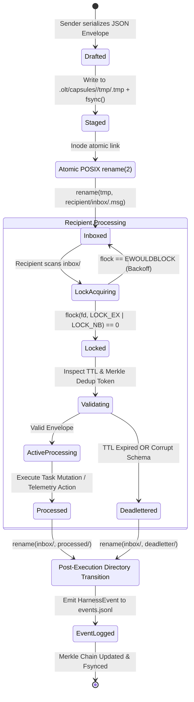

# Chapter 12: Flock Mailboxes, Telemetry & Live TUI — Inter-Agent Directory Protocols, Non-Blocking Advisory Streaming, Tamper-Evident Transcripts & Real-Time Terminal Dashboards

[OLT Documentation Hub](../../README.md) > [Architecture Index](../index.md) > Chapter 12: Flock Mailboxes, Telemetry & Live TUI

---

> **Status**: Authoritative Architecture Specification  
> **Topic**: Hierarchical Filesystem Mailbox IPC, POSIX Advisory `flock` Channels, Non-Blocking Sentinel Wakeups, Cryptographic Event/Transcript Logging, Behavioral Meta-Auditing, and High-Density VT100 TUI Dashboards  
> **Target Audience**: Distributed Systems Engineers, Multi-Agent Runtime Architects, Operating Systems Engineers, Observability & Verification Specialists

---

[⏮️ Previous: Chapter 11: Worktree Branching & Honesty Gates](../11-worktree-branching-honesty/index.md) | [📂 Chapter Index](index.md) | [📚 All Chapters Index](../index.md) | [⏭️ Next: 12-01 Mailbox Directory Protocol](12-01-inter-agent-mailbox-directory-protocol.md)
---

## 1. Executive Summary & IPC Philosophy

In long-horizon multi-agent systems executing autonomous software engineering tasks, inter-agent communication and runtime observability present severe architectural pitfalls. Traditional distributed communication models—such as centralized message brokers (e.g., Redis, RabbitMQ), persistent socket daemons, or shared-memory thread pools—introduce external daemon dependencies, fragile socket lifecycles, complex port binding disputes, and catastrophic uncoordinated process death during headless host container termination.

Conversely, unconstrained conversational multi-agent architectures entrust agent-to-agent coordination entirely to unstructured chat streams. This yields **conversational chaos**: unbounded token consumption, message loss across large context windows, non-deterministic race conditions on shared workspace files, and zero post-mortem auditability.

The **Orchestrated Long Tasks (OLT)** runtime resolves this fundamental challenge through the **Flock Mailbox & Telemetry Subsystem**. OLT models all inter-agent coordination, lifecycle telemetry, and diagnostic event streams strictly via **deterministic, filesystem-backed POSIX kernel primitives**:

1. **Hierarchical Directory-Based Mailboxes**: Every agent identity $A_i$ possesses an isolated, structured mailbox tree within the task capsule (`.olt/capsules/<slug>/mailbox/<agent_id>/`), partitioned into `inbox/`, `outbox/`, `processed/`, and `deadletter/` directories.
2. **Atomic POSIX Inode State Transitions**: Message enqueue and dequeue operations execute via POSIX `rename(2)` semantics on the same filesystem, guaranteeing strictly atomic, tear-free message state transitions with zero intermediate invalid states.
3. **Non-Blocking Advisory `flock` Channels**: Message delivery, channel polling, and mailbox consumption are guarded by non-blocking advisory file descriptor locks (`flock(fd, LOCK_EX | LOCK_NB)`). This eliminates cross-agent lock contention, prevents distributed deadlocks, and guarantees lock-free polling loops.
4. **Tamper-Evident Transcripts & Dual Event Streams**: High-volume diagnostic traces (`transcript.jsonl`) are strictly separated from authoritative state transition logs (`events.jsonl`). Every state event is cryptographically sealed into a forward-secure Merkle hash chain ($h_k = \text{SHA-256}(h_{k-1} \parallel e_k)$), providing deterministic execution replay and forensic auditability.
5. **Real-Time Terminal Observability (Live TUI)**: An asynchronous, non-interfering Terminal User Interface (TUI) engine renders live Work/Span cognitive metrics ($W, S, \mathcal{P} = \lceil W/S \rceil$), Sugiyama dynamic DAG wave progress, heartbeat meters, and active advisory leases directly to human operators and cognitive supervisory agents without worker thread serialization.

```
                      THE OLT FLOCK MAILBOX & TELEMETRY ARCHITECTURE
   ┌────────────────────────────────────────────────────────────────────────────────────────┐
   │                                  TASK RUN CAPSULE ROOT                                 │
   │                           .olt/capsules/<slug>/ (Mode 0755)                            │
   │                                                                                        │
   │  ┌───────────────────────────────┐                  ┌───────────────────────────────┐  │
   │  │   HIERARCHICAL MAILBOX TREE   │                  │  TAMPER-EVIDENT LOG STREAMS   │  │
   │  │  .olt/capsules/<slug>/mailbox │                  │  • events.jsonl (Merkle Chain)│  │
   │  │  ├── orchestrator/            │                  │  • transcript.jsonl (Traces)  │  │
   │  │  │   ├── inbox/  ◄──[atomic]  │                  │  • audit/incidents.jsonl      │  │
   │  │  │   ├── outbox/              │                  └───────────────┬───────────────┘  │
   │  │  │   └── processed/           │                                  │                  │
   │  │  ├── impl_wave0_task1/        │                                  │                  │
   │  │  │   ├── inbox/ (flock-locked)│                                  ▼                  │
   │  │  │   └── deadletter/          │                  ┌───────────────────────────────┐  │
   │  │  └── val_wave0_task1/         │                  │      META-AUDITOR ENGINE      │  │
   │  │      └── inbox/               │                  │  • Exploratory Over-Scanning  │  │
   │  └───────────────┬───────────────┘                  │  • False Serialization Flags  │  │
   │                  │                                  │  • Role Boundary Audits       │  │
   │                  │                                  └───────────────┬───────────────┘  │
   └──────────────────┼──────────────────────────────────────────────────┼──────────────────┘
                      │                                                  │
                      ▼                                                  ▼
   ┌────────────────────────────────────────────────────────────────────────────────────────┐
   │                          ASYNCHRONOUS LIVE TUI DASHBOARD                               │
   │  ┌──────────────────────────────────────────┬───────────────────────────────────────┐  │
   │  │ Quadrant I: Capsule Status & Dual-Time   │ Quadrant II: Work/Span & Brent Bounds │  │
   │  │  • Run: fix-auth-middleware              │  • Total Work (W): 1420s              │  │
   │  │  • Phase: WAVE_0_EXECUTION (Wave 2/4)    │  • Critical Span (S): 380s            │  │
   │  │  • Monotonic Time: 00:08:42.190 UTC      │  • Ideal Concurrency (P): 4 lanes     │  │
   │  ├──────────────────────────────────────────┼───────────────────────────────────────┤  │
   │  │ Quadrant III: Living Sugiyama Dynamic DAG│ Quadrant IV: Leases, Heartbeat & Bus  │  │
   │  │  • [task-1] COMPLETED ──► [task-3] RUN   │  • impl_0: Active (Lease: 342s left)  │  │
   │  │  • [task-2] COMPLETED ──► [task-4] READY │  • val_0:  Active (Lease: 512s left)  │  │
   │  │  • Dynamic Repair Branches: 1 active     │  • Mailbox: In: 0 | Out: 2 | Dead: 0  │  │
   │  └──────────────────────────────────────────┴───────────────────────────────────────┘  │
   └────────────────────────────────────────────────────────────────────────────────────────┘
```

---

## 2. Chapter Roadmap & Thematic Taxonomy

Chapter 12 is divided into four exhaustive sub-chapters, establishing the complete formal specification, mathematical models, POSIX kernel mechanics, and terminal rendering algorithms for inter-agent messaging and telemetry:

```
┌──────────────────────────────────────────────────────────────────────────────────────────────────┐
│                      CHAPTER 12: FLOCK MAILBOXES, TELEMETRY & LIVE TUI                           │
├──────────────────┬────────────────────────────────────────┬──────────────────────────────────────┤
│ Section          │ Title                                  │ Primary Theoretical Concepts         │
├──────────────────┼────────────────────────────────────────┼──────────────────────────────────────┤
│ **[12-01]**      │ [Inter-Agent Mailbox Directory Protocol│ • Hierarchical POSIX mailbox trees.  │
│                  │ ](./12-01-inter-agent-mailbox-directory-protocol.md) state transitions.│
│                  │ -protocol.md)                          │ • Canonical JSON message schema.     │
│                  │                                        │ • Priority ordering & TTL dispatch.  │
├──────────────────┼────────────────────────────────────────┼──────────────────────────────────────┤
│ **[12-02]**      │ [Non-Blocking Message Delivery & Flock │ • Advisory flock(2) channel locks.   │
│                  │ ](./12-02-non-blocking-message-delivery.md) probing loops.│
│                  │ .md)                                   │ • Sentinel touch wakeup signaling.   │
│                  │                                        │ • At-least-once & Merkle dedup proof.│
├──────────────────┼────────────────────────────────────────┼──────────────────────────────────────┤
│ **[12-03]**      │ [Audit Logging & Transcripts]          │ • Dual-stream separation model.      │
│                  │ (./12-03-audit-logging-and-transcripts.│ • Cryptographic SHA-256 Merkle chain.│
│                  │ md)                                    │ • Behavioral Meta-Auditor heuristics.│
│                  │                                        │ • Deterministic replay & bundling.   │
├──────────────────┼────────────────────────────────────────┼──────────────────────────────────────┤
│ **[12-04]**      │ [Live TUI Telemetry & Diagnostics]     │ • High-density 4-quadrant ANSI UI.   │
│                  │ (./12-04-live-tui-telemetry-and-diagnos│ • Live Work/Span cognitive metrics.  │
│                  │ tics.md)                               │ • Heartbeat monitors & lease meters. │
│                  │                                        │ • Lock-free frame rendering engine.  │
└──────────────────┴────────────────────────────────────────┴──────────────────────────────────────┘
```

---

## 3. End-to-End Inter-Agent Messaging & Telemetry State Machine

The lifecycle of an inter-agent message $\mathcal{M}$ advances through a strictly deterministic finite state machine ($S_{\text{msg}}$), governed by POSIX atomic directory movements and advisory lock acquisitions.



---

## 4. Mathematical Foundations of Asynchronous Mailbox Queuing & Telemetry

### 4.1 Formal Mailbox Topology Space

Let the global capsule communication space $\mathcal{C}_{\text{mbx}}$ be defined by the 5-tuple:

$$\mathcal{C}_{\text{mbx}} = \langle \mathcal{A}, \mathcal{D}_{\text{in}}, \mathcal{D}_{\text{out}}, \mathcal{D}_{\text{proc}}, \mathcal{D}_{\text{dead}} \rangle$$

where:

- $\mathcal{A} = \{A_1, A_2, \dots, A_n\}$ is the finite set of active agent identity descriptors within the capsule.
- $\mathcal{D}_{\text{in}}(A_i) \subset \text{Inodes}$ is the set of message files pending processing in $A_i$'s inbox directory.
- $\mathcal{D}_{\text{out}}(A_i) \subset \text{Inodes}$ is the outbound staging directory for agent $A_i$.
- $\mathcal{D}_{\text{proc}}(A_i) \subset \text{Inodes}$ is the immutable historical archive of completed messages.
- $\mathcal{D}_{\text{dead}}(A_i) \subset \text{Inodes}$ is the quarantined set of corrupted, unroutable, or TTL-expired messages.

### 4.2 Message Envelope Identity & Cryptographic Deduplication

Every message $\mathcal{M}$ transmitted across the mailbox protocol is defined as an immutable 8-tuple:

$$\mathcal{M} = \langle \text{id}, \text{corr\_id}, \text{sender}, \text{recipient}, \text{prio}, \text{ts}, \text{ttl}, \mathcal{P} \rangle$$

where:

- $\text{id} \in \{0, 1\}^{256}$ is a cryptographically unique identifier:
  $$\text{id} = \text{SHA-256}(\text{sender} \parallel \text{recipient} \parallel \text{ts} \parallel \text{nonce})$$
- $\text{prio} \in \{\text{P0}_{\text{EMERGENCY}}, \text{P1}_{\text{GATE}}, \text{P2}_{\text{WORK}}, \text{P3}_{\text{TELEMETRY}}\}$ defines the deterministic queue priority.
- $\mathcal{P} \in \text{JsonObject}$ is the validated payload conforming strictly to [packets.ts](file:///Users/onurseckinsenoglu/repos/skills/olt/scripts/src/core/contracts/network/packets.ts).

To ensure **Strict Monotonic Deduplication**, every consuming agent maintains an in-memory Merkle filter $\mathcal{K}_{\text{dedup}}$ combined with persistent directory indexing. A message $\mathcal{M}$ is accepted if and only if:

$$\text{DedupToken}(\mathcal{M}) \notin \mathcal{K}_{\text{dedup}} \land \text{FileExists}(\mathcal{D}_{\text{proc}}(A_i) / \text{id}) = \text{false}$$

where:

$$\text{DedupToken}(\mathcal{M}) = \text{HMAC-SHA256}(K_{\text{capsule}}, \mathcal{M}.\text{corr\_id} \parallel \mathcal{M}.\text{sender} \parallel \mathcal{M}.\text{ts})$$

### 4.3 Work/Span Cognitive Metrics & Telemetry Bounds

The real-time telemetry subsystem computes cognitive Work/Span metrics dynamically across the active Sugiyama task DAG $G = (V, E)$:

- **Cumulative Work ($W(t)$)**: The total cognitive processing and execution time expended plus estimated pending effort:
  $$W(t) = \sum_{v \in V_{\text{completed}}} t_{\text{actual}}(v) + \sum_{v \in V_{\text{active}}} t_{\text{elapsed}}(v) + \sum_{v \in V_{\text{pending}}} t_{\text{est}}(v)$$

- **Critical Span ($S(t)$)**: The maximal remaining causal execution path from the active wavefront to DAG terminal sinks:
  $$S(t) = \max_{p \in \text{Paths}(G_{\text{remaining}})} \sum_{v \in p} t_{\text{est}}(v)$$

- **Instantaneous Parallelism ($\mathcal{P}(t)$)**:
  $$\mathcal{P}(t) = \left\lceil \frac{W(t)}{S(t)} \right\rceil$$

- **Ideal Worker Lane Allocation Bound ($L_{\text{target}}$)**:
  $$L_{\text{target}}(t) = \max\left(1, \, \min\left(40, \, \mathcal{P}(t)\right)\right)$$

---

## 5. Architectural Invariants Matrix ($C_{\text{MBX}-1} \dots C_{\text{MBX}-5}$)

The Flock Mailbox & Telemetry subsystem enforces five strict invariants to ensure crash-recovery, zero message corruption, and lock-free execution:

| Invariant ID  | Canonical Name                    | Mathematical Formalization                                                                                                                                     | Enforcement Mechanism                                                                                           | Failure / Panic Code                        |
| :------------ | :-------------------------------- | :------------------------------------------------------------------------------------------------------------------------------------------------------------- | :-------------------------------------------------------------------------------------------------------------- | :------------------------------------------ |
| **`C_MBX-1`** | **Atomic Staging Invariant**      | $\forall \mathcal{M} \in \mathcal{D}_{\text{in}}, \, \text{Mode}(\mathcal{M}) = \texttt{0644} \land \text{TearFree}(\mathcal{M})$                              | Sender writes to `.olt/capsules/<slug>/tmp/`, executes `fsync(fd)`, then issues atomic `rename(2)` to `inbox/`. | `INTEGRITY` (Exit 3)                        |
| **`C_MBX-2`** | **Advisory Lock Exclusivity**     | $\forall A_i, A_j \in \mathcal{A} \, (i \neq j) \implies \text{FlockHolders}(\mathcal{D}_{\text{in}}(A_i)) \le 1$                                              | POSIX `flock(fd, LOCK_EX \| LOCK_NB)` on dedicated lockfiles (`.lock`) in each mailbox directory.               | `LOCK_TIMEOUT` (Exit 4)                     |
| **`C_MBX-3`** | **Monotonic Deduplication**       | $\forall \mathcal{M}_a, \mathcal{M}_b, \, \text{DedupToken}(\mathcal{M}_a) = \text{DedupToken}(\mathcal{M}_b) \implies \text{Exec}(\mathcal{M}_b) = \emptyset$ | Merkle filter check and `.olt/capsules/<slug>/mailbox/<agent>/processed/` presence verification.                | `IDEMPOTENT_IGNORE` (Exit 0)                |
| **`C_MBX-4`** | **Tamper-Evident Event Chaining** | $\forall k \ge 1, \, h_k = \text{SHA-256}(h_{k-1} \parallel \text{Bytes}(e_k)) \land \text{Fsynced}(e_k)$                                                      | Forward-secure Merkle hash chain validated by `validateEventChain()` on every state transition.                 | `INTEGRITY` (Exit 3) / `INTERNAL` (Exit 70) |
| **`C_MBX-5`** | **Lock-Free Telemetry Rendering** | $\text{LockWait}(\text{TUI\_Thread}) = 0\,\text{ms} \land \text{ThreadMutation}(\text{TUI}) = \emptyset$                                                       | Live TUI engine utilizes read-only file descriptor tailing (`tail -n`) with zero advisory lock acquisition.     | `UI_RENDER_FAULT` (Exit 0 degraded)         |

---

## 6. Source Traceability & Code Architecture Directory

The theoretical foundations and protocols detailed in this chapter are implemented across the following core runtime modules:

- **Event Streaming & Replay Engine**:
  [`engine/store/events/event-stream.ts`](file:///Users/onurseckinsenoglu/repos/skills/olt/scripts/src/engine/store/events/event-stream.ts) — Low-level Merkle chain validation, torn-line recovery, and canonical JSON event deserialization.  
  [`reporting/event-stream.ts`](file:///Users/onurseckinsenoglu/repos/skills/olt/scripts/src/reporting/event-stream.ts) — Capsule event reading, filtering, NDJSON streaming, and webhook telemetry dispatchers.  
  [`reporting/living-tracer/event-replayer.ts`](file:///Users/onurseckinsenoglu/repos/skills/olt/scripts/src/reporting/living-tracer/event-replayer.ts) — Chronological event folding and living task dynamic state reconstruction.

- **Forensic Auditing & Meta-Auditor**:
  [`cli/commands/meta-audit.ts`](file:///Users/onurseckinsenoglu/repos/skills/olt/scripts/src/cli/commands/meta-audit.ts) — CLI handler for deep behavioral forensics, incident table formatting, and feedback queue remediation injection.  
  [`mind/auditing/meta/index.ts`](file:///Users/onurseckinsenoglu/repos/skills/olt/scripts/src/mind/auditing/meta/index.ts) — Forensic incident discovery engine, token waste calculation, and efficiency scoring algorithms.

- **Living Dynamic Tracer & ASCII Visualizers**:
  [`reporting/living-tracer/render.ts`](file:///Users/onurseckinsenoglu/repos/skills/olt/scripts/src/reporting/living-tracer/render.ts) — Connected ASCII DAG hierarchy renderer with dynamic round-by-round repair branches and active agent tool indicators.  
  [`reporting/living-tracer/timeline.ts`](file:///Users/onurseckinsenoglu/repos/skills/olt/scripts/src/reporting/living-tracer/timeline.ts) — Real-time execution timeline synthesizer and gate metrics collector.  
  [`reporting/sugiyama-dag/render.ts`](file:///Users/onurseckinsenoglu/repos/skills/olt/scripts/src/reporting/sugiyama-dag/render.ts) — 4-phase Sugiyama layout renderer for terminal-native topological display.

- **Durable Storage & Inode Locking**:
  [`core/durable-write.ts`](file:///Users/onurseckinsenoglu/repos/skills/olt/scripts/src/core/durable-write.ts) — Hardware `fdatasync`, atomic temporary-to-permanent file replacement, and POSIX `flock` advisory concurrency locking.  
  [`logging/lock.ts`](file:///Users/onurseckinsenoglu/repos/skills/olt/scripts/src/logging/lock.ts) — Structured concurrency locking envelopes and deadlock timeout management.

- **Network Packets & Capsule Contracts**:
  [`core/contracts/network/packets.ts`](file:///Users/onurseckinsenoglu/repos/skills/olt/scripts/src/core/contracts/network/packets.ts) — Canonical TypeScript interfaces for review payloads, checklist coverage, and packet metadata.  
  [`core/contracts/agents/capsule.ts`](file:///Users/onurseckinsenoglu/repos/skills/olt/scripts/src/core/contracts/agents/capsule.ts) — Capsule layout contracts, runtime manifests, and projection patch models.

---

[⏮️ Previous: Chapter 11: Worktree Branching & Honesty Gates](../11-worktree-branching-honesty/index.md) | [📂 Chapter Index](index.md) | [📚 All Chapters Index](../index.md) | [⏭️ Next: 12-01 Mailbox Directory Protocol](12-01-inter-agent-mailbox-directory-protocol.md)
---
