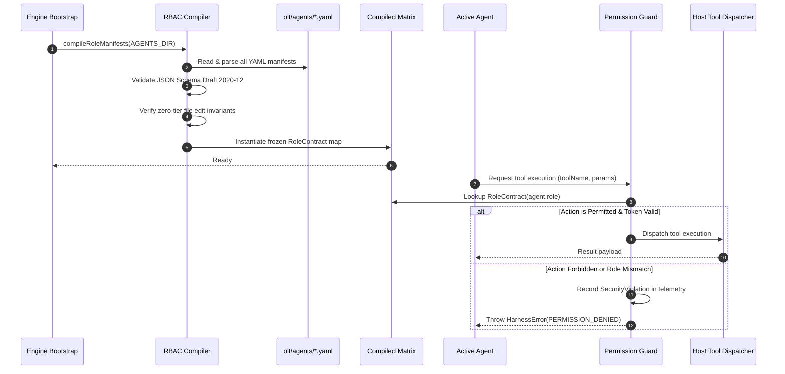

# 13.1 Mechanical RBAC Compiler & Role Capability Matrix

---

> **Status**: Authoritative Architecture Specification  
> **Topic**: Mechanical RBAC Compilation, Declarative Manifest SSoT, Immutable Capability Matrices, and Fail-Closed Dispatch  
> **Target Audience**: Distributed Systems Engineers, Security Architects, Agent Platform Engineers

---

[Previous: Chapter 13: Policy, RBAC & Fail-Closed Engine](index.md) | [Chapter Index](index.md) | [All Chapters Index](../index.md) | [Next: 13-02 Static AST Lint Purity Engine](13-02-static-ast-lint-purity-engine.md)

---

## 1. Executive Summary & Epistemic Foundations

In autonomous multi-agent developer runtimes, unconstrained agent execution poses severe epistemic and operational hazards. When autonomous agents operate with generic, unrestricted toolsets:

1. **Context Contamination**: Supervisory agents attempt to write code, consuming their limited context window with transient syntax trees rather than maintaining global architectural invariants.
2. **Adversarial Rubber-Stamping**: Validators execute unchecked shell commands or synthesize mock execution receipts, destroying orthogonal verification integrity.
3. **Privilege Creep & Manifest Mutation**: Worker agents rewrite authorization manifests or invoke administrative orchestration commands, escalating privileges out-of-band.

The Orchestrating Long Tasks (OLT) framework resolves these vulnerabilities through the **Mechanical RBAC Compiler & Role Capability Matrix Engine**. Rather than relying on soft runtime prompt instructions, OLT compiles declarative YAML manifests into immutable, in-memory capability matrices at boot. Every agent interaction is intercepted by a mechanical gate that evaluates permissions fail-closed prior to dispatching any host tool or shell command.

```text
+--------------------------------------------------------------------------------------------------------------------+
|                                    MECHANICAL RBAC COMPILER & DISPATCH PIPELINE                                    |
+--------------------------------------------------------------------------------------------------------------------+
|                                                                                                                    |
|   DECLARATIVE MANIFEST SSoT             AOT COMPILATION ENGINE                 COMPILED CAPABILITY MATRIX          |
|   ┌──────────────────────────────┐      ┌──────────────────────────────┐       ┌─────────────────────────────────┐ │
|   │ olt/agents/mind.yaml         │ ───► │ Parse YAML via Draft-2020-12 │ ────► │ Mind: Tier 0 [Mailbox, Doctor]  │ │
|   │ olt/agents/orchestrator.yaml │      │ Validate Schema Invariants   │       │ Orch: Tier 1 [DAG, Subagent]    │ │
|   │ olt/agents/coordinator.yaml  │      │ Assert Capability Orthogon   │       │ Coord: Tier 2 [Lease, Dispatch] │ │
|   │ olt/agents/implementer.yaml  │      │ Compute Tool Bitmasks        │       │ Impl: Tier 3 [Edit, AST, Git]   │ │
|   │ olt/agents/validator.yaml    │      │ Freeze Memory Structures     │       │ Val: Tier 3 [ReadOnly AST Only] │ │
|   │ olt/agents/mechanic-val.yaml │      └──────────────────────────────┘       │ MechVal: Tier 3 [Proc, Gates]   │ │
|   └──────────────────────────────┘                                             └─────────────────────────────────┘ │
|                  │                                                                              │                  |
|                  ▼                                                                              ▼                  |
|   ┌────────────────────────────────────────────────────────────────────────────────────────────────────────────┐   |
|   │ RUNTIME MECHANICAL DISPATCH INTERLOCK                                                                      │   |
|   │ Agent Action Request (Actor, Tool, Command, Scope) ──► AssertPermission(Matrix, Token)                    │   |
|   │   ├── Match: Authorized ─────────────────────────────► Dispatch to Host Execution Adapter                  │   |
|   │   └── Mismatch / Missing / Exception ────────────────► TRAP: PERMISSION_DENIED (Fail-Closed Revocation)    │   |
|   └────────────────────────────────────────────────────────────────────────────────────────────────────────────┘   |
|                                                                                                                    |
+--------------------------------------------------------------------------------------------------------------------+
```

---

## 2. Core Architectural Principles & Invariants

The Mechanical RBAC Compiler enforces four fundamental architectural invariants across all agent tiers:

### 2.1 Declarative Manifest Single Source of Truth (SSoT)

All role definitions, capability boundaries, permitted tools, and allowed CLI commands originate exclusively from version-controlled YAML files located in `olt/agents/*.yaml`. No dynamic in-flight role creation or privilege augmentation is permitted during execution.

### 2.2 Strict Zero-Ambient Privilege

By default, an unauthenticated or newly initialized agent has zero permissions ($\emptyset$). Every capability must be explicitly granted by the compiled manifest and corroborated by an active session grant token.

### 2.3 Tiered Separation of Concerns

Capabilities are strictly partitioned across the 4-tier agent hierarchy:

| Role Archetype         | Tier   | Permitted Tool Categories      | Permitted CLI Commands      | File Mutation Scope      | Isolation Boundary    |
| :--------------------- | :----- | :----------------------------- | :-------------------------- | :----------------------- | :-------------------- |
| **Mind**               | Tier 0 | Mailbox, Telemetry, Doctor     | `mind:*`, `doctor:*`        | Strictly None            | Host Capsule Root     |
| **Orchestrator**       | Tier 1 | Subagent Spawn, Mailbox        | `plan:*`, `dag:*`, `wave:*` | Strictly None            | Host Capsule Root     |
| **Coordinator**        | Tier 2 | Subagent Spawn, Mailbox, Lease | `task:claim`, `task:submit` | Strictly None            | Host Capsule Root     |
| **Implementer**        | Tier 3 | File Edit, AST Query, Git Ops  | `branch:*`, `task:check`    | Assigned Worktree Only   | Dedicated Worktree    |
| **Validator**          | Tier 3 | Read-Only File, AST Query      | Strictly 0 (Hard-Locked)    | Strictly None            | Read-Only Worktree    |
| **Mechanic-Validator** | Tier 3 | Process Runner, Binary Probe   | `bun test`, `gate:prove`    | Read-Only Test Artifacts | Isolated Scratch Tree |

### 2.4 Compile-Time Schema Invariant Verification

During engine bootstrap, the compiler executes structural and invariant checks over all role manifests. Any syntax defect, undefined tool category, or forbidden capability pairing (such as a Tier 1 supervisor requesting file edit permissions) immediately halts initialization with a fatal exit code.

```text
+---------------------------------------------------------------------------------------------+
|                              RBAC MANIFEST SCHEMA CONSTRAINTS                               |
+---------------------------------------------------------------------------------------------+
| 1. Root Tier Invariant: Tier 0 (Mind) is unique and cannot be spawned as a subagent.         |
| 2. File Mutation Exclusivity: Only Tier 3 Implementer manifests may set allows_file_edit.   |
| 3. Validator Command Hard-Lock: Validator role must define commands: [] strictly.           |
| 4. Worktree Isolation Invariant: Tier 3 roles require dedicated worktree directories.       |
+---------------------------------------------------------------------------------------------+
```

---

## 3. Algorithmic Mechanics & State Transitions

The RBAC compilation and enforcement lifecycle proceeds across three deterministic phases: Boot Compilation, Session Binding, and Dispatch Interception.



### 3.1 Compilation Algorithm & Manifest Validation

The Ahead-Of-Time (AOT) compiler processes role manifests using the following mechanical steps:

1. **Discovery & Ingestion**: Read all `.yaml` files from the canonical `olt/agents/` directory.
2. **Structural Validation**: Parse each document against the Draft 2020-12 JSON Schema specification for role manifests.
3. **Purity & Invariant Checking**:
   - Assert $k \in \{0, 1, 2, 3\}$.
   - Assert $k < 3 \implies \text{allows\_file\_edit} = \text{false}$.
   - Assert $\text{name} = \texttt{"validator"} \implies |\text{commands}| = 0$.
   - Assert all tool categories belong to the closed set $\mathcal{T}_{\text{valid}}$.
4. **Index Construction**: Compile the parsed definitions into an immutable lookup table $\mathbf{M}: \text{RoleName} \to \text{CompiledRoleContract}$.
5. **Memory Freezing**: Apply deep recursive immutability (`Object.freeze`) to prevent runtime prototype pollution or attribute manipulation.

### 3.2 Dispatch Interception Pipeline

When an agent requests the execution of a tool or CLI command:

```text
Incoming Action (actor_id, role, tool_category, command_argv, target_path)
    │
    ├── 1. Session Token Validation: Assert token is active, unexpired, and signature is authentic
    │
    ├── 2. Role Lookup: Retrieve CompiledRoleContract for role from in-memory matrix
    │
    ├── 3. Tool Category Check: Assert tool_category in contract.permittedTools
    │
    ├── 4. Command Whitelist Check (if CLI): Match command_argv against contract.permittedCommands
    │
    ├── 5. Worktree Scope Check (if File Edit): Assert target_path is inside assigned worktree
    │
    └── 6. Verdict:
            ├── ALL CHECKS PASS ──► Invoke Host Adapter
            └── ANY CHECK FAILS ──► Emit SecurityTrapRecord to telemetry.jsonl & THROW HarnessError
```

---

## 4. Mathematical Formulations & Proofs

Let $\mathcal{R}$ denote the finite set of role archetypes, $\mathcal{T}$ denote the universal set of platform tools, $\mathcal{C}$ denote the set of CLI commands, $\mathcal{W}$ denote the set of worktree filesystem paths, and $\mathcal{K} = \{0, 1, 2, 3\}$ denote the hierarchy tiers.

### 4.1 Role Manifest Model

Each role manifest $M_r \in \mathcal{M}$ is defined as a 6-tuple:

$$M_r = \langle r, k_r, T_r, C_r, W_r, I_r \rangle$$

Where:

- $r \in \mathcal{R}$ is the unique role identifier string.
- $k_r \in \mathcal{K}$ is the hierarchical tier index.
- $T_r \subseteq \mathcal{T}$ is the subset of authorized tool categories.
- $C_r \subseteq \mathcal{C}$ is the set of permitted CLI command glob patterns.
- $W_r \in \{0, 1\}$ is the boolean file mutation capability indicator.
- $I_r \in \{0, 1\}$ indicates mandatory worktree isolation.

### 4.2 Mechanical Capability Function

The compilation mapping $f_{\text{compile}}: \mathcal{M} \to \mathbf{\Phi}_{\text{rbac}}$ produces the capability evaluation function:

$$ \mathbf{\Phi}_{\text{rbac}}(r, a, \omega) = \begin{cases}
1 & \text{if } a \in T_r \land (\text{IsCLI}(a) \implies \exists p \in C_r \text{ s.t. } \text{Match}(p, a)) \land (\text{IsWrite}(a) \implies W_r = 1 \land \omega \in \mathcal{W}_r) \\
0 & \text{otherwise}
\end{cases}$$

### 4.3 Theorem: Monotonic Confinement of Subordinates

**Theorem (Hierarchical Confinement)**: Let agent $A$ with role $r_A$ spawn subordinate agent $B$ with role $r_B$. Under OLT RBAC compilation rules, no subordinate agent can acquire authority surpassing its hierarchical parent without root elevation tokens.

**Proof**:
1. By construction of the hierarchy, the tier index satisfies $k_B \ge k_A$.
2. For all supervisory tiers $k < 3$, the compilation invariant enforces $W_r \equiv 0$, guaranteeing $\text{WriteScope}(r) = \emptyset$.
3. Tool dispatch requires satisfying both the role capability matrix $\mathbf{\Phi}_{\text{rbac}}(r_B, a, \omega) = 1$ and the parent delegation grant predicate:
   $$\text{GrantValid}(A, B, a) \iff a \in T_{r_B} \cap \text{DelegatedScope}(A)$$
4. Since $\text{DelegatedScope}(A) \subseteq \text{MaxCapabilities}(k_A)$, any attempt by $B$ to invoke $a \notin T_{r_B}$ yields $\mathbf{\Phi}_{\text{rbac}}(r_B, a, \omega) = 0$, triggering an immediate fail-closed security trap. $\blacksquare$

---

## 5. Concrete TypeScript Contracts & Schemas

The TypeScript interfaces governing the Mechanical RBAC Compiler are implemented in [role-contract.ts](../../../../olt/scripts/src/packets/role-contract.ts) and [command-authorizer.ts](../../../../olt/scripts/src/authority/rbac/command-authorizer.ts):

```typescript
export type AgentTier = 0 | 1 | 2 | 3;

export type ToolCategory =
  | "mailbox"
  | "telemetry"
  | "doctor"
  | "subagent_spawn"
  | "lease_management"
  | "file_edit"
  | "ast_query"
  | "git_ops"
  | "process_runner"
  | "binary_probe";

export interface RoleManifestCapabilities {
  readonly tools: readonly ToolCategory[];
  readonly commands: readonly string[];
  readonly allows_file_edit: boolean;
  readonly allows_command_execution: boolean;
}

export interface RoleManifestIsolation {
  readonly worktree_required: boolean;
  readonly read_only: boolean;
}

export interface RoleManifestSchema {
  readonly name: string;
  readonly tier: AgentTier;
  readonly description: string;
  readonly capabilities: RoleManifestCapabilities;
  readonly isolation: RoleManifestIsolation;
}

export interface CompiledRoleContract {
  readonly roleName: string;
  readonly tier: AgentTier;
  readonly permittedTools: ReadonlySet<ToolCategory>;
  readonly permittedCommands: readonly string[];
  readonly allowsFileEdit: boolean;
  readonly allowsCommandExecution: boolean;
  readonly worktreeRequired: boolean;
  readonly readOnly: boolean;
}

export interface PermissionEvaluationContext {
  readonly actorId: string;
  readonly role: string;
  readonly toolCategory: ToolCategory;
  readonly commandArgv?: readonly string[];
  readonly targetPath?: string;
  readonly worktreeRoot?: string;
}

export interface IRBACCompilerEngine {
  readonly compileManifests: (manifestDir: string) => ReadonlyMap<string, CompiledRoleContract>;
  readonly assertPermission: (context: PermissionEvaluationContext) => void;
  readonly isActionAuthorized: (context: PermissionEvaluationContext) => boolean;
}
```

```typescript
export function compileRoleManifest(rawYaml: string): CompiledRoleContract {
  const parsed = parseYamlManifest(rawYaml);

  // Enforce zero file edit invariant for supervisory tiers
  if (parsed.tier < 3 && parsed.capabilities.allows_file_edit) {
    throw new HarnessError(
      "RBAC_INVARIANT_VIOLATION",
      `Supervisory role '${parsed.name}' (Tier ${parsed.tier}) cannot declare allows_file_edit: true`,
    );
  }

  // Enforce zero shell commands for cognitive validators
  if (parsed.name === "validator" && parsed.capabilities.commands.length > 0) {
    throw new HarnessError(
      "RBAC_INVARIANT_VIOLATION",
      "Validator archetype must be mechanically locked to 0 shell commands",
    );
  }

  return Object.freeze({
    roleName: parsed.name,
    tier: parsed.tier,
    permittedTools: new Set(parsed.capabilities.tools),
    permittedCommands: Object.freeze([...parsed.capabilities.commands]),
    allowsFileEdit: parsed.capabilities.allows_file_edit,
    allowsCommandExecution: parsed.capabilities.allows_command_execution,
    worktreeRequired: parsed.isolation.worktree_required,
    readOnly: parsed.isolation.read_only,
  });
}
```

---

## 6. Failure Modes, Anti-Blunders & Recovery Playbooks

| Blunder Identifier | Trigger Condition | Severity | System Impact | Immediate Recovery Playbook |
| :--- | :--- | :--- | :--- | :--- |
| **`RBAC_MANIFEST_SYNTAX_ERROR`** | Corrupted YAML formatting or invalid UTF-8 in `olt/agents/*.yaml`. | FATAL | Engine fails boot compilation; halts startup. | Validate YAML syntax via `doctor:hygiene`; restore valid manifest from git history. |
| **`SUPERVISOR_EDIT_ATTEMPT`** | Mind, Orchestrator, or Coordinator calls `write_to_file`. | FATAL | Immediate execution halt; lease revoked. | Refactor workflow to spawn a Tier 3 Implementer with dedicated worktree. |
| **`VALIDATOR_COMMAND_TRAP`** | Cognitive Validator invokes bash or shell execution tool. | FATAL | Security trap; validator subagent quarantined. | Route dynamic test execution to a dedicated Mechanic-Validator role. |
| **`UNREGISTERED_ROLE_ARCHETYPE`** | Agent spawned with role name missing from manifest directory. | ERROR | Subagent spawn rejected at gate. | Declare role in `olt/agents/<role>.yaml` before invoking spawn primitives. |
| **`WILDCARD_COMMAND_INJECTION`** | Manifest contains unescaped wildcard command pattern `*`. | ERROR | Boot compilation rejects over-permissive pattern. | Specify exact command namespaces (e.g., `task:check`, `branch:*`). |
| **`STALE_CAPABILITY_CACHE`** | Manifest modified on disk without restarting harness process. | WARN | Runtime enforces cached in-memory matrix. | Rerun harness CLI command to force fresh ahead-of-time compilation. |
| **`SCOPE_CONFINEMENT_ESCAPE`** | Tier 3 Implementer attempts mutation outside `.olt/worktrees/T_i/`. | FATAL | Write blocked fail-closed; task quarantined. | Reconfigure task `write_scope` in requirements or adjust worktree mount. |

---

[Previous: Chapter 13: Policy, RBAC & Fail-Closed Engine](index.md) | [Chapter Index](index.md) | [All Chapters Index](../index.md) | [Next: 13-02 Static AST Lint Purity Engine](13-02-static-ast-lint-purity-engine.md)
$$
