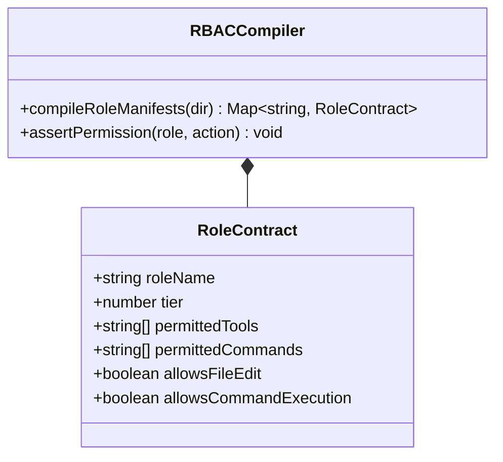

# Mechanical RBAC Compiler & Role Capability Matrix

---

[Previous: Chapter 13 Index](index.md) | [Chapter Index](index.md) | [All Chapters Index](../index.md) | [Next: 13-02 Static AST Lint Purity Engine](13-02-static-ast-lint-purity-engine.md)

---

## 1. Executive Summary & Epistemic Security

In autonomous multi-agent environments, unconstrained agents with generic tool access represent severe operational and security risks:

- Supervisory agents attempt to write code, contaminating their high-level planning context.
- Validators execute destructive shell commands or synthesize false test passes.
- Workers mutate security manifests and elevate their own privileges.

The OLT (Orchestrating Long Tasks) engine implements the **Mechanical RBAC Compiler & Role Capability Matrix Architecture**. Under this model:

1. **Declarative Role Manifests as SSoT**: Every agent archetype is declared in an immutable YAML manifest under `olt/agents/*.yaml` (`mind.yaml`, `orchestrator.yaml`, `coordinator.yaml`, `implementer.yaml`, `validator.yaml`, `mechanic-validator.yaml`).
2. **Deterministic Compilation**: The RBAC compiler parses these manifests into an immutable in-memory capability matrix during initialization.
3. **Fail-Closed Mechanical Enforcement**: Tool dispatchers intercept every action request, evaluating it against the compiled matrix before execution.

```text
+--------------------------------------------------------------------------------------------------+
│                                 MECHANICAL RBAC COMPILER PIPELINE                                │
+--------------------------------------------------------------------------------------------------+
│                                                                                                  │
│   ┌──────────────────────┐         ┌──────────────────────┐         ┌──────────────────────┐     │
│   │ Role Manifest YAMLs  │  ───►   │ Mechanical RBAC      │  ───►   │ Compiled Capability  │     │
│   │ (olt/agents/*.yaml)  │         │ Compiler Engine      │         │ Matrix (In-Memory)   │     │
│   └──────────────────────┘         └──────────────────────┘         └──────────────────────┘     │
│              │                                 │                               │                 │
│              ▼                                 ▼                               ▼                 │
│      [Declarative SSoT]              [Schema Validation]             [Fail-Closed Dispatch]      │
│                                                                                                  │
+--------------------------------------------------------------------------------------------------+
```

---

## 2. The Universal Role Capability Matrix

```text
+--------------------+------+------------------------------+-------------------------+--------------------+
| Role Archetype     | Tier | Permitted Tool Categories    | Permitted CLI Commands  | File Edit Scope    |
+--------------------+------+------------------------------+-------------------------+--------------------+
| Mind               | 0    | Mailbox, Telemetry, Doctor   | mind:*, doctor:*        | STRICTLY NONE      |
| Orchestrator       | 1    | Subagent Spawn, Mailbox      | plan:*, dag:*, wave:*   | STRICTLY NONE      |
| Coordinator        | 2    | Subagent Spawn, Mailbox      | task:claim, task:submit | STRICTLY NONE      |
| Implementer        | 3    | File Edit, AST Query, Git    | branch:*, task:check    | Assigned Worktree  |
| Validator          | 3    | Read-Only, AST Query         | STRICTLY 0 (Hard-Locked)| STRICTLY NONE      |
| Mechanic-Validator | 3    | Process Runner, Binary Probe | bun test, gate:prove    | Read-Only Receipts |
+--------------------+------+------------------------------+-------------------------+--------------------+
```



---

## 3. Mathematical Formalization of RBAC Interlocks

Let $\mathcal{R}$ denote the set of roles, $\mathcal{T}$ denote the set of tools, and $\mathcal{C}$ denote the set of CLI commands.

The **RBAC Capability Function** $\Phi_{\text{rbac}}: \mathcal{R} \times (\mathcal{T} \cup \mathcal{C}) \rightarrow \{0, 1\}$ is:

$$\Phi_{\text{rbac}}(r, a) = \begin{cases} 1 & \text{if } a \in \text{PermittedActions}(r) \\ 0 & \text{otherwise} \end{cases}$$

For any action request $a$ from agent $A$ with $\text{Role}(A) = r$:

$$\text{EvaluateAction}(A, a) = \begin{cases} \text{DISPATCH}(a) & \text{if } \Phi_{\text{rbac}}(r, a) = 1 \\ \text{TRAP}(\texttt{"PERMISSION\_DENIED"}) & \text{if } \Phi_{\text{rbac}}(r, a) = 0 \end{cases}$$

---

## 4. Compiler Implementation & Manifest Validation

The RBAC compiler ([`role-contract.ts`](file:///Users/onurseckinsenoglu/repos/skills/olt/scripts/src/packets/role-contract.ts)) validates manifests against the Draft 2020-12 schema at boot:

```typescript
export function loadRoleContract(role: string): RoleContract {
  const yamlContent = readFileSync(join(AGENTS_DIR, `${role}.yaml`), "utf-8");
  const parsed = yaml.load(yamlContent) as RoleManifestSchema;
  return {
    roleName: parsed.name,
    tier: parsed.tier,
    permittedTools: parsed.capabilities.tools,
    permittedCommands: parsed.capabilities.commands,
    allowsFileEdit: parsed.tier === 3 && parsed.name === "implementer",
    allowsCommandExecution: parsed.name !== "validator",
  };
}
```

---

## 5. Architectural Invariants Summary

1. **Declarative Grounding**: All permissions originate from immutable YAML manifests under version control.
2. **Zero Runtime Escalation**: Agents cannot modify their own permissions or spawn subagents with higher tiers than their own.
3. **Fail-Closed Intercept**: Any unregistered command or unauthorized tool call triggers immediate execution halt.

---

[Previous: Chapter 13 Index](index.md) | [Chapter Index](index.md) | [All Chapters Index](../index.md) | [Next: 13-02 Static AST Lint Purity Engine](13-02-static-ast-lint-purity-engine.md)

---
