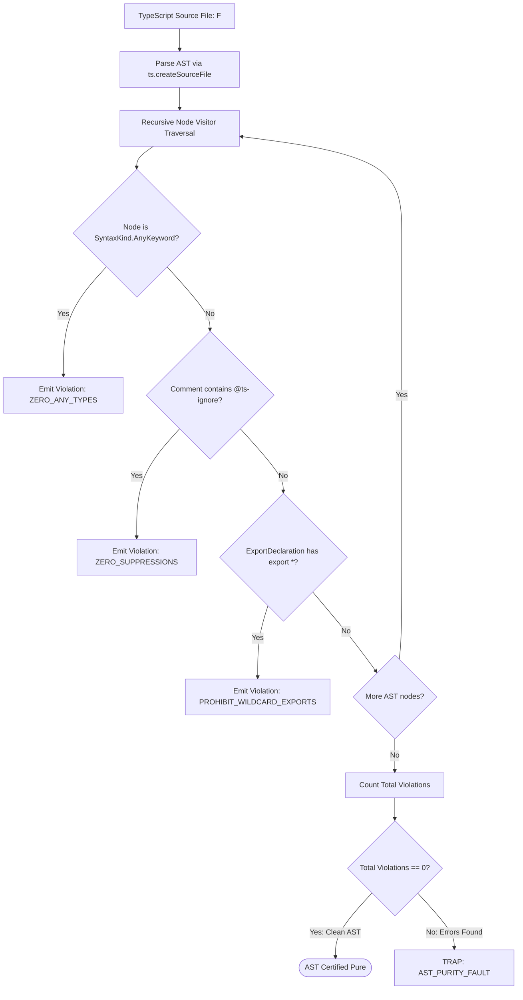

# Static AST Lint Purity Engine & Code Quality Rules

---

[Previous: 13-01 Mechanical RBAC Compiler](13-01-mechanical-rbac-compiler.md) | [Chapter Index](index.md) | [All Chapters Index](../index.md) | [Next: 13-03 Fail-Closed Permission Gates](13-03-fail-closed-permission-gates.md)

---

## 1. Executive Summary & The Static Analysis Guarantee

In automated agent workflows, code written by LLMs frequently introduces subtle anti-patterns that escape basic syntax parsing:

- Implicit or explicit `any` types that disable type safety.
- `@ts-ignore` or `@ts-expect-error` comments that mask typecheck errors.
- Monolithic functions and files that violate line budgets.
- Circular imports and wildcard re-exports that defeat tree-shaking.

The OLT (Orchestrating Long Tasks) engine implements the **Static AST Lint Purity Engine**. Under this system:

1. **TypeScript Compiler API Analysis**: The linter parses every TypeScript file into an Abstract Syntax Tree (AST), performing deep semantic and structural checks without executing untrusted code.
2. **The 10 Static Purity Rules**: The engine enforces 10 strict mechanical rules covering type purity, file sizing, export facades, and test non-triviality.
3. **Pre-Commit & Verification Interlock**: Tasks failing AST purity checks are rejected during `task:check` and barred from merging.

```text
+--------------------------------------------------------------------------------------------------+
│                                 STATIC AST LINT PURITY PIPELINE                                  │
+--------------------------------------------------------------------------------------------------+
│                                                                                                  │
│   ┌──────────────────────┐         ┌──────────────────────┐         ┌──────────────────────┐     │
│   │ TypeScript Source    │  ───►   │ AST Parsing Engine   │  ───►   │ 10 Purity Rules      │     │
│   │ (Modified Worktree)  │         │ (ts.createSourceFile)│         │ Evaluation Engine    │     │
│   └──────────────────────┘         └──────────────────────┘         └──────────────────────┘     │
│              │                                 │                               │                 │
│              ▼                                 ▼                               ▼                 │
│      [Raw Source Files]              [Syntax Tree Nodes]             [Zero Any / Strict Types]   │
│                                                                                                  │
+--------------------------------------------------------------------------------------------------+
```

---

## 2. The 10 Static AST Purity Rules Catalog

```text
+------+---------------------------+---------------------------------------------------------------+
| Rule | Rule Identifier           | Mechanical AST Verification Standard                          |
+------+---------------------------+---------------------------------------------------------------+
| R1   | ZERO_ANY_TYPES            | Prohibits explicit `any` keyword and implicit any types.       |
+------+---------------------------+---------------------------------------------------------------+
| R2   | ZERO_SUPPRESSIONS         | Prohibits `@ts-ignore`, `@ts-nocheck`, `@ts-expect-error`.     |
+------+---------------------------+---------------------------------------------------------------+
| R3   | PHYSICAL_LINE_BUDGET      | Code files <= 300 lines; Doc topics 250-800 lines.            |
+------+---------------------------+---------------------------------------------------------------+
| R4   | DIRECTORY_FANOUT_BUDGET   | Maximum 10 child entries per directory module.                |
+------+---------------------------+---------------------------------------------------------------+
| R5   | EXPLICIT_EXPORT_FACADES   | Barrel index.ts files must use explicit named exports.        |
+------+---------------------------+---------------------------------------------------------------+
| R6   | PROHIBIT_WILDCARD_EXPORTS | Prohibits `export * from ...` across all modules.             |
+------+---------------------------+---------------------------------------------------------------+
| R7   | FUNCTION_SCOPE_BUDGET     | Single functions <= 50 lines; recommends helper decomposition.|
+------+---------------------------+---------------------------------------------------------------+
| R8   | NON_EMPTY_TEST_BODIES     | Test `it()` / `test()` blocks must contain >= 1 real expect().|
+------+---------------------------+---------------------------------------------------------------+
| R9   | STRICT_NULL_SAFETY        | Mandatory optional chaining and nullish coalescing operators. |
+------+---------------------------+---------------------------------------------------------------+
| R10  | UNUSED_PARAMETER_GUARD    | Prohibits discarded, unreferenced parameters.                 |
+------+---------------------------+---------------------------------------------------------------+
```



---

## 3. Mathematical Formalization of AST Purity

Let $\mathcal{N}(F)$ denote the set of AST nodes for file $F$, and let $\mathcal{C}(F)$ denote the set of trivia comment tokens.

The **AST Purity Predicate** $\Psi_{\text{ast}}(F)$ is:

$$\Psi_{\text{ast}}(F) = \big( \forall n \in \mathcal{N}(F), \; \text{Kind}(n) \neq \text{AnyKeyword} \big) \land \big( \forall c \in \mathcal{C}(F), \; \neg \text{HasSuppression}(c) \big) \land \big( \text{Lines}(F) \le 300 \big)$$

A commit is certified if and only if:

$$\forall F \in \text{ModifiedFiles}, \quad \Psi_{\text{ast}}(F) = 1$$

---

## 4. AST Linter Engine Implementation

The AST engine ([`ast-linter.ts`](file:///Users/onurseckinsenoglu/repos/skills/olt/scripts/src/linter/ast/ast-linter.ts)) traverses syntax trees using the TypeScript Compiler API:

```typescript
export function auditASTPurity(sourceFile: ts.SourceFile): ASTViolation[] {
  const violations: ASTViolation[] = [];

  function visit(node: ts.Node) {
    if (node.kind === ts.SyntaxKind.AnyKeyword) {
      violations.push({
        rule: "ZERO_ANY_TYPES",
        line: sourceFile.getLineAndCharacterOfPosition(node.getStart()).line + 1,
      });
    }
    if (ts.isExportDeclaration(node) && !node.exportClause) {
      violations.push({
        rule: "PROHIBIT_WILDCARD_EXPORTS",
        line: sourceFile.getLineAndCharacterOfPosition(node.getStart()).line + 1,
      });
    }
    ts.forEachChild(node, visit);
  }

  visit(sourceFile);
  return violations;
}
```

---

## 5. Architectural Invariants Summary

1. **Zero Suppression Toleration**: Code containing `@ts-ignore` is rejected mechanically.
2. **Deterministic Traversal**: AST visitor algorithms produce identical findings across environments.
3. **Pre-Commit Enforcement**: AST purity is verified before any git commit is generated.

---

[Previous: 13-01 Mechanical RBAC Compiler](13-01-mechanical-rbac-compiler.md) | [Chapter Index](index.md) | [All Chapters Index](../index.md) | [Next: 13-03 Fail-Closed Permission Gates](13-03-fail-closed-permission-gates.md)

---
