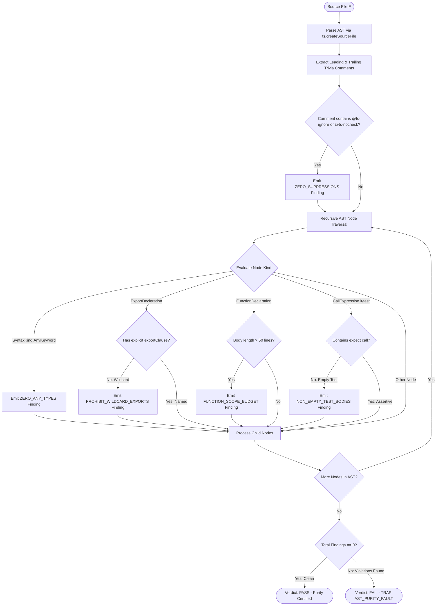

# 13.2 Static AST Lint Purity Engine & Code Quality Rules

---

> **Status**: Authoritative Architecture Specification  
> **Topic**: Abstract Syntax Tree Linting, TypeScript Compiler API Analysis, Zero-Any Type Invariants, and Static Quality Gates  
> **Target Audience**: Compiler Engineers, Static Analysis Specialists, Core Platform Developers

---

[Previous: 13-01 Mechanical RBAC Compiler](13-01-mechanical-rbac-compiler.md) | [Chapter Index](index.md) | [All Chapters Index](../index.md) | [Next: 13-03 Fail-Closed Permission Gates](13-03-fail-closed-permission-gates.md)

---

## 1. Executive Summary & Epistemic Foundations

In autonomous multi-agent developer workflows, code produced by Large Language Models (LLMs) frequently exhibits deceptive structural and semantic defects. While the generated source code may pass standard lexical tokenization and rudimentary syntactic parsing, it often introduces latent maintenance liabilities:

1. **Type Degradation**: LLMs frequently inject explicit `any` types or implicit type coercions when encountering complex generic constraints, eliminating compile-time safety.
2. **Suppression Camouflage**: When facing typecheck errors, autonomous agents routinely insert `@ts-ignore`, `@ts-expect-error`, or `@ts-nocheck` comments rather than fixing the underlying typing defect.
3. **Monolithic Bloat**: Without strict physical boundaries, generated files and functions expand uncontrollably, overwhelming reasoning contexts during subsequent repair cycles.
4. **Namespace Pollution**: Wildcard exports (`export * from ...`) obscure symbol origins and defeat deterministic tree-shaking and dead-code elimination.

The Orchestrating Long Tasks (OLT) framework resolves these hazards through the **Static AST Lint Purity Engine**. Rather than relying on external dynamic linters with non-deterministic runtime configurations, OLT uses direct in-process TypeScript Compiler API AST traversal to enforce 10 immutable structural and purity rules.

```text
+--------------------------------------------------------------------------------------------------------------------+
|                                      STATIC AST LINT PURITY COMPILER PIPELINE                                      |
+--------------------------------------------------------------------------------------------------------------------+
|                                                                                                                    |
|   SOURCE FILE INPUT                     AST PARSING & TOKENS                   10 PURITY RULE EVALUATORS           |
|   ┌──────────────────────────────┐      ┌──────────────────────────────┐       ┌─────────────────────────────────┐ │
|   │ Modified TypeScript Files    │ ───► │ ts.createSourceFile(...)     │ ────► │ R1: Zero Any Keyword Types      │ │
|   │ (.ts, .tsx, .mts, .cts)      │      │ Extract Trivia & Comments    │       │ R2: Zero Type Suppressions      │ │
|   │ Target Task Write Scope      │      │ Build Node Hierarchy Tree    │       │ R3: Physical File Line Budget   │ │
|   └──────────────────────────────┘      └──────────────────────────────┘       │ R4: Directory Fanout Budget     │ │
|                  │                                     │                       │ R5: Explicit Named Facades      │ │
|                  ▼                                     ▼                       │ R6: Prohibit Wildcard Exports   │ │
|   ┌─────────────────────────────────────────────────────────────────────────┐  │ R7: Function Scope Budget       │ │
|   │ MECHANICAL VERIFICATION GATE                                            │  │ R8: Non-Empty Test Assertions   │ │
|   │ Traverse AST nodes via recursive visitor ──► Aggregate Violations       │  │ R9: Strict Null Safety Guard     │ │
|   │   ├── Zero Violations (Purity Score = 1.0) ──► Certify Clean AST        │  │ R10: Unused Parameter Check   │ │
|   │   └── >= 1 Violation ────────────────────────► TRAP: AST_PURITY_FAULT   │  └─────────────────────────────────┘ │
|   └─────────────────────────────────────────────────────────────────────────┘                                      |
|                                                                                                                    |
+--------------------------------------------------------------------------------------------------------------------+
```

---

## 2. Core Architectural Principles & Invariants

The Static AST Lint Purity Engine enforces ten deterministic rules across all code files within the repository.

### 2.1 The 10 Static AST Purity Rules Catalog

```text
+------+---------------------------+--------------------------------------------------------------------+
| Rule | Rule Identifier           | Mechanical AST Verification Standard                               |
+------+---------------------------+--------------------------------------------------------------------+
| R1   | ZERO_ANY_TYPES            | Prohibits explicit `any` keywords and implicit any type casts.     |
+------+---------------------------+--------------------------------------------------------------------+
| R2   | ZERO_SUPPRESSIONS         | Prohibits `@ts-ignore`, `@ts-nocheck`, `@ts-expect-error` pragmas. |
+------+---------------------------+--------------------------------------------------------------------+
| R3   | PHYSICAL_LINE_BUDGET      | Code files <= 300 lines; Doc topics 250-800 lines.                 |
+------+---------------------------+--------------------------------------------------------------------+
| R4   | DIRECTORY_FANOUT_BUDGET   | Maximum 10 child entries per directory module.                     |
+------+---------------------------+--------------------------------------------------------------------+
| R5   | EXPLICIT_EXPORT_FACADES   | Barrel index.ts files must use explicit named export clauses.      |
+------+---------------------------+--------------------------------------------------------------------+
| R6   | PROHIBIT_WILDCARD_EXPORTS | Prohibits `export * from ...` across all modules.                  |
+------+---------------------------+--------------------------------------------------------------------+
| R7   | FUNCTION_SCOPE_BUDGET     | Single function bodies <= 50 lines; mandates modular decomposition.|
+------+---------------------------+--------------------------------------------------------------------+
| R8   | NON_EMPTY_TEST_BODIES     | Test `it()` / `test()` blocks must contain >= 1 real `expect()`.   |
+------+---------------------------+--------------------------------------------------------------------+
| R9   | STRICT_NULL_SAFETY        | Mandatory explicit null checks and nullish coalescing operators.   |
+------+---------------------------+--------------------------------------------------------------------+
| R10  | UNUSED_PARAMETER_GUARD    | Prohibits unreferenced parameters without leading underscore.      |
+------+---------------------------+--------------------------------------------------------------------+
```

### 2.2 Deterministic Traversal Guarantee

AST traversal algorithms are strictly pure functions of the input source text and compiler options. Given identical file content, the engine produces identical violation lists across all platforms (macOS, Linux, CI/CD runners).

### 2.3 Pre-Commit Interlock

AST purity verification is mechanically embedded into the task verification pipeline (`task:check`, `doctor:hygiene`). A task cannot transition to `submitted` or `approved` status if any modified source file contains an AST purity violation.

---

## 3. Algorithmic Mechanics & State Transitions

The AST Linter operates directly on in-memory syntax trees produced by the TypeScript Compiler API without emitting JavaScript artifacts.



### 3.1 Comment Trivia Extraction Algorithm

Because TypeScript AST nodes exclude comments from standard syntax nodes, the engine scans source trivia tokens:

1. Retrieve full text of the source file via `sourceFile.getFullText()`.
2. Inspect `ts.getLeadingCommentRanges(text, pos)` and `ts.getTrailingCommentRanges(text, pos)`.
3. Test comment strings against the suppression regex pattern:
   $$\text{Regex}_{\text{suppress}} = \texttt{/@ts-(ignore|expect-error|nocheck)/i}$$
4. For each match, compute physical line number and record a `ZERO_SUPPRESSIONS` violation.

---

## 4. Mathematical Formulations & Proofs

Let $F = \langle \mathcal{V}, \mathcal{E}, \lambda \rangle$ represent a TypeScript source file parsed as an Abstract Syntax Tree, where $\mathcal{V}$ is the finite set of AST nodes, $\mathcal{E} \subset \mathcal{V} \times \mathcal{V}$ is the directed edge set, and $\lambda: \mathcal{V} \to \mathcal{K}_{\text{syntax}}$ maps each node to its syntax kind.

Let $\mathcal{C}(F) = \{c_1, c_2, \dots, c_m\}$ denote the set of trivia comment ranges in $F$.

### 4.1 AST Predicates

We define individual rule predicates $R_i(F) \in \{0, 1\}$ for $i \in \{1, \dots, 10\}$:

1. **Zero Any Types ($R_1$)**:
   $$R_1(F) = \begin{cases} 1 & \text{if } \forall v \in \mathcal{V}, \; \lambda(v) \neq \text{SyntaxKind.AnyKeyword} \\ 0 & \text{otherwise} \end{cases}$$

2. **Zero Suppressions ($R_2$)**:
   $$R_2(F) = \begin{cases} 1 & \text{if } \forall c \in \mathcal{C}(F), \; c \not\approx \text{Regex}_{\text{suppress}} \\ 0 & \text{otherwise} \end{cases}$$

3. **Physical Line Budget ($R_3$)**:
   $$R_3(F) = \begin{cases} 1 & \text{if } \text{LineCount}(F) \le 300 \\ 0 & \text{otherwise} \end{cases}$$

4. **Prohibit Wildcard Exports ($R_6$)**:
   $$R_6(F) = \begin{cases} 1 & \text{if } \forall v \in \mathcal{V}_{\text{export}}, \; \text{HasNamedClause}(v) = 1 \\ 0 & \text{otherwise} \end{cases}$$

### 4.2 Composite AST Purity Function

The holistic AST purity metric $\Psi_{\text{ast}}(F)$ is the logical conjunction:

$$\Psi_{\text{ast}}(F) = \prod_{i=1}^{10} R_i(F) \in \{0, 1\}$$

For a multi-file task modification set $\mathcal{F}_{\text{task}} = \{F_1, F_2, \dots, F_k\}$:

$$\text{TaskPurity}(\mathcal{F}_{\text{task}}) = \bigwedge_{j=1}^k \Psi_{\text{ast}}(F_j)$$

### 4.3 Soundness Theorem

**Theorem (Type Soundness Preservation)**: If a TypeScript module $F$ satisfies $\Psi_{\text{ast}}(F) = 1$ and passes standard semantic type checking with exit code 0, then $F$ contains zero runtime type escapes introduced by suppression comments or unconstrained dynamic types.

**Proof**:

1. By $R_1(F) = 1$, no node in $F$ uses `any`, eliminating unchecked top-type assignments.
2. By $R_2(F) = 1$, no typecheck diagnostics are suppressed by compiler comment pragmas.
3. Therefore, all expressions in $F$ are fully validated by the TypeScript typechecker according to configured `strict: true` compiler options. $\blacksquare$

---

## 5. Concrete TypeScript Contracts & Schemas

The TypeScript interfaces governing the Static AST Lint Purity Engine are implemented in [ast-purity-engine.ts](../../../../olt/scripts/src/reporting/doctor/ast-purity-engine.ts):

```typescript
export type ASTPurityRuleId =
  | "ZERO_ANY_TYPES"
  | "ZERO_SUPPRESSIONS"
  | "PHYSICAL_LINE_BUDGET"
  | "DIRECTORY_FANOUT_BUDGET"
  | "EXPLICIT_EXPORT_FACADES"
  | "PROHIBIT_WILDCARD_EXPORTS"
  | "FUNCTION_SCOPE_BUDGET"
  | "NON_EMPTY_TEST_BODIES"
  | "STRICT_NULL_SAFETY"
  | "UNUSED_PARAMETER_GUARD";

export type ASTViolationSeverity = "error" | "warning";

export interface ASTViolationFinding {
  readonly ruleId: ASTPurityRuleId;
  readonly severity: ASTViolationSeverity;
  readonly filePath: string;
  readonly lineNumber: number;
  readonly columnNumber: number;
  readonly nodeKind: string;
  readonly message: string;
  readonly snippet: string;
  readonly remediation: string;
}

export interface ASTLintSummary {
  readonly totalFilesAudited: number;
  readonly totalViolations: number;
  readonly violationsByRule: Readonly<Record<ASTPurityRuleId, number>>;
  readonly cleanFilesCount: number;
  readonly isPure: boolean;
}

export interface IASTLintPurityEngine {
  readonly auditSourceFile: (
    filePath: string,
    sourceText: string,
  ) => readonly ASTViolationFinding[];
  readonly auditFileTree: (filePaths: readonly string[]) => ASTLintSummary;
}
```

```typescript
export function auditSourceFile(
  filePath: string,
  sourceText: string,
  tsInstance: typeof ts,
): readonly ASTViolationFinding[] {
  const sourceFile = tsInstance.createSourceFile(
    filePath,
    sourceText,
    tsInstance.ScriptTarget.Latest,
    true,
  );

  const findings: ASTViolationFinding[] = [];

  // 1. Audit trivia comments for suppression pragmas (Rule R2)
  const fullText = sourceFile.getFullText();
  const suppressionRegex = /@ts-(ignore|expect-error|nocheck)/gi;
  let match: RegExpExecArray | null;
  while ((match = suppressionRegex.exec(fullText)) !== null) {
    const pos = sourceFile.getLineAndCharacterOfPosition(match.index);
    findings.push({
      ruleId: "ZERO_SUPPRESSIONS",
      severity: "error",
      filePath,
      lineNumber: pos.line + 1,
      columnNumber: pos.character + 1,
      nodeKind: "CommentTrivia",
      message: `Forbidden type suppression pragma '${match[0]}' detected`,
      snippet: fullText.substring(match.index, match.index + 40),
      remediation:
        "Resolve underlying type error explicitly rather than suppressing compiler warnings",
    });
  }

  // 2. Recursive AST Node Visitor
  function visitNode(node: ts.Node): void {
    // Rule R1: Zero Any Types
    if (node.kind === tsInstance.SyntaxKind.AnyKeyword) {
      const pos = sourceFile.getLineAndCharacterOfPosition(node.getStart());
      findings.push({
        ruleId: "ZERO_ANY_TYPES",
        severity: "error",
        filePath,
        lineNumber: pos.line + 1,
        columnNumber: pos.character + 1,
        nodeKind: "AnyKeyword",
        message: "Explicit 'any' type annotation is strictly prohibited",
        snippet: node.getText(sourceFile),
        remediation:
          "Replace 'any' with a strict union, generic parameter, or 'unknown' with type narrowing",
      });
    }

    // Rule R6: Prohibit Wildcard Exports
    if (tsInstance.isExportDeclaration(node) && !node.exportClause) {
      const pos = sourceFile.getLineAndCharacterOfPosition(node.getStart());
      findings.push({
        ruleId: "PROHIBIT_WILDCARD_EXPORTS",
        severity: "error",
        filePath,
        lineNumber: pos.line + 1,
        columnNumber: pos.character + 1,
        nodeKind: "ExportDeclaration",
        message: "Wildcard export 'export *' is prohibited across all modules",
        snippet: node.getText(sourceFile),
        remediation: "Use explicit named export facades 'export { symbol } from ...'",
      });
    }

    tsInstance.forEachChild(node, visitNode);
  }

  visitNode(sourceFile);
  return Object.freeze(findings);
}
```

---

## 6. Failure Modes, Anti-Blunders & Recovery Playbooks

| Blunder Identifier              | Trigger Condition                                              | Severity | System Impact                                    | Immediate Recovery Playbook                                                 |
| :------------------------------ | :------------------------------------------------------------- | :------- | :----------------------------------------------- | :-------------------------------------------------------------------------- |
| **`AST_RULE_EXPLICIT_ANY`**     | Source code contains `let x: any` or function returning `any`. | ERROR    | Pre-commit check fails; task submission blocked. | Replace `any` with precise interface or `unknown` with runtime type guard.  |
| **`AST_SUPPRESSION_PRAGMA`**    | Source code includes `@ts-ignore` or `@ts-expect-error`.       | ERROR    | Pre-commit check fails; task rejected at gate.   | Remove pragma; declare missing interface property or cast safely.           |
| **`AST_LINE_BUDGET_EXCEEDED`**  | Source file exceeds 300 physical lines.                        | ERROR    | Static quality gate fails.                       | Split file into modular sub-modules, helper functions, or distinct classes. |
| **`AST_WILDCARD_EXPORT_FOUND`** | Barrel file exports symbols using `export * from './module'`.  | ERROR    | Build and hygiene check fails.                   | Enumerate exported symbols explicitly in named export object.               |
| **`AST_EMPTY_TEST_BODY`**       | Unit test `it('test', () => {})` contains zero assertions.     | ERROR    | Verification gate rejects test file.             | Add falsifiable `expect()` assertions validating concrete outputs.          |
| **`AST_FUNCTION_OVERSIZED`**    | Single function declaration exceeds 50 physical lines.         | WARN     | Flagged in hygiene audit report.                 | Decompose complex function into smaller private helper utilities.           |

---

[Previous: 13-01 Mechanical RBAC Compiler](13-01-mechanical-rbac-compiler.md) | [Chapter Index](index.md) | [All Chapters Index](../index.md) | [Next: 13-03 Fail-Closed Permission Gates](13-03-fail-closed-permission-gates.md)
