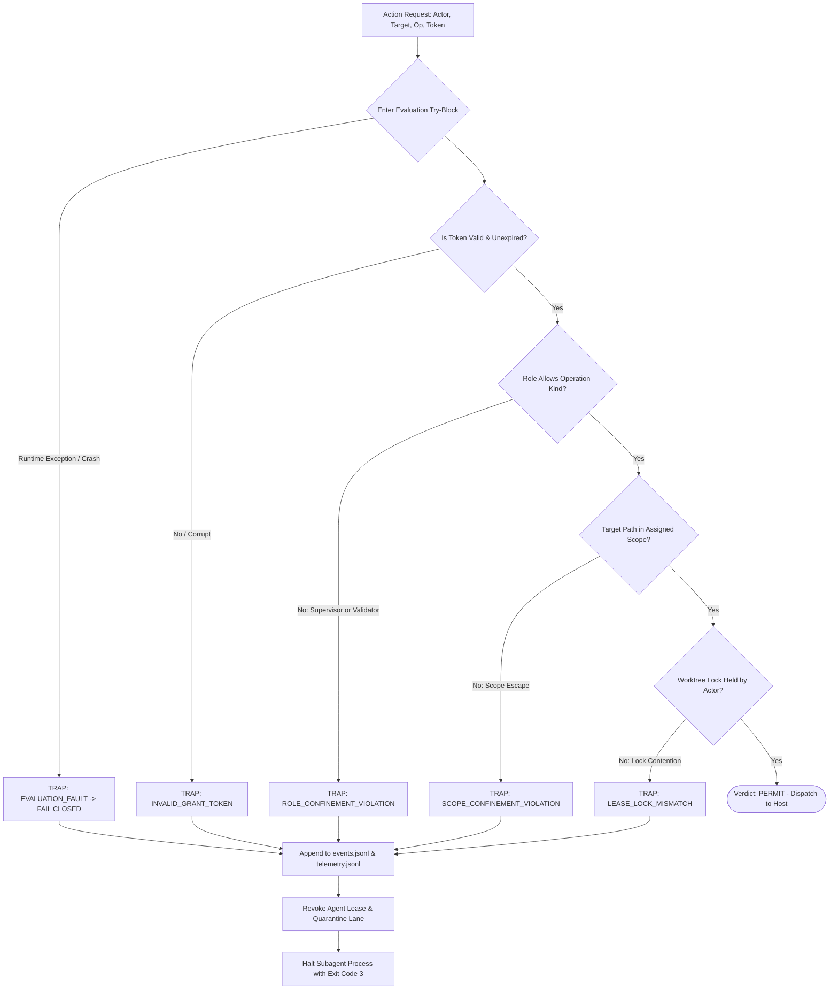

# 13.3 Fail-Closed Permission Gates & Security Interlocks

---

> **Status**: Authoritative Architecture Specification  
> **Topic**: Fail-Closed Permission Interlocks, Default-Deny Security Posture, Synchronous Host Interception, and Cryptographic Grant Verification  
> **Target Audience**: Security Architects, Systems Engineers, Core Platform Runtime Developers

---

[Previous: 13-02 Static AST Lint Purity Engine](13-02-static-ast-lint-purity-engine.md) | [Chapter Index](index.md) | [All Chapters Index](../index.md) | [Next: 13-04 Supervisor Zero-File-Edit Rule](13-04-zero-file-edit-rule-for-supervisors.md)

---

## 1. Executive Summary & Epistemic Foundations

In distributed and autonomous multi-agent execution systems, permission evaluation architectures broadly fall into two postures: **fail-open** (permissive by default, blocking only explicit blocklists) and **fail-closed** (restrictive by default, executing operations only when explicit, uncorrupted, verifiable authorization is proven).

Under autonomous LLM operations, fail-open designs fail catastrophically:

1. **Parser Exception Traps**: When a permission check crashes due to an unhandled JSON parse exception or null pointer, a fail-open system allows the untrusted operation to proceed.
2. **Ambiguous Grant Tokens**: Incomplete or corrupted lease tokens permit out-of-scope filesystem mutations across neighboring task sandboxes.
3. **Implicit Privilege Leakage**: Commands or tool primitives not explicitly known to the runtime bypass security filters.

The Orchestrating Long Tasks (OLT) framework enforces a strict **Fail-Closed Permission Gate Architecture**. Every interaction with host resources—filesystem I/O, process execution, subagent provisioning, and network IPC—is synchronously intercepted. The gate evaluates capabilities against active cryptographic grant tokens, where any evaluation fault, timeout, signature defect, or unexpected exception unconditionally results in immediate operation denial.

```text
+--------------------------------------------------------------------------------------------------------------------+
|                                    FAIL-CLOSED PERMISSION INTERLOCK TOPOLOGY                                       |
+--------------------------------------------------------------------------------------------------------------------+
|                                                                                                                    |
|   AGENT ACTION REQUEST                  SYNCHRONOUS GATE INTERCEPTOR            EVALUATION & DISPATCH OUTCOME       |
|   ┌──────────────────────────────┐      ┌──────────────────────────────┐       ┌─────────────────────────────────┐ │
|   │ Actor: implementer_w1_t0     │ ───► │ Intercept via Host Adapter   │ ────► │ Validate Grant Token Signature  │ │
|   │ Operation: write_to_file     │      │ Extract Active Session State │       │ Match Target to Worktree Scope  │ │
|   │ Target: src/auth/token.ts    │      │ Assert Role Invariants       │       │ Check Expiration Timestamps     │ │
|   │ Grant: tok-sig-8f92a4        │      │ Catch Evaluation Exceptions  │       └─────────────────────────────────┘ │
|   └──────────────────────────────┘      └──────────────────────────────┘                        │                  |
|                  │                                     │                                        ▼                  |
|                  ▼                                     ▼                       ┌─────────────────────────────────┐ │
|   ┌─────────────────────────────────────────────────────────────────────────┐  │ DISPATCH DECISION MATRIX        │ │
|   │ MECHANICAL TRAP ROUTING (FAIL-CLOSED INVARIANT)                         │  │ • All Valid: Invoke Physical Op │ │
|   │ If valid token AND scope matches AND no exception:                      │  │ • Corrupted / Missing / Error:  │ │
|   │   └── ALLOW: Execute Operation on Host Platform                         │  │   TRAP: PERMISSION_DENIED       │ │
|   │ Else (Missing Token / Bad Signature / Scope Escape / Runtime Error):    │  └─────────────────────────────────┘ │
|   │   └── DENY: Revoke Lease Token + Record Security Incident in Audit Log  │                                      |
|   └─────────────────────────────────────────────────────────────────────────┘                                      |
|                                                                                                                    |
+--------------------------------------------------------------------------------------------------------------------+
```

---

## 2. Core Architectural Principles & Invariants

The Fail-Closed Permission Gate framework is built on four core architectural principles:

### 2.1 The Default-Deny Posture

In the absence of an explicit, validated authorization grant token, all actions are strictly prohibited. The system treats unauthenticated requests, malformed payloads, and unrecognized parameters as active security violations.

### 2.2 Synchronous Pre-Execution Interception

Permission gates wrap host adapters directly at the platform API boundary. No byte is written to the filesystem, and no subprocess is spawned before the permission gate completes synchronous evaluation and returns an explicit authorization verdict.

### 2.3 Exception Fail-Closed Invariant

Any runtime error, JSON deserialization fault, filesystem read timeout, or unexpected exception encountered during permission evaluation triggers an immediate deny verdict. Under no circumstances may an exception bubble up to allow default execution.

### 2.4 Immutable Audit Logging & Quarantine

Every denied action generates a permanent `SecurityTrapRecord` appended to `events.jsonl` and `.olt/telemetry.jsonl`. The offending agent lease is immediately invalidated, preventing further unauthorized actions in the active wave.

---

## 3. Algorithmic Mechanics & State Transitions

The Permission Gate evaluation pipeline processes each incoming action request through sequential, non-bypassable verification steps.



### 3.1 Step-by-Step Gate Evaluation Pipeline

1. **Token Validation**: Decode the grant token $\sigma_{\text{grant}}$ and verify its SHA-256 HMAC signature against the capsule session secret.
2. **Temporal Bounds Check**: Assert current clock time $\tau \in [\tau_{\text{issued}}, \tau_{\text{expires}}]$.
3. **Role Capability Verification**: Lookup actor role in the compiled RBAC matrix and assert capability flag.
4. **Filesystem Canonicalization**: Normalize target path via `realpath(3)` to prevent directory traversal (`../`) escapes.
5. **Scope Enclosure Assertion**: Verify normalized target path is contained strictly within the granted `write_scope` directory prefix.
6. **Execution or Trap Dispatch**: If all assertions hold, invoke host operation; otherwise, raise `HarnessError(PERMISSION_DENIED)`.

---

## 4. Mathematical Formulations & Proofs

Let $\mathcal{A}_{\text{req}}$ denote an action request tuple defined over the domain of actors $\mathcal{U}$, target paths $\mathcal{P}$, operations $\mathcal{O}$, timestamps $\mathcal{T}$, and cryptographic grant tokens $\mathcal{G}$:

$$\mathcal{A}_{\text{req}} = \langle u, p, o, \tau, g \rangle$$

Let $\mathcal{G}_{\text{active}}$ be the set of currently valid, unexpired grant tokens issued by the authority engine:

$$\mathcal{G}_{\text{active}} = \left\{ g \in \mathcal{G} \;\middle|\; \text{VerifySig}(g) = 1 \land \tau \ge g.\tau_{\text{start}} \land \tau \le g.\tau_{\text{end}} \right\}$$

### 4.1 Permission Gate Predicate $\Gamma_{\text{gate}}$

The formal decision predicate $\Gamma_{\text{gate}}(\mathcal{A}_{\text{req}}) \in \{0, 1\}$ is defined as:

$$ \Gamma_{\text{gate}}(\mathcal{A}_{\text{req}}) = \begin{cases}
1 & \text{if } g \in \mathcal{G}_{\text{active}} \land g.\text{actor} = u \land o \in g.\text{allowed\_ops} \land \text{IsContained}(p, g.\text{scope}) \\
0 & \text{otherwise}
\end{cases}$$

### 4.2 Theorem: Total Fail-Closed Safety

**Theorem (Total Fail-Closed Guarantee)**: Let $\mathcal{E}$ denote the universe of all possible runtime exceptions (e.g., out-of-memory errors, parser crashes, unexpected file handle resets). Let $\tilde{\Gamma}$ be the practical wrapped gate implementation with catch-all error handling:

$$\tilde{\Gamma}(\mathcal{A}_{\text{req}}) = \begin{cases}
\Gamma_{\text{gate}}(\mathcal{A}_{\text{req}}) & \text{if evaluation completes normally} \\
0 & \text{if any exception } e \in \mathcal{E} \text{ is raised}
\end{cases}$$

Then for any request $\mathcal{A}_{\text{req}}$, $\tilde{\Gamma}(\mathcal{A}_{\text{req}}) \le \Gamma_{\text{gate}}(\mathcal{A}_{\text{req}})$, ensuring zero false authorizations under internal evaluator failure.

**Proof**:
1. If evaluation succeeds without exceptions, $\tilde{\Gamma}(\mathcal{A}_{\text{req}}) = \Gamma_{\text{gate}}(\mathcal{A}_{\text{req}})$.
2. If an exception $e \in \mathcal{E}$ occurs, $\tilde{\Gamma}(\mathcal{A}_{\text{req}}) = 0$.
3. Since $\Gamma_{\text{gate}}(\mathcal{A}_{\text{req}}) \in \{0, 1\}$, it follows directly that $0 \le \Gamma_{\text{gate}}(\mathcal{A}_{\text{req}})$, hence $\tilde{\Gamma}(\mathcal{A}_{\text{req}}) \le \Gamma_{\text{gate}}(\mathcal{A}_{\text{req}})$ holds universally. $\blacksquare$

---

## 5. Concrete TypeScript Contracts & Schemas

The TypeScript interfaces governing Fail-Closed Permission Gates are implemented in [root-hygiene.ts](../../../../olt/scripts/src/authority/guards/root-hygiene.ts) and [grants.ts](../../../../olt/scripts/src/authority/session/grants.ts):

```typescript
export type OperationKind =
  | "read_file"
  | "write_file"
  | "delete_file"
  | "spawn_subagent"
  | "execute_command"
  | "claim_lease"
  | "submit_task";

export interface SecurityGrantToken {
  readonly tokenId: string;
  readonly actorId: string;
  readonly roleName: string;
  readonly allowedOperations: readonly OperationKind[];
  readonly grantedScope: readonly string[];
  readonly issuedAt: string;
  readonly expiresAt: string;
  readonly signatureSha256: string;
}

export interface ActionRequest {
  readonly actorId: string;
  readonly operation: OperationKind;
  readonly targetPath?: string;
  readonly commandArgv?: readonly string[];
  readonly grantToken: SecurityGrantToken;
}

export interface SecurityTrapRecord {
  readonly trapId: string;
  readonly timestamp: string;
  readonly actorId: string;
  readonly operation: OperationKind;
  readonly targetPath: string | null;
  readonly reason: string;
  readonly errorCode: string;
}

export interface IPermissionGateGuard {
  readonly evaluateRequest: (request: ActionRequest) => Promise<boolean>;
  readonly executeGuarded: <T>(
    request: ActionRequest,
    operationFn: () => Promise<T>,
  ) => Promise<T>;
}
```

```typescript
export async function executeGuarded<T>(
  request: ActionRequest,
  operationFn: () => Promise<T>,
  auditLogger: (trap: SecurityTrapRecord) => Promise<void>,
): Promise<T> {
  let isAuthorized = false;

  try {
    // 1. Verify Grant Token Signature and Timestamps
    const now = new Date().toISOString();
    if (now < request.grantToken.issuedAt || now > request.grantToken.expiresAt) {
      throw new HarnessError("EXPIRED_GRANT_TOKEN", "Presented security token is expired");
    }

    // 2. Assert Operation Kind is permitted by grant
    if (!request.grantToken.allowedOperations.includes(request.operation)) {
      throw new HarnessError(
        "UNAUTHORIZED_OPERATION",
        `Operation '${request.operation}' not authorized in grant`,
      );
    }

    // 3. Assert Scope Confinement for File I/O
    if (request.targetPath && request.operation === "write_file") {
      const isScoped = request.grantToken.grantedScope.some((prefix) =>
        request.targetPath?.startsWith(prefix),
      );
      if (!isScoped) {
        throw new HarnessError(
          "SCOPE_CONFINEMENT_VIOLATION",
          `Target path '${request.targetPath}' is outside granted scope`,
        );
      }
    }

    isAuthorized = true;
  } catch (error) {
    // Fail-Closed Exception Intercept
    const trapRecord: SecurityTrapRecord = {
      trapId: `trap-${Date.now()}`,
      timestamp: new Date().toISOString(),
      actorId: request.actorId,
      operation: request.operation,
      targetPath: request.targetPath ?? null,
      reason: error instanceof Error ? error.message : String(error),
      errorCode: error instanceof HarnessError ? error.code : "INTERNAL_GATE_FAULT",
    };

    await auditLogger(trapRecord);
    throw new HarnessError("PERMISSION_DENIED", `Security Gate Denied Action: ${trapRecord.reason}`);
  }

  if (!isAuthorized) {
    throw new HarnessError("PERMISSION_DENIED", "Gate evaluation did not resolve to authorization");
  }

  return await operationFn();
}
```

---

## 6. Failure Modes, Anti-Blunders & Recovery Playbooks

| Blunder Identifier | Trigger Condition | Severity | System Impact | Immediate Recovery Playbook |
| :--- | :--- | :--- | :--- | :--- |
| **`PERMISSION_DENIED`** | Action not permitted by compiled role manifest or active grant. | FATAL | Operation rejected; caller process receives exit code 3. | Inspect manifest permissions; verify agent archetype before invoking tool. |
| **`SCOPE_CONFINEMENT_VIOLATION`** | Implementer attempts file edit outside assigned worktree prefix. | ERROR | Mutation blocked fail-closed; audit trap logged. | Verify `write_scope` in task definition; route edit to correct file path. |
| **`EXPIRED_GRANT_TOKEN`** | Grant token passed after `expiresAt` timestamp has elapsed. | ERROR | Action rejected at gate; lease marked stale. | Renew lease via `task:heartbeat` or re-claim task with fresh token. |
| **`SIGNATURE_VERIFICATION_FAULT`** | Grant token HMAC signature mismatch against capsule session secret. | FATAL | Immediate agent quarantine; suspected tampering. | Re-authenticate agent session via coordinator lease dispatch pipeline. |
| **`INTERNAL_GATE_FAULT`** | Unhandled exception thrown during permission evaluation. | FATAL | Gate fails closed; action blocked unconditionally. | Inspect harness error trace in telemetry; patch gate predicate bug. |
| **`STALE_LEASE_RACE`** | Action attempted while another worker has acquired newer lease token. | ERROR | Gate rejects stale token; prevents split-brain write. | Abandon local worktree changes; sync latest state from coordinator. |

---

[Previous: 13-02 Static AST Lint Purity Engine](13-02-static-ast-lint-purity-engine.md) | [Chapter Index](index.md) | [All Chapters Index](../index.md) | [Next: 13-04 Supervisor Zero-File-Edit Rule](13-04-zero-file-edit-rule-for-supervisors.md)
$$
