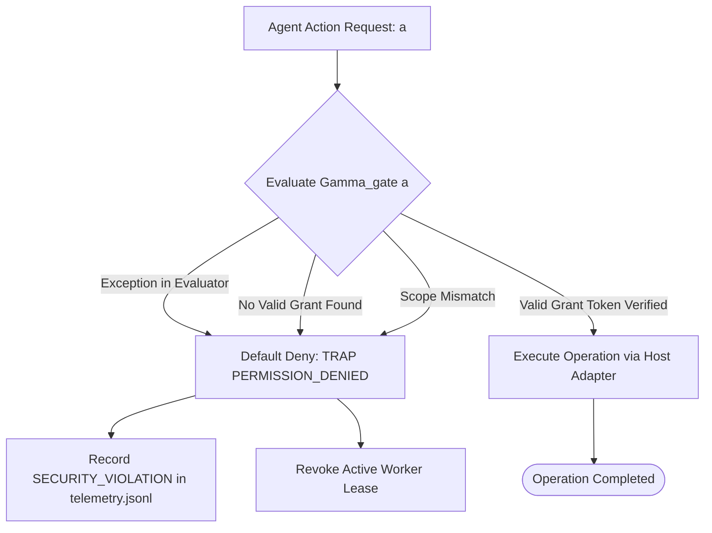

# Fail-Closed Permission Gates & Security Interlocks

---

[Previous: 13-02 Static AST Lint Purity](13-02-static-ast-lint-purity-engine.md) | [Chapter Index](index.md) | [All Chapters Index](../index.md) | [Next: 13-04 Supervisor Zero-File-Edit Rule](13-04-zero-file-edit-rule-for-supervisors.md)

---

## 1. Executive Summary & The Default-Deny Posture

In security engineering, systems that default to permissive behavior ("fail-open") inevitably experience privilege escalations and unauthorized mutations whenever an edge case or unhandled error occurs.

The OLT (Orchestrating Long Tasks) engine implements the **Fail-Closed Permission Gate Architecture**. Under this security model:

1. **Default-Deny Posture**: Every action, tool invocation, file edit, and command execution is denied by default unless an explicit, valid grant token is presented.
2. **Synchronous Interception**: Permission gates intercept execution before the kernel or host runtime executes any underlying operation.
3. **Deterministic Security Traps**: Any permission violation triggers an immediate, uncatchable security trap, logging the incident to `.olt/telemetry.jsonl` and halting the violating agent lane.

```text
+--------------------------------------------------------------------------------------------------+
│                             FAIL-CLOSED PERMISSION INTERLOCK TOPOLOGY                            │
+--------------------------------------------------------------------------------------------------+
│                                                                                                  │
│   ┌──────────────────────┐         ┌──────────────────────┐         ┌──────────────────────┐     │
│   │ Agent Action Request │  ───►   │ Synchronous Gate     │  ───►   │ Host Execution /     │     │
│   │ (Tool / Command / FS)│         │ (Default Deny Check) │         │ Physical Operation   │     │
│   └──────────────────────┘         └──────────────────────┘         └──────────────────────┘     │
│              │                                 │                                                 │
│              │                                 ▼ (If No Grant / Exception)                       │
│              ▼                     ┌──────────────────────────────────┐                          │
│      [Agent Request Payload]       │ TRAP: PERMISSION_DENIED          │                          │
│                                    │ Immediate Lease Revocation       │                          │
│                                    └──────────────────────────────────┘                          │
│                                                                                                  │
+--------------------------------------------------------------------------------------------------+
```

---

## 2. Mathematical Formalization of Fail-Closed Interlocks

Let $\mathcal{A}_{\text{req}}$ denote the requested action tuple $\langle \text{actor}, \text{target}, \text{operation}, \text{token} \rangle$.

Let $\mathcal{G}_{\text{valid}}(\text{actor})$ denote the set of active, unexpired, cryptographically verified grant tokens for $\text{actor}$.

The **Fail-Closed Permission Gate Predicate** $\Gamma_{\text{gate}}$ is defined as:

$$ \Gamma_{\text{gate}}(\mathcal{A}_{\text{req}}) = \begin{cases}
1 \text{ (PERMIT)} & \text{if } \exists g \in \mathcal{G}_{\text{valid}}(\mathcal{A}.\text{actor}) : \text{MatchesScope}(g, \mathcal{A}.\text{target}) \land \text{AllowsOp}(g, \mathcal{A}.\text{operation}) \\
0 \text{ (DENY)} & \text{otherwise (including any parser error, null pointer, or missing token)}
\end{cases}$$

$$\text{Dispatch}(\mathcal{A}_{\text{req}}) = \begin{cases} \text{Execute}(\mathcal{A}_{\text{req}}) & \text{if } \Gamma_{\text{gate}}(\mathcal{A}_{\text{req}}) = 1 \\ \text{TrapException}(\texttt{"PERMISSION\_DENIED"}) & \text{if } \Gamma_{\text{gate}}(\mathcal{A}_{\text{req}}) = 0 \end{cases}$$



---

## 3. Security Error Catalog & Trap Codes

```text
+------------------------------+------------+------------------------------------------------------+
| Error Identifier             | Severity   | Trigger Condition                                    |
+------------------------------+------------+------------------------------------------------------+
| PERMISSION_DENIED            | FATAL      | Action not declared in agent role manifest           |
+------------------------------+------------+------------------------------------------------------+
| SCOPE_CONFINEMENT_VIOLATION  | ERROR      | Attempting to mutate file outside assigned worktree  |
+------------------------------+------------+------------------------------------------------------+
| COMMAND_HARD_LOCKED          | FATAL      | Cognitive validator attempting terminal execution    |
+------------------------------+------------+------------------------------------------------------+
| STALE_LEASE_TOKEN_REJECTED   | ERROR      | Stale or superseded fencing token presented          |
+------------------------------+------------+------------------------------------------------------+
| PROMPT_CORRUPTION_DETECTED   | FATAL      | prompt.md SHA-256 digest mismatch against manifest   |
+------------------------------+------------+------------------------------------------------------+
```

---

## 4. Harness Gate Interceptor Architecture

The gate interceptor ([`permission-guard.ts`](file:///Users/onurseckinsenoglu/repos/skills/olt/scripts/src/authority/session/session-registry.ts)) wraps all host adapter calls:

```typescript
export async function executeGatedOperation<T>(actor: string, op: string, target: string, fn: () => Promise<T>): Promise<T> {
  const allowed = await verifyActorPermission(actor, op, target);
  if (!allowed) {
    throw new HarnessError("PERMISSION_DENIED", `Actor ${actor} is unauthorized to perform ${op} on ${target}`);
  }
  return await fn();
}
```

---

## 5. Architectural Invariants Summary

1. **Default-Deny Invariant**: Absence of explicit permission implies denial; errors during evaluation fail closed.
2. **Immutable Audit Trail**: Every permission denial is permanently recorded in `events.jsonl`.
3. **Immediate Quarantine**: Violating agents are revoked and isolated from the active execution pool.

---

[Previous: 13-02 Static AST Lint Purity](13-02-static-ast-lint-purity-engine.md) | [Chapter Index](index.md) | [All Chapters Index](../index.md) | [Next: 13-04 Supervisor Zero-File-Edit Rule](13-04-zero-file-edit-rule-for-supervisors.md)

---
$$
