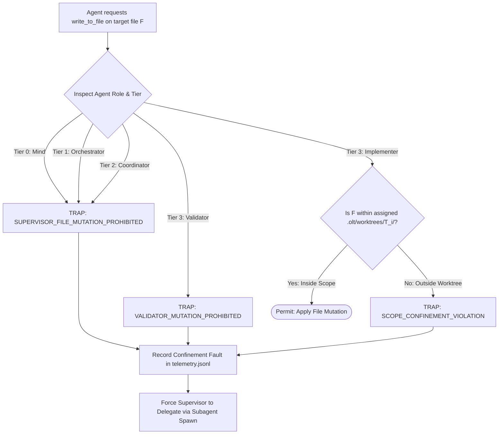

# 13.4 Supervisor Zero-File-Edit Rule & Role Confinement

---

> **Status**: Authoritative Architecture Specification  
> **Topic**: Supervisor Role Confinement, Zero-File-Edit Invariants, Context Window Protection, and Pure Delegation Mechanics  
> **Target Audience**: Distributed Systems Architects, Agent Governance Engineers, Core Runtime Developers

---

[Previous: 13-03 Fail-Closed Permission Gates](13-03-fail-closed-permission-gates.md) | [Chapter Index](index.md) | [All Chapters Index](../index.md) | [Next: Chapter 14: Harness CLI & Command Engine](../14-harness-cli-and-command-engine/index.md)

---

## 1. Executive Summary & Epistemic Foundations

In multi-tier autonomous agent architectures, a frequent systemic failure mode is **supervisor context contamination**. When supervisory agents—specifically Tier 0 (Mind), Tier 1 (Orchestrator), and Tier 2 (Coordinator)—attempt to write implementation code directly, three severe epistemic breakdowns occur:

1. **Strategic Context Dilution**: Ingesting thousands of lines of source code, diffs, and syntax errors displaces global dependency models, wave schedules, and high-level project goals from the supervisor's context window.
2. **Loss of Orthogonal Validation**: When a supervisory agent authors code directly, it naturally rubber-stamps its own output during review cycles, destroying the critical separation of concerns required for adversarial verification.
3. **Sandbox and Worktree Corruption**: Direct file edits by supervisors bypass isolated worktrees (`.olt/worktrees/T_i/`), mutating the primary repository root out-of-band and creating unresolvable git merge conflicts.

The Orchestrating Long Tasks (OLT) framework strictly enforces the **Supervisor Zero-File-Edit Rule**. Supervisory agents are mechanically stripped of all file mutation capabilities. They operate exclusively through structured task delegation, topological dependency scheduling, and evidence bundle ingestion.

```text
+--------------------------------------------------------------------------------------------------------------------+
|                                    SUPERVISOR ZERO-FILE-EDIT CONFINEMENT TOPOLOGY                                  |
+--------------------------------------------------------------------------------------------------------------------+
|                                                                                                                    |
|   SUPERVISORY PLANE (Tiers 0, 1, 2)                                                                                |
|   ┌──────────────────────────────┐      ┌──────────────────────────────┐       ┌─────────────────────────────────┐ │
|   │ Tier 0: Mind (Product Owner) │      │ Tier 1: Orchestrator         │       │ Tier 2: Coordinator             │ │
|   │ • 6 Admission Gates          │ ───► │ • DAG & Wave Compilation     │ ────► │ • Lease & SLA Management        │ │
|   │ • Defect Normalization       │      │ • Work-Span Critical Paths   │       │ • Worker Dispatch & Monitoring  │ │
|   │ • ZERO File Edit Capability  │      │ • ZERO File Edit Capability  │       │ • ZERO File Edit Capability     │ │
|   └──────────────────────────────┘      └──────────────────────────────┘       └─────────────────────────────────┘ │
|                  │                                     │                                        │                  |
|   ═══════════════╪═════════════════════════════════════╪════════════════════════════════════════╪═══════════════════   |
|   MECHANICAL FIREWALL: Any write_to_file / replace_file_content by Tier 0..2 Agent ──► TRAP: PERMISSION_DENIED     |
|   ═════════════════════════════════════════════════════════════════════════════════════════════════════════════════   |
|                  │                                                                              │                  |
|                  ▼ (Pure Delegation Protocol: Task Synthesis & Lease Minting)                   ▼                  |
|   EXECUTION PLANE (Tier 3 Specialized Workforce)                                                                   |
|   ┌────────────────────────────────────────────────────────────────────────────────────────────────────────────┐   |
|   │ Tier 3: Implementers (Worktree Isolated)  │  Tier 3: Validators (Adversarial, 0-Commands)                 │   |
|   │ • Mutates Code in .olt/worktrees/T_i/     │  • Socratic AST Review & Static Proof Assertions               │   |
|   │ • Generates Class 1 Falsifiable Evidence  │  • Mechanic-Validator: Isolated Binary Probes & Gate Prove     │   |
|   └────────────────────────────────────────────────────────────────────────────────────────────────────────────┘   |
|                                                                                                                    |
+--------------------------------------------------------------------------------------------------------------------+
```

---

## 2. Core Architectural Principles & Invariants

The Supervisor Zero-File-Edit Rule establishes five non-negotiable architectural invariants:

### 2.1 The Hard Zero-Mutation Invariant

For all agents with $\text{Tier} \in \{0, 1, 2\}$, the write permission set across repository files is universally empty: $\mathcal{W}_{\text{perm}}(\text{Supervisor}) \equiv \emptyset$. Tool dispatchers mechanically reject `write_to_file`, `replace_file_content`, and direct destructive file manipulation.

### 2.2 Pure Delegation Interface

Supervisors interact with the codebase exclusively through structured, machine-verifiable abstractions:

- Synthesizing requirements and task specifications in `requirements.json`.
- Compiling Directed Acyclic Graph (DAG) dependency structures in `plan.json`.
- Minting execution lease tokens for Tier 3 Implementers.
- Inspecting cryptographic verification receipts (`events.jsonl`).

```text
+---------------------------------------------------------------------------------------------+
|                                 SUPERVISOR DELEGATION FLOW                                  |
+---------------------------------------------------------------------------------------------+
| 1. Supervisor identifies codebase requirement or defect.                                    |
| 2. Supervisor authors structured task descriptor in plan.json (specifying write_scope).     |
| 3. Coordinator spawns Tier 3 Implementer bound to isolated worktree .olt/worktrees/T_i/.   |
| 4. Implementer executes file mutations exclusively inside worktree sandbox.                 |
| 5. Mechanic-Validator executes gate tests; Coordinator ingests cryptographic evidence.      |
| 6. Supervisor reviews execution outcome without loading source diffs into active context.   |
+---------------------------------------------------------------------------------------------+
```

### 2.3 Task Claiming Confinement

The `task:claim` CLI command rejects any attempt by a supervisory agent ID (`mind-*`, `orch-*`, `coord-*`) to claim a code implementation task. Implementation leases are granted strictly to Tier 3 Implementer agents.

### 2.4 Mathematical Context Window Protection

By offloading implementation details to leaf workers, the supervisor's active memory consumption scales sublinearly $\mathcal{O}(\log N)$ relative to the total codebase size, preventing reasoning degradation across long-horizon orchestrations.

### 2.5 Epistemic Hygiene & The Rubber-Stamp Barrier

When code is written by the same entity that reviews or orchestrates it, verification degrades into circular self-affirmation. By mechanically preventing supervisors from writing code, the architecture guarantees that all code entering the repository is authored by an Implementer and independently audited by a Cognitive Validator and Mechanic-Validator.

---

## 3. Algorithmic Mechanics & State Transitions

The supervisor role confinement engine intercepts both task assignment and tool invocation pipelines to prevent unauthorized file mutations.



### 3.1 Task Claiming Interception Pipeline

When `task:claim` is invoked, the execution boundary applies strict role filtering:

```text
task:claim --task <task_id> --actor <agent_id> --role <role_name>
    │
    ├── 1. Role Tier Verification: Assert role_name === "implementer"
    │       └── If role in ["mind", "orchestrator", "coordinator", "validator"]:
    │           THROW HarnessError(ROLE_CONFINEMENT_VIOLATION)
    │
    ├── 2. Agent Identifier Prefix Check: Assert agent_id starts with "impl-"
    │       └── If agent_id matches /^(mind|orch|coord|val)-/:
    │           THROW HarnessError(AGENT_ID_CONFINEMENT_VIOLATION)
    │
    ├── 3. Worktree Provisioning: Allocate dedicated isolated directory .olt/worktrees/<task_id>/
    │
    └── 4. Issue Implementation Lease: Mint lease token with write_scope bound to worktree
```

### 3.2 Write Tool Interception Pipeline

When any file mutation tool (`write_to_file`, `replace_file_content`, `notebook_edit`) is called:

1. Extract active session caller token $\sigma_{\text{caller}}$.
2. Resolve caller role $r \in \mathcal{R}$.
3. If $\text{Tier}(r) < 3$, immediately abort operation with error code `SUPERVISOR_FILE_MUTATION_PROHIBITED`.
4. If $r = \texttt{"validator"}$, immediately abort operation with error code `VALIDATOR_MUTATION_PROHIBITED`.
5. If $r = \texttt{"implementer"}$, verify canonical path of target file lies strictly within `.olt/worktrees/<task_id>/`.

---

## 4. Mathematical Formulations & Proofs

Let $\mathcal{R}$ denote the set of roles, and let $\text{Tier}: \mathcal{R} \to \{0, 1, 2, 3\}$ define role hierarchy tiers.

Let $\mathcal{F}_{\text{repo}}$ represent the set of all filesystem paths in the repository, and let $\mathcal{W}_{\text{perm}}: \mathcal{R} \to \mathcal{P}(\mathcal{F}_{\text{repo}})$ map a role to its authorized file mutation path set.

### 4.1 Confinement Formulation

The Supervisor Zero-File-Edit Rule is formally defined as:

$$\forall r \in \mathcal{R} \text{ such that } \text{Tier}(r) < 3, \quad \mathcal{W}_{\text{perm}}(r) \equiv \emptyset$$

For any write action request $a_{\text{write}}(F)$ targeting file $F \in \mathcal{F}_{\text{repo}}$ by agent $A$:

$$ \text{EvaluateWrite}(A, F) = \begin{cases}
\text{DISPATCH}(a_{\text{write}}) & \text{if } \text{Tier}(\text{Role}(A)) = 3 \land \text{Role}(A) = \text{implementer} \land F \in \text{Worktree}(A) \\
\text{TRAP}(\texttt{"CONFINEMENT\_VIOLATION"}) & \text{otherwise}
\end{cases}$$

### 4.2 Theorem: Context Entropy Bound Under Delegation

**Theorem (Context Conservation)**: Let $N$ be the number of modified source lines in a multi-task wave. Under pure delegation, the context entropy $\mathcal{H}_{\text{sup}}$ ingested by a supervisor remains bounded by $\mathcal{O}(\log N)$, whereas under direct modification it scales as $\mathcal{O}(N)$.

**Proof**:
1. Under direct modification, the supervisor must ingest all tokenized source lines:
   $$\mathcal{H}_{\text{direct}} = \sum_{i=1}^N \text{Entropy}(\text{line}_i) = \mathcal{O}(N)$$
2. Under the Zero-File-Edit delegation protocol, the supervisor ingests only task metadata and cryptographic evidence receipts:
   $$E_{\text{task}} = \langle \text{task\_id}, \text{exit\_code}, \text{sha256\_digest}, \text{verdict} \rangle$$
3. For $k$ modular tasks decomposing $N$ lines, $k \le \log_2 N$. The evidence payload size $|E_{\text{task}}| = \mathcal{O}(1)$.
4. Thus, $\mathcal{H}_{\text{sup}} = \sum_{j=1}^k |E_j| = \mathcal{O}(k) = \mathcal{O}(\log N)$, preserving the supervisor's attention budget for strategic orchestration. $\blacksquare$

---

## 5. Concrete TypeScript Contracts & Schemas

The TypeScript interfaces governing supervisor role confinement are implemented in [task-ops.ts](../../../../olt/scripts/src/cli/commands/task-ops.ts) and [spawn-validator.ts](../../../../olt/scripts/src/authority/guards/spawn-validator.ts):

```typescript
export type SupervisorRole = "mind" | "orchestrator" | "coordinator";
export type LeafWorkerRole = "implementer" | "validator" | "mechanic-validator";

export interface TaskClaimRequest {
  readonly taskId: string;
  readonly actorId: string;
  readonly roleName: string;
  readonly runSlug: string;
}

export interface ClaimAuthorizationVerdict {
  readonly authorized: boolean;
  readonly worktreePath: string | null;
  readonly leaseToken: string | null;
  readonly rejectionReason?: string;
}

export interface ISupervisorConfinementGuard {
  readonly assertCanClaimTask: (request: TaskClaimRequest) => void;
  readonly assertFileMutationPermitted: (roleName: string, targetPath: string) => void;
}
```

```typescript
export function assertCanClaimCodeTask(roleName: string, actorId: string): void {
  const supervisorRoles: ReadonlySet<string> = new Set(["mind", "orchestrator", "coordinator"]);

  if (supervisorRoles.has(roleName)) {
    throw new HarnessError(
      "ROLE_CONFINEMENT_VIOLATION",
      `Supervisor role '${roleName}' is strictly barred from claiming code implementation tasks`,
    );
  }

  if (roleName === "validator" || roleName === "mechanic-validator") {
    throw new HarnessError(
      "ROLE_CONFINEMENT_VIOLATION",
      `Validation role '${roleName}' cannot claim implementation tasks; must execute review sweeps exclusively`,
    );
  }

  const supervisorPrefixes = ["mind-", "orch-", "coord-", "val-"];
  for (const prefix of supervisorPrefixes) {
    if (actorId.startsWith(prefix)) {
      throw new HarnessError(
        "AGENT_ID_CONFINEMENT_VIOLATION",
        `Agent identifier '${actorId}' indicates a supervisor or validator and cannot claim implementation tasks`,
      );
    }
  }
}

export function assertFileMutationPermitted(roleName: string, targetPath: string): void {
  if (roleName !== "implementer") {
    throw new HarnessError(
      "SUPERVISOR_FILE_MUTATION_PROHIBITED",
      `Role '${roleName}' possesses ZERO file mutation permissions across application source files (target: ${targetPath})`,
    );
  }
}
```

---

## 6. Failure Modes, Anti-Blunders & Recovery Playbooks

| Blunder Identifier | Trigger Condition | Severity | System Impact | Immediate Recovery Playbook |
| :--- | :--- | :--- | :--- | :--- |
| **`SUPERVISOR_FILE_MUTATION_ATTEMPT`** | Orchestrator or Coordinator calls file edit tool directly. | FATAL | Tool call trapped fail-closed; agent reprimanded. | Refactor planning loop to emit task definitions and spawn Tier 3 Implementer. |
| **`SUPERVISOR_TASK_CLAIM_VIOLATION`** | Supervisor agent attempts `task:claim` with supervisory credentials. | ERROR | Claim rejected; lease not granted. | Dispatch task to worker queue; spawn implementer subagent to claim lease. |
| **`UNISOLATED_ROOT_MUTATION`** | Implementer attempts write directly in root instead of `.olt/worktrees/T_i/`. | FATAL | Mutation blocked; worktree escape prevented. | Configure git worktree environment; mount target path within isolated task directory. |
| **`VALIDATOR_RUBBER_STAMP`** | Validator attempts to modify implementation files under review. | FATAL | Review rejected; validator quarantined. | Enforce read-only inspection; emit structured finding packets for repairer. |
| **`AGENT_ID_IMPERSONATION`** | Supervisor attempts to claim task by spoofing an `impl-` prefix. | FATAL | Session HMAC validation fails; actor banned. | Authenticate through valid coordinator delegation grant tokens. |
| **`CONTEXT_WINDOW_EXHAUSTION`** | Supervisor attempts to read entire codebase into memory. | WARN | Token budget exhausted; planning degraded. | Use `doctor:hygiene` summary metrics rather than reading full source files. |
| **`CROSS_WORKTREE_POLLUTION`** | Implementer $T_1$ attempts to edit files inside worktree of task $T_2$. | FATAL | Write rejected fail-closed; audit alert triggered. | Confine edits strictly to assigned worktree mount directory. |

---

[Previous: 13-03 Fail-Closed Permission Gates](13-03-fail-closed-permission-gates.md) | [Chapter Index](index.md) | [All Chapters Index](../index.md) | [Next: Chapter 14: Harness CLI & Command Engine](../14-harness-cli-and-command-engine/index.md)
$$
