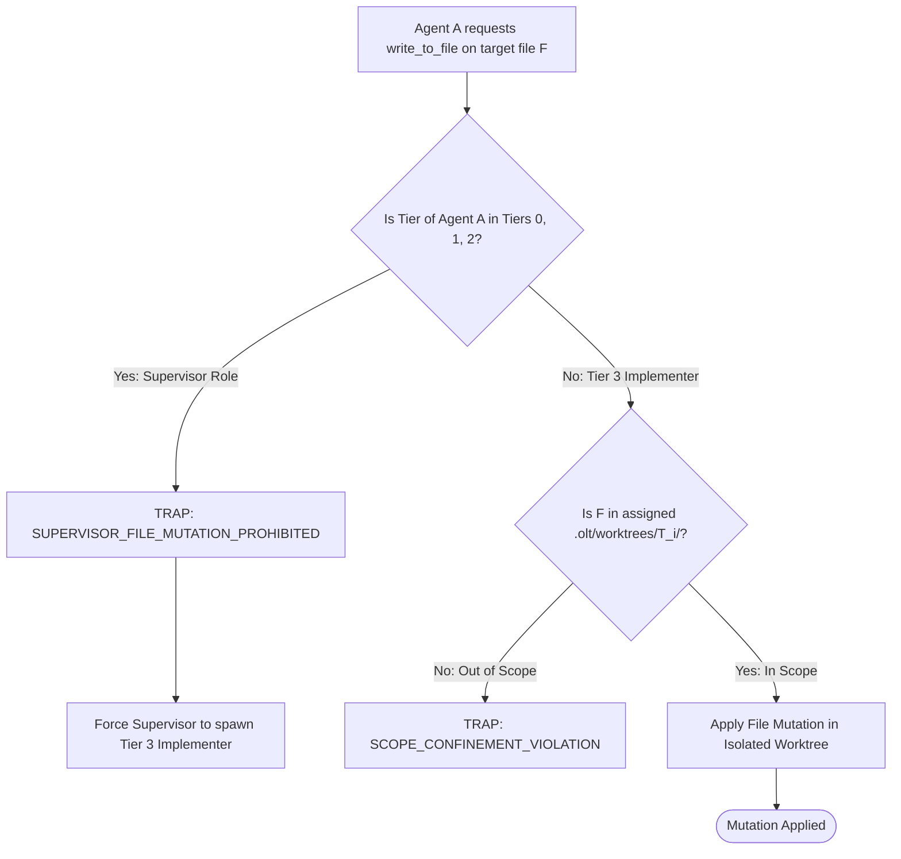

# Supervisor Zero-File-Edit Rule & Role Confinement

---

[Previous: 13-03 Fail-Closed Permission Gates](13-03-fail-closed-permission-gates.md) | [Chapter Index](index.md) | [All Chapters Index](../index.md) | [Next: Chapter 14 Index](../14-harness-cli-and-command-engine/index.md)

---

## 1. Executive Summary & The Context Dilution Hazard

In multi-tier autonomous architectures, when supervisory agents (Tier 0 Mind, Tier 1 Orchestrator, Tier 2 Coordinator) attempt to write implementation code directly, the system suffers severe failure modes:

1. **Strategic Context Amnesia**: Loading hundreds of lines of code into a supervisor's context window displaces architectural roadmaps, milestone tracking, and cross-task dependency graphs.
2. **Bypassing Verification Pipelines**: Code edited directly by a supervisor circumvents the dual-channel validation, AST linting, and worktree isolation enforced on Tier 3 Implementers.
3. **Supervisor Hallucination Cascades**: When a supervisor edits code, it tends to rubber-stamp its own changes, violating the fundamental principle of orthogonal validation.

The OLT (Orchestrating Long Tasks) engine enforces the **Supervisor Zero-File-Edit Rule**. Under this invariant:

- Tier 0 (Mind), Tier 1 (Orchestrator), and Tier 2 (Coordinator) agents possess **ZERO file mutation permissions** across application source files.
- All code, test, and documentation edits must be delegated exclusively to specialized Tier 3 Implementers executing within isolated worktrees.

```text
+--------------------------------------------------------------------------------------------------+
│                             SUPERVISOR ZERO-FILE-EDIT CONFINEMENT                                │
+--------------------------------------------------------------------------------------------------+
│                                                                                                  │
│   SUPERVISORY TIERS (Tiers 0, 1, 2)                                                              │
│   • Mind (Product Owner) ──► Macro-Triage & Admission Gates (0 Code Edits)                       │
│   • Orchestrator         ──► DAG Compilation & Wave Planning (0 Code Edits)                      │
│   • Coordinator          ──► Wave Dispatch & Straggler SLAs (0 Code Edits)                       │
│                                                                                                  │
│   ════════════════════════════════════════════════════════════════════════════════════════════   │
│   MECHANICAL FIREWALL: Any write_to_file / replace_file_content by Supervisor -> TRAP REJECT     │
│   ════════════════════════════════════════════════════════════════════════════════════════════   │
│                                                                                                  │
│   EXECUTION TIER (Tier 3 Specialized Workforce)                                                  │
│   • Tier 3 Implementer   ──► Mutates Code within Isolated Worktree (.olt/worktrees/T_i/)        │
│                                                                                                  │
+--------------------------------------------------------------------------------------------------+
```

---

## 2. Mathematical Formalization of Supervisor Role Confinement

Let $\mathcal{R}_{\text{sup}} = \{\text{Mind}, \text{Orchestrator}, \text{Coordinator}\}$ denote the set of supervisory roles, and let $\mathcal{F}_{\text{target}} \subset \mathcal{F}_{\text{repo}}$ denote application source files.

Let $\text{WritePermissions}: \mathcal{R} \rightarrow \mathcal{P}(\mathcal{F}_{\text{repo}})$ denote the granted write permission set.

The Supervisor Confinement Invariant is defined as:

$$\forall r \in \mathcal{R}_{\text{sup}}, \quad \text{WritePermissions}(r) \equiv \emptyset$$

For any write action request $a_{\text{write}}(F)$ targeting file $F \in \mathcal{F}_{\text{target}}$ by agent $A$:

$$\text{Role}(A) \in \mathcal{R}_{\text{sup}} \implies \text{Halt}(\texttt{"SUPERVISOR\_FILE\_MUTATION\_PROHIBITED"})$$



---

## 3. Delegation Mechanics: How Supervisors Direct Work

Supervisors interact with the codebase exclusively through structured task delegation:

1. **Topological Task Creation**: The Orchestrator compiles requirements into DAG task definitions.
2. **Lease Dispatching**: The Coordinator mints a lease token and spawns a Tier 3 Implementer.
3. **Evidence Ingestion**: The supervisor receives cryptographic evidence bundles upon task completion without ever directly touching file buffers.

---

## 4. Mechanical RBAC Verification in Task Claiming

The task claiming engine ([`task-ops.ts`](file:///Users/onurseckinsenoglu/repos/skills/olt/scripts/src/cli/commands/task-ops.ts)) strictly verifies that supervisor roles are blocked from claiming implementation tasks:

```typescript
export function assertCanClaimCodeTask(role: string, agentId: string): void {
  if (role === "orchestrator" || role === "coordinator" || role === "mind") {
    throw new HarnessError(
      "ROLE_CONFINEMENT_VIOLATION",
      `Supervisor role ${role} is barred from claiming code implementation tasks`,
    );
  }
  if (agentId.startsWith("orch-") || agentId.startsWith("coord-") || agentId.startsWith("mind-")) {
    throw new HarnessError(
      "AGENT_ID_CONFINEMENT_VIOLATION",
      `Supervisor agent ${agentId} cannot claim code tasks`,
    );
  }
}
```

---

## 5. Architectural Invariants Summary

1. **Strict Separation of Concerns**: Supervisors plan and coordinate; only Tier 3 Implementers mutate code.
2. **Context Window Protection**: Supervisors retain high-level architectural models without context contamination from code dumps.
3. **Universal Interlock**: Supervisor write attempts are intercepted at the harness level and rejected fail-closed.

---

[Previous: 13-03 Fail-Closed Permission Gates](13-03-fail-closed-permission-gates.md) | [Chapter Index](index.md) | [All Chapters Index](../index.md) | [Next: Chapter 14 Index](../14-harness-cli-and-command-engine/index.md)

---
