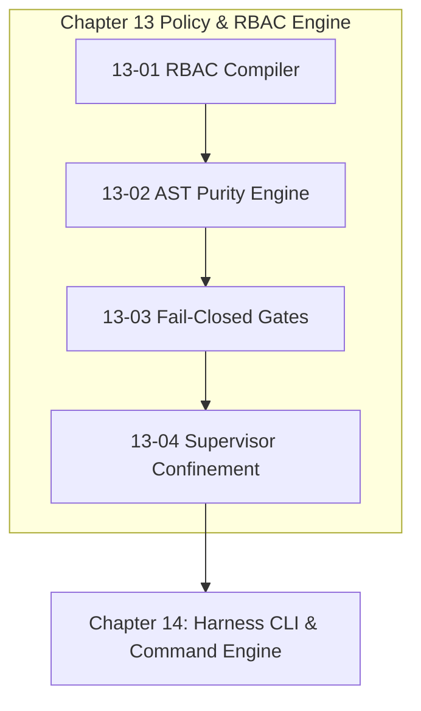

# Chapter 13: Policy, RBAC & Fail-Closed Engine

---

[Previous: Chapter 12 Index](../12-flock-mailboxes-and-tui/index.md) | [Chapter Index](index.md) | [All Chapters Index](../index.md) | [Next: 13-01 Mechanical RBAC Compiler](13-01-mechanical-rbac-compiler.md)

---

## 1. Chapter Overview & Security Policy Architecture

Welcome to Chapter 13 of the OLT Architecture Book. This chapter codifies the declarative role manifests, mechanical RBAC compilers, static AST purity engines, default-deny permission gates, and supervisor role confinement rules governing security and operational discipline in the OLT (Orchestrating Long Tasks) engine.

Autonomous agents operating without rigorous least-privilege boundaries cause permission leaks, corrupted repositories, and compromised review pipelines. Chapter 13 establishes the Mechanical RBAC Compiler & Capability Matrix, details the Static AST Lint Purity Engine (10 Rules), formalizes Fail-Closed Permission Gates & Default-Deny Interlocks, and defines the Supervisor Zero-File-Edit Rule.

```text
+--------------------------------------------------------------------------------------------------+
│                             CHAPTER 13: SECURITY POLICY TOPOLOGY                                 │
+--------------------------------------------------------------------------------------------------+
│                                                                                                  │
│    ┌───────────────────────────┐                    ┌───────────────────────────┐                │
│    │ 13-01: Mechanical RBAC    │                    │ 13-02: Static AST Lint    │                │
│    │ Compiler & Capabilities   │ ══════════════════►│ Purity Engine (10 Rules)  │                │
│    └─────────────┬─────────────┘                    └─────────────┬─────────────┘                │
│                  │                                                │                              │
│                  ▼                                                ▼                              │
│    ┌───────────────────────────┐                    ┌───────────────────────────┐                │
│    │ 13-03: Fail-Closed        │                    │ 13-04: Supervisor Zero    │                │
│    │ Permission Gates          │ ══════════════════►│ File-Edit Confinement     │                │
│    └───────────────────────────┘                    └───────────────────────────┘                │
│                                                                                                  │
+--------------------------------------------------------------------------------------------------+
```

---

## 2. Chapter Table of Contents & Learning Path

```text
+--------------------------------------------------+--------------+--------------------------------+
│ Document                                         │ Classification│ Core Architectural Focus       │
+--------------------------------------------------+--------------+--------------------------------+
│ 13-01 Mechanical RBAC Compiler                   │ Security     │ YAML manifests & capability map│
│ 13-02 Static AST Lint Purity Engine              │ Quality      │ 10 AST rules, 0 any, budgets   │
│ 13-03 Fail-Closed Permission Gates               │ Architecture │ Default-deny & security traps  │
│ 13-04 Supervisor Zero-File-Edit Rule             │ Concurrency  │ Role confinement & delegation  │
+--------------------------------------------------+--------------+--------------------------------+
```

### [13-01: Mechanical RBAC Compiler & Role Capability Matrix](13-01-mechanical-rbac-compiler.md)

Deconstructs declarative agent manifests (`olt/agents/*.yaml`), the in-memory capability compiler, role contract schemas, and fail-closed dispatch interlocks.

### [13-02: Static AST Lint Purity Engine & Code Quality Rules](13-02-static-ast-lint-purity-engine.md)

Details the 10 static AST purity rules enforced via the TypeScript Compiler API: zero `any`, zero `@ts-ignore` suppressions, physical line limits ($\le 300$), and explicit export facades.

### [13-03: Fail-Closed Permission Gates & Security Interlocks](13-03-fail-closed-permission-gates.md)

Formalizes default-deny gate predicates $\Gamma_{\text{gate}}$, synchronous tool interception, and the security error catalog (`PERMISSION_DENIED`, `SCOPE_CONFINEMENT_VIOLATION`).

### [13-04: Supervisor Zero-File-Edit Rule & Role Confinement](13-04-zero-file-edit-rule-for-supervisors.md)

Explains the mathematical supervisor confinement invariant $\text{WritePermissions}(r) \equiv \emptyset$ for Tiers 0, 1, and 2, protecting high-level context and enforcing orthogonal validation.

---

## 3. Core Security & Policy Reference Table

$$ \begin{array}{|l|l|l|}
\hline
\textbf{Policy / Rule} & \textbf{Formal Notation} & \textbf{Operational Invariant} \\ \hline
\text{RBAC Capability} & \Phi_{\text{rbac}}(r, a) \in \{0, 1\} & \text{Strict least-privilege tool dispatch} \\ \hline
\text{AST Purity} & |\text{any}| = 0 \land |\text{Suppressions}| = 0 & \text{100\% TypeScript type safety} \\ \hline
\text{Default-Deny} & \Gamma_{\text{gate}}(a) = 0 \implies \text{TRAP} & \text{Fail-closed execution interlocks} \\ \hline
\text{Supervisor Lock} & \text{WritePermissions}(\text{Tiers } 0, 1, 2) \equiv \emptyset & \text{Supervisors cannot mutate code} \\ \hline
\end{array}$$



---

## 4. Summary & Transition

The declarative role manifests, AST purity engines, and fail-closed permission interlocks established in Chapter 13 guarantee that the autonomous workforce executes with uncompromising security, type safety, and architectural discipline.

Proceed to [13-01: Mechanical RBAC Compiler](13-01-mechanical-rbac-compiler.md) or advance directly to [Chapter 14: Harness CLI & Command Engine](../14-harness-cli-and-command-engine/index.md).

---

[Previous: Chapter 12 Index](../12-flock-mailboxes-and-tui/index.md) | [Chapter Index](index.md) | [All Chapters Index](../index.md) | [Next: 13-01 Mechanical RBAC Compiler](13-01-mechanical-rbac-compiler.md)

---
$$
