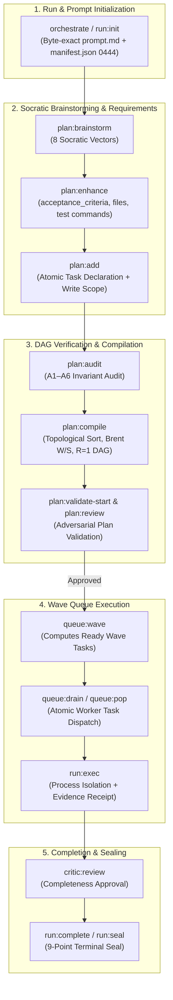
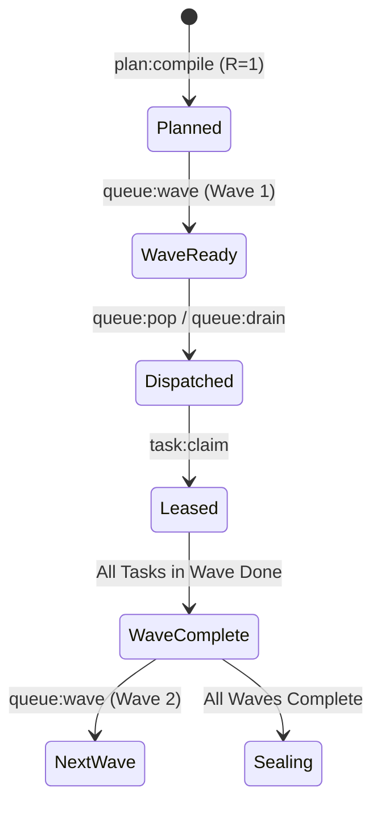

# Lifecycle & Run Commands — `run:*`, `plan:*`, `queue:*`

[Reference Home](../index.md) > [CLI Dictionary](./index.md) > Lifecycle & Run Commands

---

[⏮️ Previous: Reference 04: CLI Dictionary Overview](index.md) | [📂 Chapter Index](index.md) | [📚 All Chapters Index](../index.md) | [⏭️ Next: Task & Worker Commands](14-02-task-and-worker-commands.md)
---

## 🏛️ Section Overview & Lifecycle Topology

The **Lifecycle & Run** command suite governs the progression of an OLT capsule from raw prompt capture through Socratic brainstorming, requirements formalization, DAG compilation, wave queue dispatch, and terminal cryptographic sealing.



---

## 1. Run Lifecycle Commands (`run:*`)

### `run:init`

**Aliases**: `orchestrate`  
**Domain**: `run` / `plan`  
**Authority Tier**: `T0` (Orchestrator)  
**Advisory Lock**: Exclusive on capsule root  
**Mutation Guarantee**: Creates `.olt/capsules/<slug>/`, writes `manifest.json` (`0444`), `prompt.md` (`0444`), initializes `events.jsonl` with genesis event, and generates empty `state.json`.

#### Synopsis

```bash
bun olt/scripts/harness.ts orchestrate [PROMPT_TEXT...]
bun olt/scripts/harness.ts run:init --run <RUN_DIR> [--repo <PATH>] [--prompt-file <PATH>] [--prompt-stdin]
```

#### Flags & Parameters

| Flag                |   Type   | Required |   Default   | Description                                                               |
| :------------------ | :------: | :------: | :---------: | :------------------------------------------------------------------------ |
| `--run`, `--run-id` | `string` | Optional |  Auto-slug  | Target capsule directory (e.g. `.olt/capsules/2026-08-29-refactor-auth`). |
| `--repo`            | `string` | Optional |     `.`     | Target git repository root.                                               |
| `--prompt-file`     | `string` | Optional | `undefined` | Path to text file containing prompt bytes.                                |
| `--prompt-stdin`    |  `bool`  | Optional |   `false`   | Read verbatim prompt from `stdin` pipe.                                   |
| `--capture-mode`    | `string` | Optional |   `argv`    | Capture mode metadata (`argv`, `file`, `stdin`).                          |
| `--source-verified` |  `bool`  | Optional |   `false`   | Asserts the prompt source was authenticated.                              |
| `--runtime-source`  | `string` | Optional | Harness dir | Directory to pin in `runtime/` for replay safety.                         |

#### Input / Output Payloads

**Standard Output (Markdown Brief)**:

```markdown
### 🚀 OLT Run Initialized: `2026-08-29-refactor-auth`

- **Run Root**: `.olt/capsules/2026-08-29-refactor-auth`
- **Prompt Hash**: `sha256:4a8b2c1d9e8f...` (1,420 bytes)
- **Manifest**: Created mode `0444`
- **Next Actions**:
  1. `bun harness.ts plan:brainstorm --run .olt/capsules/2026-08-29-refactor-auth`
  2. `bun harness.ts plan:enhance --run .olt/capsules/2026-08-29-refactor-auth`
```

**Structured Output (`--format json`)**:

```json
{
  "ok": true,
  "result": {
    "run_root": ".olt/capsules/2026-08-29-refactor-auth",
    "run_id": "2026-08-29-refactor-auth",
    "prompt_sha256": "4a8b2c1d9e8f572a12903487cdefa10293847561029384756102938475610293",
    "prompt_bytes": 1420,
    "manifest_created": true,
    "genesis_event_id": "evt-00000001",
    "next_commands": [
      "bun harness.ts plan:brainstorm --run .olt/capsules/2026-08-29-refactor-auth",
      "bun harness.ts plan:enhance --run .olt/capsules/2026-08-29-refactor-auth"
    ]
  }
}
```

#### Exit Codes

- `0`: Success, capsule opened and locked.
- `3`: `INVALID_ARGUMENT` (conflicting prompt flags, unreadable prompt file, or invalid slug syntax).
- `4`: `LOCK_TIMEOUT` (existing run capsule locked by another active process).

---

### `run:status`

**Aliases**: `status`  
**Domain**: `run`  
**Authority Tier**: Any (`T0`..`T3`, Human)  
**Advisory Lock**: Shared Read  
**Mutation Guarantee**: Zero mutation. Strictly reads state projections.

#### Synopsis

```bash
bun olt/scripts/harness.ts run:status [--run <RUN_DIR>] [--repo <PATH>] [--detailed]
```

#### Flags & Parameters

| Flag                |   Type   | Required |   Default    | Description                                     |
| :------------------ | :------: | :------: | :----------: | :---------------------------------------------- |
| `--run`, `--run-id` | `string` | Optional | Auto-derived | Capsule run root.                               |
| `--repo`            | `string` | Optional |     `.`      | Repository root to search for active capsule.   |
| `--detailed`        |  `bool`  | Optional |   `false`    | Includes full raw state JSON and gate matrices. |

#### Input / Output Payloads

**Standard Output (Markdown Brief)**:

```markdown
### 📊 OLT Run Status: `2026-08-29-refactor-auth` [Phase: `EXECUTING`]

- **Revision**: `R=1` | **Wave**: `2/4` | **Tasks**: `3/7 Done` (42%)
- **Active Leases**:
  - `task-auth-02` leased to `worker-2` (TTL: 480s remaining)
- **Queue**: 1 ready (`task-auth-03`), 2 waiting, 1 in review

| Task ID        |  Status  | Role        | Assignee | Scope                    |
| :------------- | :------: | :---------- | :------- | :----------------------- |
| `task-auth-01` |  `done`  | implementer | worker-1 | `src/auth/jwt.ts`        |
| `task-auth-02` | `leased` | implementer | worker-2 | `src/auth/session.ts`    |
| `task-auth-03` | `ready`  | —           | —        | `src/auth/middleware.ts` |
```

#### Exit Codes

- `0`: Success.
- `3`: `INVALID_STATE` (capsule path does not exist or unreadable state projection).

---

### `run:exec`

**Domain**: `run`  
**Authority Tier**: `T2` (Validator), `T3` (Worker/Implementer)  
**Advisory Lock**: Exclusive on command execution receipt log  
**Mutation Guarantee**: Spawns isolated host child process, captures stdout/stderr log bytes into `.olt/capsules/<slug>/evidence/commands/<cmd-id>.log`, records command execution receipt in `events.jsonl`, and updates gate evidence mapping.

#### Synopsis

```bash
bun olt/scripts/harness.ts run:exec --run <RUN_DIR> --actor <AGENT_ID> [--task <TASK_ID>] [--gate <GATE_ID>] [--cwd <DIR>] [--tool-category <CAT>] [--tool <NAME>] -- <COMMAND...>
```

#### Flags & Parameters

| Flag              |    Type     |       Required        |   Default   | Description                                                    |
| :---------------- | :---------: | :-------------------: | :---------: | :------------------------------------------------------------- |
| `--run`           |  `string`   |       Required        |      —      | Capsule run root directory.                                    |
| `--actor`         |  `string`   |       Required        |      —      | Agent or validator ID executing the command.                   |
| `--task`          |  `string`   |       Optional        | `undefined` | Task ID this command belongs to.                               |
| `--gate`          |  `string`   |       Optional        | `undefined` | Gate ID this command attempts to prove.                        |
| `--cwd`           |  `string`   |       Optional        |  Repo root  | Working directory for the process.                             |
| `--tool-category` |  `string`   |       Optional        | `undefined` | Category (`test-runner`, `typechecker`, `linter`, `compiler`). |
| `--tool`          |  `string`   |       Optional        | `undefined` | Tool binary name (e.g. `bun-test`, `tsc`, `eslint`).           |
| `--tool-extra`    |  `string`   | Optional (Repeatable) |    `[]`     | Key-value pairs (`k=v`) recorded verbatim.                     |
| `--`              | `remainder` |       Required        |      —      | Verbatim command line to execute.                              |

#### Input / Output Payloads

**Standard Output (Markdown Brief)**:

```markdown
### ⚙️ Command Executed: `bun test tests/unit/auth.test.ts`

- **Command ID**: `cmd-9f8e7d6c` | **Exit Code**: `0`
- **Duration**: `412ms` | **Output Size**: `2,840 bytes`
- **Evidence Log**: `.olt/capsules/.../evidence/commands/cmd-9f8e7d6c.log`
- **Gate Proved**: `gate-auth-test` (PASSED)
```

**Structured Output (`--format json`)**:

```json
{
  "ok": true,
  "result": {
    "command_id": "cmd-9f8e7d6c",
    "actor": "worker-1",
    "task_id": "task-auth-01",
    "gate_id": "gate-auth-test",
    "argv": ["bun", "test", "tests/unit/auth.test.ts"],
    "cwd": "/repo",
    "exit_code": 0,
    "duration_ms": 412,
    "log_bytes": 2840,
    "sha256": "3c8a1b9d...",
    "screenshots_ingested": 0
  }
}
```

#### Exit Codes

- `0`: Success (Command spawned, executed to completion, and receipt recorded. **Note**: Child exit code is in `result.command.exit_code`).
- `3`: `INVALID_ARGUMENT` (missing actor, invalid working directory, or empty remainder).
- `4`: `LOCK_TIMEOUT` (unable to lock event stream).

---

### `run:complete`

**Domain**: `run`  
**Authority Tier**: `T0` (Orchestrator)  
**Advisory Lock**: Exclusive on entire capsule  
**Mutation Guarantee**: Verifies terminal 9-point seal criteria, validates critic approval token, stamps `terminal_status = "completed"`, generates final summary suite, and locks capsule state to read-only (`0444`).

#### Synopsis

```bash
bun olt/scripts/harness.ts run:complete --run <RUN_DIR> --actor <ACTOR> --auth-token <CRITIC_TOKEN>
```

#### Flags & Parameters

| Flag           |   Type   | Required | Default | Description                                                      |
| :------------- | :------: | :------: | :-----: | :--------------------------------------------------------------- |
| `--run`        | `string` | Required |    —    | Capsule run root directory.                                      |
| `--actor`      | `string` | Required |    —    | Orchestrator ID sealing the run.                                 |
| `--auth-token` | `string` | Required |    —    | Bearer token issued by `critic:review` upon whole-repo approval. |

#### Terminal 9-Point Verification Seal

```
┌──────────────────────────────────────────────────────────────────────────────────────────────────┐
│                                9-POINT TERMINAL SEAL INVARIANTS                                  │
├────┬───────────────────────────────────────┬─────────────────────────────────────────────────────┤
│ 1  │ All Tasks Terminal                    │ 100% of tasks in state `done`. Zero `leased`/`ready`│
├────┼───────────────────────────────────────┼─────────────────────────────────────────────────────┤
│ 2  │ All Gates Satisfied                   │ 100% of gates have passing Class 1–4 proof receipts.│
├────┼───────────────────────────────────────┼─────────────────────────────────────────────────────┤
│ 3  │ All Requirements Evidenced            │ 100% of requirements mapped to passing gate hashes. │
├────┼───────────────────────────────────────┼─────────────────────────────────────────────────────┤
│ 4  │ Critic Approval Token Valid           │ Bearer token matches latest `critic:review` approval│
├────┼───────────────────────────────────────┼─────────────────────────────────────────────────────┤
│ 5  │ Zero Open Defect Records              │ No unadmitted/unresolved entries in `defects.jsonl` │
├────┼───────────────────────────────────────┼─────────────────────────────────────────────────────┤
│ 6  │ Zero Active Worktrees / Leases        │ All branch leases merged or cleanly abandoned.      │
├────┼───────────────────────────────────────┼─────────────────────────────────────────────────────┤
│ 7  │ Working-Tree Scope Match              │ Git `HEAD` diff strictly matches audited task scopes│
├────┼───────────────────────────────────────┼─────────────────────────────────────────────────────┤
│ 8  │ AST & Typecheck 100% Clean            │ Whole-repo `task:check` returns 0 diagnostics.      │
├────┼───────────────────────────────────────┼─────────────────────────────────────────────────────┤
│ 9  │ Merkle Event Chain Intact             │ SHA-256 event reflog validated from genesis to seal.│
└────┴───────────────────────────────────────┴─────────────────────────────────────────────────────┘
```

#### Exit Codes

- `0`: Success, capsule permanently sealed.
- `3`: `INVALID_STATE` (any of the 9 invariants violated; error record lists unmet criteria).
- `3`: `AUTHENTICATION_FAILURE` (invalid or expired critic auth-token).

---

### `run:abort`

**Aliases**: `orphan:dispose`  
**Domain**: `run` / `orphan`  
**Authority Tier**: `T0` (Orchestrator), `T1` (Mind)  
**Advisory Lock**: Exclusive  
**Mutation Guarantee**: Releases all held leases, prunes active worktrees, appends `run-aborted` event, and marks run status as `aborted`.

#### Synopsis

```bash
bun olt/scripts/harness.ts run:abort --run <RUN_DIR> --actor <ACTOR> --reason <REASON>
```

#### Flags & Parameters

| Flag       |   Type   | Required | Default | Description                                 |
| :--------- | :------: | :------: | :-----: | :------------------------------------------ |
| `--run`    | `string` | Required |    —    | Capsule run root.                           |
| `--actor`  | `string` | Required |    —    | Orchestrator or Mind ID issuing abort.      |
| `--reason` | `string` | Required |    —    | Human/agent rationale explaining the abort. |

#### Exit Codes

- `0`: Success, run marked aborted and resources released.
- `3`: `INVALID_ARGUMENT` (missing reason).

---

### `run:lock` & `run:unlock`

**Domain**: `run`  
**Authority Tier**: `T0` (Orchestrator)  
**Advisory Lock**: Explicit kernel mutex on `.olt/capsules/<slug>/locks/run.lock`  
**Mutation Guarantee**: Acquires or releases POSIX advisory file descriptor locks.

#### Synopsis

```bash
bun olt/scripts/harness.ts run:lock --run <RUN_DIR> --holder <AGENT_ID> [--timeout-ms <MS>]
bun olt/scripts/harness.ts run:unlock --run <RUN_DIR> --holder <AGENT_ID> --token <LOCK_TOKEN>
```

#### Exit Codes

- `0`: Success.
- `4`: `LOCK_TIMEOUT` (could not acquire lock within timeout window).

---

### `run:seal`

**Aliases**: `run:consolidate`, `run:archive`  
**Domain**: `run`  
**Authority Tier**: `T0` (Orchestrator)  
**Advisory Lock**: Exclusive  
**Mutation Guarantee**: Compresses evidence logs, generates `summary.md` and `audit.json`, and sets directory permissions to read-only `0555`.

#### Synopsis

```bash
bun olt/scripts/harness.ts run:seal --run <RUN_DIR> --actor <ACTOR> [--out-archive <TAR_GZ>]
```

---

## 2. Plan Orchestration Commands (`plan:*`)

The `plan:*` domain manages the progression from natural language intent to an immutable, mathematically scheduled DAG.

```
┌──────────────────────────────────────────────────────────────────────────────────────────────────┐
│                                  PLAN REFINEMENT & COMPILATION                                   │
├───────────────────┬───────────────────┬───────────────────┬──────────────────────────────────────┤
│ 1. Brainstorm     │ 2. Enhance        │ 3. Add Tasks      │ 4. Audit & Compile                   │
├───────────────────┼───────────────────┼───────────────────┼──────────────────────────────────────┤
│ `plan:brainstorm` │ `plan:enhance`    │ `plan:add`        │ `plan:audit` -> `plan:compile`       │
│ Socratic 8-vector │ Formalizes reqs & │ Staged tasks with │ A1-A6 invariant checks, topological  │
│ expansion matrix  │ acceptance criteria│ strict file scopes│ sorting, Brent Work/Span calculation │
└───────────────────┴───────────────────┴───────────────────┴──────────────────────────────────────┘
```

---

### `plan:brainstorm`

**Aliases**: `brainstorm`  
**Domain**: `plan`  
**Authority Tier**: `T0` (Orchestrator), `T1` (Mind)  
**Advisory Lock**: Exclusive on planning state  
**Mutation Guarantee**: Generates `brainstorming.json` analyzing the prompt across the 8 Socratic vectors, appends `plan-brainstormed` event.

#### Synopsis

```bash
bun olt/scripts/harness.ts plan:brainstorm --run <RUN_DIR> [--rounds <INT>] [--prompt <TEXT>] [--save]
```

#### The 8 Socratic Vectors

1. **Scope Boundary Vector**: Explicit exclusions and anti-goals.
2. **Failure Mode Vector**: Edge cases, network splits, file corruption, race conditions.
3. **Concurrency Vector**: Independence of tasks, shared mutable state hazards.
4. **Falsifiability Vector**: Concrete proof definitions for every requirement.
5. **Host Parity Vector**: Multi-platform constraints (macOS/Linux, Bun/Node, POSIX).
6. **AST/Type Safety Vector**: Invariant typings, lint boundaries, exported interfaces.
7. **Adversarial Vector**: Probabilistic model drifts and sycophantic self-grading traps.
8. **Reversibility Vector**: Reflog rollback paths and blast-radius confinement.

#### Exit Codes

- `0`: Success, `brainstorming.json` written.
- `3`: `INVALID_STATE` (capsule not initialized).

---

### `plan:enhance`

**Aliases**: `enhance`  
**Domain**: `plan`  
**Authority Tier**: `T0`, `T1`  
**Advisory Lock**: Exclusive  
**Mutation Guarantee**: Generates `requirements.json` mapping functional requirements to falsifiable acceptance criteria and candidate test commands.

#### Synopsis

```bash
bun olt/scripts/harness.ts plan:enhance --run <RUN_DIR> [--requirement-file <JSON_FILE>] [--actor <ACTOR>]
```

#### Flags & Parameters

| Flag                 |   Type   | Required |   Default   | Description                                            |
| :------------------- | :------: | :------: | :---------: | :----------------------------------------------------- |
| `--run`              | `string` | Required |      —      | Capsule run root.                                      |
| `--requirement-file` | `string` | Optional | `undefined` | External JSON file containing structured requirements. |
| `--actor`            | `string` | Optional |  `planner`  | Actor ID recording the enhancement.                    |

---

### `plan:add`

**Aliases**: `plan`  
**Domain**: `plan`  
**Authority Tier**: `T0`, `T1`  
**Advisory Lock**: Exclusive  
**Mutation Guarantee**: Appends structured task definitions to `state.json` uncompiled task staging buffer.

#### Synopsis

```bash
bun olt/scripts/harness.ts plan:add --run <RUN_DIR> --task-id <ID> --title <TITLE> --write-scope <PATHS...> [--dep <DEP_TASK_ID...>] [--gate <CMD>] [--actor <ACTOR>]
```

#### Flags & Parameters

| Flag                    |   Type   |       Required        |   Default   | Description                                              |
| :---------------------- | :------: | :-------------------: | :---------: | :------------------------------------------------------- |
| `--run`                 | `string` |       Required        |      —      | Capsule run root.                                        |
| `--task-id`             | `string` |       Required        |      —      | Unique task identifier (e.g. `task-auth-jwt`).           |
| `--title`               | `string` |       Required        |      —      | Human/agent descriptive title.                           |
| `--write-scope`         | `string` | Required (Repeatable) |      —      | File or directory paths the task is permitted to mutate. |
| `--dep`, `--depends-on` | `string` | Optional (Repeatable) |    `[]`     | Upstream prerequisite task IDs.                          |
| `--gate`                | `string` |       Optional        | `undefined` | Verification command required to pass the task.          |
| `--actor`               | `string` |       Optional        |  `planner`  | Actor ID.                                                |

#### Exit Codes

- `0`: Success, task staged.
- `3`: `INVALID_ARGUMENT` (duplicate task ID or overlapping write-scope with sibling tasks in same wave).

---

### `plan:audit`

**Domain**: `plan`  
**Authority Tier**: `T0`, `T1`, `T2`  
**Advisory Lock**: Shared Read / Exclusive on audit log  
**Mutation Guarantee**: Evaluates uncompiled or compiled DAG against the **A1–A6 Plan Invariants**.

#### Synopsis

```bash
bun olt/scripts/harness.ts plan:audit --run <RUN_DIR> [--strict]
```

#### The A1–A6 Invariant Audit Suite

|   Code   | Invariant Name            | Rule & Validation Heuristic                                                                                               |
| :------: | :------------------------ | :------------------------------------------------------------------------------------------------------------------------ |
| **`A1`** | `Acyclic Topology`        | Graph must form a Directed Acyclic Graph (DAG). Zero Tarjan Strongly Connected Components of size $>1$.                   |
| **`A2`** | `Disjoint Parallel Scope` | Tasks in the same topological wave must have mutually disjoint write scopes ($\Omega(T_i) \cap \Omega(T_j) = \emptyset$). |
| **`A3`** | `Gate Discrimination`     | Every task must define at least one gate command that directly targets files within its write scope.                      |
| **`A4`** | `Requirement Bounding`    | Every task must link to at least one declared requirement ID in `requirements.json`.                                      |
| **`A5`** | `File Budget Limit`       | No task write scope may exceed 5 files or 300 LOC modified (Cowan chunk limit).                                           |
| **`A6`** | `Falsifiability Audit`    | No shared generic whole-repo gates (e.g. `bun test`) permitted without task-specific target filters.                      |

#### Exit Codes

- `0`: Audit passed with 0 errors.
- `3`: `INVALID_STATE` (audit failed; lists all invariant violations and prescribed fixes).

---

### `plan:compile`

**Aliases**: `compile`  
**Domain**: `plan`  
**Authority Tier**: `T0` (Orchestrator)  
**Advisory Lock**: Exclusive  
**Mutation Guarantee**: Freezes uncompiled task staging buffer into an immutable compiled DAG at Revision `R=1` (or `R \to R+1`), computes topological wave lanes, calculates Brent Work/Span metrics, stamps initial status `planned`, and transitions capsule phase to `PLAN_COMPILED`.

#### Synopsis

```bash
bun olt/scripts/harness.ts plan:compile --run <RUN_DIR> --actor <ACTOR> [--force]
```

#### Mathematical Telemetry Payload

The compiler calculates the Brent Work/Span equation:

$$W = \sum_{i=1}^n \text{cost}(T_i), \quad S = \text{length of critical path}, \quad P = \left\lceil \frac{W}{S} \right\rceil$$

```json
{
  "ok": true,
  "result": {
    "revision": 1,
    "total_tasks": 8,
    "waves": 3,
    "work_units": 8,
    "span_units": 3,
    "recommended_parallelism": 3,
    "wave_schedule": [
      { "wave": 1, "tasks": ["task-1", "task-2", "task-3"], "concurrency": 3 },
      { "wave": 2, "tasks": ["task-4", "task-5"], "concurrency": 2 },
      { "wave": 3, "tasks": ["task-6", "task-7", "task-8"], "concurrency": 3 }
    ]
  }
}
```

---

### `plan:validate-start` & `plan:review`

**Domain**: `plan`  
**Authority Tier**: `T2` (Lead Validator)  
**Advisory Lock**: Exclusive  
**Mutation Guarantee**: Grants validation lease for the compiled plan, records adversarial review answers across 4 Socratic questions, and either approves DAG topology or triggers replanning (`changes_requested`).

#### Synopsis

```bash
bun olt/scripts/harness.ts plan:validate-start --run <RUN_DIR> --validator <AGENT_ID>
bun olt/scripts/harness.ts plan:review --run <RUN_DIR> --validator <AGENT_ID> --token <TOKEN> --status <pass|fail> [--finding <FINDING_JSON>]
```

---

### `plan:export` & `plan:replan`

**Aliases**: `plan:status`, `plan:apply`, `plan:claim`  
**Domain**: `plan`  
**Authority Tier**: `T0`, `T1`  
**Advisory Lock**: Exclusive on replan  
**Mutation Guarantee**: `plan:export` renders structured JSON of current DAG. `plan:replan` increments revision $R \to R+1$, ingests validation or critic findings, and allows task adjustments.

---

## 3. Queue Scheduling Commands (`queue:*`)

The `queue:*` domain manages topological wave execution, agent dispatch, prioritization, and queue draining.



---

### `queue:wave`

**Domain**: `queue`  
**Authority Tier**: `T0` (Orchestrator), `T2` (Lead)  
**Advisory Lock**: Exclusive  
**Mutation Guarantee**: Evaluates task dependency graph. Identifies tasks whose upstream dependencies are 100% `done`, marks them `ready`, and sets active wave number.

#### Synopsis

```bash
bun olt/scripts/harness.ts queue:wave --run <RUN_DIR> [--wave <INT>] [--actor <ACTOR>]
```

#### Flags & Parameters

| Flag      |   Type   | Required |    Default     | Description                          |
| :-------- | :------: | :------: | :------------: | :----------------------------------- |
| `--run`   | `string` | Required |       —        | Capsule run root.                    |
| `--wave`  |  `int`   | Optional |   Auto-next    | Wave number to activate (1-indexed). |
| `--actor` | `string` | Optional | `orchestrator` | Actor ID activating the wave.        |

#### Input / Output Payloads

**Standard Output (Markdown Brief)**:

```markdown
### 🌊 Wave 1 Activated: 3 Tasks Ready

- **Run**: `2026-08-29-refactor-auth`
- **Ready Tasks**: `task-auth-01`, `task-auth-02`, `task-auth-03`
- **Concurrency Budget**: 3 parallel workers ($P = \lceil 8/3 \rceil = 3$)
- **Next Action**: Claim tasks with `bun harness.ts task:claim`
```

---

### `queue:status`

**Aliases**: `queue:list`, `queue:next`  
**Domain**: `queue`  
**Authority Tier**: Any  
**Advisory Lock**: Shared Read  
**Mutation Guarantee**: Zero mutation. Renders task queues categorized by execution state.

#### Synopsis

```bash
bun olt/scripts/harness.ts queue:status --run <RUN_DIR> [--format json]
```

#### Queue Classification Structure

- **`ready`**: Unclaimed tasks in the active wave with all dependencies satisfied.
- **`leased`**: Tasks currently held by active workers with live lease clocks.
- **`submitted`**: Tasks waiting for validator probe and review.
- **`changes_requested`**: Tasks requiring repair routing.
- **`blocked`**: Downstream tasks waiting for previous waves to finish.
- **`done`**: Validated and committed tasks.

---

### `queue:drain` & `queue:pop`

**Domain**: `queue`  
**Authority Tier**: `T2` (Lead), `T3` (Worker)  
**Advisory Lock**: Exclusive  
**Mutation Guarantee**: Pops the highest priority `ready` task from the active wave queue and atomically leases it to the requesting agent.

#### Synopsis

```bash
bun olt/scripts/harness.ts queue:pop --run <RUN_DIR> --agent <AGENT_ID> --role <ROLE> [--lease-duration <SECS>]
bun olt/scripts/harness.ts queue:drain --run <RUN_DIR> --agent-pool <AGENT_1,AGENT_2,...>
```

#### Exit Codes

- `0`: Success, task leased and token returned.
- `3`: `INVALID_STATE` (no tasks currently `ready` in queue).

---

### `queue:reprioritize`

**Domain**: `queue`  
**Authority Tier**: `T0` (Orchestrator), `T2` (Lead)  
**Advisory Lock**: Exclusive  
**Mutation Guarantee**: Reorders execution priorities within the active wave queue without violating dependency DAG invariants.

#### Synopsis

```bash
bun olt/scripts/harness.ts queue:reprioritize --run <RUN_DIR> --task <TASK_ID> --priority <HIGH|NORMAL|LOW>
```

---

[⏮️ Previous: Reference 04: CLI Dictionary Overview](index.md) | [📂 Chapter Index](index.md) | [📚 All Chapters Index](../index.md) | [⏭️ Next: Task & Worker Commands](14-02-task-and-worker-commands.md)
---
