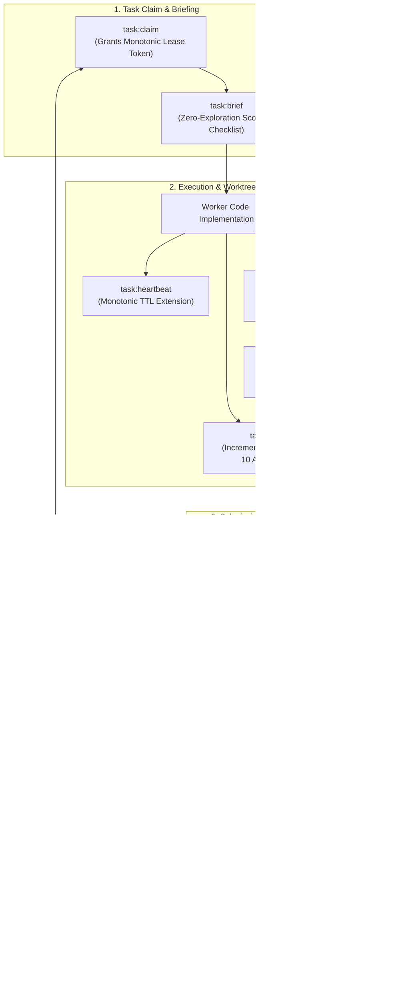

# Task & Worker Commands — `task:*`, `branch:*`, `inspection:*`

[Reference Home](../index.md) > [CLI Dictionary](./index.md) > Task & Worker Commands

---

[⏮️ Previous: Lifecycle & Run Commands](14-01-lifecycle-and-run-commands.md) | [📂 Chapter Index](index.md) | [📚 All Chapters Index](../index.md) | [⏭️ Next: Mind & Preplanning Commands](14-03-mind-and-preplanning-commands.md)
---

## 🏛️ Section Overview & Execution Topology

The **Task & Worker** command suite orchestrates the core execution loop of OLT. It enforces strict physical lease boundaries, bearer token authentication, heartbeat continuity, incremental AST/type verification, adversarial validator probing, worktree branch isolation, and evidence collection.



---

## 1. Task Lifecycle Commands (`task:*`)

### `task:claim`

**Domain**: `task`  
**Authority Tier**: `T3` (Implementer / Repairer)  
**Advisory Lock**: Exclusive on task record  
**Mutation Guarantee**: Transitions task status from `ready` (or `changes_requested`) to `leased`, records initial write-scope SHA-256 digest ($D_{\text{claim}}$), stamps lease expiration timestamp ($t_{\text{claim}} + \text{TTL}$), increments task attempt counter, and mints an ephemeral bearer token.

#### Synopsis

```bash
bun olt/scripts/harness.ts task:claim --run <RUN_DIR> --task <TASK_ID> --agent <AGENT_ID> --role <ROLE> [--lease-duration <SECS>]
```

#### Flags & Parameters

| Flag                                  |   Type   | Required |   Default    | Description                                                                         |
| :------------------------------------ | :------: | :------: | :----------: | :---------------------------------------------------------------------------------- |
| `--run`                               | `string` | Required |      —       | Capsule run root directory.                                                         |
| `--task`                              | `string` | Required |      —       | Task ID to lease (must be in `ready` or `changes_requested`).                       |
| `--agent`                             | `string` | Required |      —       | Unique identifier of claiming agent (e.g. `worker-auth-01`).                        |
| `--role`                              | `string` | Required |      —       | Role contract: `implementer` (for `ready`) or `repairer` (for `changes_requested`). |
| `--lease-duration`, `--lease-seconds` |  `int`   | Optional | `1200` (20m) | Lease duration in seconds (Range: 5 to 86400).                                      |

#### Input / Output Payloads

**Standard Output (Markdown Brief)**:

```markdown
### 🔒 Task Leased: `task-auth-jwt`

- **Agent**: `worker-auth-01` | **Role**: `implementer`
- **Bearer Token**: `tok_9a8b7c6d5e4f3a2b1c0d` (Store securely; required for all worker ops)
- **Lease Expiration**: `2026-08-29T10:45:00.000Z` (1200s remaining)
- **Assigned Write Scope**: `src/auth/jwt.ts`, `tests/unit/auth/jwt.test.ts`
- **Next Action**: Run `bun harness.ts task:brief --run .olt/capsules/... --task task-auth-jwt`
```

**Structured Output (`--format json`)**:

```json
{
  "ok": true,
  "result": {
    "task_id": "task-auth-jwt",
    "agent_id": "worker-auth-01",
    "role": "implementer",
    "token": "tok_9a8b7c6d5e4f3a2b1c0d",
    "attempt": 1,
    "lease_duration_seconds": 1200,
    "expires_at": "2026-08-29T10:45:00.000Z",
    "write_scope": ["src/auth/jwt.ts", "tests/unit/auth/jwt.test.ts"],
    "initial_scope_digest": "e3b0c44298fc1c149afbf4c8996fb92427ae41e4649b934ca495991b7852b855"
  }
}
```

#### Exit Codes

- `0`: Success, lease granted.
- `3`: `INVALID_STATE` (task not in `ready` or `changes_requested` state).
- `3`: `ROLE_CONFINEMENT_VIOLATION` (claiming `repairer` on a fresh task or `implementer` on a rejected task).
- `4`: `LOCK_TIMEOUT` (concurrent lease race contention).

---

### `task:brief`

**Domain**: `task`  
**Authority Tier**: `T3` (Worker)  
**Advisory Lock**: Shared Read  
**Mutation Guarantee**: Zero mutation. Renders a single-shot zero-exploration context packet for the assigned worker.

#### Synopsis

```bash
bun olt/scripts/harness.ts task:brief --run <RUN_DIR> --task <TASK_ID> [--agent <AGENT_ID>] [--role <ROLE>]
```

#### Briefing Contents

1. **Target Files**: Explicit read/write file paths.
2. **Acceptance Criteria**: Verbatim requirements from `requirements.json`.
3. **Assigned Gate Command**: Exact verification command string.
4. **Preceding Task Diffs**: Compact summary of upstream commits.
5. **Anti-Goals & Prohibitions**: Out-of-bounds files and forbidden modifications.

---

### `task:heartbeat`

**Domain**: `task`  
**Authority Tier**: `T3` (Worker holding active lease)  
**Advisory Lock**: Exclusive on lease record  
**Mutation Guarantee**: Validates bearer token, extends lease expiration timestamp by the original lease duration, and updates agent liveness telemetry in `state.json`.

#### Synopsis

```bash
bun olt/scripts/harness.ts task:heartbeat --run <RUN_DIR> --task <TASK_ID> --agent <AGENT_ID> --token <BEARER_TOKEN>
```

#### Exit Codes

- `0`: Success, lease renewed.
- `3`: `AUTHENTICATION_FAILURE` (invalid or mismatched bearer token).
- `3`: `INVALID_STATE` (lease expired and reclaimed by watchdog).

---

### `task:check`

**Domain**: `task`  
**Authority Tier**: `T3` (Worker), `T2` (Validator)  
**Advisory Lock**: None (pure local AST verification)  
**Mutation Guarantee**: Zero mutation. Runs incremental TypeScript typechecking (`tsc --noEmit`) and audits modified files against the **10 AST Static Linter Rules (L1–L10)**.

#### Synopsis

```bash
bun olt/scripts/harness.ts task:check --run <RUN_DIR> [--task <TASK_ID>] [--files <PATH...>] [--strict] [--skip-typecheck]
```

#### The 10 AST Linter Rules (L1–L10)

|  Rule ID  | Linter Name              | Enforced AST Pattern & Invariant                                                       |
| :-------: | :----------------------- | :------------------------------------------------------------------------------------- |
| **`L1`**  | `No Unhandled Any`       | Prohibits explicit `any` without preceding `// @ts-expect-error` and cited defect ID.  |
| **`L2`**  | `No Ephemeral Fallbacks` | Prohibits `?? "fallback_literal"` on critical configuration interfaces.                |
| **`L3`**  | `Strict Function Return` | All exported functions must specify an explicit return type annotation.                |
| **`L4`**  | `No Vendor Namespace`    | Prohibits proprietary vendor names (`openai`, `anthropic`) in domain identifier names. |
| **`L5`**  | `File Budget Limit`      | Source files must not exceed 300 LOC (excluding test fixtures).                        |
| **`L6`**  | `No Shell Injection`     | Prohibits template literal interpolation inside `child_process.exec` or `Bun.spawn`.   |
| **`L7`**  | `No Silent Catch`        | Prohibits empty `catch (e) {}` blocks without telemetry logging.                       |
| **`L8`**  | `Explicit Sync Locks`    | File write operations inside capsule storage must use `flock` or atomic renames.       |
| **`L9`**  | `Strict Null Checks`     | Prohibits non-null assertions (`!`) on API boundary parameters.                        |
| **`L10`** | `No Circular Imports`    | Module dependency graph must form an acyclic DAG.                                      |

#### Exit Codes

- `0`: `SUCCESS` (AST lint and typecheck 100% clean).
- `1`: `VERIFICATION_FAILED` (AST lint or typecheck detected violations; prints exact file, line, and AST node).
- `3`: `INVALID_ARGUMENT` (target files not found or tsconfig unreadable).

---

### `task:submit`

**Domain**: `task`  
**Authority Tier**: `T3` (Worker holding active lease)  
**Advisory Lock**: Exclusive on task and event reflog  
**Mutation Guarantee**: Performs **Invariant C4 Scope Digest Verification**, enforces git staging, captures modified files, releases the worker lease, and transitions task status to `submitted`.

#### Synopsis

```bash
bun olt/scripts/harness.ts task:submit --run <RUN_DIR> --task <TASK_ID> --agent <AGENT_ID> --token <BEARER_TOKEN> --summary <SUMMARY_TEXT> [--files-changed <PATH...>] [--evidence <CMD_ID...>] [--no-op --reason <REASON>]
```

#### Invariant C4 Scope Digest Check

$$D_{\text{submit}} = \text{SHA-256}\left( \bigcup_{p \in \Omega(T)} \text{read}(p) \right)$$

If $D_{\text{submit}} == D_{\text{claim}}$:

- The submission is **immediately rejected** with `INVALID_STATE` unless `--no-op` and `--reason` are explicitly supplied explaining why zero file modifications were necessary.
- Unexplained no-op submissions are classified as agent hallucinations.

#### Git Staging Invariant

`task:submit` verifies that all modified files in $\Omega(T)$ have been staged via `git add -A` or recorded in the working tree. Untracked dangling files inside $\Omega(T)$ abort the submission.

#### Exit Codes

- `0`: Success, task moved to `submitted`.
- `3`: `INVALID_STATE` (Invariant C4 scope digest unchanged without `--no-op`, or out-of-scope files detected).
- `3`: `AUTHENTICATION_FAILURE` (invalid token).

---

### `task:validate-start`

**Domain**: `task`  
**Authority Tier**: `T2` (Validator)  
**Advisory Lock**: Exclusive on validation lease  
**Mutation Guarantee**: Transitions task status from `submitted` to `in_validation`, grants validator lease, and enforces the **Cognitive Validator Hard-Lock** (Validator is physically barred from invoking write tools or `run:exec` on source code).

#### Synopsis

```bash
bun olt/scripts/harness.ts task:validate-start --run <RUN_DIR> --task <TASK_ID> --validator <VALIDATOR_ID> [--domain <DOMAIN>]
```

---

### `task:probe`

**Domain**: `task`  
**Authority Tier**: `T2` (Validator)  
**Advisory Lock**: Exclusive  
**Mutation Guarantee**: Generates structured adversarial probe demands recorded in `.olt/capsules/<slug>/evidence/probes/<task-id>.json`.

#### Synopsis

```bash
bun olt/scripts/harness.ts task:probe --run <RUN_DIR> --task <TASK_ID> --validator <VALIDATOR_ID> --token <VALIDATOR_TOKEN> --demand <DEMAND_TEXT> [--category <CATEGORY>]
```

---

### `task:review`

**Domain**: `task`  
**Authority Tier**: `T2` (Validator holding validation lease)  
**Advisory Lock**: Exclusive  
**Mutation Guarantee**: Evaluates Class 1–4 evidence, answers 7 validator heuristics, records review report, and transitions task to `done` (if passing) or `changes_requested` (if failing).

#### Synopsis

```bash
bun olt/scripts/harness.ts task:review --run <RUN_DIR> --task <TASK_ID> --validator <VALIDATOR_ID> --token <TOKEN> --status <pass|fail> [--finding <FINDING_JSON>] [--reason <REASON>]
```

#### Dual-Channel Validation Protocol

1. **Host Verification Channel**: Direct verification of POSIX exit code `0`, log size $>1024$ bytes, and AST cleanliness.
2. **Cognitive Semantic Channel**: Adversarial checklist audit confirming requirements are genuinely satisfied without test weakening.

#### Exit Codes

- `0`: Success, task review committed.
- `3`: `INVALID_ARGUMENT` (missing finding JSON on failing review).

---

### `task:reject` & `task:assign-repairer`

**Aliases**: `task:repair`  
**Domain**: `task`  
**Authority Tier**: `T2` (Validator), `T0` (Orchestrator)  
**Advisory Lock**: Exclusive  
**Mutation Guarantee**: Records structured defect finding, unlocks task into `changes_requested` quarantine, and assigns an isolated repair lease to a repair agent.

#### Synopsis

```bash
bun olt/scripts/harness.ts task:reject --run <RUN_DIR> --task <TASK_ID> --validator <VALIDATOR_ID> --token <TOKEN> --findings-file <FINDINGS_JSON>
bun olt/scripts/harness.ts task:assign-repairer --run <RUN_DIR> --task <TASK_ID> --repairer <AGENT_ID> [--lease-seconds <SECS>]
```

---

### `task:release` & `task:abandon`

**Domain**: `task`  
**Authority Tier**: `T3` (Worker holding lease), `T0` (Orchestrator)  
**Advisory Lock**: Exclusive  
**Mutation Guarantee**: Surrenders active lease, marks reason in event log, reverts task status back to `ready` for another worker to claim.

#### Synopsis

```bash
bun olt/scripts/harness.ts task:release --run <RUN_DIR> --task <TASK_ID> --agent <AGENT_ID> --token <TOKEN> --reason <REASON>
```

---

## 2. Branch Isolation Commands (`branch:*`)

The `branch:*` domain provides execution-time sub-task division, enabling an implementer to subdivide large work into isolated child sub-tasks executed by sub-agents without modifying the plan DAG revision.

```
┌──────────────────────────────────────────────────────────────────────────────────────────────────┐
│                                 BRANCH ISOLATION LIFECYCLE                                       │
├───────────────────┬───────────────────┬───────────────────┬──────────────────────────────────────┤
│ 1. branch:open    │ 2. branch:claim   │ 3. branch:submit  │ 4. branch:collect                    │
├───────────────────┼───────────────────┼───────────────────┼──────────────────────────────────────┤
│ Freezes parent    │ Dispatches sub-   │ Sub-agent reports │ Parent inspects merged diffs, audits │
│ lease clock;      │ agent into        │ completion and    │ proper-subset write scopes, and      │
│ defines sub-tasks │ isolated worktree │ releases sub-lease│ merges into parent workspace         │
└───────────────────┴───────────────────┴───────────────────┴──────────────────────────────────────┘
```

---

### `branch:open`

**Aliases**: `branch:create`  
**Domain**: `branch`  
**Authority Tier**: `T3` (Implementer holding active task lease)  
**Advisory Lock**: Exclusive on parent task  
**Mutation Guarantee**: Transitions parent task to `branched`, freezes parent lease clock, validates that all sub-task write scopes are **STRICT PROPER SUBSETS** of the parent scope ($\Omega(S_k) \subset \Omega(T_{\text{parent}})$), and creates branch registry `B-<uuid>`.

#### Synopsis

```bash
bun olt/scripts/harness.ts branch:open --run <RUN_DIR> --parent-task <TASK_ID> --agent <PARENT_AGENT> --token <PARENT_TOKEN> --reason <REASON> --sub-task <S_ID...> --sub-label <S_ID=LABEL...> --sub-scope <S_ID=PATH...> [--sub-gate <S_ID=CMD...>]
```

#### Flags & Parameters

| Flag            |   Type   |       Required        | Default | Description                                    |
| :-------------- | :------: | :-------------------: | :-----: | :--------------------------------------------- |
| `--run`         | `string` |       Required        |    —    | Capsule run root.                              |
| `--parent-task` | `string` |       Required        |    —    | Parent task ID currently leased by the caller. |
| `--agent`       | `string` |       Required        |    —    | Parent agent ID.                               |
| `--token`       | `string` |       Required        |    —    | Parent bearer token.                           |
| `--reason`      | `string` |       Required        |    —    | Rationale for subdivision.                     |
| `--sub-task`    | `string` | Required (Repeatable) |    —    | Sub-task ID (e.g. `S-1`, `S-2`).               |
| `--sub-label`   | `string` | Required (Repeatable) |    —    | Mapping: `S-1="Parser refactor"`.              |
| `--sub-scope`   | `string` | Required (Repeatable) |    —    | Mapping: `S-1=src/parser/lexer.ts`.            |
| `--sub-gate`    | `string` | Optional (Repeatable) |  `[]`   | Sub-task verification gate.                    |

#### Invariant: Strict Proper Subsetting

Every sub-task scope must satisfy:
$$\Omega(S_k) \subsetneq \Omega(T_{\text{parent}}) \quad \land \quad \Omega(S_i) \cap \Omega(S_j) = \emptyset \quad (\forall i \neq j)$$
Violations are refused preflight to prevent runaway recursive branching.

---

### `branch:claim` & `branch:submit`

**Aliases**: `branch:isolate`  
**Domain**: `branch`  
**Authority Tier**: `T3` (Sub-implementer, Sub-validator)  
**Advisory Lock**: Exclusive on branch sub-task  
**Mutation Guarantee**: `branch:claim` leases sub-task $S_k$ and returns sub-bearer token. `branch:submit` records sub-agent activity and releases sub-lease.

#### Synopsis

```bash
bun olt/scripts/harness.ts branch:claim --run <RUN_DIR> --branch <BRANCH_ID> --sub-task <SUB_TASK_ID> --agent <SUB_AGENT> --role <SUB_ROLE> [--lease-seconds <SECS>]
bun olt/scripts/harness.ts branch:submit --run <RUN_DIR> --branch <BRANCH_ID> --sub-task <SUB_TASK_ID> --agent <SUB_AGENT> --token <SUB_TOKEN> --summary <SUMMARY>
```

---

### `branch:collect` & `branch:abandon`

**Aliases**: `branch:merge`, `branch:cleanup`  
**Domain**: `branch`  
**Authority Tier**: `T3` (Parent Implementer holding parent token)  
**Advisory Lock**: Exclusive on parent task  
**Mutation Guarantee**: `branch:collect` verifies that all sub-tasks are submitted, merges out-of-repo worktrees into parent tree, unfreezes parent lease clock, and restores parent status to `leased`. `branch:abandon` prunes worktrees and cancels branch.

#### Synopsis

```bash
bun olt/scripts/harness.ts branch:collect --run <RUN_DIR> --branch <BRANCH_ID> --parent-task <TASK_ID> --agent <PARENT_AGENT> --token <PARENT_TOKEN>
bun olt/scripts/harness.ts branch:abandon --run <RUN_DIR> --branch <BRANCH_ID> --parent-task <TASK_ID> --agent <PARENT_AGENT> --token <PARENT_TOKEN> --reason <REASON>
```

---

## 3. Inspection & Evidence Commands (`inspection:*`)

The `inspection:*` domain provides safe, read-only and scope-adjustment tools for examining git diffs, Merkle event streams, proof blobs, screenshots, and findings.

---

### `inspection:diff`

**Domain**: `inspection`  
**Authority Tier**: Any  
**Advisory Lock**: Shared Read  
**Mutation Guarantee**: Zero mutation. Renders exact unified diff of files within assigned task write scope.

#### Synopsis

```bash
bun olt/scripts/harness.ts inspection:diff --run <RUN_DIR> --task <TASK_ID> [--format json]
```

---

### `inspection:scope` & `scope:expand`

**Domain**: `inspection`  
**Authority Tier**: `T0` (Orchestrator), `T2` (Lead)  
**Advisory Lock**: Exclusive on plan DAG  
**Mutation Guarantee**: Formally expands the write scope of a task in response to discovered dependencies, re-auditing against invariant A2 (Disjoint Scope).

#### Synopsis

```bash
bun olt/scripts/harness.ts scope:expand --run <RUN_DIR> --task <TASK_ID> --add-path <NEW_PATH...> --reason <REASON> --actor <ACTOR>
```

---

### `inspection:log` & `stream:events`

**Domain**: `inspection`  
**Authority Tier**: Any  
**Advisory Lock**: Shared Read  
**Mutation Guarantee**: Zero mutation. Replays or tails cryptographic event log `events.jsonl` with Merkle hash validation.

#### Synopsis

```bash
bun olt/scripts/harness.ts stream:events --run <RUN_DIR> [--tail <N>] [--event-type <TYPE>] [--json]
```

---

### `evidence:get` & `evidence:screenshots`

**Domain**: `inspection`  
**Authority Tier**: Any  
**Advisory Lock**: Shared Read  
**Mutation Guarantee**: Zero mutation. Retrieves raw log bytes, AST outputs, or PNG visual test artifacts recorded during `run:exec`.

#### Synopsis

```bash
bun olt/scripts/harness.ts evidence:get --run <RUN_DIR> --command-id <CMD_ID>
bun olt/scripts/harness.ts evidence:screenshots --run <RUN_DIR> [--task <TASK_ID>]
```

---

### `finding:get` & `report:get`

**Domain**: `inspection`  
**Authority Tier**: Any  
**Advisory Lock**: Shared Read  
**Mutation Guarantee**: Zero mutation. Retrieves validator probe reports, adversarial findings, and task completion summaries.

#### Synopsis

```bash
bun olt/scripts/harness.ts finding:get --run <RUN_DIR> --finding-id <FINDING_ID>
bun olt/scripts/harness.ts report:get --run <RUN_DIR> --task <TASK_ID>
```

---

[⏮️ Previous: Lifecycle & Run Commands](14-01-lifecycle-and-run-commands.md) | [📂 Chapter Index](index.md) | [📚 All Chapters Index](../index.md) | [⏭️ Next: Mind & Preplanning Commands](14-03-mind-and-preplanning-commands.md)
---
