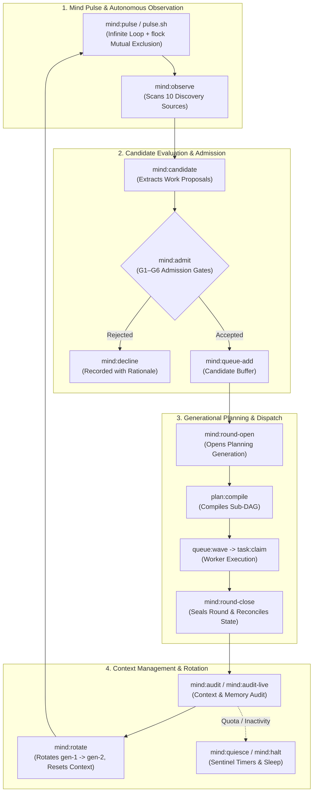

# Mind & Preplanning Commands — `mind:*`

[Reference Home](../index.md) > [CLI Dictionary](./index.md) > Mind & Preplanning Commands

---

[⏮️ Previous: Task & Worker Commands](14-02-task-and-worker-commands.md) | [📂 Chapter Index](index.md) | [📚 All Chapters Index](../index.md) | [⏭️ Next: Doctor & Diagnostics Commands](14-04-doctor-and-diagnostics-commands.md)
---

## 🏛️ Section Overview & Autonomous Supervisor Loop

The **Mind & Preplanning** command suite provides the runtime foundation for the **OLT Infinite Autonomous Supervisor**. Operating above individual task runs, the Mind mode runs in an infinite pulse cadence (`pulse.sh`), continuously scanning 10 repository discovery sources, evaluating candidates against 6 admission gates (`G1`–`G6`), calculating cognitive Work/Span telemetry, dispatching multi-agent execution rounds, and performing generational rotation (`mind-gen-1` $\to$ `mind-gen-2`) to avoid context satiation.



---

## 1. The 10 Discovery Sources

Every invocation of `mind:observe` scans ten deterministic repository sources for work proposals:

```
┌──────────────────────────────────────────────────────────────────────────────────────────────────┐
│                                   THE 10 DISCOVERY SOURCES                                       │
├────┬─────────────────────────────┬───────────────────────────────────────────────────────────────┤
│ 1  │ User Interactive Requests   │ Incoming user prompts, feedback queue items, operator signals │
├────┼─────────────────────────────┼───────────────────────────────────────────────────────────────┤
│ 2  │ Capsule Defect Records      │ Open findings in `.olt/capsules/*/defects.jsonl`              │
├────┼─────────────────────────────┼───────────────────────────────────────────────────────────────┤
│ 3  │ Continuous Test Failures    │ Automated test suite failure logs and regressions             │
├────┼─────────────────────────────┼───────────────────────────────────────────────────────────────┤
│ 4  │ Static AST & Lint Violations│ 10 AST linter rule breaches (`task:check`) across source tree │
├────┼─────────────────────────────┼───────────────────────────────────────────────────────────────┤
│ 5  │ Policy & Schema Drift       │ Drift between code implementations and `requirements.json`    │
├────┼─────────────────────────────┼───────────────────────────────────────────────────────────────┤
│ 6  │ Orphaned Workspaces         │ Stale worktrees, dangling branch grants, leaked leases        │
├────┼─────────────────────────────┼───────────────────────────────────────────────────────────────┤
│ 7  │ Persistent Todo Registry    │ Uncompleted action items in `todo.jsonl`                      │
├────┼─────────────────────────────┼───────────────────────────────────────────────────────────────┤
│ 8  │ Stale Git Branches          │ Unmerged experimental branches with aging reflogs             │
├────┼─────────────────────────────┼───────────────────────────────────────────────────────────────┤
│ 9  │ Quota & Budget Alerts       │ Token limit thresholds, execution time spikes                 │
├────┼─────────────────────────────┼───────────────────────────────────────────────────────────────┤
│ 10 │ Performance Regressions     │ Benchmark regressions, high latency, APCA contrast failures   │
└────┴─────────────────────────────┴───────────────────────────────────────────────────────────────┘
```

---

## 2. The 6 Admission Gates (`G1`–`G6`)

No candidate proposal may transition to a scheduled planning round without satisfying all six admission gates:

|   Gate   | Invariant Name         | Rule & Validation Condition                                                   | Rejection Code     |
| :------: | :--------------------- | :---------------------------------------------------------------------------- | :----------------- |
| **`G1`** | `Charter Alignment`    | Candidate must directly advance at least one pinned charter goal.             | `CHARTER_MISMATCH` |
| **`G2`** | `Bounded Scope`        | Write scope must not exceed 5 files or 300 LOC (Cowan budget).                | `SCOPE_EXCEEDED`   |
| **`G3`** | `Falsifiable Gate`     | Must define a deterministic verification command that fails when unfulfilled. | `NON_FALSIFIABLE`  |
| **`G4`** | `Disjoint Parallelism` | Write scope must not overlap with any currently active candidate or task.     | `SCOPE_COLLISION`  |
| **`G5`** | `Quota Feasibility`    | Estimated token and time budget must remain within active quota limits.       | `QUOTA_EXHAUSTION` |
| **`G6`** | `Deduplication`        | Candidate must not duplicate any open, admitted, or recently closed task.     | `DUPLICATE_WORK`   |

---

## 3. Cognitive Telemetry & Work/Span Equations

The Mind supervisor calculates real-time cognitive metrics across active runs:

$$\text{Total Work } (W) = \sum_{i=1}^N \text{cost}(T_i), \quad \text{Critical Span } (S) = \text{max path length}$$

$$\text{Optimal Parallelism } (P) = \left\lceil \frac{W}{S} \right\rceil, \quad \text{Concurrency Efficiency } (\eta) = \frac{W}{P \cdot S}$$

If $\eta < 0.50$, the Mind automatically triggers a DAG replan to eliminate serialization bottlenecks.

---

## 4. Mind Command Reference

### `mind:init`

**Domain**: `mind`  
**Authority Tier**: `T1` (Mind Supervisor)  
**Advisory Lock**: Exclusive on capsule root  
**Mutation Guarantee**: Initializes `.olt/capsules/<slug>/mind/` metadata, sets initial generation `mind-gen-1`, records pinned charter goals, and starts pulse epoch timer.

#### Synopsis

```bash
bun olt/scripts/harness.ts mind:init --run <RUN_DIR> --charter <CHARTER_TEXT> [--actor <ACTOR>]
```

#### Flags & Parameters

| Flag        |   Type   | Required |      Default      | Description                                               |
| :---------- | :------: | :------: | :---------------: | :-------------------------------------------------------- |
| `--run`     | `string` | Required |         —         | Capsule run root directory.                               |
| `--charter` | `string` | Required |         —         | High-level system charter goals and boundary constraints. |
| `--actor`   | `string` | Optional | `mind-supervisor` | Actor ID initializing the Mind loop.                      |

---

### `mind:pulse`

**Aliases**: `mind:pulse-open`  
**Domain**: `mind`  
**Authority Tier**: `T1` (Mind Supervisor)  
**Advisory Lock**: Exclusive on Mind supervisor mutex  
**Mutation Guarantee**: Executes one full pulse cycle: updates watchdog timers, sweeps expired leases, ingests telemetry from active workers, evaluates discovery sources, and emits cognitive health status.

#### Synopsis

```bash
bun olt/scripts/harness.ts mind:pulse --run <RUN_DIR> [--actor <ACTOR>] [--format json]
```

#### Input / Output Payloads

**Standard Output (Markdown Brief)**:

```markdown
### 🧠 Mind Pulse: `mind-gen-1` (Pulse #42)

- **Status**: `ACTIVE_SUPERVISING` | **Active Tasks**: `3 leased`, `2 ready`, `5 done`
- **Work / Span**: $W=10, S=4 \implies P=\lceil 10/4 \rceil = 3$ | **Efficiency**: $\eta=83.3\%$
- **Discovery**: 2 new candidates detected (1 test failure, 1 AST lint)
- **Token Telemetry**: 142k / 1.0M tokens used (14.2%)
- **Next Action**: Run `bun harness.ts mind:admit` to process staged candidates
```

**Structured Output (`--format json`)**:

```json
{
  "ok": true,
  "result": {
    "generation": 1,
    "pulse_number": 42,
    "timestamp": "2026-08-29T10:50:00.000Z",
    "telemetry": {
      "total_work": 10,
      "critical_span": 4,
      "recommended_parallelism": 3,
      "parallelization_efficiency": 0.833,
      "active_agents": 3,
      "tokens_consumed": 142500,
      "quota_fraction": 0.142
    },
    "discovery_summary": {
      "user_requests": 0,
      "defects": 0,
      "test_failures": 1,
      "ast_lints": 1,
      "orphaned_workspaces": 0
    },
    "admitted_candidates_count": 0
  }
}
```

---

### `mind:wake`

**Domain**: `mind`  
**Authority Tier**: `T1` (Mind Supervisor)  
**Advisory Lock**: Exclusive on `.olt/capsules/<slug>/locks/mind.lock`  
**Mutation Guarantee**: Acquires supervisor flock lock, verifies process liveness, and starts background heartbeat watcher.

#### Synopsis

```bash
bun olt/scripts/harness.ts mind:wake --run <RUN_DIR> [--actor <ACTOR>]
```

---

### `mind:observe`

**Aliases**: `mind:triage`  
**Domain**: `mind`  
**Authority Tier**: `T1` (Mind Supervisor)  
**Advisory Lock**: Shared Read  
**Mutation Guarantee**: Zero mutation. Runs an audit across all 10 discovery sources and outputs prioritized candidate proposals.

#### Synopsis

```bash
bun olt/scripts/harness.ts mind:observe --run <RUN_DIR> [--source <SOURCE_NAME...>]
```

---

### `mind:candidate`

**Domain**: `mind`  
**Authority Tier**: `T1` (Mind Supervisor)  
**Advisory Lock**: Exclusive  
**Mutation Guarantee**: Formats a raw observation into a formal candidate proposal with assigned write-scope and proposed gate commands.

#### Synopsis

```bash
bun olt/scripts/harness.ts mind:candidate --run <RUN_DIR> --title <TITLE> --source <SOURCE> --write-scope <PATHS...> --gate <CMD>
```

---

### `mind:admit` & `mind:decline`

**Domain**: `mind`  
**Authority Tier**: `T1` (Mind Supervisor)  
**Advisory Lock**: Exclusive  
**Mutation Guarantee**: `mind:admit` verifies gates G1–G6 and moves candidate to `admitted` candidate queue. `mind:decline` records rejection rationale and archives proposal.

#### Synopsis

```bash
bun olt/scripts/harness.ts mind:admit --run <RUN_DIR> --candidate <CANDIDATE_ID> --actor <ACTOR>
bun olt/scripts/harness.ts mind:decline --run <RUN_DIR> --candidate <CANDIDATE_ID> --actor <ACTOR> --reason <REASON>
```

---

### `mind:round-open` & `mind:round-close`

**Domain**: `mind`  
**Authority Tier**: `T1` (Mind Supervisor)  
**Advisory Lock**: Exclusive  
**Mutation Guarantee**: `mind:round-open` clusters admitted candidates into a cohesive planning round, compiles the round DAG, and opens execution waves. `mind:round-close` verifies that all round tasks are `done`, updates memory ledgers, and seals the round.

#### Synopsis

```bash
bun olt/scripts/harness.ts mind:round-open --run <RUN_DIR> --round-id <ROUND_ID> --candidates <ID_1,ID_2,...>
bun olt/scripts/harness.ts mind:round-close --run <RUN_DIR> --round-id <ROUND_ID> --actor <ACTOR>
```

---

### `mind:rotate`

**Domain**: `mind`  
**Authority Tier**: `T1` (Mind Supervisor)  
**Advisory Lock**: Exclusive  
**Mutation Guarantee**: Implements **Generational Context Rotation**. Seals current generation event reflog, compresses long-term memories into `memory/`, resets active LLM context memory, and initializes generation increment: `mind-gen-1` $\to$ `mind-gen-2`.

#### Synopsis

```bash
bun olt/scripts/harness.ts mind:rotate --run <RUN_DIR> --next-gen <GEN_ID> --actor <ACTOR>
```

#### Rotation Sequence

1. Validates all active tasks are terminal.
2. Generates semantic summary of closed generation.
3. Appends `mind-generation-rotated` event.
4. Updates `state.json` pointer to new generation ID.
5. Re-executes `mind:pulse` under clean context.

---

### `mind:freeze`, `mind:quiesce` & `mind:halt`

**Domain**: `mind`  
**Authority Tier**: `T1` (Mind Supervisor), `T0` (Orchestrator)  
**Advisory Lock**: Exclusive  
**Mutation Guarantee**: Pauses the Mind pulse loop, puts supervisor into low-power sentinel sleep, or terminates the autonomous run.

#### Synopsis

```bash
bun olt/scripts/harness.ts mind:quiesce --run <RUN_DIR> --timeout-seconds <SECS> --source <SRC:CMD:COUNT...>
bun olt/scripts/harness.ts mind:halt --run <RUN_DIR> --actor <ACTOR> --reason <REASON>
bun olt/scripts/harness.ts quota:freeze --run <RUN_DIR> --reason <QUOTA_LIMIT>
bun olt/scripts/harness.ts quota:resume --run <RUN_DIR> --actor <ACTOR>
```

---

### `mind:status`, `mind:audit` & `mind:queue-*`

**Aliases**: `mind:audit-live`, `todo:list`, `todo:add`, `todo:drain`, `todo:seal`, `todo:clean`  
**Domain**: `mind` / `reporting`  
**Authority Tier**: Any  
**Advisory Lock**: Shared Read / Exclusive on mutations  
**Mutation Guarantee**: Manages persistent todo items, candidate buffers, and memory query interfaces.

#### Synopsis

```bash
bun olt/scripts/harness.ts mind:status --run <RUN_DIR>
bun olt/scripts/harness.ts mind:audit --run <RUN_DIR>
bun olt/scripts/harness.ts mind:queue-list --run <RUN_DIR>
bun olt/scripts/harness.ts mind:queue-add --run <RUN_DIR> --item <TODO_TEXT>
bun olt/scripts/harness.ts memory:query --run <RUN_DIR> --query <QUERY_STRING>
```

---

[⏮️ Previous: Task & Worker Commands](14-02-task-and-worker-commands.md) | [📂 Chapter Index](index.md) | [📚 All Chapters Index](../index.md) | [⏭️ Next: Doctor & Diagnostics Commands](14-04-doctor-and-diagnostics-commands.md)
---
