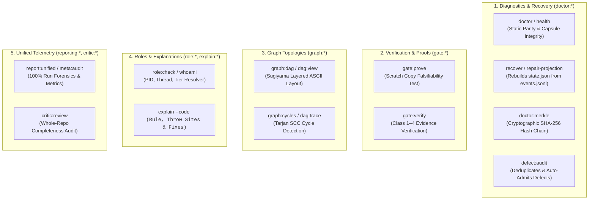

# Doctor & Diagnostics Commands — `doctor:*`, `gate:*`, `graph:*`, `role:*`, `explain:*`, `reporting:*`

[Reference Home](../index.md) > [CLI Dictionary](./index.md) > Doctor & Diagnostics Commands

---

[⏮️ Previous: Mind & Preplanning Commands](14-03-mind-and-preplanning-commands.md) | [📂 Chapter Index](index.md) | [📚 All Chapters Index](../index.md) | [⏭️ Next: Reference 05: Role Contracts & Authority](../02-four-tier-hierarchy/index.md)
---

## 🏛️ Section Overview & Diagnostic Architecture

The **Doctor & Diagnostics** suite provides the verification, forensic, and telemetry foundations of OLT. It ensures host runtime parity, verifies falsifiable gate proofs on scratch sandbox copies, computes topological graph layouts, enforces 4-tier RBAC authority contracts, provides instant error explanations, and compiles comprehensive audit reports.



---

## 1. Doctor & Environment Diagnostics (`doctor:*`)

The `doctor:*` domain audits runtime parity, checks for orphaned resources, verifies capsule file schemas, and rebuilds corrupted state projections.

---

### `doctor:env` & `health`

**Domain**: `diagnostics`  
**Authority Tier**: Any  
**Advisory Lock**: None  
**Mutation Guarantee**: Zero mutation. Audits the host environment against the canonical platform specification: Bun runtime version, Git porcelain compatibility, POSIX `flock(2)` support, available memory, and CPU concurrency.

#### Synopsis

```bash
bun olt/scripts/harness.ts health [--scripts <DIR>] [--consumer <REPO>] [--check <CHECK_NAME...>]
bun olt/scripts/harness.ts doctor:env
```

#### Verification Suite

- **Bun Runtime Engine**: Version $\ge 1.1.0$.
- **Git Porcelain & Worktrees**: Git version $\ge 2.38.0$.
- **Advisory Locking Engine**: POSIX `flock(2)` syscall availability.
- **AST Parser & Linters**: Clean parse on all harness scripts.
- **Vendor Namespace Audit**: Verifies zero forbidden vendor names in identifier positions.

#### Exit Codes

- `0`: Environment healthy and fully conforming.
- `3`: `UNSUPPORTED_PLATFORM` (missing dependencies, incompatible runtime, or failing health checks).

---

### `doctor:system` & `doctor`

**Domain**: `diagnostics`  
**Authority Tier**: Any  
**Advisory Lock**: Shared Read  
**Mutation Guarantee**: Zero mutation. Performs deep structural audit of an active capsule directory: verifies mode `0444` on `manifest.json` and `prompt.md`, validates JSON schema compliance on `state.json` and `requirements.json`, and audits `mailbox/` integrity.

#### Synopsis

```bash
bun olt/scripts/harness.ts doctor [--run <RUN_DIR>] [--detailed]
```

---

### `doctor:capsule` & `recover`

**Aliases**: `repair-projection`  
**Domain**: `diagnostics`  
**Authority Tier**: `T0` (Orchestrator)  
**Advisory Lock**: Exclusive on entire capsule  
**Mutation Guarantee**: Sweeps expired task leases (returning them to `ready`), cleans stale branch worktrees, and **deterministically rebuilds `state.json` from genesis by replaying `events.jsonl`**.

#### Synopsis

```bash
bun olt/scripts/harness.ts recover --run <RUN_DIR> [--actor <ACTOR>]
bun olt/scripts/harness.ts repair-projection --run <RUN_DIR>
```

#### Replay Recovery Guarantee

$$\text{State}_N = \text{Fold}(\text{GenesisState}, [E_1, E_2, \dots, E_N])$$
If `state.json` is deleted or corrupted, `repair-projection` guarantees byte-for-byte state restoration with zero data loss.

---

### `doctor:merkle`

**Domain**: `diagnostics`  
**Authority Tier**: Any  
**Advisory Lock**: Shared Read  
**Mutation Guarantee**: Zero mutation. Verifies the SHA-256 Merkle hash chain in `events.jsonl`:

$$H_0 = \text{SHA-256}(\text{GenesisEvent}), \quad H_i = \text{SHA-256}(H_{i-1} \,\|\, E_i)$$

If any event line in `events.jsonl` was modified, deleted, or reordered, `doctor:merkle` reports the exact line and computed hash mismatch.

#### Synopsis

```bash
bun olt/scripts/harness.ts doctor:merkle --run <RUN_DIR>
```

---

### `doctor:apca` & `defect:audit`

**Aliases**: `coverage:check`  
**Domain**: `diagnostics`  
**Authority Tier**: Any  
**Advisory Lock**: Exclusive when auto-admitting  
**Mutation Guarantee**: `doctor:apca` verifies perceptual lightness contrast ($L_c$) compliance for UI badges. `defect:audit` scans, deduplicates, and optionally auto-admits open defects across capsules. `coverage:check` enforces minimum 95% test coverage.

#### Synopsis

```bash
bun olt/scripts/harness.ts defect:audit [--run <RUN_DIR>] [--filter-status <open|all>] [--auto-admit]
bun olt/scripts/harness.ts coverage:check [--threshold 0.95] [--strict]
```

---

## 2. Gate Verification & Falsifiability Commands (`gate:*`)

The `gate:*` domain ensures that gates are mathematically falsifiable and verifies Class 1–4 proof evidence.

```
┌──────────────────────────────────────────────────────────────────────────────────────────────────┐
│                                 THE 4 EVIDENCE CLASSES (C1–C4)                                   │
├────┬─────────────────────────────┬───────────────────────────────────────────────────────────────┤
│ C1 │ Direct Deterministic Exit   │ Process exited 0; captured log bytes > 1024 bytes             │
├────┼─────────────────────────────┼───────────────────────────────────────────────────────────────┤
│ C2 │ Static AST / Type Proof     │ `task:check` incremental typecheck + 10 AST linters passed    │
├────┼─────────────────────────────┼───────────────────────────────────────────────────────────────┤
│ C3 │ Perceptual / Visual Proof   │ APCA contrast $L_c \ge 60$, binary PNG IHDR header verified   │
├────┼─────────────────────────────┼───────────────────────────────────────────────────────────────┤
│ C4 │ Falsifiable Negative Test   │ `gate:prove` fails on reverted scratch copy of write scope    │
└────┴─────────────────────────────┴───────────────────────────────────────────────────────────────┘
```

---

### `gate:prove`

**Domain**: `gate`  
**Authority Tier**: `T0` (Orchestrator), `T2` (Lead Validator)  
**Advisory Lock**: Exclusive on gate proof event log  
**Mutation Guarantee**: Copies tracked repository files to a temporary disposable scratch sandbox, reverts the task's write scope to base ref (`HEAD~1` or claimed base sha), and runs the task's compiled gate command against that reverted copy.

#### Synopsis

```bash
bun olt/scripts/harness.ts gate:prove --run <RUN_DIR> --task <TASK_ID> --actor <ACTOR> [--base <GIT_REF>] [--timeout-ms <MS>]
```

#### Falsifiability Property

A gate is **falsifiable** if and only if it exits non-zero when the task's own modifications are stripped away. If a gate passes on a reverted tree, it is rejected as a generic non-discriminating test.

#### Input / Output Payloads

**Standard Output (Markdown Brief)**:

```markdown
### 🔬 Gate Proof Audit: `task-auth-jwt`

- **Gate Command**: `bun test tests/unit/auth/jwt.test.ts`
- **Reverted Ref**: `HEAD~1` (Write scope reverted in scratch sandbox)
- **Scratch Run Result**: Exit Code `1` (Tests failed on reverted code)
- **Verdict**: ✅ **FALSIFIABLE** (The gate genuinely proves the task's code)
- **Proof Hash**: `sha256:7b8a9c...` recorded in `events.jsonl`
```

---

### `gate:verify` & `gate:status`

**Domain**: `gate`  
**Authority Tier**: Any  
**Advisory Lock**: Shared Read  
**Mutation Guarantee**: Zero mutation. Audits the entire gate matrix for the run, mapping every compiled task to its recorded proof receipts.

#### Synopsis

```bash
bun olt/scripts/harness.ts gate:status --run <RUN_DIR>
```

---

## 3. Graph Topology Commands (`graph:*`)

The `graph:*` domain calculates topological wave schedules, renders terminal ASCII DAG layouts, detects circular dependencies via Tarjan's algorithm, and exports DAG telemetry.

---

### `graph:dag` & `dag:view`

**Aliases**: `dag`, `dag:render`  
**Domain**: `graph` / `reporting`  
**Authority Tier**: Any  
**Advisory Lock**: Shared Read  
**Mutation Guarantee**: Zero mutation. Renders a Sugiyama layered visual or ASCII DAG depicting task nodes, wave lanes, active agent badges, and execution statuses.

#### Synopsis

```bash
bun olt/scripts/harness.ts dag:view --run <RUN_DIR> [--recommendations] [--box-style <ascii|unicode>] [--json]
bun olt/scripts/harness.ts report:dag --run <RUN_DIR>
```

#### Visual Terminal Output Exemplar

```
┌────────────────────────────────────────────────────────────────────────┐
│                      WAVE 1 (Concurrency: 2)                          │
├──────────────────────────────────┬─────────────────────────────────────┤
│ [✓] task-auth-jwt                │ [⚡] task-auth-session               │
│ Assignee: worker-1 (Done)        │ Assignee: worker-2 (Leased 420s)    │
│ Scope: src/auth/jwt.ts           │ Scope: src/auth/session.ts          │
└────────────────┬─────────────────┴──────────────────┬──────────────────┘
                 │                                    │
                 ▼                                    ▼
┌────────────────────────────────────────────────────────────────────────┐
│                      WAVE 2 (Concurrency: 1)                          │
├────────────────────────────────────────────────────────────────────────┤
│ [ ] task-auth-middleware                                               │
│ Prereqs: task-auth-jwt, task-auth-session                              │
│ Scope: src/auth/middleware.ts                                          │
└────────────────────────────────────────────────────────────────────────┘
```

---

### `graph:cycles` & `dag:trace`

**Domain**: `graph`  
**Authority Tier**: Any  
**Advisory Lock**: Shared Read  
**Mutation Guarantee**: Zero mutation. Runs **Tarjan's Strongly Connected Components (SCC)** algorithm to identify and trace circular dependency cycles.

#### Synopsis

```bash
bun olt/scripts/harness.ts dag:trace --run <RUN_DIR> [--task <TASK_ID>]
```

#### Cycle Diagnostics

If cycles exist, outputs the exact loop: `task-a -> task-b -> task-c -> task-a` and identifies the minimum feedback edge set to remove to restore DAG acyclicity.

---

### `graph:metrics` & `report:graph-json`

**Aliases**: `dag:export-json`  
**Domain**: `graph` / `reporting`  
**Authority Tier**: Any  
**Advisory Lock**: Shared Read  
**Mutation Guarantee**: Zero mutation. Exports full mathematical graph metrics (Brent Work/Span, serialization hotspots, multi-coordinator recommendations) to JSON.

#### Synopsis

```bash
bun olt/scripts/harness.ts report:graph-json --run <RUN_DIR> [--out <OUTPUT_FILE>] [--pretty]
```

---

## 4. Role Contracts & Authority Commands (`role:*`)

The `role:*` domain inspects process runtime context, maps process IDs to 4-tier roles, renders RBAC permission matrices, and records formal authority decisions.

---

### `role:check` & `whoami`

**Domain**: `role`  
**Authority Tier**: Any  
**Advisory Lock**: None  
**Mutation Guarantee**: Zero mutation. Inspects calling process environment (`PID`, `PPID`, environment variables, session grants), identifies the agent ID, active role, model tier, and active lease.

#### Synopsis

```bash
bun olt/scripts/harness.ts whoami [--run <RUN_DIR>] [--agent <AGENT_ID>] [--role <ROLE>]
```

#### Input / Output Payloads

**Standard Output (Markdown Brief)**:

```markdown
### 🆔 Execution Context Resolved

- **Process Context**: PID `41285` | PPID `41200`
- **Agent Identity**: `worker-auth-01` | **Tier**: `T3` (Implementer)
- **Active Task Lease**: `task-auth-jwt` (Expires in 840s)
- **Role Permissions**: Read/Write in `src/auth/jwt.ts`; Barred from modifying other files
- **Supervisory Reminder**: "You are an Implementer. Execute task write-scope changes, verify with `task:check`, and submit via `task:submit`."
```

---

### `role:matrix` & `role-cheat-sheet`

**Domain**: `role`  
**Authority Tier**: Any  
**Advisory Lock**: None  
**Mutation Guarantee**: Zero mutation. Renders the authoritative 4-tier RBAC permission cheat sheet.

#### Synopsis

```bash
bun olt/scripts/harness.ts role:matrix [--role <ROLE_NAME>] [--all] [--compact]
```

#### Authority Tier Summary

|   Tier   | Role Title               | Permitted Commands                                                                  | Strict Prohibitions (`must_not`)                         |
| :------: | :----------------------- | :---------------------------------------------------------------------------------- | :------------------------------------------------------- |
| **`T0`** | `Orchestrator`           | `run:*`, `plan:compile`, `queue:wave`, `run:complete`                               | Modifying source code directly; claiming task leases     |
| **`T1`** | `Mind Supervisor`        | `mind:*`, `plan:brainstorm`, `plan:enhance`, `todo:*`                               | Direct task execution; modifying working tree            |
| **`T2`** | `Validator / Critic`     | `task:validate-start`, `task:probe`, `task:review`, `critic:*`                      | **Writing code; modifying test files to make them pass** |
| **`T3`** | `Implementer / Repairer` | `task:claim`, `task:heartbeat`, `run:exec`, `task:check`, `task:submit`, `branch:*` | Altering plan DAG; validating own submissions            |

---

### `role:verify` & `authority:decide`

**Domain**: `role` / `authority`  
**Authority Tier**: `T0` (Orchestrator), `T1` (Mind)  
**Advisory Lock**: Exclusive on requirements  
**Mutation Guarantee**: Records an explicit `grant` or `decline` decision on architectural change proposals or requirement amendments.

#### Synopsis

```bash
bun olt/scripts/harness.ts authority:decide --run <RUN_DIR> --requirement <REQ_ID> --actor <ACTOR> --decision <grant|decline> --rationale <REASON>
```

---

## 5. Diagnostic Explanation Commands (`explain:*`)

The `explain:*` domain provides instant, dynamic diagnostics for HarnessError codes, linking failure sites to source lines and actionable remedies.

---

### `explain:error` & `explain`

**Domain**: `diagnostics`  
**Authority Tier**: Any  
**Advisory Lock**: None  
**Mutation Guarantee**: Zero mutation. Grounded in actual throw sites in the harness build, reporting exact lines, causes, and fixes.

#### Synopsis

```bash
bun olt/scripts/harness.ts explain --code <ERROR_CODE> [--command <COMMAND_NAME>]
```

#### The 7 HarnessError Codes

| Error Code                       | Meaning & Invariant Enforced                                  | Common Remedy                                          |
| :------------------------------- | :------------------------------------------------------------ | :----------------------------------------------------- |
| **`INVALID_STATE`**              | State transition violates state machine topology.             | Wait for lease expiration or run `recover`.            |
| **`INVALID_ARGUMENT`**           | CLI flag syntax error or missing required argument.           | Inspect `bun harness.ts <cmd> -h` for parameter types. |
| **`INTEGRITY`**                  | Merkle hash chain break or scope digest mismatch.             | Run `doctor:merkle` or audit git reflog.               |
| **`PATH_SAFETY`**                | Attempt to access or modify paths outside capsule/repo.       | Confine paths to repository root.                      |
| **`LOCK_TIMEOUT`**               | POSIX advisory lock held by another process $>5000\text{ms}$. | Check for hung processes or run `recover`.             |
| **`ROLE_CONFINEMENT_VIOLATION`** | Agent attempted a command barred by its active role contract. | Use role with matching privileges.                     |
| **`UNSUPPORTED_PLATFORM`**       | Host environment missing Bun runtime or POSIX features.       | Upgrade to Bun $\ge 1.1.0$ on Linux/macOS.             |

#### Exemplar Diagnostic Output

```bash
$ bun harness.ts explain --code INVALID_STATE --command task:claim

### 🔍 Error Explanation: INVALID_STATE (task:claim)
- **Rule**: A task cannot be claimed unless its status is 'ready' or 'changes_requested'.
- **Direct Throw Sites**:
  - `src/workflow/lease/task-claim.ts:L48`: "Task is currently leased to another agent"
  - `src/workflow/lease/task-claim.ts:L54`: "Task dependencies are not yet satisfied"
- **Remedies**:
  1. If lease is stale: run `bun harness.ts recover --run .olt/capsules/<slug>`
  2. If upstream dependencies are pending: check status via `bun harness.ts run:status`
```

---

## 6. Worker & Agent Telemetry Commands (`agent:*`)

The `agent:*` domain manages the multi-agent worker pool, registers grants, records token consumption telemetry, and tracks task lineages.

---

### `agent:register` & `agent:release`

**Domain**: `agent`  
**Authority Tier**: `T0` (Orchestrator), `T1` (Mind)  
**Advisory Lock**: Exclusive on agent ledger  
**Mutation Guarantee**: `agent:register` provisions a worker slot with assigned model tier and token quota. `agent:release` revokes the grant and clears the mailbox.

#### Synopsis

```bash
bun olt/scripts/harness.ts agent:register --run <RUN_DIR> --agent <AGENT_ID> --role <ROLE> [--model-tier <TIER>] [--parent-agent <PARENT>]
bun olt/scripts/harness.ts agent:release --run <RUN_DIR> --agent <AGENT_ID> [--actor <ACTOR>]
```

---

### `agent:report` & `agent:list`

**Domain**: `agent`  
**Authority Tier**: Any  
**Advisory Lock**: Exclusive on telemetry records  
**Mutation Guarantee**: `agent:report` ingests token counts, prompt cache hits, and tool invocation counts from a worker. `agent:list` displays active worker pool status.

#### Synopsis

```bash
bun olt/scripts/harness.ts agent:report --run <RUN_DIR> --agent <AGENT_ID> --tokens-in <INT> --tokens-out <INT> [--cache-read <INT>] [--tool-invocations <INT>]
bun olt/scripts/harness.ts agent:list --run <RUN_DIR>
```

---

## 7. Completeness Critic Commands (`critic:*`)

The `critic:*` domain performs whole-repository diff audits before terminal run completion, ensuring zero unevidenced changes or orphaned regressions.

---

### `critic:start`

**Domain**: `critic`  
**Authority Tier**: `T2` (Completeness Critic)  
**Advisory Lock**: Exclusive on critic grant  
**Mutation Guarantee**: Grants whole-repo inspection lease and publishes the critic review packet.

#### Synopsis

```bash
bun olt/scripts/harness.ts critic:start --run <RUN_DIR> --critic <CRITIC_ID>
```

---

### `critic:review` & `critic:reject`

**Domain**: `critic`  
**Authority Tier**: `T2` (Completeness Critic holding critic token)  
**Advisory Lock**: Exclusive  
**Mutation Guarantee**: `critic:review` issues terminal completion auth-token upon full approval. `critic:reject` records defect findings and forces replanning.

#### Synopsis

```bash
bun olt/scripts/harness.ts critic:review --run <RUN_DIR> --critic <CRITIC_ID> --token <TOKEN> --decision <approve|request_changes> [--finding <FINDING_JSON>]
bun olt/scripts/harness.ts critic:reject --run <RUN_DIR> --critic <CRITIC_ID> --token <TOKEN> --findings-file <FINDINGS_JSON>
```

---

## 8. Unified Reporting Commands (`reporting:*`)

The `reporting:*` domain compiles executive summaries, unified timeline reports, and forensic audit logs.

---

### `reporting:summary` & `summary:view`

**Aliases**: `summary:export`  
**Domain**: `reporting` / `summary`  
**Authority Tier**: Any  
**Advisory Lock**: Shared Read  
**Mutation Guarantee**: Zero mutation. Renders or exports the terminal run executive summary.

#### Synopsis

```bash
bun olt/scripts/harness.ts summary:view --run <RUN_DIR>
bun olt/scripts/harness.ts summary:export --run <RUN_DIR> --out <SUMMARY_MD>
```

---

### `reporting:telemetry` & `report:unified`

**Aliases**: `report`, `usage:report`, `report:health`, `report:leases`, `report:decisions`  
**Domain**: `reporting`  
**Authority Tier**: Any  
**Advisory Lock**: Shared Read  
**Mutation Guarantee**: Zero mutation. Compiles multi-agent token telemetry, cache hit ratios, wall-clock task latencies, and lease turnaround times.

#### Synopsis

```bash
bun olt/scripts/harness.ts report:unified --run <RUN_DIR> [--detailed] [--json]
bun olt/scripts/harness.ts usage:report --run <RUN_DIR>
```

---

### `reporting:audit-log` & `meta:audit`

**Domain**: `reporting` / `diagnostics`  
**Authority Tier**: Any  
**Advisory Lock**: Shared Read  
**Mutation Guarantee**: Zero mutation. Compiles comprehensive forensic audit log: incident tables, lease reclaims, validator pushbacks, and concurrency scaling metrics.

#### Synopsis

```bash
bun olt/scripts/harness.ts meta:audit --run <RUN_DIR> [--strict]
```

---

[⏮️ Previous: Mind & Preplanning Commands](14-03-mind-and-preplanning-commands.md) | [📂 Chapter Index](index.md) | [📚 All Chapters Index](../index.md) | [⏭️ Next: Reference 05: Role Contracts & Authority](../02-four-tier-hierarchy/index.md)
---
