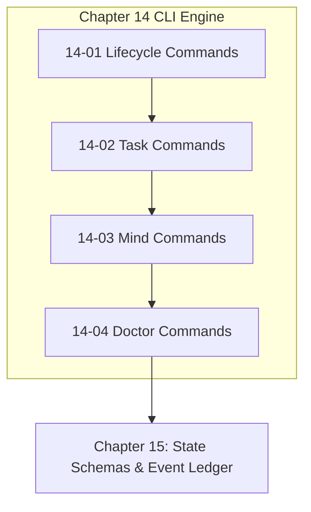

# Chapter 14: Harness CLI & Command Engine

---

[Previous: Chapter 13 Index](../13-policy-rbac-failclosed-engine/index.md) | [Chapter Index](index.md) | [All Chapters Index](../index.md) | [Next: 14-01 Lifecycle & Run Commands](14-01-lifecycle-and-run-commands.md)

---

## 1. Chapter Overview & CLI Architecture

Welcome to Chapter 14 of the OLT Architecture Book. This chapter provides the comprehensive operational reference and theoretical foundations for the **OLT Harness CLI and Command Engine**.

In autonomous multi-agent environments, agents and human operators interact through a unified, script-backed command line interface that provides deterministic receipts, machine-readable output formatting, and fail-closed permission checks. Chapter 14 catalogues the complete 15-domain CLI capability dictionary, detailing command lifecycles, argument contracts, output schemas, and error codes.

```text
+--------------------------------------------------------------------------------------------------+
│                             CHAPTER 14: HARNESS CLI ARCHITECTURE                                 │
+--------------------------------------------------------------------------------------------------+
│                                                                                                  │
│    ┌───────────────────────────┐                    ┌───────────────────────────┐                │
│    │ 14-01: Lifecycle & Run    │                    │ 14-02: Task & Worker      │                │
│    │ Execution Commands        │ ══════════════════►│ Management Commands       │                │
│    └─────────────┬─────────────┘                    └─────────────┬─────────────┘                │
│                  │                                                │                              │
│                  ▼                                                ▼                              │
│    ┌───────────────────────────┐                    ┌───────────────────────────┐                │
│    │ 14-03: Mind Product Owner │                    │ 14-04: Doctor & System    │                │
│    │ & Preplanning Commands    │ ══════════════════►│ Diagnostics Commands      │                │
│    └───────────────────────────┘                    └───────────────────────────┘                │
│                                                                                                  │
+--------------------------------------------------------------------------------------------------+
```

---

## 2. Chapter Table of Contents & Learning Path

```text
+--------------------------------------------------+--------------+--------------------------------+
│ Document                                         │ Classification│ Core Architectural Focus       │
+--------------------------------------------------+--------------+--------------------------------+
│ 14-01 Lifecycle & Run Commands                   │ Reference    │ capsule:init, run:start/status │
│ 14-02 Task & Worker Commands                     │ Reference    │ task:claim, submit, queue:*    │
│ 14-03 Mind & Preplanning Commands                │ Reference    │ mind:pulse, plan:compile       │
│ 14-04 Doctor & Diagnostics Commands              │ Reference    │ doctor:diagnose, heal, verify  │
+--------------------------------------------------+--------------+--------------------------------+
```

### [14-01: Lifecycle & Run Commands](14-01-lifecycle-and-run-commands.md)

Deconstructs core execution lifecycle commands: `capsule:init` (genesis initialization), `run:start` (launching orchestrations), `run:status` (real-time progress querying), `run:complete` (terminal sealing), and `run:abort`.

### [14-02: Task & Worker Commands](14-02-task-and-worker-commands.md)

Details worker-facing command contracts: `task:claim` (atomic lease acquisition), `task:submit` (completion submission), `task:check` (pre-flight AST verification), `queue:list`, `queue:next`, and `queue:wave`.

### [14-03: Mind & Preplanning Commands](14-03-mind-and-preplanning-commands.md)

Catalogues supervisory commands: `mind:pulse` (autonomous discovery and admission cadence), `mind:rotate` (generational compaction), `plan:compile` (Kahn topological sort), and `plan:validate` (100% line coverage check).

### [14-04: Doctor & Diagnostics Commands](14-04-doctor-and-diagnostics-commands.md)

Explains system health commands: `doctor:diagnose` (comprehensive 10-domain diagnostic sweep), `doctor:heal` (torn-tail and crash auto-recovery), and `doctor:certify` (compliance auditing).

---

## 3. Universal CLI Output Envelope

Every CLI command emits a standardized JSON envelope wrapped in deterministic formatting:

```json
{
  "status": "SUCCESS",
  "command": "task:claim",
  "actor": "implementer_core_task-01",
  "timestamp": "2026-08-29T03:19:00.000Z",
  "data": {
    "taskId": "TASK-01",
    "leaseToken": "8f3b2a1c...",
    "expiresAt": "2026-08-29T03:24:00.000Z"
  },
  "error": null
}
```



---

## 4. Summary & Transition

The command contracts catalogued in Chapter 14 form the deterministic operational interface used by human operators, orchestrators, and automated test runners.

Proceed to [14-01: Lifecycle & Run Commands](14-01-lifecycle-and-run-commands.md) or advance directly to [Chapter 15: State Schemas & Event Ledger](../15-state-schemas-and-event-ledger/index.md).

---

[Previous: Chapter 13 Index](../13-policy-rbac-failclosed-engine/index.md) | [Chapter Index](index.md) | [All Chapters Index](../index.md) | [Next: 14-01 Lifecycle & Run Commands](14-01-lifecycle-and-run-commands.md)

---
