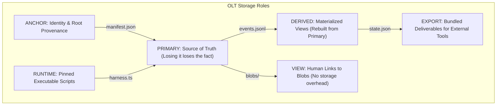
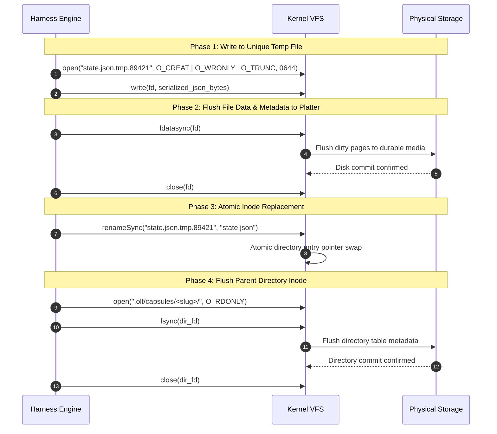

# Capsule Filesystem Layout & Storage Anatomy

> **Navigation**: [Reference Home](../index.md) > [State & Capsule Schemas](./index.md) > Capsule Filesystem Layout  
> **Status**: Authoritative Reference Specification  
> **POSIX Mode Reference**: IEEE Std 1003.1 (Filesystem & Inode Specifications)  
> **Related Code**: [`olt/scripts/src/engine/store/layout/layout.ts`](file:///Users/onurseckinsenoglu/repos/skills/olt/scripts/src/engine/store/layout/layout.ts), [`olt/scripts/src/engine/store/layout/constants.ts`](file:///Users/onurseckinsenoglu/repos/skills/olt/scripts/src/engine/store/layout/constants.ts)

---

[Previous: Reference 07: State & Capsule Schemas Overview](index.md) | [Chapter Index](index.md) | [All Chapters Index](../index.md) | [Next: Manifest & Requirements Schemas](15-02-manifest-and-requirements-schemas.md)
---

## 1. Complete Filesystem Anatomy

An OLT **Run Capsule** is a self-contained, crash-resilient, gitignored directory initialized under `.olt/capsules/<slug>/` (for feature runs) or `.olt/capsules/mind-gen-<G>/` (for generational Mind supervisor runs). It stores the entire immutable cryptographic lineage of a task run, including prompt provenance, append-only event ledgers, materialized snapshots, command execution receipts, inter-agent mailbox buffers, and validation artifacts.

### 1.1 Single-Task Run Capsule Anatomy (`.olt/capsules/<slug>/`)

```text
.olt/
├── capsules/
│   ├── .locks/                                    # [Coordination] POSIX advisory lock hierarchy (0700)
│   │   └── <slug>/
│   │       ├── capsule.lock                       # flock(LOCK_EX) mutual exclusion for state & projection writes
│   │       ├── event.lock                         # flock(LOCK_EX) append-only serialization lock for events.jsonl
│   │       └── .transaction-marker.json           # Write-ahead commit marker for atomic 2-phase recovery (0600)
│   │
│   └── <slug>/                                    # [Capsule Root] Mode 0755, Inode-bound run container
│       ├── README.md                              # Mode 0644 [Derived] Human-readable catalog describing capsule layout
│       ├── manifest.json                          # Mode 0644 [Anchor] Run identity, capture assurance, prompt SHA-256
│       ├── prompt.md                              # Mode 0444 [Primary/Immutable] Exact byte-for-byte user prompt
│       ├── events.jsonl                           # Mode 0644 [Primary/Append-Only] Forward-secure SHA-256 event hash chain
│       ├── state.json                             # Mode 0644 [Derived] Materialized point-in-time state projection
│       ├── requirements.json                      # Mode 0644 [Primary] 100% prompt line disposition compilation & gate mappings
│       ├── index.json                             # Mode 0644 [Derived] O(1) query catalog for rapid status inspection
│       ├── trace.md                               # Mode 0644 [Derived] Numbered chronological step-by-step execution log
│       ├── handoff.md                             # Mode 0644 [Derived] Self-contained resume brief for incoming replacement agents
│       ├── captures.json                          # Mode 0644 [Primary] Maps content-addressed blobs to owning tasks/commands
│       ├── last_pulse.json                        # Mode 0644 [Runtime] Latest pulse status, execution metrics, and wake timers
│       │
│       ├── planning/                              # [Planning Artifacts] Enhanced plan and brainstorming matrices
│       │   ├── brainstorming.json                 # Mode 0444 8-vector Socratic brainstorming matrix expansion
│       │   ├── enhanced-plan.json                 # Mode 0444 Structured plan document (observations, todos, risks, sources)
│       │   └── enhanced-plan.md                   # Mode 0444 Markdown rendering of the enhanced plan
│       │
│       ├── commands/                              # [Execution Receipts] One directory per recorded run:exec command
│       │   └── C-<uuid>/                          # Execution identifier directory (e.g. C-1a2b3c4d-5e6f)
│       │       ├── record.json                    # Mode 0644 Command receipt: argv, cwd, exit code, diffs, hash digests
│       │       ├── stdout.log                     # Mode 0644 Raw stdout stream capture (atomic stream drain)
│       │       └── stderr.log                     # Mode 0644 Raw stderr stream capture (atomic stream drain)
│       │
│       ├── packets/                               # [Role Capability Contracts] Immutable packets granted to worker subagents
│       │   └── <role>-<token-digest-prefix>/      # Role grant contract directory (e.g., implementer-3c9a1e7d)
│       │       ├── packet.md                      # Mode 0444 Markdown role contract handed to worker
│       │       └── metadata.json                  # Mode 0444 Role grant binding, tool allowances, and SHA-256 signatures
│       │
│       ├── mailbox/                               # [Inter-Agent Mailbox Buffers] POSIX flock-synchronized P2P channels
│       │   ├── <agent-id-1>/                      # Recipient mailbox directory (e.g., mailbox/implementer-1/)
│       │   │   ├── in.lock                        # Mode 0600 Inbound mailbox mutex lock
│       │   │   ├── msg-001-f1e2d3c4.json          # Mode 0644 Structured envelope (probe demand, finding, handoff)
│       │   │   └── msg-002-a5b6c7d8.json          # Mode 0644 Structured envelope
│       │   └── <agent-id-2>/                      # Recipient mailbox directory (e.g., mailbox/coordinator-1/)
│       │       ├── in.lock                        # Mode 0600 Inbound mailbox mutex lock
│       │       └── msg-001-9a8b7c6d.json          # Mode 0644 Structured envelope
│       │
│       ├── evidence/                              # [Verification Evidence] Human-readable symbolic links into blobs/
│       │   ├── findings.json                      # Mode 0644 Structured defect findings & adversarial probe demands
│       │   ├── proofs.json                        # Mode 0644 Cryptographic proof bundle submitted for completion
│       │   └── test-results.json                  # Mode 0644 Command test run artifacts
│       │
│       ├── reports/                               # [Validation Reports] Markdown evaluation briefs from critics
│       │   └── report-<critic-id>-<round>.md      # Mode 0444 Immutable adversarial evaluation report
│       │
│       ├── screenshots/                           # [Visual Artifacts] Screenshots and visual verification PNGs
│       │   └── <screenshot-id>.png                # Mode 0644 Binary PNG artifact linked into blobs/
│       │
│       ├── blobs/                                 # [Content-Addressed Storage] Immutable deduplicated byte storage (0444)
│       │   └── <prefix-2>/                        # Two-character SHA-256 hex prefix directory (e.g., blobs/e3/)
│       │       └── <sha256-hash>                  # Full SHA-256 hash filename containing raw payload bytes
│       │
│       ├── quarantine/                            # [Crash Recovery] Damaged or torn-tail event fragments recovered during boot
│       │   └── torn-event-<timestamp>.jsonl       # Mode 0600 Preserved torn write lines stripped during crash recovery
│       │
│       ├── runtime/                               # [Pinned Engine] Pinned copy of harness scripts at plan:init time
│       │   ├── harness.ts                         # Mode 0444 Pinned CLI entrypoint
│       │   └── src/                               # Mode 0444 Pinned runtime modules ensuring immutable behavior
│       │
│       └── summary/                               # [Export Bundles] run:complete / summary:export deliverables
│           ├── graph.json                         # Mode 0644 Final DAG node/edge topology & Work/Span metrics
│           ├── summary.md                         # Mode 0644 Markdown final executive summary
│           └── timeline.json                      # Mode 0644 Detailed timestamped step timeline
```

---

### 1.2 Generational Mind Capsule Anatomy (`.olt/capsules/mind-gen-<G>/`)

When OLT operates in **Mind Mode** (Tier 0 infinite autonomous preplanning supervisor), execution state is partitioned into generational capsules (`mind-gen-1`, `mind-gen-2`, etc.).

```text
.olt/
└── capsules/
    ├── .locks/
    │   └── mind-gen-1/
    │       ├── capsule.lock                       # flock(LOCK_EX) protecting generational pulse transactions
    │       ├── event.lock                         # flock(LOCK_EX) serializing Mind discovery & admission events
    │       └── pulse.lock                         # flock(LOCK_EX) held by pulse.sh during active pulse execution
    │
    └── mind-gen-1/                                # Mode 0755 Generational Mind container
        ├── manifest.json                          # Mode 0644 Anchor binding Mind charter, generation counter, and repo roots
        ├── charter.md                             # Mode 0444 [Immutable] Generational charter guiding goal discovery
        ├── events.jsonl                           # Mode 0644 [Append-Only] Continuous pulse & admission event stream
        ├── state.json                             # Mode 0644 [Derived] Materialized Mind state (candidate pool, active waves)
        ├── last_pulse.json                        # Mode 0644 [Runtime] Latest pulse status, execution metrics, and wake timers
        ├── index.json                             # Mode 0644 [Derived] Fast lookup catalog of open proposals & admitted tasks
        ├── trace.md                               # Mode 0644 [Derived] Chronological pulse execution history
        ├── candidates/                            # [Candidate Pool] Discovered strategic opportunities before admission
        │   ├── CAND-001-typecheck.json            # Mode 0644 Proposed improvement candidate
        │   └── CAND-002-linter-rot.json           # Mode 0644 Proposed improvement candidate
        ├── rounds/                                # [Admission Rounds] Admitted execution waves
        │   └── round-001/                         # Admission round directory
        │       ├── wave-spec.json                 # Mode 0644 Topological wave schedule and Brent telemetry
        │       └── admitted-tasks.json            # Mode 0644 Task definitions spawned from candidate pool
        ├── blobs/                                 # Mode 0444 Content-addressed storage for telemetry dumps
        └── quarantine/                            # Mode 0600 Crash recovery quarantine for damaged pulse events
```

---

## 2. File Roles, Ownership & Classification

Every filesystem entry in an OLT capsule is assigned a formal **Layout Role** that dictates its lifecycle, mutability, and recovery behavior:



### Layout Role Taxonomy Table

| Role          | Meaning & Lifecycle Contract                                                                           | Recovery Rule on Loss                                                                | Primary Examples                                                                                               |
| :------------ | :----------------------------------------------------------------------------------------------------- | :----------------------------------------------------------------------------------- | :------------------------------------------------------------------------------------------------------------- |
| **`ANCHOR`**  | Binds the cryptographic identity, prompt hash, and container UUID. Written once during initialization. | **Unrecoverable**. If deleted, capsule identity is permanently broken.               | `manifest.json`                                                                                                |
| **`PRIMARY`** | Canonical source of truth. Contains unique factual records that exist nowhere else.                    | **Unrecoverable**. Losing a primary file permanently destroys that fact.             | `prompt.md`, `events.jsonl`, `requirements.json`, `commands/`, `packets/`, `blobs/`, `reports/`, `quarantine/` |
| **`DERIVED`** | Materialized point-in-time views calculated deterministically from `PRIMARY` entries. Safe to delete.  | **100% Rebuildable**. Harness regenerates derived files by replaying `events.jsonl`. | `state.json`, `index.json`, `trace.md`, `handoff.md`, `README.md`, `brainstorming.json`                        |
| **`VIEW`**    | Human-readable alias pointers linking into `blobs/`. Holds zero unique bytes of its own.               | **Rebuildable**. Relinked from `captures.json` and `blobs/`.                         | `evidence/`, `screenshots/`                                                                                    |
| **`EXPORT`**  | Self-contained final deliverables formatted for visualization tools and supervisors.                   | **Regenerable**. Exported on `run:complete` or `summary:export`.                     | `summary/graph.json`, `summary/summary.md`, `summary/timeline.json`                                            |
| **`RUNTIME`** | Pinned copies of executable harness scripts and pulse execution timestamps.                            | **Re-pinnable**. Copied from repo root on initialization.                            | `runtime/harness.ts`, `last_pulse.json`                                                                        |

---

## 3. POSIX Permissions & Concurrency Matrix

OLT enforces strict POSIX file permission octal masks to prevent accidental overwrites, unauthorized subagent file modifications, and lock collisions:

| Filesystem Path Pattern         | Octal Mode | Read / Write Policy       | Concurrency Protection      | Invariant Description                                |
| :------------------------------ | :--------: | :------------------------ | :-------------------------- | :--------------------------------------------------- |
| `.olt/capsules/<slug>/`         |   `0755`   | Read/Write (Owner)        | Directory inode lock        | Root container for single-task run.                  |
| `.olt/capsules/.locks/<slug>/`  |   `0700`   | Read/Write (Owner Only)   | Directory inode lock        | Lock boundary isolated from capsule contents.        |
| `.locks/<slug>/capsule.lock`    |   `0600`   | Read/Write (Owner Only)   | `flock(LOCK_EX \| LOCK_NB)` | Advisory lock protecting `state.json` transactions.  |
| `.locks/<slug>/event.lock`      |   `0600`   | Read/Write (Owner Only)   | `flock(LOCK_EX)`            | Advisory lock serializing appends to `events.jsonl`. |
| `prompt.md`                     |   `0444`   | **Read-Only (Immutable)** | Write-once on `init`        | Byte-for-byte user prompt. Modification prohibited.  |
| `manifest.json`                 |   `0644`   | Write-once on `init`      | Atomic write + fsync        | Run metadata and prompt SHA-256 binding.             |
| `events.jsonl`                  |   `0644`   | **Append-Only**           | Protected by `event.lock`   | Cryptographically chained transaction log.           |
| `state.json`                    |   `0644`   | Materialized Projection   | Protected by `capsule.lock` | Rebuilt atomically via temp-file replacement.        |
| `requirements.json`             |   `0644`   | Write-once on `compile`   | Atomic write + fsync        | Compiled requirement obligations and line maps.      |
| `planning/*`                    |   `0444`   | **Read-Only (Immutable)** | Atomic write + `chmod 0444` | Enhanced plan and brainstorming matrices.            |
| `commands/C-*/record.json`      |   `0644`   | Write-once per execution  | Command process lock        | Sealed execution receipt and git diff metrics.       |
| `commands/C-*/std{out,err}.log` |   `0644`   | Stream Capture            | Child process pipe drain    | Unmodified command stream captures.                  |
| `packets/*`                     |   `0444`   | **Read-Only (Immutable)** | Token digest binding        | Role capability contracts handed to subagents.       |
| `mailbox/<agent>/in.lock`       |   `0600`   | Read/Write (Owner Only)   | `flock(LOCK_EX)`            | Recipient mailbox inbound queue mutex.               |
| `mailbox/<agent>/*.json`        |   `0644`   | Write-once per message    | `in.lock`                   | Structured P2P inter-agent envelopes.                |
| `blobs/<aa>/<hash>`             |   `0444`   | **Read-Only (Immutable)** | Content-addressed SHA-256   | Deduplicated binary and text object storage.         |
| `quarantine/*.jsonl`            |   `0600`   | Append-Only (Owner Only)  | Exclusive engine lock       | Corrupted or torn tail event fragments.              |

---

## 4. Atomic Temp Files & Durability Cycles

To guarantee **Zero State Corruption** across power outages, host crashes, or process terminations (`SIGKILL`), all file mutations in OLT adhere to a strict 4-phase **Atomic Temp-Fsync-Rename** protocol.



### 4.1 Temp File Naming Rules

1. **PID & Nonce Suffix**: Every temporary file created during atomic projection writes uses the pattern `<filename>.tmp.<pid>.<random_hex>` (e.g. `state.json.tmp.89421.a7f1`).
2. **Same-Filesystem Guarantee**: Temporary files are always created in the exact same directory as their target destination (`.olt/capsules/<slug>/`). This guarantees that `renameSync()` executes as an atomic single-inode pointer swap (`rename(2)`) rather than an expensive and non-atomic cross-device copy.
3. **Orphan Cleanup on Boot**: During harness initialization (`run:status`, `doctor:capsule`, or `task:claim`), the engine scans for dangling `*.tmp.*` files older than $60\text{ seconds}$ and unlinks them.

---

## 5. Content-Addressed Storage (`blobs/`) & Views (`evidence/`)

The OLT storage engine eliminates redundant byte storage through Content-Addressed Storage (CAS).

```text
               CONTENT-ADDRESSED STORAGE ARCHITECTURE

  [Command stdout: 128KB]               [Adversarial Validator Report: 45KB]
           │                                             │
           ▼                                             ▼
     SHA-256 Hash                                  SHA-256 Hash
  e3b0c44298fc1c14...                           8d3f1a2e4b6c8d0e...
           │                                             │
           ▼                                             ▼
  blobs/e3/e3b0c44298fc1c14...                  blobs/8d/8d3f1a2e4b6c8d0e...
  (Mode 0444, Immutable)                        (Mode 0444, Immutable)
           ▲                                             ▲
           │ Relative Link / Pointer                     │ Relative Link / Pointer
  evidence/test-results.json                    evidence/findings.json
```

### CAS Storage Invariants

1. **Fan-Out Prefix Directory Structure**: Blobs are partitioned using a 2-character hexadecimal prefix based on the first two characters of their SHA-256 digest (`blobs/<prefix-2>/<sha256>`). This prevents filesystem performance degradation on directories containing thousands of files.
2. **Immutability Mode `0444`**: Once written, blob files are immediately marked read-only (`chmod 0444`). The harness never modifies an existing blob.
3. **Deduplication Ledger (`captures.json`)**: Every stored blob is registered in `captures.json`, recording its SHA-256 digest, byte length, creation timestamp, and the task or command receipt that created it.

---

## 6. Quarantine Mechanics & Recovery Storage

If a process crash or kernel panic occurs during an active append to `events.jsonl`, the file may be left with a **torn final line** (incomplete JSON fragment or partially written UTF-8 bytes).

### Recovery Procedure

1. **Detection**: On capsule load, `event-stream.ts` scans `events.jsonl` from line 0. If the final line fails JSON parsing or hash verification, it is flagged as a `torn_tail`.
2. **Isolation**: The unparsed byte fragment is excised from `events.jsonl` and preserved in `.olt/capsules/<slug>/quarantine/torn-event-<timestamp>.jsonl` (Mode `0600`).
3. **Canonical Truncation**: `events.jsonl` is truncated to the byte offset of the last known valid event line.
4. **Projection Refresh**: The materialized `state.json` is re-projected up to the last verified sequence number, restoring the capsule to a 100% consistent state.

---

[Previous: Reference 07: State & Capsule Schemas Overview](index.md) | [Chapter Index](index.md) | [All Chapters Index](../index.md) | [Next: Manifest & Requirements Schemas](15-02-manifest-and-requirements-schemas.md)
---
