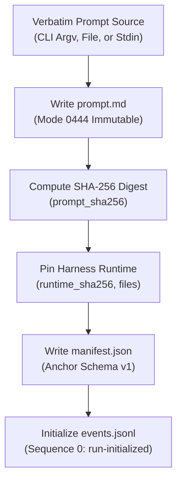
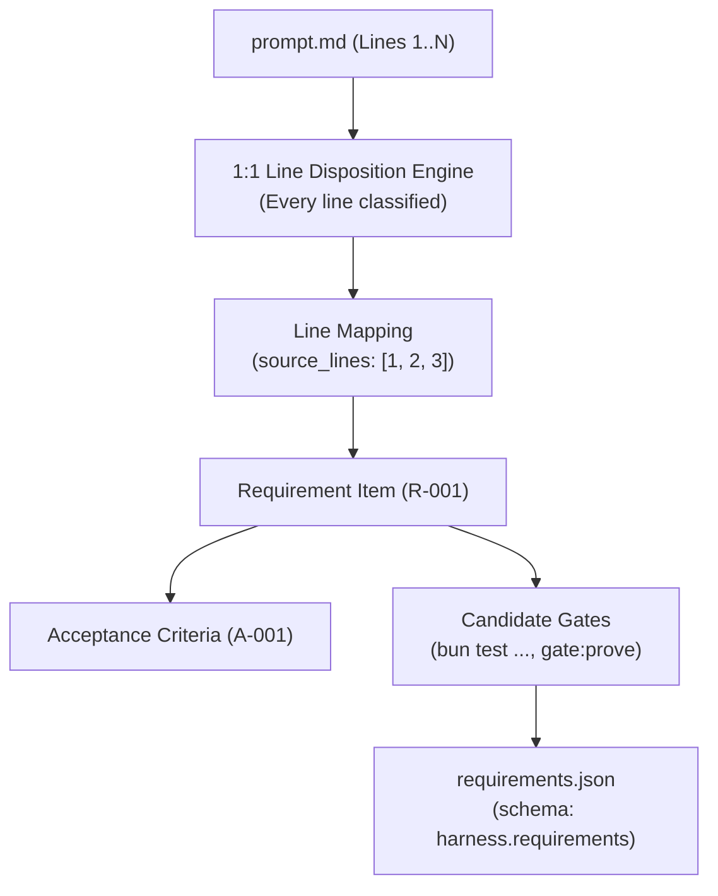

# Manifest & Requirements Schemas Reference Manual

> **Navigation**: [Reference Home](../index.md) > [State & Capsule Schemas](./index.md) > Manifest & Requirements Schemas  
> **Status**: Authoritative Reference Specification  
> **Draft Version**: JSON Schema Draft 2020-12  
> **Related Code**: [`olt/scripts/src/core/contracts/agents/capsule.ts`](file:///Users/onurseckinsenoglu/repos/skills/olt/scripts/src/core/contracts/agents/capsule.ts#L8-L26), [`olt/scripts/src/requirements/enhanced-plan.ts`](file:///Users/onurseckinsenoglu/repos/skills/olt/scripts/src/requirements/enhanced-plan.ts)

---

[⏮️ Previous: Capsule Filesystem Layout](15-01-capsule-filesystem-layout.md) | [📂 Chapter Index](index.md) | [📚 All Chapters Index](../index.md) | [⏭️ Next: Events JSONL & Merkle Schema](15-03-events-jsonl-and-merkle-schema.md)
---

## 📑 1. Capsule Manifest Schema (`manifest.json`)

The **Capsule Manifest** is the root anchor artifact initialized at `.olt/capsules/<slug>/manifest.json` during `plan:init` or `orchestrate`. It immutably binds the exact byte-for-byte user prompt, execution container identity, capture assurance level, and pinned runtime engine versions to the capsule.



---

### 1.1 Draft 2020-12 JSON Schema: `harness.manifest`

```json
{
  "$schema": "https://json-schema.org/draft/2020-12/schema",
  "$id": "https://schemas.olt.dev/v1/harness.manifest.json",
  "title": "HarnessManifest",
  "description": "Anchor contract binding prompt provenance, container UUID, and pinned runtime metadata.",
  "type": "object",
  "required": [
    "schema",
    "version",
    "run_id",
    "capsule_id",
    "mode",
    "prompt_sha256",
    "prompt_bytes",
    "capture_mode",
    "source_verified",
    "assurance",
    "created_at",
    "bun_version",
    "runtime_version"
  ],
  "additionalProperties": false,
  "properties": {
    "schema": {
      "type": "string",
      "const": "harness.manifest",
      "description": "Fixed schema discriminator constant."
    },
    "version": {
      "type": "integer",
      "const": 1,
      "description": "Manifest format major version."
    },
    "run_id": {
      "type": "string",
      "pattern": "^[A-Za-z0-9._-]{1,128}$",
      "description": "Canonical run identifier slug."
    },
    "capsule_id": {
      "type": "string",
      "pattern": "^[0-9a-f]{8}-[0-9a-f]{4}-[0-9a-f]{4}-[0-9a-f]{4}-[0-9a-f]{12}$|^[0-9a-f]{32}$",
      "description": "Cryptographic container UUID (v4 format or 32-char hex)."
    },
    "mode": {
      "type": "string",
      "enum": ["feature", "mind"],
      "description": "Capsule execution paradigm mode."
    },
    "prompt_sha256": {
      "type": "string",
      "pattern": "^[0-9a-f]{64}$",
      "description": "Canonical lowercase SHA-256 hexadecimal digest of prompt.md."
    },
    "prompt_bytes": {
      "type": "integer",
      "minimum": 1,
      "description": "Exact byte count of verbatim prompt.md."
    },
    "capture_mode": {
      "type": "string",
      "enum": ["file", "stdin", "argv", "verbatim_context_copy"],
      "description": "Transport mechanism used to ingest prompt bytes."
    },
    "source_verified": {
      "type": "boolean",
      "description": "True if prompt was attested by an authenticated caller."
    },
    "assurance": {
      "type": "string",
      "enum": ["source-verified", "recorded-unverified"],
      "description": "Cryptographic assurance level of prompt ingestion."
    },
    "created_at": {
      "type": "string",
      "format": "date-time",
      "description": "ISO-8601 UTC creation timestamp."
    },
    "runtime_sha256": {
      "type": "string",
      "pattern": "^[0-9a-f]{64}$",
      "description": "Merkle tree SHA-256 digest of pinned runtime/ directory."
    },
    "runtime_files": {
      "type": "integer",
      "minimum": 0,
      "description": "Number of pinned harness source files in runtime/."
    },
    "runtime_entrypoint": {
      "type": "string",
      "description": "Relative entrypoint path for execution (e.g. runtime/harness.ts)."
    },
    "bun_version": {
      "type": "string",
      "description": "Semantic version of host Bun runtime at initialization."
    },
    "bun_compatibility": {
      "type": "string",
      "enum": ["same-major-not-older"],
      "description": "Runtime compatibility contract rule."
    },
    "runtime_version": {
      "type": "string",
      "description": "Semantic version of OLT harness engine."
    }
  }
}
```

---

### 1.2 Field Specification Table

| Field Name           | Type      | Nullable | Validation Rule / Regex   | Description                                                             |
| :------------------- | :-------- | :------: | :------------------------ | :---------------------------------------------------------------------- |
| `schema`             | `string`  |    No    | `"harness.manifest"`      | Discriminator constant identifying manifest schema.                     |
| `version`            | `integer` |    No    | `1`                       | Schema format major version.                                            |
| `run_id`             | `string`  |    No    | `^[A-Za-z0-9._-]{1,128}$` | Human-readable task slug identifier.                                    |
| `capsule_id`         | `string`  |    No    | UUID v4 or 32-char hex    | Unique random container ID distinguishing runs with identical slugs.    |
| `mode`               | `string`  |    No    | `"feature" \| "mind"`     | Execution mode: single-task feature or infinite Mind supervisor.        |
| `prompt_sha256`      | `string`  |    No    | `^[0-9a-f]{64}$`          | Cryptographic SHA-256 hash of `prompt.md`.                              |
| `prompt_bytes`       | `integer` |    No    | $\ge 1$                   | Exact byte size of `prompt.md`.                                         |
| `capture_mode`       | `string`  |    No    | Enum (4 values)           | Method of ingestion (`argv`, `stdin`, `file`, `verbatim_context_copy`). |
| `source_verified`    | `boolean` |    No    | `true \| false`           | Attestation that prompt bytes originated from trusted human/host.       |
| `assurance`          | `string`  |    No    | Enum (2 values)           | `source-verified` (trusted) or `recorded-unverified` (unauthenticated). |
| `created_at`         | `string`  |    No    | ISO-8601 UTC              | Exact time of capsule initialization.                                   |
| `runtime_sha256`     | `string`  |   Yes    | `^[0-9a-f]{64}$`          | Cryptographic hash of pinned harness runtime directory.                 |
| `runtime_files`      | `integer` |   Yes    | $\ge 0$                   | Total number of harness runtime files pinned into `runtime/`.           |
| `runtime_entrypoint` | `string`  |   Yes    | Relative path             | Entrypoint script for pinned execution (`runtime/harness.ts`).          |
| `bun_version`        | `string`  |    No    | SemVer string             | Host Bun runtime version executing `plan:init`.                         |
| `bun_compatibility`  | `string`  |   Yes    | `"same-major-not-older"`  | Forward-compatibility contract specification.                           |
| `runtime_version`    | `string`  |    No    | SemVer string             | OLT engine semantic version release.                                    |

---

### 1.3 Validator-Green Manifest Exemplar

```json
{
  "schema": "harness.manifest",
  "version": 1,
  "run_id": "35-comprehensive-olt-documentation-overhaul",
  "capsule_id": "c7f91a2b-38d4-4e91-8921-bc74e92a104f",
  "mode": "feature",
  "prompt_sha256": "e3b0c44298fc1c149afbf4c8996fb92427ae41e4649b934ca495991b7852b855",
  "prompt_bytes": 1024,
  "capture_mode": "argv",
  "source_verified": true,
  "assurance": "source-verified",
  "created_at": "2026-08-29T02:00:00.000Z",
  "runtime_sha256": "9f86d081884c7d659a2feaa0c55ad015a3bf4f1b2b0b822cd15d6c15b0f00a08",
  "runtime_files": 128,
  "runtime_entrypoint": "runtime/harness.ts",
  "bun_version": "1.2.4",
  "bun_compatibility": "same-major-not-older",
  "runtime_version": "1.0.0"
}
```

---

## 📋 2. Requirements Specification Schema (`requirements.json`)

`requirements.json` compiled during `plan:compile` binds the exact lines of `prompt.md` to verifiable, atomic technical obligations. Every requirement must have falsifiable acceptance criteria and candidate verification gates.



---

### 2.1 100% Prompt Line Coverage Rule

OLT enforces the **Zero-Unaccounted-Lines Axiom**: Every line in `prompt.md` (from line 1 to EOF) must be explicitly mapped to an item in the `dispositions` array.

| Line Kind         | Description                                            | Handling Requirement                                                       |
| :---------------- | :----------------------------------------------------- | :------------------------------------------------------------------------- |
| **`requirement`** | Actionable technical instruction or feature demand.    | Must bind to a valid `requirement_id` defined in the `requirements` array. |
| **`constraint`**  | Boundary condition, file limit, or disallowed pattern. | Must bind to a `requirement_id` enforcing the constraint.                  |
| **`context`**     | Background information or problem explanation.         | Explanatory note; no direct task claim required.                           |
| **`non_goal`**    | Explicitly out-of-scope requirement.                   | Marked non-actionable; satisfies boundary checks.                          |
| **`metadata`**    | Headers, timestamps, markdown formatting fences.       | Structural scaffolding.                                                    |
| **`blank`**       | Empty lines or whitespace.                             | Structural padding.                                                        |

---

### 2.2 Draft 2020-12 JSON Schema: `harness.requirements`

```json
{
  "$schema": "https://json-schema.org/draft/2020-12/schema",
  "$id": "https://schemas.olt.dev/v1/harness.requirements.json",
  "title": "HarnessRequirements",
  "description": "Formal technical requirements compilation with 100% prompt line coverage and gate bindings.",
  "type": "object",
  "required": ["schema", "version", "prompt_sha256", "requirements", "dispositions"],
  "additionalProperties": false,
  "properties": {
    "schema": {
      "type": "string",
      "const": "harness.requirements",
      "description": "Fixed schema discriminator constant."
    },
    "version": {
      "type": "integer",
      "const": 1,
      "description": "Requirements format major version."
    },
    "prompt_sha256": {
      "type": "string",
      "pattern": "^[0-9a-f]{64}$",
      "description": "SHA-256 digest of bound prompt.md matching manifest.json."
    },
    "requirements": {
      "type": "array",
      "description": "Exhaustive array of actionable technical requirements.",
      "items": {
        "type": "object",
        "required": [
          "id",
          "source_lines",
          "source_excerpt",
          "instruction",
          "implementation",
          "subsystem",
          "acceptance",
          "candidate_gates",
          "priority",
          "risk",
          "ambiguity",
          "dependencies",
          "disposition",
          "status"
        ],
        "additionalProperties": false,
        "properties": {
          "id": {
            "type": "string",
            "pattern": "^R-[A-Za-z0-9_-]+$",
            "description": "Unique requirement identifier (e.g. R-001, R-DOC-004)."
          },
          "source_lines": {
            "type": "array",
            "items": { "type": "integer", "minimum": 1 },
            "minItems": 1,
            "description": "1-indexed line numbers in prompt.md forming this requirement."
          },
          "source_excerpt": {
            "type": "string",
            "description": "Verbatim quote or excerpt from prompt.md."
          },
          "instruction": {
            "type": "string",
            "description": "Imperative instruction summarizing the requirement."
          },
          "implementation": {
            "type": "string",
            "description": "Technical strategy to fulfill the instruction."
          },
          "subsystem": {
            "type": "string",
            "description": "Target module or directory path."
          },
          "acceptance": {
            "type": "array",
            "items": {
              "type": "object",
              "required": ["id", "criterion", "evidence"],
              "additionalProperties": false,
              "properties": {
                "id": { "type": "string" },
                "criterion": { "type": "string" },
                "evidence": { "type": "array", "items": { "type": "string" } }
              }
            }
          },
          "candidate_gates": {
            "type": "array",
            "items": {
              "type": "object",
              "required": ["argv", "cwd"],
              "additionalProperties": false,
              "properties": {
                "argv": { "type": "array", "items": { "type": "string" }, "minItems": 1 },
                "cwd": { "type": "string" }
              }
            }
          },
          "priority": { "type": "integer", "default": 100 },
          "risk": { "type": "string", "enum": ["low", "medium", "high", "critical"] },
          "ambiguity": { "type": "array", "items": { "type": "string" } },
          "dependencies": { "type": "array", "items": { "type": "string" } },
          "disposition": {
            "type": "string",
            "enum": ["actionable", "needs_authority", "out_of_scope"]
          },
          "status": { "type": "string", "enum": ["planned", "satisfied"] }
        }
      }
    },
    "dispositions": {
      "type": "array",
      "description": "1:1 line classification for every line in prompt.md.",
      "items": {
        "type": "object",
        "required": ["line", "kind"],
        "additionalProperties": false,
        "properties": {
          "line": { "type": "integer", "minimum": 1 },
          "kind": {
            "type": "string",
            "enum": ["requirement", "constraint", "context", "non_goal", "metadata", "blank"]
          },
          "requirement_id": { "type": "string" }
        }
      }
    }
  }
}
```

---

### 2.3 Validator-Green Requirements Exemplar

```json
{
  "schema": "harness.requirements",
  "version": 1,
  "prompt_sha256": "e3b0c44298fc1c149afbf4c8996fb92427ae41e4649b934ca495991b7852b855",
  "requirements": [
    {
      "id": "R-DOC-004",
      "source_lines": [1, 2, 3],
      "source_excerpt": "Author/expand the comprehensive reference document docs/olt/reference/state-schemas.md.",
      "instruction": "Author complete Diátaxis reference specifications for all OLT state schemas.",
      "implementation": "Produce exhaustive reference documentation for capsule layout, manifest, events, state, requirements, receipts, mailbox, findings, and proofs.",
      "subsystem": "docs/olt/reference",
      "acceptance": [
        {
          "id": "A-001",
          "criterion": "All reference files are written, typechecked, and verified against TypeScript contracts.",
          "evidence": ["Passing task:check incremental audit command receipt"]
        }
      ],
      "candidate_gates": [
        {
          "argv": ["bun", "olt/scripts/harness.ts", "task:check", "--task", "task-docs-reference"],
          "cwd": "."
        }
      ],
      "priority": 100,
      "risk": "medium",
      "ambiguity": [],
      "dependencies": [],
      "disposition": "actionable",
      "status": "planned"
    }
  ],
  "dispositions": [
    { "line": 1, "kind": "requirement", "requirement_id": "R-DOC-004" },
    { "line": 2, "kind": "requirement", "requirement_id": "R-DOC-004" },
    { "line": 3, "kind": "requirement", "requirement_id": "R-DOC-004" }
  ]
}
```

---

## 🏛️ 3. Preplanning Artifact Schemas

Preplanning artifacts are created during `plan:brainstorm` and `plan:enhance` before graph compilation.

### 3.1 Socratic Brainstorming Schema (`brainstorming.json`)

The **8-Vector Socratic Brainstorming Engine** evaluates every prompt requirement across eight orthogonal failure domains:

```text
┌───────────────────────┬────────────────────────────────────────────────────────────────────────┐
│ Vector ID             │ Core Analytical Focus                                                  │
├───────────────────────┼────────────────────────────────────────────────────────────────────────┤
│ EMPTY_PAYLOAD         │ Null checks, empty strings, missing fields, malformed JSON/YAML payloads│
│ TIMEOUT_STAGNATION    │ Deadlocks, unbounded waits, watchdog timers, graceful process aborts  │
│ CONCURRENCY_MUTATION  │ Atomic operations, POSIX file locking, state isolation, race conditions│
│ HOST_BOUNDARY         │ Host tool adapter boundaries, CLI flag parsing, path normalization     │
│ STATE_TRANSITION      │ Lifecycle prerequisites, invalid state transitions, crash recovery     │
│ TYPE_INVARIANT        │ Zero TypeScript any, zero suppressions, runtime schema guards          │
│ CLI_TELEMETRY         │ Structured error logging, human-readable diagnostics, POSIX exit codes │
│ ADVERSARIAL_GATE      │ Negative counterfactual tests, boundary detection, false positive tests│
└───────────────────────┴────────────────────────────────────────────────────────────────────────┘
```

#### Exemplar: `planning/brainstorming.json`

```json
{
  "schema": "harness.brainstorming",
  "version": 1,
  "prompt": "Author comprehensive Diátaxis state-schemas reference manual.",
  "roundsExecuted": 3,
  "vectors": [
    {
      "id": "EMPTY_PAYLOAD",
      "name": "Empty / Whitespace / Malformed Payload Handling",
      "description": "Handling empty payloads, whitespace-only input, missing files, or syntactically malformed structures",
      "focus": "Null checks, empty strings, missing properties, malformed JSON/YAML payloads"
    },
    {
      "id": "CONCURRENCY_MUTATION",
      "name": "Concurrent File / Lock / Memory Mutation Races",
      "description": "Handling race conditions, parallel file access, shared memory mutations, and lock contention",
      "focus": "Atomic operations, file locking, state isolation, transactional edits, collision avoidance"
    }
  ],
  "expandedItems": [
    {
      "id": "item-1",
      "vectorId": "CONCURRENCY_MUTATION",
      "vectorName": "Concurrent File / Lock / Memory Mutation Races",
      "round": 1,
      "sourceRequirement": "Concurrent subagents mutating state.json simultaneously",
      "risk": "Torn writes or lost update race conditions on state snapshot",
      "mitigation": "Enforce POSIX flock advisory locks on .locks/capsule.lock during transaction commit",
      "targetInvariant": "flock(LOCK_EX) must be acquired before writing state.json"
    }
  ],
  "totalExpandedItems": 1,
  "createdAt": "2026-08-29T02:01:00.000Z"
}
```

---

### 3.2 Enhanced Plan Schema (`enhanced-plan.json`)

Stores structured observations, todos, identified risks, and discovered source references compiled by the planner agent.

#### Exemplar: `planning/enhanced-plan.json`

```json
{
  "schema": "harness.enhanced-plan",
  "version": 1,
  "run_id": "35-comprehensive-olt-documentation-overhaul",
  "prompt_sha256": "e3b0c44298fc1c149afbf4c8996fb92427ae41e4649b934ca495991b7852b855",
  "derived_from": "prompt.md",
  "authoritative": false,
  "recorded_at": "2026-08-29T02:02:00.000Z",
  "actor": "planner",
  "summary": {
    "value": "Author comprehensive Diátaxis reference for OLT state schemas and capsule layout.",
    "evidence_class": "agent_reported"
  },
  "observations": [
    {
      "value": "Existing state-schemas.md covers basic fields but lacks mailbox, command receipt, and Mind schema specifications.",
      "evidence_class": "agent_reported"
    }
  ],
  "todos": [
    {
      "id": "todo-1",
      "text": "Fully document capsule filesystem ASCII layout with mode permissions.",
      "evidence_class": "agent_reported"
    },
    {
      "id": "todo-2",
      "text": "Provide validator-green JSON exemplars for all 9 schemas.",
      "evidence_class": "agent_reported"
    }
  ],
  "risks": [
    {
      "value": "Schema drift between TypeScript contract interfaces and markdown documentation tables.",
      "evidence_class": "agent_reported"
    }
  ],
  "open_questions": [],
  "sources": [
    {
      "value": "olt/scripts/src/core/contracts/agents/capsule.ts",
      "evidence_class": "agent_reported"
    },
    {
      "value": "olt/scripts/src/workflow/types.ts",
      "evidence_class": "agent_reported"
    }
  ]
}
```

---

## 🔐 4. RBAC Authority & Mutation Matrix

| File Target         | Creating Role                         | Authorized Readers     | Modifying Role                  | Mutation Policy                                                   |
| :------------------ | :------------------------------------ | :--------------------- | :------------------------------ | :---------------------------------------------------------------- |
| `manifest.json`     | Orchestrator (Tier 1) / Mind (Tier 0) | All Agents & Verifiers | **None**                        | **Write-Once on Init**. Never mutated after creation.             |
| `prompt.md`         | Host Runtime / Orchestrator           | All Agents & Verifiers | **None**                        | **Immutable Byte-Exact (0444)**.                                  |
| `requirements.json` | Planner (Tier 2) / Orchestrator       | All Agents & Verifiers | Planner (during `plan:enhance`) | Replaced atomically before graph freeze; locked during execution. |
| `planning/*`        | Planner Agent                         | All Agents             | Planner                         | Written once during planning phase (`chmod 0444`).                |

---

[⏮️ Previous: Capsule Filesystem Layout](15-01-capsule-filesystem-layout.md) | [📂 Chapter Index](index.md) | [📚 All Chapters Index](../index.md) | [⏭️ Next: Events JSONL & Merkle Schema](15-03-events-jsonl-and-merkle-schema.md)
---
