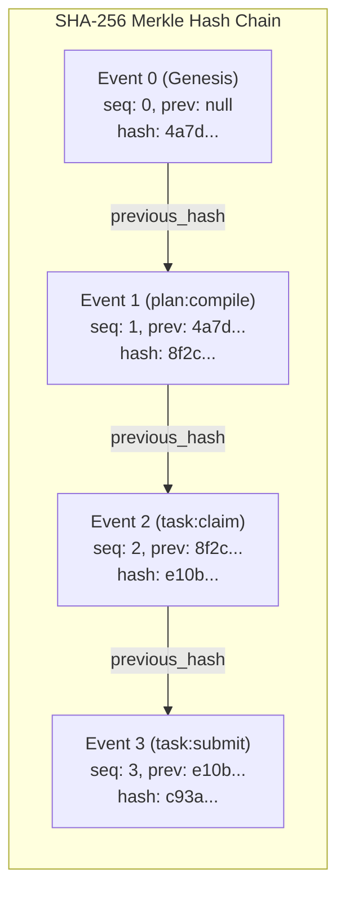
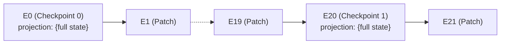

# Events JSONL & Cryptographic Merkle Schema

> **Navigation**: [Reference Home](../index.md) > [State & Capsule Schemas](./index.md) > Events JSONL & Merkle Schema  
> **Status**: Authoritative Reference Specification  
> **Draft Version**: JSON Schema Draft 2020-12 | **Serialization**: RFC 8785 Canonical JSON  
> **Related Code**: [`olt/scripts/src/engine/store/events/event-append.ts`](file:///Users/onurseckinsenoglu/repos/skills/olt/scripts/src/engine/store/events/event-append.ts), [`olt/scripts/src/engine/store/events/event-validation.ts`](file:///Users/onurseckinsenoglu/repos/skills/olt/scripts/src/engine/store/events/event-validation.ts)

---

[Previous: Manifest & Requirements Schemas](15-02-manifest-and-requirements-schemas.md) | [Chapter Index](index.md) | [All Chapters Index](../index.md) | [Next: State JSON & Mailbox Schemas](15-04-state-json-and-mailbox-schemas.md)
---

## 1. The Append-Only Merkle Ledger (`events.jsonl`)

The **OLT Event Log** (`.olt/capsules/<slug>/events.jsonl`) is the canonical, forward-secure, append-only source of truth for an execution capsule. Every state transition, task lease, heartbeat, command execution, and gate proof is appended as a discrete line formatted as a cryptographic Merkle event record.



---

## 2. Mathematical Chaining & SHA-256 Computation Rules

Every event record $E_n$ is cryptographically bound to its immediate predecessor $E_{n-1}$ via SHA-256 hashing.

### 2.1 Hash Chain Equations

For sequence $n = 0$ (Genesis Event):
$$E_0.\text{previous\_hash} = \text{null}$$
$$E_0.\text{hash} = \text{SHA-256}\Big(\text{canonical\_json}\big(E_0 \setminus \{\text{hash}\}\big)\Big)$$

For sequence $n \ge 1$:
$$E_n.\text{previous\_hash} = E_{n-1}.\text{hash}$$
$$E_n.\text{hash} = \text{SHA-256}\Big(\text{canonical\_json}\big(E_n \setminus \{\text{hash}\}\big)\Big)$$

### 2.2 RFC 8785 Canonical JSON Serialization Rules

To ensure byte-for-byte deterministic hash computation across different operating systems, Node/Bun engine versions, and architectures, OLT normalizes JSON payloads prior to hashing:

1. **Lexicographical Key Sorting**: All object keys are sorted in ascending ASCII lexicographical order recursively.
2. **Whitespace Stripping**: Zero whitespace is permitted outside string literals (no spaces after colons or commas).
3. **Floating-Point Normalization**: Numbers are formatted in standard IEEE 754 representation (e.g. integer `1` never serializes as `1.0`).
4. **UTF-8 Byte Encoding**: String values are encoded strictly as canonical UTF-8 bytes.

```typescript
// Canonical JSON Hashing Algorithm (olt/scripts/src/core/json.ts)
export function canonicalJsonBytes(value: JsonValue): Uint8Array {
  const normalized = normalizeJson(value); // Recursive key sorting
  const jsonString = JSON.stringify(normalized);
  return new TextEncoder().encode(jsonString);
}

export function computeEventHash(eventWithoutHash: Omit<HarnessEvent, "hash">): string {
  const bytes = canonicalJsonBytes(eventWithoutHash);
  return sha256Bytes(bytes); // Lowercase 64-character hex string
}
```

---

## 3. Event Record Schema (`harness.event`)

### 3.1 Draft 2020-12 JSON Schema

```json
{
  "$schema": "https://json-schema.org/draft/2020-12/schema",
  "$id": "https://schemas.olt.dev/v1/harness.event.json",
  "title": "HarnessEvent",
  "description": "Cryptographically chained append-only event record in events.jsonl.",
  "type": "object",
  "required": [
    "schema",
    "version",
    "run_id",
    "capsule_id",
    "mode",
    "sequence",
    "revision",
    "timestamp",
    "actor",
    "kind",
    "payload",
    "previous_hash",
    "projection",
    "hash"
  ],
  "additionalProperties": false,
  "properties": {
    "schema": {
      "type": "string",
      "const": "harness.event",
      "description": "Fixed schema discriminator constant."
    },
    "version": {
      "type": "integer",
      "const": 1,
      "description": "Event format major version."
    },
    "run_id": {
      "type": "string",
      "pattern": "^[A-Za-z0-9._-]{1,128}$",
      "description": "Bound task run identifier slug."
    },
    "capsule_id": {
      "type": "string",
      "pattern": "^[0-9a-f]{8}-[0-9a-f]{4}-[0-9a-f]{4}-[0-9a-f]{4}-[0-9a-f]{12}$|^[0-9a-f]{32}$",
      "description": "Bound cryptographic container UUID."
    },
    "mode": {
      "type": "string",
      "enum": ["feature", "mind"],
      "description": "Capsule execution mode."
    },
    "sequence": {
      "type": "integer",
      "minimum": 0,
      "description": "Monotonically increasing zero-indexed sequence number."
    },
    "revision": {
      "type": "integer",
      "minimum": 0,
      "description": "Graph or workflow revision counter."
    },
    "timestamp": {
      "type": "string",
      "format": "date-time",
      "description": "ISO-8601 UTC event creation timestamp."
    },
    "actor": {
      "type": "string",
      "minLength": 1,
      "description": "Emitting agent ID, supervisor role, or host engine."
    },
    "kind": {
      "type": "string",
      "pattern": "^[a-z0-9-]+$",
      "description": "Event semantic kind discriminator."
    },
    "payload": {
      "type": "object",
      "description": "Structured event-specific payload arguments."
    },
    "previous_hash": {
      "type": ["string", "null"],
      "pattern": "^[0-9a-f]{64}$",
      "description": "SHA-256 hash of event line n-1 (null for sequence 0)."
    },
    "projection": {
      "type": ["object", "null"],
      "description": "Embedded point-in-time state projection snapshot (checkpoint sequences)."
    },
    "projection_patch": {
      "type": ["array", "null"],
      "description": "RFC-6902 JSON patch operations mutating state.json.",
      "items": {
        "type": "object",
        "required": ["op", "path"],
        "properties": {
          "op": { "type": "string", "enum": ["set", "unset"] },
          "path": { "type": "array", "items": { "type": "string" }, "minItems": 1 },
          "value": {}
        }
      }
    },
    "hash": {
      "type": "string",
      "pattern": "^[0-9a-f]{64}$",
      "description": "Canonical SHA-256 digest of this event structure."
    }
  }
}
```

---

### 3.2 Field Breakdown Table

| Field Name         | Type      | Nullable | Validation Constraints | Description                                                         |
| :----------------- | :-------- | :------: | :--------------------- | :------------------------------------------------------------------ |
| `schema`           | `string`  |    No    | `"harness.event"`      | Fixed discriminator identifier.                                     |
| `version`          | `integer` |    No    | `1`                    | Schema major version.                                               |
| `run_id`           | `string`  |    No    | Slug pattern           | Matches `manifest.run_id`.                                          |
| `capsule_id`       | `string`  |    No    | UUID v4 / 32-hex       | Matches `manifest.capsule_id`.                                      |
| `mode`             | `string`  |    No    | `"feature" \| "mind"`  | Execution paradigm mode.                                            |
| `sequence`         | `integer` |    No    | $n = 0, 1, 2, \dots$   | Zero-based sequence number; must increment by exactly +1 per event. |
| `revision`         | `integer` |    No    | $\ge 0$                | Incremented on topological graph rewrites or plan revisions.        |
| `timestamp`        | `string`  |    No    | ISO-8601 UTC           | Wall-clock timestamp when event was committed.                      |
| `actor`            | `string`  |    No    | Non-empty string       | Agent ID or role executing the transaction (e.g. `coordinator-1`).  |
| `kind`             | `string`  |    No    | Lowercase hyphenated   | Semantic event name (e.g. `task-claimed`, `gate-proved`).           |
| `payload`          | `object`  |    No    | Valid JSON Object      | Type-checked payload parameters for the specific event kind.        |
| `previous_hash`    | `string`  |   Yes    | 64-char hex / `null`   | Previous event digest. Null if and only if `sequence === 0`.        |
| `projection`       | `object`  |   Yes    | `RunState \| null`     | Full state snapshot embedded every $K=20$ events (checkpoint).      |
| `projection_patch` | `array`   |   Yes    | Array of Patch Ops     | RFC-6902 `set` and `unset` operations mutating `state.json`.        |
| `hash`             | `string`  |    No    | 64-char hex            | Computed SHA-256 digest over all canonical fields excluding `hash`. |

---

## 4. RFC-6902 Patch Operations & Checkpoints

To ensure O(1) state snapshot generation without requiring full state tree dumps on every transaction, OLT utilizes **Incremental JSON Patches**:

```json
// Setting a task lease property
{ "op": "set", "path": ["tasks", "task-1", "status"], "value": "leased" }

// Unsetting an expired lease record
{ "op": "unset", "path": ["tasks", "task-1", "lease"] }
```

### Checkpoint Cadence ($K = 20$)

Every 20th sequence number ($n \pmod{20} === 0$), the harness includes a complete, fully projected snapshot in `projection`. During boot and recovery replay, the engine can fast-forward to the latest checkpoint $C_{\lfloor N/20 \rfloor \times 20}$ and apply only the remaining $N \pmod{20}$ patch operations, reducing cold-start time from $O(N)$ to $O(1)$.



---

## 5. Standard Event Kinds Taxonomy

| Event `kind`         | Primary Actor          | Description                                           | Key Payload Properties                                       |
| :------------------- | :--------------------- | :---------------------------------------------------- | :----------------------------------------------------------- |
| `run-initialized`    | Orchestrator / Host    | Initializes run capsule and binds prompt digest.      | `run_id`, `capsule_id`, `prompt_sha256`, `mode`              |
| `plan-compiled`      | Planner / Orchestrator | Commits verified requirements and topology graph.     | `requirement_count`, `task_count`, `waves`                   |
| `agent-granted`      | Coordinator / Host     | Registers newly authorized subagent in grant ledger.  | `agent_id`, `role`, `parent_agent_id`, `host`, `tools`       |
| `task-claimed`       | Worker Subagent        | Issues atomic lease lock for execution on a task.     | `task_id`, `agent_id`, `role`, `attempt`, `duration_seconds` |
| `task-heartbeat`     | Worker Subagent        | Extends lease expiration watchdog deadline.           | `task_id`, `agent_id`, `token_digest`, `heartbeat_at`        |
| `task-submitted`     | Worker Subagent        | Submits completed task staging diffs (`git add -A`).  | `task_id`, `agent_id`, `staged_files`, `commit_sha`          |
| `task-reviewed`      | Adversarial Critic     | Logs adversarial probe demands or approval findings.  | `task_id`, `critic_id`, `outcome`, `finding_ids`             |
| `gate-proved`        | Verifier Engine        | Records falsifiable execution proof for quality gate. | `gate_id`, `command_id`, `exit_code`, `status`               |
| `run-completed`      | Orchestrator           | Formally seals run upon 100% gate satisfaction.       | `proof_bundle_sha256`, `total_events`, `completed_at`        |
| `run-aborted`        | Supervisor / Host      | Aborts run due to unrecoverable invariant failure.    | `reason`, `exit_code`, `actor`, `error_details`              |
| `pulse-started`      | Mind Supervisor        | Opens autonomous preplanning pulse cycle.             | `pulse_id`, `generation`, `cadence_ms`                       |
| `candidate-admitted` | Mind Supervisor        | Admits strategic discovery candidate into round wave. | `candidate_id`, `round_id`, `target_tasks`                   |

---

## 6. Validator-Green Exemplar Event Lines

### Exemplar 1: Genesis Initialization Event (Sequence 0)

```json
{
  "schema": "harness.event",
  "version": 1,
  "run_id": "35-comprehensive-olt-documentation-overhaul",
  "capsule_id": "c7f91a2b-38d4-4e91-8921-bc74e92a104f",
  "mode": "feature",
  "sequence": 0,
  "revision": 0,
  "timestamp": "2026-08-29T02:00:00.000Z",
  "actor": "orchestrator",
  "kind": "run-initialized",
  "payload": {
    "run_id": "35-comprehensive-olt-documentation-overhaul",
    "capsule_id": "c7f91a2b-38d4-4e91-8921-bc74e92a104f",
    "prompt_sha256": "e3b0c44298fc1c149afbf4c8996fb92427ae41e4649b934ca495991b7852b855",
    "mode": "feature"
  },
  "previous_hash": null,
  "projection": {
    "schema": "harness.state",
    "version": 1,
    "revision": 0,
    "event_sequence": 0,
    "planning": { "status": "pending" },
    "topology": { "revision": 0, "max_parallel": 4, "waves": [], "decisions": [] },
    "agents": {},
    "tasks": {},
    "branches": {},
    "gates": {}
  },
  "projection_patch": [],
  "hash": "4a7d2e8b9c1f4e3a2d5e6f7a8b9c0d1e2f3a4b5c6d7e8f9a0b1c2d3e4f5a6b7c"
}
```

### Exemplar 2: Task Claim Event with Projection Patch (Sequence 4)

```json
{
  "schema": "harness.event",
  "version": 1,
  "run_id": "35-comprehensive-olt-documentation-overhaul",
  "capsule_id": "c7f91a2b-38d4-4e91-8921-bc74e92a104f",
  "mode": "feature",
  "sequence": 4,
  "revision": 1,
  "timestamp": "2026-08-29T02:05:00.000Z",
  "actor": "coordinator-1",
  "kind": "task-claimed",
  "payload": {
    "task_id": "task-docs-reference",
    "agent_id": "implementer-4",
    "role": "implementer",
    "attempt": 1,
    "duration_seconds": 600
  },
  "previous_hash": "4a7d2e8b9c1f4e3a2d5e6f7a8b9c0d1e2f3a4b5c6d7e8f9a0b1c2d3e4f5a6b7c",
  "projection": null,
  "projection_patch": [
    { "op": "set", "path": ["tasks", "task-docs-reference", "status"], "value": "leased" },
    {
      "op": "set",
      "path": ["tasks", "task-docs-reference", "lease", "agent_id"],
      "value": "implementer-4"
    },
    {
      "op": "set",
      "path": ["tasks", "task-docs-reference", "lease", "role"],
      "value": "implementer"
    },
    { "op": "set", "path": ["tasks", "task-docs-reference", "lease", "attempt"], "value": 1 },
    {
      "op": "set",
      "path": ["tasks", "task-docs-reference", "lease", "token_digest"],
      "value": "3c9a1e7d5b2f48c6a0d93e1b7f45c82a6d0e39b1c74f2a8560de3b91c7a4f605"
    },
    {
      "op": "set",
      "path": ["tasks", "task-docs-reference", "lease", "issued_at"],
      "value": "2026-08-29T02:05:00.000Z"
    },
    {
      "op": "set",
      "path": ["tasks", "task-docs-reference", "lease", "expires_at"],
      "value": "2026-08-29T02:15:00.000Z"
    },
    {
      "op": "set",
      "path": ["tasks", "task-docs-reference", "lease", "heartbeat_at"],
      "value": "2026-08-29T02:05:00.000Z"
    },
    {
      "op": "set",
      "path": ["tasks", "task-docs-reference", "lease", "duration_seconds"],
      "value": 600
    }
  ],
  "hash": "b2c3d4e5f60718293a4b5c6d7e8f90123456789abcdef0123456789abcdef01"
}
```

---

[Previous: Manifest & Requirements Schemas](15-02-manifest-and-requirements-schemas.md) | [Chapter Index](index.md) | [All Chapters Index](../index.md) | [Next: State JSON & Mailbox Schemas](15-04-state-json-and-mailbox-schemas.md)
---
