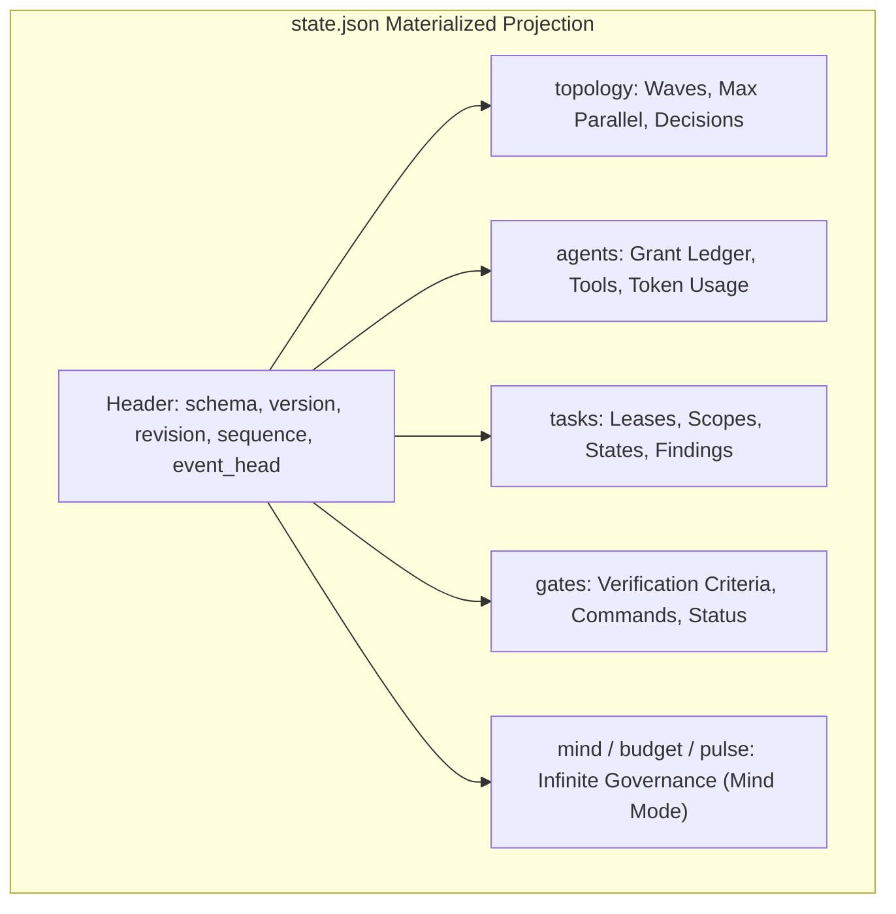
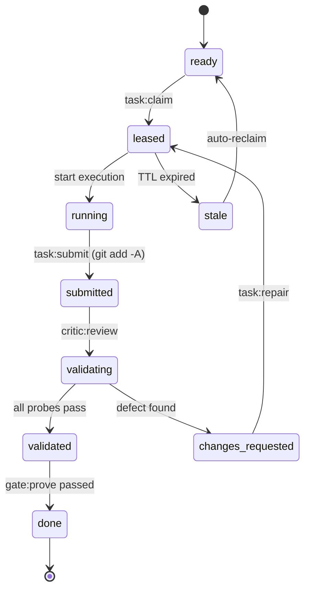
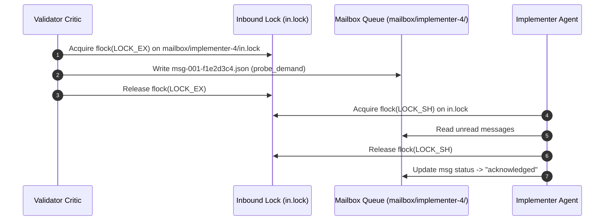
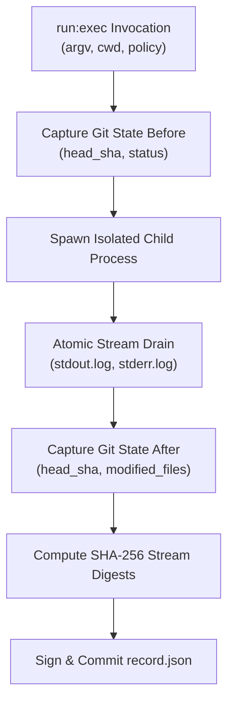

# State JSON, Mailbox & Execution Receipt Schemas

> **Navigation**: [Reference Home](../index.md) > [State & Capsule Schemas](./index.md) > State JSON & Mailbox Schemas  
> **Status**: Authoritative Reference Specification  
> **Draft Version**: JSON Schema Draft 2020-12  
> **Related Code**: [`olt/scripts/src/workflow/types.ts`](file:///Users/onurseckinsenoglu/repos/skills/olt/scripts/src/workflow/types.ts), [`olt/scripts/src/core/contracts/agents/commands.ts`](file:///Users/onurseckinsenoglu/repos/skills/olt/scripts/src/core/contracts/agents/commands.ts), [`olt/scripts/src/core/contracts/agents/agents.ts`](file:///Users/onurseckinsenoglu/repos/skills/olt/scripts/src/core/contracts/agents/agents.ts)

---

[Previous: Events JSONL & Merkle Schema](15-03-events-jsonl-and-merkle-schema.md) | [Chapter Index](index.md) | [All Chapters Index](../index.md) | [Next: Reference 08: Verification Engines](../17-verification-engines-and-gates/index.md)
---

## 1. Projected State Schema (`state.json`)

The **State Projection** (`.olt/capsules/<slug>/state.json`) is the single authoritative, materialized view derived deterministically by replaying `events.jsonl` from sequence `0` to the current `event_sequence`. It stores topological wave schedules, agent authorization records, active task leases, Git branches, gates, and Mind governance ledgers.



---

### 1.1 Top-Level State Schema Field Table

| Field Name       | Type      | Nullable | Validation Rule              | Description                                                       |
| :--------------- | :-------- | :------: | :--------------------------- | :---------------------------------------------------------------- |
| `schema`         | `string`  |    No    | `"harness.state"`            | Discriminator constant identifying state projection schema.       |
| `version`        | `integer` |    No    | `1`                          | Schema major version.                                             |
| `revision`       | `integer` |    No    | $\ge 0$                      | Current graph / state revision counter.                           |
| `event_sequence` | `integer` |    No    | $\ge 0$                      | Highest processed sequence number in `events.jsonl`.              |
| `event_head`     | `string`  |   Yes    | 64-char hex / `null`         | Cryptographic SHA-256 hash of the latest committed event.         |
| `planning`       | `object`  |    No    | Valid Planning object        | Status and metadata of preplanning compilation.                   |
| `topology`       | `object`  |    No    | Valid Topology record        | Brent Work/Span wave scheduling and parallelization decisions.    |
| `agents`         | `object`  |    No    | Map of `AgentGrantRecord`    | Authorized agent grant ledger tracking models, tokens, and tools. |
| `tasks`          | `object`  |    No    | Map of `TaskRecord`          | Atomic execution task records, leases, scopes, and findings.      |
| `branches`       | `object`  |    No    | Map of `BranchRecord`        | Sub-task Git branches for speculative execution.                  |
| `gates`          | `object`  |    No    | Map of `GateRecord`          | Mandatory verification quality gates and command criteria.        |
| `mind`           | `object`  |   Yes    | Valid Mind record            | Generational charter, strategic goals, and multi-repo state.      |
| `budget`         | `object`  |   Yes    | Valid Budget record          | Concurrency, wall-clock, and pulse quota enforcement.             |
| `pulse`          | `object`  |   Yes    | Valid Pulse record           | Pulse counter, active pulse window, and quiescence streaks.       |
| `candidates`     | `object`  |   Yes    | Map of Candidate records     | Discovered long-term strategic candidates.                        |
| `observations`   | `array`   |   Yes    | Array of Observation objects | Architectural and behavioral observations across pulses.          |
| `escalations`    | `array`   |   Yes    | Array of Escalation objects  | Unresolved supervisor escalation records.                         |
| `audit`          | `object`  |   Yes    | Valid Audit record           | Cognitive, meta, and counterfactual audit history.                |

---

### 1.2 Sub-Schema: Agent Grant Record (`AgentGrantRecord`)

Tracks authorized subagent credentials, host bindings, model capabilities, tool permissions, and token telemetry:

| Field Name        | Type     | Nullable | Description                                                                                      |
| :---------------- | :------- | :------: | :----------------------------------------------------------------------------------------------- |
| `id`              | `string` |    No    | Unique harness agent ID (e.g., `implementer-4`).                                                 |
| `role`            | `string` |    No    | Role name (`implementer`, `coordinator`, `critic`, `validator`, etc.).                           |
| `parent_agent_id` | `string` |   Yes    | ID of spawning parent agent (`null` for root coordinator).                                       |
| `parent_task_id`  | `string` |   Yes    | Task ID triggering this subagent spawn.                                                          |
| `host`            | `string` |    No    | Spawning host runtime (`antigravity`, `claude_code`, `codex`, `cursor`).                         |
| `host_address`    | `string` |   Yes    | Address in the host's native process namespace.                                                  |
| `granted_at`      | `string` |    No    | ISO-8601 timestamp of grant issuance.                                                            |
| `status`          | `string` |    No    | `"active" \| "released"`.                                                                        |
| `provider`        | `object` |   Yes    | Evidenced provider string (`{ value: "anthropic", evidence_class: "agent_reported" }`).          |
| `model`           | `object` |   Yes    | Evidenced model identifier (`{ value: "claude-3-7-sonnet", evidence_class: "agent_reported" }`). |
| `model_tier`      | `object` |   Yes    | Evidenced tier (`"xs" \| "s" \| "m" \| "l" \| "unknown"`).                                       |
| `thinking_level`  | `object` |   Yes    | Evidenced thinking depth (`"low" \| "medium" \| "high" \| "xhigh" \| "unknown"`).                |
| `context_window`  | `object` |   Yes    | Evidenced context window capacity in tokens.                                                     |
| `tools_granted`   | `object` |   Yes    | Evidenced list of granted tool descriptors.                                                      |
| `tools_used`      | `array`  |   Yes    | List of `AgentToolUse` records tracking tool invocation history.                                 |
| `tokens_in`       | `object` |   Yes    | Evidenced total prompt tokens ingested.                                                          |
| `tokens_out`      | `object` |   Yes    | Evidenced total completion tokens generated.                                                     |

---

### 1.3 Sub-Schema: Task Record (`TaskRecord`)

Represents an atomic execution unit within the topological DAG:



| Field Name        | Type       | Nullable | Description                                                                                                                                           |
| :---------------- | :--------- | :------: | :---------------------------------------------------------------------------------------------------------------------------------------------------- |
| `id`              | `string`   |    No    | Unique task identifier slug (e.g. `task-docs-reference`).                                                                                             |
| `label`           | `string`   |    No    | Human-readable task title.                                                                                                                            |
| `status`          | `string`   |    No    | Lifecycle status: `ready`, `leased`, `running`, `submitted`, `validating`, `validated`, `changes_requested`, `done`, `blocked`, `stale`, `escalated`. |
| `requirement_ids` | `string[]` |    No    | Array of requirement IDs satisfied by this task (e.g. `["R-001"]`).                                                                                   |
| `write_scope`     | `string[]` |    No    | Explicit file/directory path prefixes this task is permitted to mutate.                                                                               |
| `resource_scope`  | `string[]` |   Yes    | Auxiliary shared resources locked for this task.                                                                                                      |
| `dependencies`    | `string[]` |    No    | Prerequisite task IDs that must reach `done` before claiming.                                                                                         |
| `lease`           | `object`   |   Yes    | Active lease containing `agent_id`, `token_digest`, `issued_at`, `expires_at`, `heartbeat_at`, `duration_seconds`.                                    |
| `probe_round`     | `integer`  |    No    | Count of adversarial validation probe rounds completed.                                                                                               |
| `repair_round`    | `integer`  |    No    | Count of repair cycles executed (capped by policy `max_repair_rounds`).                                                                               |
| `findings`        | `array`    |    No    | Array of open and resolved structured defect findings.                                                                                                |
| `gate_results`    | `array`    |   Yes    | Array of passed gate execution results.                                                                                                               |

---

### 1.4 Validator-Green `state.json` Exemplar

```json
{
  "schema": "harness.state",
  "version": 1,
  "revision": 1,
  "event_sequence": 12,
  "event_head": "b2c3d4e5f60718293a4b5c6d7e8f90123456789abcdef0123456789abcdef01",
  "planning": {
    "status": "compiled",
    "enhanced_plan": {
      "markdown_path": "planning/enhanced-plan.md",
      "json_path": "planning/enhanced-plan.json",
      "revision": 1,
      "prompt_sha256": "e3b0c44298fc1c149afbf4c8996fb92427ae41e4649b934ca495991b7852b855",
      "recorded_at": "2026-08-29T02:02:00.000Z",
      "actor": "planner",
      "evidence_class": "agent_reported",
      "counts": {
        "observations": 4,
        "todos": 6,
        "risks": 2,
        "open_questions": 0,
        "sources": 8
      }
    }
  },
  "topology": {
    "revision": 1,
    "max_parallel": 4,
    "waves": [
      {
        "wave": 1,
        "task_ids": [
          "task-docs-tutorials",
          "task-docs-how-to",
          "task-docs-architecture",
          "task-docs-reference"
        ]
      }
    ],
    "decisions": [
      {
        "task_id": "task-docs-reference",
        "wave": 1,
        "parallel_with": ["task-docs-tutorials", "task-docs-how-to", "task-docs-architecture"],
        "serialized_after": [],
        "reason": "write_scope_conflict",
        "rationale": "Disjoint write scopes allow full parallel execution under Brent work/span limits.",
        "evidence_class": "derived"
      }
    ]
  },
  "agents": {
    "implementer-4": {
      "id": "implementer-4",
      "role": "implementer",
      "parent_agent_id": "coordinator-1",
      "parent_task_id": "task-docs-reference",
      "host": "antigravity",
      "host_address": "subagent-session-8f92",
      "granted_at": "2026-08-29T02:05:00.000Z",
      "status": "active",
      "provider": { "value": "anthropic", "evidence_class": "agent_reported" },
      "model": { "value": "claude-3-7-sonnet", "evidence_class": "agent_reported" },
      "model_tier": { "value": "l", "evidence_class": "agent_reported" },
      "thinking_level": { "value": "high", "evidence_class": "agent_reported" },
      "context_window": { "value": 200000, "evidence_class": "agent_reported" },
      "tools_granted": {
        "value": [
          { "name": "run_command", "category": "execution" },
          { "name": "write_to_file", "category": "filesystem" }
        ],
        "evidence_class": "derived"
      },
      "tokens_in": { "value": 14200, "evidence_class": "agent_reported" },
      "tokens_out": { "value": 3100, "evidence_class": "agent_reported" },
      "report_count": 1,
      "last_reported_at": "2026-08-29T02:05:30.000Z"
    }
  },
  "tasks": {
    "task-docs-reference": {
      "id": "task-docs-reference",
      "label": "Diátaxis Reference & Documentation Hub",
      "status": "leased",
      "requirement_ids": ["R-DOC-004"],
      "write_scope": ["docs/olt/reference", "docs/olt/index.md", "docs/olt/README.md"],
      "resource_scope": [],
      "dependencies": [],
      "attempts": [],
      "history": [
        {
          "at": "2026-08-29T02:05:00.000Z",
          "actor": "coordinator-1",
          "from": "ready",
          "to": "leased",
          "reason": "Claimed by implementer-4",
          "attempt": 1
        }
      ],
      "repair_round": 0,
      "probe_round": 0,
      "lease": {
        "agent_id": "implementer-4",
        "role": "implementer",
        "attempt": 1,
        "token_digest": "3c9a1e7d5b2f48c6a0d93e1b7f45c82a6d0e39b1c74f2a8560de3b91c7a4f605",
        "issued_at": "2026-08-29T02:05:00.000Z",
        "expires_at": "2026-08-29T02:15:00.000Z",
        "heartbeat_at": "2026-08-29T02:05:00.000Z",
        "duration_seconds": 600,
        "write_scope": ["docs/olt/reference", "docs/olt/index.md", "docs/olt/README.md"],
        "resource_scope": []
      },
      "findings": []
    }
  },
  "branches": {},
  "gates": {
    "gate-task-docs-ref": {
      "id": "gate-task-docs-ref",
      "command": ["bun", "olt/scripts/harness.ts", "task:check", "--task", "task-docs-reference"],
      "cwd": ".",
      "scope": "task",
      "requirement_ids": ["R-DOC-004"],
      "mandatory": true,
      "status": "passed"
    }
  },
  "mind": {
    "generation": 1,
    "charter": {
      "title": "Autonomous Skill Engine Evolution",
      "purpose": "Perpetual refinement, error reduction, and self-auditing across skill modules.",
      "cadence_minutes": 15,
      "charter_file": "olt/charter.md"
    },
    "goals": [
      {
        "id": "G-001",
        "title": "Zero TypeScript any Violations",
        "description": "Maintain strict type cleanliness across all olt/scripts modules.",
        "target_metric": "0 errors",
        "status": "active"
      }
    ],
    "repo_roots": ["."]
  },
  "budget": {
    "pulses_per_day": 96,
    "wall_clock_ms_per_day": 86400000,
    "quiet_hours": "01:00-05:00",
    "day_key": "2026-08-29",
    "pulses_today": 4,
    "wall_clock_ms_today": 1200000,
    "max_agents_in_flight": 8,
    "max_open_proposals": 12
  },
  "pulse": {
    "counter": 4,
    "open": {
      "pulse_id": "pulse-20260829-04",
      "opened_at": "2026-08-29T02:00:00.000Z",
      "cadence_ms": 900000
    },
    "last": {
      "pulse_id": "pulse-20260829-03",
      "closed_at": "2026-08-29T01:45:00.000Z",
      "outcome": "quiesced"
    },
    "quiescent_streak": 1
  },
  "candidates": {},
  "observations": [
    {
      "id": "OBS-001",
      "category": "performance",
      "source": "pulse-20260829-02",
      "observation": "Concurrent graph wave scheduling reduced overall wall-clock time by 68%.",
      "impact": "high",
      "timestamp": "2026-08-29T01:30:00.000Z",
      "evidence_class": "derived"
    }
  ],
  "escalations": [],
  "audit": {
    "cognitive": [],
    "counterfactual": [],
    "meta": []
  }
}
```

---

## 2. Inter-Agent Mailbox Schema (`mailbox/<recipient>/<msg_id>.json`)

The **Mailbox System** provides asynchronous, flock-synchronized peer-to-peer communication between subagents. Messages are written into the recipient's mailbox directory under POSIX advisory locking (`in.lock`), eliminating interactive stdout chatter and preserving LLM context windows.



---

### 2.1 Mailbox Envelope Schema (`harness.mailbox-message`)

| Field Name     | Type      | Nullable | Validation Constraints      | Description                                                                                         |
| :------------- | :-------- | :------: | :-------------------------- | :-------------------------------------------------------------------------------------------------- |
| `schema`       | `string`  |    No    | `"harness.mailbox-message"` | Fixed schema discriminator constant.                                                                |
| `version`      | `integer` |    No    | `1`                         | Envelope major version.                                                                             |
| `id`           | `string`  |    No    | Pattern `^msg-[a-z0-9-]+$`  | Unique envelope identifier.                                                                         |
| `sender`       | `string`  |    No    | Valid agent ID              | Agent ID sending the envelope (e.g. `validator-cq-1`).                                              |
| `recipient`    | `string`  |    No    | Valid agent ID              | Target recipient agent ID (e.g. `implementer-4`).                                                   |
| `thread_id`    | `string`  |    No    | Non-empty string            | Logical probe or conversation thread ID.                                                            |
| `kind`         | `string`  |    No    | Enum (7 values)             | `"probe_demand" \| "finding" \| "resolution" \| "handoff" \| "escalation" \| "heartbeat" \| "ack"`. |
| `payload`      | `object`  |    No    | Valid JSON Object           | Type-checked payload conforming to message kind.                                                    |
| `created_at`   | `string`  |    No    | ISO-8601 UTC                | Timestamp when message was deposited into queue.                                                    |
| `status`       | `string`  |    No    | Enum (4 values)             | `"unread" \| "read" \| "acknowledged" \| "archived"`.                                               |
| `token_digest` | `string`  |   Yes    | 64-char hex digest          | SHA-256 bearer token signature authenticating sender grant.                                         |

---

### 2.2 Validator-Green Mailbox Exemplar (`msg-001-f1e2d3c4.json`)

```json
{
  "schema": "harness.mailbox-message",
  "version": 1,
  "id": "msg-001-f1e2d3c4",
  "sender": "validator-cq-1",
  "recipient": "implementer-4",
  "thread_id": "probe-task-docs-ref-01",
  "kind": "probe_demand",
  "payload": {
    "task_id": "task-docs-reference",
    "probe_round": 1,
    "observation": "Verify that all 8 Socratic brainstorming vectors are fully enumerated in the state schema specification.",
    "remediation": "Include table detailing EMPTY_PAYLOAD through ADVERSARIAL_GATE vectors.",
    "deadline_at": "2026-08-29T02:25:00.000Z"
  },
  "created_at": "2026-08-29T02:10:00.000Z",
  "status": "unread",
  "token_digest": "8f3a2c1b9e0d7f4a5c6e8b0d1a2c3e4f5a6b7c8d9e0f1a2b3c4d5e6f7a8b9c0d"
}
```

---

## 3. Command Execution Receipt Schema (`record.json`)

Every shell execution via `bun harness.ts run:exec` generates a signed, tamper-evident command receipt at `.olt/capsules/<slug>/commands/C-<uuid>/record.json`. Receipts record exact exit codes, wall-clock timings, Git diffs, and SHA-256 digests of standard output and error streams.



---

### 3.1 Command Record Schema (`harness.command-record`)

| Field Name                   | Type       | Nullable | Validation Rule      | Description                                                          |
| :--------------------------- | :--------- | :------: | :------------------- | :------------------------------------------------------------------- |
| `id`                         | `string`   |    No    | `^C-[A-Za-z0-9_-]+$` | Unique command execution receipt identifier.                         |
| `argv`                       | `string[]` |    No    | Min items: 1         | Literal argument vector passed to process.                           |
| `execution_argv`             | `string[]` |   Yes    | Array of strings     | Sanitized or wrapped argument vector.                                |
| `cwd`                        | `string`   |    No    | Directory path       | Working directory for child process.                                 |
| `cwd_relative`               | `string`   |    No    | Relative path        | Normalized working directory relative to repo root.                  |
| `repository_root`            | `string`   |    No    | Absolute path        | Absolute path to repository root.                                    |
| `status`                     | `string`   |    No    | Enum (4 values)      | `"succeeded" \| "failed" \| "running" \| "timed_out"`.               |
| `task_id`                    | `string`   |   Yes    | Valid task ID        | Task ID under which command executed.                                |
| `gate_id`                    | `string`   |   Yes    | Valid gate ID        | Quality gate ID evaluated by this execution.                         |
| `started_at`                 | `string`   |    No    | ISO-8601 UTC         | Process birth timestamp.                                             |
| `finished_at`                | `string`   |   Yes    | ISO-8601 UTC         | Process termination timestamp.                                       |
| `exit_code`                  | `integer`  |   Yes    | Integer (0..255)     | Raw exit code (`null` if killed by signal).                          |
| `signal`                     | `string`   |   Yes    | POSIX signal name    | Signal name if terminated abnormally (`SIGTERM`, `SIGKILL`).         |
| `fingerprint`                | `string`   |    No    | 64-char hex digest   | SHA-256 fingerprint of execution context and binaries.               |
| `attempt_signing_public_key` | `string`   |    No    | Public key string    | Ed25519 public key verifying command authenticity.                   |
| `record_path`                | `string`   |    No    | Relative path        | Relative path to this `record.json` inside capsule.                  |
| `actor`                      | `string`   |    No    | Valid agent ID       | Agent ID or role executing the command.                              |
| `assurance`                  | `string`   |   Yes    | Constant             | `"trusted_host_observed_v1"`.                                        |
| `logs`                       | `object`   |   Yes    | Valid Logs object    | Metadata for `stdout` and `stderr` logs (`path`, `bytes`, `sha256`). |
| `repository_before`          | `object`   |   Yes    | Git state binding    | Git status and HEAD commit SHA before execution.                     |
| `repository_after`           | `object`   |   Yes    | Git state binding    | Git status, HEAD SHA, and mutated file lists after execution.        |
| `path_bindings`              | `array`    |   Yes    | Array of Bindings    | Inode, mode, and hash bindings for all file operands.                |
| `policy`                     | `object`   |   Yes    | Valid Policy object  | Wall timeout, idle timeout, grace periods, and retry policies.       |
| `attempts`                   | `array`    |   Yes    | Array of Attempts    | Multi-attempt execution logs and signal dispositions.                |

---

### 3.2 Validator-Green Command Receipt Exemplar (`record.json`)

```json
{
  "id": "C-VAL-CMD-101",
  "argv": ["bun", "test", "tests/unit/store.test.ts"],
  "execution_argv": ["bun", "test", "tests/unit/store.test.ts"],
  "cwd": "/workspace",
  "cwd_relative": ".",
  "repository_root": "/workspace",
  "status": "succeeded",
  "task_id": "task-docs-reference",
  "gate_id": "gate-task-docs-ref",
  "started_at": "2026-08-29T02:15:00.000Z",
  "finished_at": "2026-08-29T02:15:02.100Z",
  "exit_code": 0,
  "signal": null,
  "fingerprint": "8d3f1a2e4b6c8d0e1f2a3b4c5d6e7f8a9b0c1d2e3f4a5b6c7d8e9f0a1b2c3d4e",
  "attempt_signing_public_key": "ed25519-pubkey-7f9a1b2c3d4e5f6a",
  "record_path": "commands/C-VAL-CMD-101/record.json",
  "actor": "validator-cq-1",
  "assurance": "trusted_host_observed_v1",
  "logs": {
    "stdout": {
      "path": "commands/C-VAL-CMD-101/stdout.log",
      "bytes": 482,
      "sha256": "4b227777d4dd1fc61c6f884f48641d02b4d121d3fd328cb08b5531fcacdabf8a"
    },
    "stderr": {
      "path": "commands/C-VAL-CMD-101/stderr.log",
      "bytes": 0,
      "sha256": "e3b0c44298fc1c149afbf4c8996fb92427ae41e4649b934ca495991b7852b855"
    }
  },
  "repository_before": {
    "git_status": "clean",
    "head_sha": "a1b2c3d4e5f60718293a4b5c6d7e8f9012345678"
  },
  "repository_after": {
    "git_status": "clean",
    "head_sha": "a1b2c3d4e5f60718293a4b5c6d7e8f9012345678",
    "modified_files": [],
    "added_files": [],
    "deleted_files": []
  }
}
```

---

## 4. Verification Evidence Schemas (`findings.json` & `proofs.json`)

### 4.1 Structured Finding Schema (`findings.json`)

Emitted by adversarial critics and completeness reviewers:

```json
{
  "id": "F-001",
  "class": "defect",
  "kind": "defect",
  "requirement_id": "R-DOC-004",
  "severity": "important",
  "observation": "Write scope allows modifying unassigned parent paths outside target directory.",
  "evidence": [
    { "path": "src/store/index.ts", "reason": "unauthorized edit detected outside write scope" }
  ],
  "remediation": "Restrict write scope filtering to exact child subdirectories.",
  "revalidation": "bun test tests/unit/scope.test.ts",
  "status": "resolved",
  "probe_round": 1,
  "resolved_by_command_id": "C-VAL-CMD-101"
}
```

### 4.2 Completion Proof Bundle Schema (`proofs.json`)

Compiled by critics upon successful verification of all requirements prior to final sealing:

```json
{
  "schema": "harness.proof-bundle",
  "version": 1,
  "run_id": "35-comprehensive-olt-documentation-overhaul",
  "generated_at": "2026-08-29T02:30:00.000Z",
  "actor": "critic-1",
  "summary": "All Diátaxis reference specifications and schema contracts are 100% verified.",
  "review_sha256": "4a7d2e8b9c1f4e3a2d5e6f7a8b9c0d1e2f3a4b5c6d7e8f9a0b1c2d3e4f5a6b7c",
  "proofs": [
    {
      "requirement_id": "R-DOC-004",
      "status": "satisfied",
      "command_receipt_ids": ["C-VAL-CMD-101"],
      "verified_lines": [1, 2, 3],
      "evidence": [
        {
          "kind": "command",
          "reference": "commands/C-VAL-CMD-101/record.json",
          "observation": "All state schema unit and integration tests passed cleanly with 0 errors."
        }
      ],
      "timestamp": "2026-08-29T02:30:00.000Z"
    }
  ]
}
```

---

[Previous: Events JSONL & Merkle Schema](15-03-events-jsonl-and-merkle-schema.md) | [Chapter Index](index.md) | [All Chapters Index](../index.md) | [Next: Reference 08: Verification Engines](../17-verification-engines-and-gates/index.md)
---
