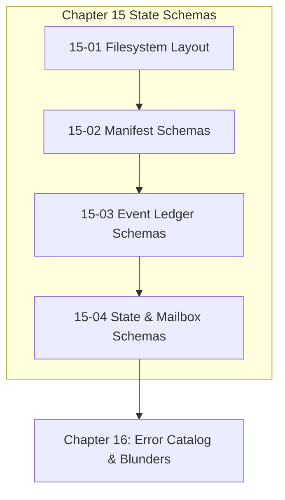

# Chapter 15: State Schemas & Event Ledger

---

[Previous: Chapter 14 Index](../14-harness-cli-and-command-engine/index.md) | [Chapter Index](index.md) | [All Chapters Index](../index.md) | [Next: 15-01 Capsule Filesystem Layout](15-01-capsule-filesystem-layout.md)

---

## 1. Chapter Overview & Schema Architecture

Welcome to Chapter 15 of the OLT Architecture Book. This chapter provides the complete Draft 2020-12 JSON Schema specifications and structural contracts for all persistent state artifacts across the **OLT (Orchestrating Long Tasks)** engine.

In robust distributed systems, data corruption occurs when schemas are ambiguous or implicit. Chapter 15 details the exact JSON schemas for capsule manifests, requirements definitions, the append-only Merkle event ledger (`events.jsonl`), the materialized state snapshot (`state.json`), inter-agent mailboxes, and cryptographic evidence bundles.

```text
┌──────────────────────────────────────────────────────────────────────────────────────────────────┐
│                             CHAPTER 15: STATE SCHEMAS TOPOLOGY                                   │
├──────────────────────────────────────────────────────────────────────────────────────────────────┤
│                                                                                                  │
│    ┌───────────────────────────┐                    ┌───────────────────────────┐                │
│    │ 15-01: Capsule Filesystem │                    │ 15-02: Manifest &         │                │
│    │ Layout Specifications     │ ══════════════════►│ Requirements Schemas      │                │
│    └─────────────┬─────────────┘                    └─────────────┬─────────────┘                │
│                  │                                                │                              │
│                  ▼                                                ▼                              │
│    ┌───────────────────────────┐                    ┌───────────────────────────┐                │
│    │ 15-03: events.jsonl &     │                    │ 15-04: state.json &       │                │
│    │ Merkle Schema Contracts   │ ══════════════════►│ Mailbox Queue Schemas     │                │
│    └───────────────────────────┘                    └───────────────────────────┘                │
│                                                                                                  │
└──────────────────────────────────────────────────────────────────────────────────────────────────┘
```

---

## 2. Chapter Table of Contents & Learning Path

```text
+--------------------------------------------------+--------------+--------------------------------+
│ Document                                         │ Classification│ Core Architectural Focus       │
+--------------------------------------------------+--------------+--------------------------------+
│ 15-01 Capsule Filesystem Layout                  │ Reference    │ Physical disk paths & modes    │
│ 15-02 Manifest & Requirements Schemas            │ Specification│ manifest.json & prompt.md      │
│ 15-03 events.jsonl & Merkle Schema Contracts     │ Specification│ Append-only event envelopes    │
│ 15-04 state.json & Mailbox Schemas               │ Specification│ Projections & queue JSON       │
+--------------------------------------------------+--------------+--------------------------------+
```

### [15-01: Capsule Filesystem Layout Specifications](15-01-capsule-filesystem-layout.md)

Provides the exhaustive reference for the on-disk directory tree under `.olt/capsules/<slug>/`, detailing exact file paths, Unix permissions (`0444`, `0644`, `0755`), locking targets, and archival rules.

### [15-02: Manifest & Requirements Schemas](15-02-manifest-and-requirements-schemas.md)

Catalogues the Draft 2020-12 schemas for `manifest.json` (prompt SHA-256 hash, slug identity, creator timestamps) and extracted obligation records.

### [15-03: events.jsonl & Merkle Schema Contracts](15-03-events-jsonl-and-merkle-schema.md)

Details the canonical JSON schema for chronological event records: sequence numbers, actor identifiers, event types, payloads, previous hashes, and SHA-256 Merkle digests.

### [15-04: state.json & Mailbox Queue Schemas](15-04-state-json-and-mailbox-schemas.md)

Deconstructs the materialized state snapshot schema (active lifecycle phase, task dictionaries, worker lease records, DAG wave assignments) and inter-agent message payloads.

---

## 3. Core Schema Validation Invariants

1. **Draft 2020-12 Compliance**: All JSON schemas strictly adhere to JSON Schema Draft 2020-12 standards.
2. **Canonical JSON Serialization**: Key ordering is alphabetized and whitespace-normalized to guarantee deterministic hashing.
3. **Fail-Closed Validation**: Any document failing schema parsing triggers immediate rejection.



---

## 4. Summary & Transition

The schema specifications established in Chapter 15 guarantee that all runtime state is unambiguously defined, cryptographically verifiable, and cross-platform compatible.

Proceed to [15-01: Capsule Filesystem Layout](15-01-capsule-filesystem-layout.md) or advance directly to [Chapter 16: Error Catalog & Empirical Blunders](../16-error-catalog-and-blunders/index.md).

---

[Previous: Chapter 14 Index](../14-harness-cli-and-command-engine/index.md) | [Chapter Index](index.md) | [All Chapters Index](../index.md) | [Next: 15-01 Capsule Filesystem Layout](15-01-capsule-filesystem-layout.md)

---
