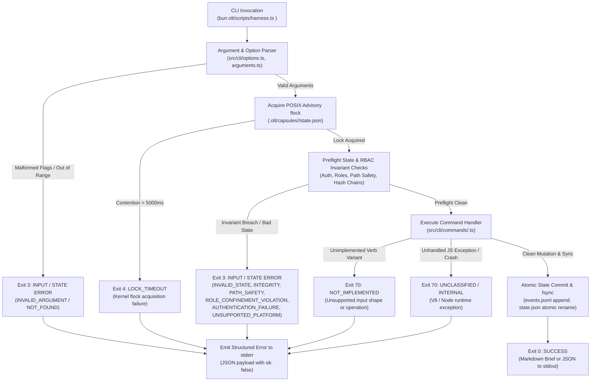
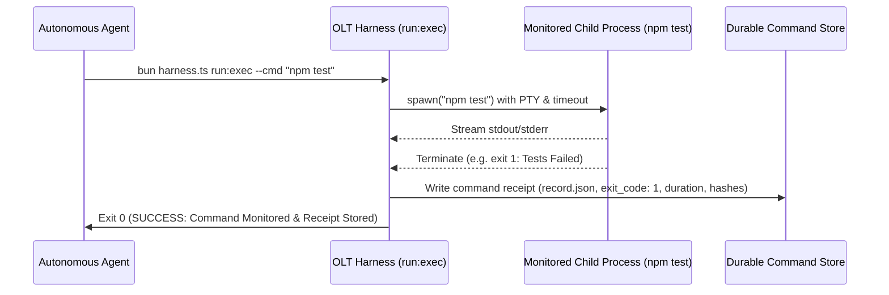

# Exit Status Hierarchy & Process Lifecycle

[Reference Home](../index.md) > [Error Dictionary](./index.md) > Exit Status Hierarchy

---

[⏮️ Previous: Reference 06: Error Dictionary & Blunders Overview](index.md) | [📂 Chapter Index](index.md) | [📚 All Chapters Index](../index.md) | [⏭️ Next: Harness Error Codes & Payloads](16-02-harness-error-codes-and-payloads.md)
---

The **Open Loop Task (OLT) Harness** (`bun olt/scripts/harness.ts`) operates as a deterministic POSIX process interface. Every CLI invocation terminates with one of four canonical POSIX exit codes. This deterministic signaling enables orchestrators, supervisor daemons, and continuous integration pipelines to immediately distinguish between input errors, transient lock contention, internal runtime panics, and successful state commits.

---

## 🚦 1. POSIX Exit Status Architecture

```
┌──────────────────────────────────────────────────────────────────────────────────────────────────┐
│                                   POSIX EXIT STATUS HIERARCHY                                    │
├───────────┬──────────────────────────┬──────────────┬───────────────┬────────────────────────────┤
│ EXIT CODE │ CANONICAL CLASSIFICATION │ POSIX NAME   │ OUTPUT STREAM │ MUTATION GUARANTEE         │
├───────────┼──────────────────────────┼──────────────┼───────────────┼────────────────────────────┤
│    `0`    │ SUCCESS                  │ `EX_OK`      │ `stdout`      │ Committed & Synced to Disk │
├───────────┼──────────────────────────┼──────────────┼───────────────┼────────────────────────────┤
│    `3`    │ INPUT / STATE ERROR      │ `EX_DATAERR` │ `stderr`      │ Zero Mutation Guaranteed   │
├───────────┼──────────────────────────┼──────────────┼───────────────┼────────────────────────────┤
│    `4`    │ LOCK_TIMEOUT             │ `EX_TEMPFAIL`│ `stderr`      │ Zero Mutation Guaranteed   │
├───────────┼──────────────────────────┼──────────────┼───────────────┼────────────────────────────┤
│   `70`    │ INTERNAL / NOT_IMPL      │ `EX_SOFTWARE`│ `stderr`      │ Zero Mutation Guaranteed   │
└───────────┴──────────────────────────┴──────────────┴───────────────┴────────────────────────────┘
```



---

## 🔍 2. Detailed Exit Code Specifications

### Exit `0`: `SUCCESS` (`EX_OK`)

- **POSIX Semantic**: Command completed successfully without error.
- **Output Stream**: `stdout` (formatted Markdown brief or structured JSON payload).
- **State Mutation Guarantee**: **Committed & Synced**.
  - All requested mutations have been recorded in memory.
  - An event payload was appended to `.olt/capsules/<slug>/events.jsonl`.
  - The updated `state.json` projection was written atomically via temporary file and `renameat2` (or POSIX atomic `rename`).
  - Kernel file buffers were flushed to durable media via `fdatasync`.
- **Primary Operational Triggers**:
  - `plan:init`, `plan:add`, `plan:compile` successfully building or advancing the DAG.
  - `task:claim` successfully establishing an exclusive lease and issuing an authenticated token.
  - `task:submit`, `task:probe`, `task:review` successfully advancing task status.
  - `run:exec` successfully spawning and recording child process execution.

---

### Exit `3`: `INPUT / STATE ERROR` (`EX_DATAERR` / `EX_USAGE`)

- **POSIX Semantic**: Input data was incorrect in format or contents, or an operational invariant was violated.
- **Output Stream**: `stderr` (structured JSON error payload or terminal markdown brief).
- **State Mutation Guarantee**: **Zero Mutation**. Disk state remains 100% byte-for-byte identical to prior state.
- **Primary Operational Triggers**:
  - **`INVALID_ARGUMENT`**: Unknown CLI options, missing mandatory arguments, values outside numeric bounds, duplicate non-repeatable flags.
  - **`INVALID_STATE`**: Attempting out-of-order lifecycle transitions (e.g. claiming a task already leased, submitting an unleased task, passing review with 0 adversarial probes or open findings).
  - **`INTEGRITY`**: SHA-256 Merkle chain divergence, corrupted event journal, cyclic plan dependencies ($A \to B \to A$), or TOCTOU file tree drift.
  - **`PATH_SAFETY`**: Path arguments escaping run root (`../../etc/passwd`), symbolic link traversal in write scope, relative PATH components, or dirty repository root.
  - **`ROLE_CONFINEMENT_VIOLATION`**: Supervisory Tier breaching RBAC boundaries (e.g. Tier 1 Mind directly claiming tasks or editing code).
  - **`AUTHENTICATION_FAILURE`**: Session bearer token mismatch, expired session digest, or token spoofing.
  - **`NOT_FOUND`**: Entity ID (task, gate, run, receipt) missing from active state projection.
  - **`UNSUPPORTED_HOST` / `UNSUPPORTED_PLATFORM`**: Unsupported OS or unverified host execution environment.

---

### Exit `4`: `LOCK_TIMEOUT` (`EX_TEMPFAIL`)

- **POSIX Semantic**: A temporary failure occurred; the caller is advised that retrying at a later time may succeed.
- **Output Stream**: `stderr`.
- **State Mutation Guarantee**: **Zero Mutation**. Aborted prior to acquiring exclusive state lock.
- **Mechanism**:
  - The harness enforces concurrency isolation across parallel worker processes using POSIX kernel advisory locks (`flock(fd, LOCK_EX)`).
  - The lock acquisition timeout is bounded to $5000\text{ ms}$.
  - If another worker holds the lock past the deadline, the process terminates with Exit 4.
- **Caller Remediation**:
  - Implement randomized exponential backoff (e.g. wait $50\text{ ms} \pm \text{jitter}$, retry up to 5 times).
  - If lock contention persists across multiple retries, run `bun harness.ts recover` to detect and release orphaned locks from dead processes.

---

### Exit `70`: `FATAL / INTERNAL / NOT_IMPLEMENTED` (`EX_SOFTWARE`)

- **POSIX Semantic**: An internal software error occurred (from `<sysexits.h>` `EX_SOFTWARE = 70`).
- **Output Stream**: `stderr`.
- **State Mutation Guarantee**: **Zero Mutation**. Execution halted prior to state synchronization.
- **Primary Operational Triggers**:
  - **`NOT_IMPLEMENTED`**: Caller invoked an unsupported command variation or requested an unsupported blob mode (e.g., executing `gate:prove` across symbolic link write scopes).
  - **`INTERNAL`**: Unhandled V8 / Bun JavaScript runtime exceptions, out-of-memory errors, engine panics, or unhandled promise rejections caught by `normalizeError()`.

---

## 🔒 3. The Zero-Mutation Invariant

> [!IMPORTANT]
> **Axiomatic Guarantee**: If any harness command terminates with exit code `3`, `4`, or `70`, the disk representation of `.olt/capsules/<slug>/` is guaranteed to be completely unchanged.

### Mechanical Implementation of Zero Mutation

```
┌──────────────────────────────────────────────────────────────────────────────────────────────────┐
│                                   ZERO-MUTATION PIPELINE GUARD                                   │
├──────────────────────────────────────────────────────────────────────────────────────────────────┤
│ 1. PRE-FLIGHT VALIDATION:                                                                        │
│    • CLI flag parsing & range checks                                                             │
│    • Inode & path safety checks                                                                  │
│    • In-memory state machine transition verification                                             │
│    • Cryptographic Merkle digest computation                                                     │
│    ─── IF ANY CHECK FAILS: Throw HarnessError → Emit stderr → Exit(3/4/70)                       │
│                                                                                                  │
│ 2. ISOLATED IN-MEMORY MUTATION:                                                                  │
│    • Clone active state object in memory                                                         │
│    • Apply state transitions to clone                                                            │
│    • Validate cloned state against post-condition invariants                                     │
│                                                                                                  │
│ 3. ATOMIC TWO-PHASE DISK COMMIT:                                                                 │
│    • Append event to events.jsonl                                                                │
│    • Write updated state to state.json.tmp.<pid>.<timestamp>                                     │
│    • Call fdatasync() on temporary file                                                          │
│    • Atomic rename: rename(state.json.tmp, state.json)                                           │
│    ─── STATE IS NOW COMMITTED → Emit stdout → Exit(0)                                            │
└──────────────────────────────────────────────────────────────────────────────────────────────────┘
```

This two-phase architecture guarantees that:

1. Invalid arguments never touch disk.
2. Concurrent processes that time out waiting for locks never corrupt state.
3. Mid-execution panics leave the prior state completely intact and recoverable.

---

## 📡 4. Stream Routing & Machine Contracts

The OLT Harness enforces strict stream separation between standard output (`stdout`) and standard error (`stderr`).

```
┌──────────────────────────────┬──────────────────────────────┬────────────────────────────────────┐
│ INVOCATION FORMAT            │ EXIT 0 (SUCCESS)             │ EXIT 3, 4, 70 (FAILURE)            │
├──────────────────────────────┼──────────────────────────────┼────────────────────────────────────┤
│ `--format json`              │ `stdout`: Parsed JSON Object │ `stdout`: Empty (0 bytes)          │
│ (Machine / Subagent)         │ `stderr`: Empty (0 bytes)    │ `stderr`: JSON HarnessErrorPayload │
├──────────────────────────────┼──────────────────────────────┼────────────────────────────────────┤
│ Default / Interactive        │ `stdout`: Markdown Brief     │ `stdout`: Empty (0 bytes)          │
│ (Human / TTY)                │ `stderr`: Empty              │ `stderr`: Terminal Error Brief     │
└──────────────────────────────┴──────────────────────────────┴────────────────────────────────────┘
```

### Machine Stream Routing Rules

1. **Never parse `stdout` when exit code is non-zero**: `stdout` will be empty; all error information is routed to `stderr`.
2. **Never parse `stderr` when exit code is `0`**: `stderr` will be empty under normal execution.
3. **JSON Structure Guarantee**: When `--format json` is passed, `stderr` is guaranteed to contain a single, valid JSON object conforming to the `HarnessErrorPayload` schema.

---

## ⚙️ 5. The `run:exec` Process Wrapper Exception

The monitored command wrapper command `bun harness.ts run:exec` is the **sole exception** to direct exit status propagation:

```bash
bun harness.ts run:exec --run <path> --actor <agent> --cmd "npm test"
```

### Behavioral Contract

- If `run:exec` successfully spawns the child process, streams its output, logs its receipts, and computes the output SHA-256 digest, `run:exec` exits with **code `0`**, regardless of whether the child process exited `0`, `1`, `127`, or was terminated by a signal.
- The child process's raw exit status is captured inside the durable receipt (`record.json`) and the `exit_code` field of the event journal.
- `run:exec` exits with code `3` only if the harness flags were invalid, the actor was unauthorized, or the run capsule was missing.
- `run:exec` exits with code `4` only if the run lock timed out.
- `run:exec` exits with code `70` only if the harness engine itself panicked while monitoring the process.



---

## 💻 6. Caller Integration & Pipeline Recipes

### Bash / Shell Script Integration

```bash
#!/usr/bin/env bash
set -eo pipefail

# Execute harness with JSON output
OUT=$(bun olt/scripts/harness.ts task:claim \
  --run .olt/capsules/feature-auth \
  --task task-01 \
  --actor implementer-1 \
  --format json 2> err.json) || EXIT_CODE=$?

if [ -z "${EXIT_CODE:-}" ]; then
  # Success (Exit 0)
  TOKEN=$(echo "$OUT" | jq -r '.token')
  echo "Lease acquired successfully. Bearer Token: $TOKEN"
elif [ "$EXIT_CODE" -eq 4 ]; then
  # Lock Timeout (Exit 4) - Jittered Retry
  echo "Lock contention detected. Backing off..." >&2
  sleep 0.5
  exec "$0" "$@"
elif [ "$EXIT_CODE" -eq 3 ]; then
  # Input or State Error (Exit 3)
  ERR_CODE=$(jq -r '.error.code' err.json)
  ERR_MSG=$(jq -r '.error.message' err.json)
  echo "Validation Error [$ERR_CODE]: $ERR_MSG" >&2
  exit 3
else
  # Internal Engine Failure (Exit 70)
  echo "Fatal Harness Engine Failure (Exit $EXIT_CODE)" >&2
  cat err.json >&2
  exit 70
fi
```

### TypeScript / Bun Caller Integration

```typescript
import { spawn } from "bun";

export interface HarnessExecutionResult<T> {
  ok: boolean;
  data?: T;
  error?: {
    code: string;
    message: string;
    exit_code: number;
    issues: unknown[];
    fix?: string;
  };
}

export async function executeHarness<T>(argv: string[]): Promise<HarnessExecutionResult<T>> {
  const proc = spawn(["bun", "olt/scripts/harness.ts", ...argv, "--format", "json"], {
    stdout: "pipe",
    stderr: "pipe",
  });

  const [stdoutStr, stderrStr] = await Promise.all([
    new Response(proc.stdout).text(),
    new Response(proc.stderr).text(),
  ]);

  const exitCode = await proc.exited;

  if (exitCode === 0) {
    return {
      ok: true,
      data: JSON.parse(stdoutStr) as T,
    };
  }

  try {
    const errorPayload = JSON.parse(stderrStr);
    return {
      ok: false,
      error: errorPayload.error,
    };
  } catch {
    return {
      ok: false,
      error: {
        code: "INTERNAL",
        message: stderrStr || "Unknown harness crash",
        exit_code: exitCode,
        issues: [],
      },
    };
  }
}
```

---

[⏮️ Previous: Reference 06: Error Dictionary & Blunders Overview](index.md) | [📂 Chapter Index](index.md) | [📚 All Chapters Index](../index.md) | [⏭️ Next: Harness Error Codes & Payloads](16-02-harness-error-codes-and-payloads.md)
---
