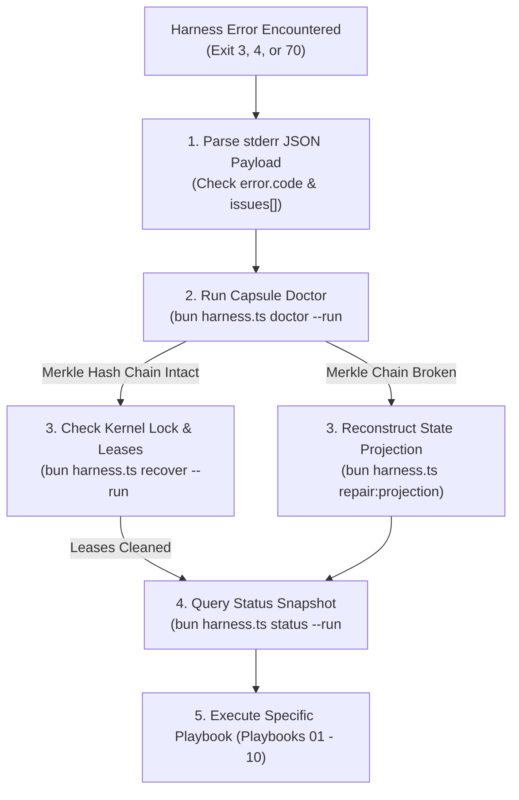
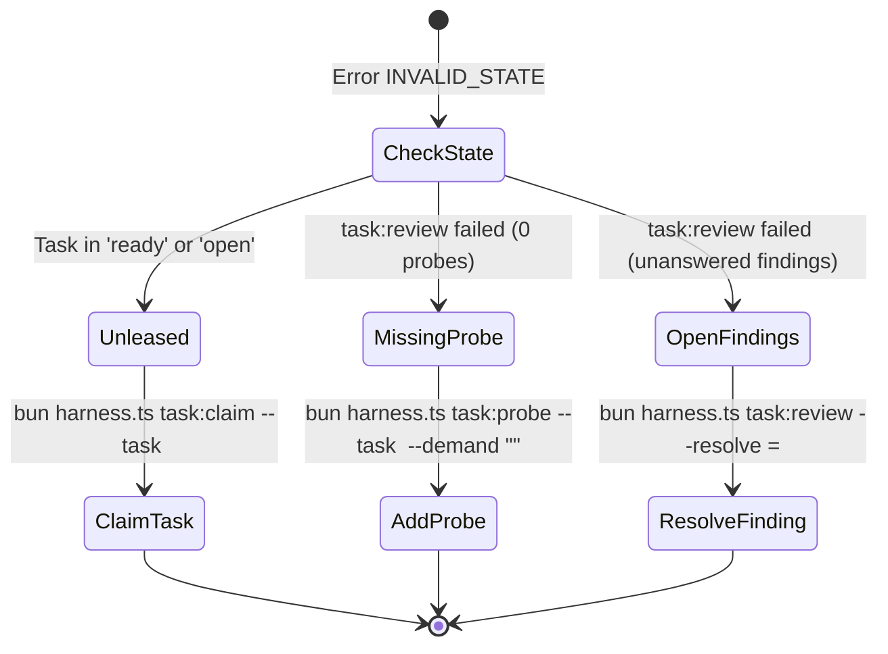
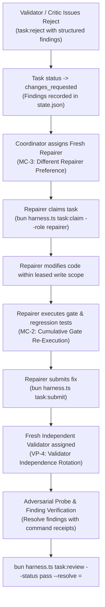

# Recovery & Mitigation Playbooks

[Reference Home](../index.md) > [Error Dictionary](./index.md) > Recovery & Mitigation Playbooks

---

[Previous: 28 Empirical Blunders](16-03-twenty-eight-empirical-blunders.md) | [Chapter Index](index.md) | [All Chapters Index](../index.md) | [Next: Reference 07: State & Capsule Schemas](../15-state-schemas-and-event-ledger/index.md)
---

This manual provides actionable, step-by-step remediation runbooks, forensic diagnostic procedures, and self-healing protocols for every error code, failure state, and empirical blunder in the Open Loop Task (OLT) ecosystem.

---

## 1. Forensic Diagnostics & Capsule Health

When an agent or pipeline encounters an unexpected error, follow the structured forensic diagnostic workflow:



---

## 2. Core Self-Healing Commands

### 1. Capsule Doctor (`doctor`)

Performs a deep integrity audit across all files in `.olt/capsules/<slug>/`:

- Audits Merkle hash chains in `events.jsonl`.
- Verifies line mappings between `prompt.md` and `requirements.json`.
- Detects stray or unmanaged files in repository root (`root-hygiene-guard`).

```bash
# Run read-only diagnostic audit
bun olt/scripts/harness.ts doctor --run .olt/capsules/<slug>

# Run audit with automatic repair of repairable invariants
bun olt/scripts/harness.ts doctor --run .olt/capsules/<slug> --repair
```

### 2. State Projection Repair (`repair:projection`)

Reconstructs `state.json` from the verified append-only Merkle journal `events.jsonl`:

```bash
bun olt/scripts/harness.ts repair:projection --run .olt/capsules/<slug>
```

### 3. Automated Lease & Lock Reclamation (`recover`)

Scans all tasks and branches in active capsules:

- Reclaims expired worker leases past their TTL.
- Releases orphaned kernel `flock` locks held by terminated PIDs.
- Resets abandoned branches to `open` state.

```bash
bun olt/scripts/harness.ts recover --run .olt/capsules/<slug>
```

---

## 3. Step-by-Step Recovery Playbooks

---

### Playbook 01: Remediation for `INVALID_ARGUMENT` & `NOT_FOUND`

#### Diagnostic Indicators

- Exit Code: `3`
- Error Code: `INVALID_ARGUMENT` or `NOT_FOUND`
- `issues`: Array specifying invalid flag name, out-of-range value, or non-existent entity ID.

#### Remediation Steps

1. Inspect the exact flag specification using the harness help command:
   ```bash
   bun olt/scripts/harness.ts help <command-verb>
   ```
2. If entity ID (task, gate, run) was not found, inspect active capsule entities:
   ```bash
   bun olt/scripts/harness.ts queue:list --run .olt/capsules/<slug>
   bun olt/scripts/harness.ts gate:status --run .olt/capsules/<slug>
   ```
3. For numeric range errors (e.g. `--lease-seconds`), provide a value within standard bounds ($30 \le \text{seconds} \le 86400$).
4. For dependency errors (`plan:add --deps`), ensure matching reasons are provided:
   ```bash
   bun olt/scripts/harness.ts plan:add \
     --run .olt/capsules/<slug> \
     --id task-02 \
     --deps task-01 \
     --dep-reason "task-01:consumes generated schema"
   ```

---

### Playbook 02: Remediation for `INVALID_STATE` & Broken Lifecycle Transitions

#### Diagnostic Indicators

- Exit Code: `3`
- Error Code: `INVALID_STATE`
- Common causes: unleased task submission, review without probes, open unanswered findings.

#### Remediation Steps



1. **If review failed due to `0 adversarial probe(s) recorded` (`VT-1`)**:
   File an adversarial probe demand before passing review:
   ```bash
   bun olt/scripts/harness.ts task:probe \
     --run .olt/capsules/<slug> \
     --task <task-id> \
     --actor validator-1 \
     --demand "Verify token refresh handles expired secret key gracefully"
   ```
2. **If review failed due to `open finding(s) unanswered` (`VT-3`)**:
   Execute the verification test, obtain the command receipt ID, and pass review with explicit resolution:
   ```bash
   # Run verification command
   bun olt/scripts/harness.ts run:exec \
     --run .olt/capsules/<slug> \
     --actor implementer-1 \
     --cmd "npm test -- -t 'token-refresh'"

   # Submit review resolving the open finding
   bun olt/scripts/harness.ts task:review \
     --run .olt/capsules/<slug> \
     --task <task-id> \
     --status pass \
     --resolve finding-01=cmd-a1b2c3
   ```

---

### Playbook 03: Remediation for `INTEGRITY` & Hash Chain Divergence

#### Diagnostic Indicators

- Exit Code: `3`
- Error Code: `INTEGRITY`
- Common causes: manual edits to `events.jsonl`, corrupted `state.json`, cyclic plan dependencies.

#### Remediation Steps

1. Run capsule doctor to inspect Merkle chain continuity:
   ```bash
   bun olt/scripts/harness.ts doctor --run .olt/capsules/<slug>
   ```
2. If `events.jsonl` has a torn trailing record due to an abrupt power cut or ungraceful crash:
   ```bash
   # Re-derive state projection from valid event journal prefix
   bun olt/scripts/harness.ts repair:projection --run .olt/capsules/<slug>
   ```
3. If plan graph contains cycles ($A \to B \to A$), audit and break cycles:
   ```bash
   bun olt/scripts/harness.ts plan:audit --run .olt/capsules/<slug>
   ```

---

### Playbook 04: Remediation for `PATH_SAFETY` & Blast Radius Violations

#### Diagnostic Indicators

- Exit Code: `3`
- Error Code: `PATH_SAFETY`
- Common causes: editing files outside declared `--write-scope`, symbolic links, dirty repository root (`SM-8`).

#### Remediation Steps

1. Identify files modified outside leased write scope from error `issues`:
   ```json
   {
     "unauthorized_path": "src/shared/database.ts",
     "declared_write_scope": ["src/billing/**"]
   }
   ```
2. Revert unauthorized modifications using Git:
   ```bash
   git checkout src/shared/database.ts
   ```
3. If modifications are genuinely required, expand the task scope via replanning:
   ```bash
   bun olt/scripts/harness.ts plan:replan \
     --run .olt/capsules/<slug> \
     --actor coordinator \
     --reason "Expand write scope to include shared database configuration"
   ```
4. If repository root contains stray scripts (`/scratch.sh`, `/test.py`):
   ```bash
   rm -f scratch.sh test.py
   ```

---

### Playbook 05: Remediation for `ROLE_CONFINEMENT_VIOLATION` & RBAC Leaks

#### Diagnostic Indicators

- Exit Code: `3`
- Error Code: `ROLE_CONFINEMENT_VIOLATION`
- Common causes: Tier 1 Orchestrator attempting `task:claim` or source code edits; Cognitive Validator invoking `run:exec`.

#### Remediation Steps

1. Review role authority rules using the cheat sheet:
   ```bash
   bun olt/scripts/harness.ts role:cheat-sheet <role-name>
   ```
2. For Supervisory roles (Tier 1/2):
   - **Do not edit code or claim tasks directly.**
   - Dispatch work to Tier 3 implementers via `invoke_subagent` or wave scheduling.
3. For Analytical / Cognitive Reviewers:
   - Perform static code reviews and file probe demands via `task:probe` or `task:reject`.
   - Never execute test commands directly; demand proof receipts from implementers.

---

### Playbook 06: Remediation for `LOCK_TIMEOUT` & Deadlock Breaking

#### Diagnostic Indicators

- Exit Code: `4`
- Error Code: `LOCK_TIMEOUT`
- Common causes: concurrent worker collision, orphaned lock from killed process.

#### Remediation Steps

1. **Short-Term Contention**: Apply randomized jittered backoff before retrying CLI invocation:
   ```bash
   # Wait random interval between 100ms and 500ms
   sleep 0.$(( ( RANDOM % 5 ) + 1 ))
   ```
2. **Persistent Lock Deadlock**: Check for active processes holding the capsule lock:
   ```bash
   # On macOS
   lsof .olt/capsules/<slug>/state.json

   # On Linux
   fuser .olt/capsules/<slug>/state.json
   ```
3. If holding PID is dead or orphaned, execute automated recovery:
   ```bash
   bun olt/scripts/harness.ts recover --run .olt/capsules/<slug>
   ```

---

### Playbook 07: Remediation for `UNSUPPORTED_HOST` / `UNSUPPORTED_PLATFORM`

#### Diagnostic Indicators

- Exit Code: `3`
- Error Code: `UNSUPPORTED_HOST` or `UNSUPPORTED_PLATFORM`

#### Remediation Steps

1. Verify operating system environment: OLT requires **macOS (Darwin)** or **Linux** with Bun $\ge 1.1.0$.
2. For Windows environments:
   - Run inside **WSL2** (Windows Subsystem for Linux) with native POSIX kernel support.
3. For unrecognised host AI environments:
   - Explicitly specify the host profile environment variable:
     ```bash
     export OLT_HOST_OVERRIDE=antigravity
     # Options: antigravity | claude_code | codex | cursor
     ```

---

### Playbook 08: Remediation for `NOT_IMPLEMENTED` & `INTERNAL` Panics

#### Diagnostic Indicators

- Exit Code: `70`
- Error Code: `NOT_IMPLEMENTED` or `INTERNAL`

#### Remediation Steps

1. For `NOT_IMPLEMENTED` (e.g. `gate:prove` on symbolic links):
   - Exclude symbolic links or submodule paths from gate verification scopes.
   - Run gate commands directly via `run:exec` and attach receipts.
2. For `INTERNAL` JavaScript engine crashes:
   - Inspect the stack trace top emitted in `issues[0].stack_top`.
   - Check available system memory and Bun runtime heap allocations.
   - Run `bun test` to confirm harness core suite health.

---

### Playbook 09: Validation Pushback & Defect Repair Routing

When a Cognitive Validator or Completeness Critic issues a rejection (`task:reject` or `critic:reject`):



1. **Coordinator Inspection**:
   ```bash
   bun olt/scripts/harness.ts task:findings --run .olt/capsules/<slug> --task <task-id>
   ```
2. **Assign Fresh Repairer** (conforming to `MC-3`):
   ```bash
   bun olt/scripts/harness.ts task:claim \
     --run .olt/capsules/<slug> \
     --task <task-id> \
     --actor repairer-2 \
     --role repairer
   ```
3. **Execute Cumulative Gates** (conforming to `MC-2`):
   ```bash
   bun olt/scripts/harness.ts gate:run-all --run .olt/capsules/<slug>
   ```

---

### Playbook 10: Remediation for Failing Acceptance Gates (`VT-4` & `G5-2`)

#### Diagnostic Indicators

- `task:review` blocked because mandatory integration gate is failing.

#### Remediation Steps

1. Query failing gate details:
   ```bash
   bun olt/scripts/harness.ts gate:status --run .olt/capsules/<slug>
   ```
2. Execute the gate command in isolation to inspect test failures:
   ```bash
   bun olt/scripts/harness.ts run:exec \
     --run .olt/capsules/<slug> \
     --actor implementer-1 \
     --cmd "<gate_command>"
   ```
3. Fix the underlying code defect within the designated task write scope.
4. Re-run the gate proof:
   ```bash
   bun olt/scripts/harness.ts gate:prove \
     --run .olt/capsules/<slug> \
     --gate <gate-id>
   ```
5. Confirm all gates report `PASS` before proceeding with `task:review --status pass`.

---

[Previous: 28 Empirical Blunders](16-03-twenty-eight-empirical-blunders.md) | [Chapter Index](index.md) | [All Chapters Index](../index.md) | [Next: Reference 07: State & Capsule Schemas](../15-state-schemas-and-event-ledger/index.md)
---
