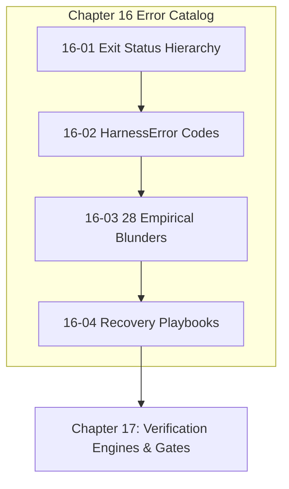

# Chapter 16: Error Catalog & Empirical Blunders

---

[Previous: Chapter 15 Index](../15-state-schemas-and-event-ledger/index.md) | [Chapter Index](index.md) | [All Chapters Index](../index.md) | [Next: 16-01 Exit Status Hierarchy](16-01-exit-status-hierarchy.md)

---

## 1. Chapter Overview & Error Architecture

Welcome to Chapter 16 of the OLT Architecture Book. This chapter codifies the exit status hierarchy, structured error codes, the catalog of 28 empirical agentic blunders, and operational recovery playbooks governing fault tolerance in the **OLT (Orchestrating Long Tasks)** engine.

Distributed autonomous development produces complex edge cases and failure modes. Chapter 16 establishes the Process Exit Status Hierarchy (Codes 0, 1, 2, 3), details the 12 Core `HarnessError` Codes, catalogued the 28 Empirical Blunders discovered through thousands of production hours, and outlines Automated Mitigation & Recovery Playbooks.

```text
┌──────────────────────────────────────────────────────────────────────────────────────────────────┐
│                             CHAPTER 16: ERROR CATALOG TOPOLOGY                                   │
├──────────────────────────────────────────────────────────────────────────────────────────────────┤
│                                                                                                  │
│    ┌───────────────────────────┐                    ┌───────────────────────────┐                │
│    │ 16-01: Exit Status        │                    │ 16-02: HarnessError       │                │
│    │ Hierarchy (Codes 0..3)    │ ══════════════════►│ Codes & Payloads          │                │
│    └─────────────┬─────────────┘                    └─────────────┬─────────────┘                │
│                  │                                                │                              │
│                  ▼                                                ▼                              │
│    ┌───────────────────────────┐                    ┌───────────────────────────┐                │
│    │ 16-03: Twenty-Eight       │                    │ 16-04: Recovery &         │                │
│    │ Empirical Blunders        │ ══════════════════►│ Mitigation Playbooks      │                │
│    └───────────────────────────┘                    └───────────────────────────┘                │
│                                                                                                  │
└──────────────────────────────────────────────────────────────────────────────────────────────────┘
```

---

## 2. Chapter Table of Contents & Learning Path

```text
+--------------------------------------------------+--------------+--------------------------------+
│ Document                                         │ Classification│ Core Architectural Focus       │
+--------------------------------------------------+--------------+--------------------------------+
│ 16-01 Exit Status Hierarchy                      │ Reference    │ Unix codes: 0, 1, 2, 3         │
│ 16-02 HarnessError Codes & Payloads              │ Specification│ 12 structured error envelopes  │
│ 16-03 Twenty-Eight Empirical Blunders            │ Knowledge    │ Real-world failure taxonomy    │
│ 16-04 Recovery & Mitigation Playbooks            │ Operations   │ Automated healing & rollback   │
+--------------------------------------------------+--------------+--------------------------------+
```

### [16-01: Exit Status Hierarchy](16-01-exit-status-hierarchy.md)

Deconstructs the standardized Unix process exit codes:

- `Exit 0`: Clean execution pass.
- `Exit 1`: General execution or test assertion failure.
- `Exit 2`: Invariant or AST purity fault.
- `Exit 3`: Hard Zero security trap or role confinement violation.

### [16-02: HarnessError Codes & Structured Payloads](16-02-harness-error-codes-and-payloads.md)

Catalogues the 12 core error codes: `PERMISSION_DENIED`, `SCOPE_CONFINEMENT_VIOLATION`, `COMMAND_HARD_LOCKED`, `STALE_LEASE_TOKEN`, `PROMPT_CORRUPTION_DETECTED`, `CYCLIC_DEPENDENCY_DETECTED`, `STRAGGLER_TIMEOUT`, etc.

### [16-03: Twenty-Eight Empirical Blunders](16-03-twenty-eight-empirical-blunders.md)

Exhaustively documents the 28 empirical failure modes observed in agentic systems (e.g. cherry-picking prompt lines, circular barrel re-exports, fake empty tests, silent exception swallowing) and their mechanical mitigations.

### [16-04: Recovery & Mitigation Playbooks](16-04-recovery-and-mitigation-playbooks.md)

Provides copy-pasteable operator playbooks for diagnosing and healing crashed capsules (`doctor:heal`), breaking graph deadlocks, and clearing stale worker locks.

---

## 3. Core Error Handling Invariants

1. **Zero Silent Exceptions**: Catching exceptions without re-throwing or mapping to `HarnessError` is strictly prohibited.
2. **Deterministic Exit Codes**: Processes must return exact, structured exit status codes reflecting failure root causes.
3. **Automated Recovery First**: Common failures (torn tails, stale locks) are healed automatically before escalating to operators.



---

## 4. Summary & Transition

The error taxonomies and recovery playbooks established in Chapter 16 ensure that faults in autonomous agent execution are instantly categorized, cleanly contained, and rapidly resolved.

Proceed to [16-01: Exit Status Hierarchy](16-01-exit-status-hierarchy.md) or advance directly to [Chapter 17: Verification Engines & Gate Provers](../17-verification-engines-and-gates/index.md).

---

[Previous: Chapter 15 Index](../15-state-schemas-and-event-ledger/index.md) | [Chapter Index](index.md) | [All Chapters Index](../index.md) | [Next: 16-01 Exit Status Hierarchy](16-01-exit-status-hierarchy.md)

---
