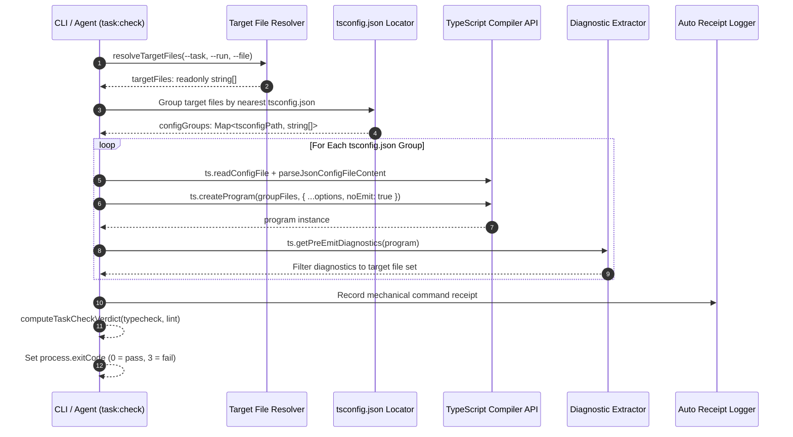

# Incremental TypeScript Typecheck Engine (`task:check`)

[Reference Home](../index.md) > [Verification Engines](./index.md) > Typecheck Engine

---

[Previous: Reference 08: Verification Engines Overview](index.md) | [Chapter Index](index.md) | [All Chapters Index](../index.md) | [Next: 10 AST Static Lint Rules](17-02-ten-ast-static-lint-rules.md)
---

The **Incremental TypeScript Typecheck Engine** provides fast, targeted semantic and syntactic type validation of files within an assigned task write scope without requiring full repository compilation passes.

Implemented in [`olt/scripts/src/cli/commands/task-check.ts`](file:///Users/onurseckinsenoglu/repos/skills/olt/scripts/src/cli/commands/task-check.ts), the engine creates targeted in-process TypeScript Compiler API programs, resolves nearest configuration roots, and aggregates compiler diagnostics into deterministic verification verdicts.

---

## 1. Architecture & Program Creation Pipeline

The Typecheck Engine isolates compilation to the files modified or targeted by a task. Rather than launching an external `tsc` CLI process that traverses the entire repository, it uses the programmatic `ts.createProgram` API to instantiate an in-memory compiler program bound exclusively to the target file set and its direct import graphs.



### 1.1 In-Process Program Creation vs CLI `tsc`

```text
┌────────────────────────────────────────┬────────────────────────────────────────┐
│ TRADITIONAL FULL REPO `tsc --noEmit`   │ OLT INCREMENTAL IN-PROCESS TYPECHECK   │
├────────────────────────────────────────┼────────────────────────────────────────┤
│ • Parses all 50,000+ files in project  │ • Parses ONLY target files + imports   │
│ • Execution time: 15,000ms – 60,000ms  │ • Execution time: 120ms – 850ms        │
│ • Noisy out-of-scope errors block task │ • Filters diagnostics to write scope   │
│ • Heavy fork/exec process overhead     │ • Direct TypeScript Compiler API calls │
│ • Blind to task boundary invariants    │ • Bound to task write_scope in capsule │
└────────────────────────────────────────┴────────────────────────────────────────┘
```

---

## 2. Target File Scope Resolution Algorithm

The engine resolves target files through [`resolveTargetFiles(options)`](file:///Users/onurseckinsenoglu/repos/skills/olt/scripts/src/cli/commands/task-check.ts#L173-L287) using a strict three-tier precedence model:

```text
┌─────────────────────────────────────────────────────────────────────────────┐
│                    TARGET FILE RESOLUTION PRECEDENCE                        │
├─────────────────────────────────────────────────────────────────────────────┤
│ 1. Explicit Flags: --file <path1>,<path2>                                   │
│    • Resolves individual files or crawls directories recursively (depth 10) │
│    • Ignores node_modules/ and .git/                                        │
│                                                                             │
│ 2. Task Write Scope: --task <id> --run <capsule-path>                       │
│    • Inspects state.json for task.target_files and task.write_scope         │
│    • Expands directories into supported source files                        │
│                                                                             │
│ 3. Whole Capsule Run: --run <capsule-path> (without --task)                 │
│    • Collects write_scope from all tasks across the capsule run             │
└─────────────────────────────────────────────────────────────────────────────┘
```

### 2.1 Supported File Extensions

Defined in [`SUPPORTED_EXTENSIONS`](file:///Users/onurseckinsenoglu/repos/skills/olt/scripts/src/cli/commands/task-check.ts#L26-L35):

- **TypeScript**: `.ts`, `.tsx`, `.mts`, `.cts`
- **JavaScript**: `.js`, `.jsx`, `.mjs`, `.cjs`

Files with unrecognized extensions (`.json`, `.md`, `.css`, `.png`) are automatically filtered out prior to program creation.

```typescript
export function isSupportedSourceFile(fileName: string): boolean {
  for (const ext of SUPPORTED_EXTENSIONS) {
    if (fileName.endsWith(ext)) {
      return true;
    }
  }
  return false;
}
```

---

## 3. `tsconfig.json` Hierarchical Resolution

For each target file, the engine identifies the nearest compilation boundary using [`findNearestTsconfig(filePath)`](file:///Users/onurseckinsenoglu/repos/skills/olt/scripts/src/cli/commands/task-check.ts#L292-L316):

```text
       Target File: /repo/packages/core/src/parser/ast.ts
                              │
                              ▼
        Does /repo/packages/core/src/parser/tsconfig.json exist? ──► NO
                              │
                              ▼
        Does /repo/packages/core/src/tsconfig.json exist? ─────────► NO
                              │
                              ▼
        Does /repo/packages/core/tsconfig.json exist? ─────────────► YES!
                              │
                              ▼
    [Bind ast.ts to /repo/packages/core/tsconfig.json Compiler Program]
```

### 3.1 Resolution Algorithm Steps

1. Start at `dirname(filePath)` (or `filePath` if it is a directory).
2. Invoke `ts.findConfigFile(startDir, ts.sys.fileExists, "tsconfig.json")`.
3. If not found in parent tree, fallback to `ts.findConfigFile(process.cwd(), ts.sys.fileExists, "tsconfig.json")`.
4. If no `tsconfig.json` is located in the entire filesystem ancestry, the file is routed to the **Strict Default Fallback Program**.

### 3.2 Strict Fallback Compiler Options

When no `tsconfig.json` exists, the fallback compiler program enforces the strictest modern ECMAScript standard:

```typescript
const fallbackCompilerOptions: ts.CompilerOptions = {
  noEmit: true,
  strict: true,
  target: ts.ScriptTarget.ES2024,
  moduleResolution: ts.ModuleResolutionKind.Bundler,
};
```

---

## 4. Program Diagnostics & Zero-Error Invariant

The typechecker invokes `ts.getPreEmitDiagnostics(program)` to collect syntactic parse errors, semantic type mismatches, and declaration diagnostics.

```typescript
export interface TypeCheckDiagnostic {
  readonly file: string;
  readonly line: number;
  readonly column: number;
  readonly code: number;
  readonly message: string;
  readonly category: "error" | "warning" | "message" | "suggestion";
  readonly snippet?: string | undefined;
}

export interface TypeCheckResult {
  readonly passed: boolean;
  readonly totalFiles: number;
  readonly totalErrors: number;
  readonly totalWarnings: number;
  readonly diagnostics: readonly TypeCheckDiagnostic[];
}
```

### 4.1 Scope Filtering Mechanism

`ts.getPreEmitDiagnostics(program)` may return diagnostics from imported library files or external project files. The engine strictly isolates diagnostics to the target file set:

```typescript
const targetAbsPaths = new Set(groupFiles.map((f) => resolve(f)));

for (const diag of rawDiagnostics) {
  let fileName = "unknown";
  let isTarget = false;

  if (diag.file !== undefined) {
    fileName = diag.file.fileName;
    isTarget = targetAbsPaths.has(resolve(fileName));
  } else {
    // Global compilation errors (e.g. invalid tsconfig options) apply to project
    isTarget = true;
  }

  if (!isTarget) {
    continue; // Suppress out-of-scope errors from unmodified files
  }
  // Record diagnostic...
}
```

### 4.2 The Zero-Error Invariant

> [!CAUTION]
> **Zero-Error Invariant**: Any diagnostic where `category === "error"` (e.g. `TS2322` Type mismatch, `TS2339` Property does not exist, `TS7006` Implicit any, `TS2345` Argument type incompatible) immediately marks `passed = false` and causes process termination with exit code `3`.

```typescript
const totalErrors = allDiagnostics.filter((d) => d.category === "error").length;
const totalWarnings = allDiagnostics.filter((d) => d.category === "warning").length;

return {
  passed: totalErrors === 0,
  totalFiles: tsFiles.length,
  totalErrors,
  totalWarnings,
  diagnostics: allDiagnostics,
};
```

---

## 5. CLI Invocation & Parameter Grammar

```bash
bun olt/scripts/harness.ts task:check [--task <id>] [--run <path>] [--file <paths>] [--typecheck] [--lint] [--format <markdown|json>]
```

### 5.1 CLI Parameters Matrix

| Flag          | Argument Type                            | Mandatory?  | Default          | Description                                                                                           |
| :------------ | :--------------------------------------- | :---------- | :--------------- | :---------------------------------------------------------------------------------------------------- |
| `--task`      | `string`                                 | Conditional | `undefined`      | Task ID whose `write_scope` and `target_files` define the audit set. Requires `--run`.                |
| `--run`       | `string`                                 | Conditional | `undefined`      | Absolute or relative path to the `.olt/capsules/<slug>` run root.                                     |
| `--file`      | `string` (repeatable or comma-separated) | Conditional | `undefined`      | Explicit file paths or directory paths to verify.                                                     |
| `--typecheck` | `boolean` (flag)                         | Optional    | `true` (default) | Explicitly requests TypeScript typecheck pass.                                                        |
| `--lint`      | `boolean` (flag)                         | Optional    | `false`          | When passed alone without `--typecheck`, executes AST static linters only.                            |
| `--format`    | `"markdown"` \| `"json"`                 | Optional    | `"markdown"`     | Output format: `"markdown"` for terminal briefings or `"json"` for structured programmatic pipelines. |

> [!IMPORTANT]
> **Always-On AST Invariant**: The AST static invariant audit (10 rules) is non-negotiable and runs unconditionally during every `task:check` invocation. `--typecheck` is additive. Specifying `--lint` without `--typecheck` is the only way to execute the AST audit while skipping the slower `ts.createProgram` compiler pass.

---

## 6. Output Schemas & Concrete Exemplars

### 6.1 JSON Structured Payload Output (`--format json`)

When invoked with `--format json`, the engine outputs a JSON object adhering to the following schema:

```json
{
  "passed": false,
  "runRoot": "/repo/.olt/capsules/feature-auth",
  "taskId": "task-impl-auth-tokens",
  "filesChecked": ["/repo/src/auth/token-manager.ts", "/repo/src/auth/token-types.ts"],
  "typecheck": {
    "passed": false,
    "totalFiles": 2,
    "totalErrors": 2,
    "totalWarnings": 0,
    "diagnostics": [
      {
        "file": "/repo/src/auth/token-manager.ts",
        "line": 42,
        "column": 11,
        "code": 2322,
        "message": "Type 'string | null' is not assignable to type 'string'. Type 'null' is not assignable to type 'string'.",
        "category": "error",
        "snippet": "const token: string = parseHeader(req);"
      },
      {
        "file": "/repo/src/auth/token-manager.ts",
        "line": 87,
        "column": 18,
        "code": 2339,
        "message": "Property 'expiresIn' does not exist on type 'TokenPayload'.",
        "category": "error",
        "snippet": "const ttl = payload.expiresIn;"
      }
    ]
  },
  "lint": {
    "passed": true,
    "totalFiles": 2,
    "totalViolations": 0,
    "violations": [],
    "summaryByRule": {
      "nullish_coalescing": 0,
      "logical_or_fallback": 0,
      "any_type": 0,
      "non_null_assertion": 0,
      "vendor_leak": 0,
      "compiler_suppression": 0,
      "mock_tautology": 0,
      "trivial_assertion": 0,
      "empty_test_body": 0,
      "trivial_early_return": 0
    }
  },
  "durationMs": 342,
  "format": "json"
}
```

### 6.2 Terminal Markdown Briefing Output (`--format markdown`)

```text
###  Incremental Verification: Task `task-impl-auth-tokens`
[FAIL] **FAIL: Verification Violations Detected**

- **Duration**: 342ms
- **Files Audited**: 2
- **Capsule Run**: `/repo/.olt/capsules/feature-auth`
- **Task ID**: `task-impl-auth-tokens`

####  TypeScript Incremental Type Check
- Status: **Failed** (2 errors across 2 files)

| Location | Code | Message |
| :--- | :--- | :--- |
| `/repo/src/auth/token-manager.ts:42:11` | TS2322 | Type 'string \| null' is not assignable to type 'string'. Type 'null' is not assignable to type 'string'. |
| `/repo/src/auth/token-manager.ts:87:18` | TS2339 | Property 'expiresIn' does not exist on type 'TokenPayload'. |

####  AST Static Invariant & Linter Audit
- Status: **Passed** (0 violations, strict 0 'any', 0 compiler suppressions maintained)
```

---

## 7. Mechanical Evidence Persistence

When `--run` is supplied, `task:check` automatically writes a persistent diagnostic report to `.olt/capsules/<slug>/evidence/mechanic-report-<task-id>.json` (or `evidence/mechanic-report.json`).

This artifact provides verifiable Class 1 mechanical proof that typechecking succeeded prior to gate verification and task submission (`task:submit`).

---

[Previous: Reference 08: Verification Engines Overview](index.md) | [Chapter Index](index.md) | [All Chapters Index](../index.md) | [Next: 10 AST Static Lint Rules](17-02-ten-ast-static-lint-rules.md)
---
