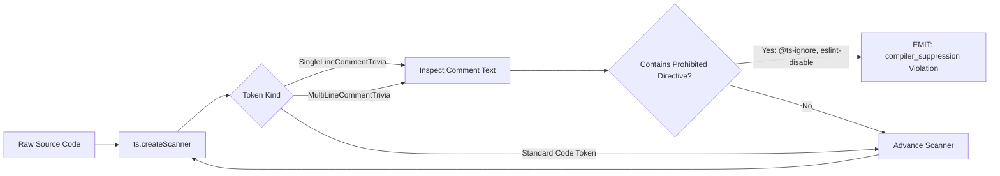

# The 10 AST Static Invariant Lint Rules

[Reference Home](../index.md) > [Verification Engines](./index.md) > 10 AST Static Lint Rules

---

[Previous: Typecheck Engine](17-01-typecheck-engine.md) | [Chapter Index](index.md) | [All Chapters Index](../index.md) | [Next: APCA Perceptual Contrast Engine](17-03-apca-perceptual-contrast-engine.md)
---

The **AST Static Invariant Auditor** ([`olt/scripts/src/linter/ast-enforcer.ts`](file:///Users/onurseckinsenoglu/repos/skills/olt/scripts/src/linter/ast-enforcer.ts)) parses TypeScript and JavaScript source files into abstract syntax trees to enforce 10 non-negotiable code hygiene, typing safety, vendor neutrality, and test honesty invariants.

In the OLT runtime, these rules execute unconditionally during `bun harness.ts task:check`. Any violation produces an immediate verification failure, preventing tasks with degraded code, suppressed compiler warnings, or tautological mock tests from being submitted.

---

## Master AST Rule Catalog

```text
┌────────────────────────────────────────────────────────────────────────────────────────────────────────┐
│                                 THE 10 MANDATORY AST LINT INVARIANTS                                   │
├────┬────────────────────────┬────────────────────────────────┬─────────────────────────────────────────┤
│ #  │ Rule Identifier        │ Target AST Node / Token        │ Invariant & Policy Summary              │
├────┼────────────────────────┼────────────────────────────────┼─────────────────────────────────────────┤
│ 1  │ `any_type`             │ `SyntaxKind.AnyKeyword`        │ Strict 0 `any` annotations or casts.    │
├────┼────────────────────────┼────────────────────────────────┼─────────────────────────────────────────┤
│ 2  │ `compiler_suppression` │ Comment Trivia Scanner Tokens  │ Prohibits `@ts-ignore`, `eslint-disable`│
├────┼────────────────────────┼────────────────────────────────┼─────────────────────────────────────────┤
│ 3  │ `non_null_assertion`   │ `SyntaxKind.NonNullExpression` │ Prohibits postfix `!` operator.         │
├────┼────────────────────────┼────────────────────────────────┼─────────────────────────────────────────┤
│ 4  │ `vendor_leak`          │ Identifiers, Imports, Literals │ Prohibits hardcoded AI vendor brands.   │
├────┼────────────────────────┼────────────────────────────────┼─────────────────────────────────────────┤
│ 5  │ `logical_or_fallback`  │ `BinaryExpression (\|\|)`      │ Prohibits falsy-blind OR fallbacks.     │
├────┼────────────────────────┼────────────────────────────────┼─────────────────────────────────────────┤
│ 6  │ `nullish_coalescing`   │ `BinaryExpression (??)`        │ Prohibits unverified nullish fallbacks. │
├────┼────────────────────────┼────────────────────────────────┼─────────────────────────────────────────┤
│ 7  │ `mock_tautology`       │ Test `CallExpression`          │ Catches tests asserting mocks directly. │
├────┼────────────────────────┼────────────────────────────────┼─────────────────────────────────────────┤
│ 8  │ `trivial_assertion`    │ Assertion `CallExpression`     │ Catches constant vs constant checks.    │
├────┼────────────────────────┼────────────────────────────────┼─────────────────────────────────────────┤
│ 9  │ `empty_test_body`      │ Test `CallExpression`          │ Catches test blocks with 0 statements.  │
├────┼────────────────────────┼────────────────────────────────┼─────────────────────────────────────────┤
│ 10 │ `trivial_early_return` │ Test Callback `ReturnStatement`│ Catches early return before assertions. │
└────┴────────────────────────┴────────────────────────────────┴─────────────────────────────────────────┘
```

---

## 1. Rule 1: `any_type`

- **Implementation**: [`olt/scripts/src/linter/rules/any_type.ts`](file:///Users/onurseckinsenoglu/repos/skills/olt/scripts/src/linter/rules/any_type.ts)
- **AST Node Matcher**: `node.kind === ts.SyntaxKind.AnyKeyword`
- **Invariant**: Strict 0 occurrences of the `any` keyword in variable declarations, function signatures, interface properties, type aliases, or cast expressions.
- **Violation Message**: `"Prohibited 'any' type annotation detected. Use strict types or type guards instead."`

### 1.1 AST Detection Mechanism

```text
    TypeReference / TypeNode
             │
             ▼
    [SyntaxKind.AnyKeyword] ──► (MATCH: Emits any_type violation)
```

The rule intercepts any TypeScript AST node matching `ts.SyntaxKind.AnyKeyword`. This includes explicit type annotations (`x: any`), return type annotations (`(): any`), generic parameters (`Array<any>`), and type assertions (`val as any` or `<any>val`).

### 1.2 Code Exemplars

```typescript
// [FAIL] VIOLATION: Unsafe any usage
function parsePayload(raw: any): any {
  const data = raw as any;
  return data.value;
}

// [PASS] GOOD: Type-safe generics and unknown with runtime type narrowing
function parsePayload<T extends Record<string, unknown>>(raw: T): unknown {
  const data = raw as unknown as { value: unknown };
  if (typeof data === "object" && data !== null && "value" in data) {
    return data.value;
  }
  throw new Error("Invalid payload structure");
}
```

### 1.3 Remediation Strategy

1. Replace `any` with `unknown` when incoming data types cannot be statically verified at compile time.
2. Use TypeScript **User-Defined Type Guards** (`function isFoo(v: unknown): v is Foo`) to safely narrow types.
3. Use generic type constraints (`<T extends Record<string, unknown>>`) rather than erasing types.

---

## 2. Rule 2: `compiler_suppression`

- **Implementation**: [`olt/scripts/src/linter/rules/compiler_suppression.ts`](file:///Users/onurseckinsenoglu/repos/skills/olt/scripts/src/linter/rules/compiler_suppression.ts)
- **Scanner Mechanism**: Tokenizes source text with `ts.createScanner(ts.ScriptTarget.Latest, false, languageVariant, sourceCode)` scanning `ts.SyntaxKind.SingleLineCommentTrivia` and `ts.SyntaxKind.MultiLineCommentTrivia`.
- **Prohibited Directives**:
  - `@ts-ignore`, `@ts-expect-error`, `@ts-nocheck`, `@ts-check`
  - `eslint-disable`, `eslint-disable-line`, `eslint-disable-next-line`
- **Violation Message**: `"Prohibited compiler suppression directive '<directive>' detected."`

### 2.1 Scanner Tokenization Architecture



### 2.2 Code Exemplars

```typescript
// [FAIL] VIOLATION: Suppressing typechecker errors
// @ts-ignore
const result = unsafeMethodCall();

/* eslint-disable @typescript-eslint/no-explicit-any */
const config = loadRawConfig();

// [FAIL] VIOLATION: Ignoring expected type mismatch
// @ts-expect-error Type string not assignable to number
const count: number = "10";

// [PASS] GOOD: Correct typing without suppression
interface ConfigLoader {
  loadRawConfig(): Record<string, unknown>;
}
const config: Record<string, unknown> = loadRawConfig();
const count: number = parseInt("10", 10);
```

### 2.3 Remediation Strategy

1. Eliminate the comment suppression directive entirely.
2. Refactor the underlying types, export signatures, or imported interfaces to satisfy the compiler naturally.

---

## 3. Rule 3: `non_null_assertion`

- **Implementation**: [`olt/scripts/src/linter/rules/non_null_assertion.ts`](file:///Users/onurseckinsenoglu/repos/skills/olt/scripts/src/linter/rules/non_null_assertion.ts)
- **AST Node Matcher**: `ts.isNonNullExpression(node)` (postfix `!` operator).
- **Invariant**: Strict 0 non-null assertion operators (`!`).
- **Violation Message**: `"Prohibited non-null assertion operator (!) detected. Use explicit branching and runtime verification."`

### 3.1 AST Detection Mechanism

```text
    NonNullExpression (node.kind === SyntaxKind.NonNullExpression)
             │
             ├── expression: Identifier ("user")
             └── exclamationToken: ExclamationToken ("!")
             │
             ▼
    (MATCH: Emits non_null_assertion violation)
```

### 3.2 Code Exemplars

```typescript
// [FAIL] VIOLATION: Assuming non-null state
function getUsername(user?: { name: string }): string {
  return user!.name; // Crash if user is undefined
}

const element = document.getElementById("root")!;

// [PASS] GOOD: Explicit runtime guards & defensive branching
function getUsername(user?: { name: string }): string {
  if (user === undefined || user === null) {
    throw new Error("user must be defined");
  }
  return user.name;
}

const element = document.getElementById("root");
if (element === null) {
  throw new Error("DOM root element '#root' not found");
}
```

### 3.3 Remediation Strategy

1. Guard nullable variables with `if (val === undefined || val === null)` checks before member access.
2. Throw explicit descriptive errors (`HarnessError("INVALID_STATE", ...)`) when mandatory runtime invariants are breached.

---

## 4. Rule 4: `vendor_leak`

- **Implementation**: [`olt/scripts/src/linter/rules/vendor_leak.ts`](file:///Users/onurseckinsenoglu/repos/skills/olt/scripts/src/linter/rules/vendor_leak.ts)
- **AST Target Nodes**: `ts.isIdentifier`, `ts.isImportDeclaration`, `ts.isExportDeclaration`, `ts.isCallExpression` (e.g. `require()`), and `ts.isStringLiteral`.
- **Prohibited Vendor Deny-List**:
  ```typescript
  export const DEFAULT_PROHIBITED_VENDORS = [
    "anthropic",
    "openai",
    "gemini",
    "claude",
    "chatgpt",
    "gpt-4",
    "gpt-3",
    "sonnet",
    "haiku",
    "opus",
    "dall-e",
    "llama",
    "deepseek",
    "mistral",
    "qwen",
    "cohere",
  ] as const;
  ```
- **Violation Message**: `"Prohibited vendor identifier '<vendor>' found in '<identifier>'."`

### 4.1 Identifier Normalization & Exemption Rules

The rule splits identifiers into words using camelCase, PascalCase, and snake_case boundary heuristics:

```typescript
export function extractIdentifierWords(identifier: string): readonly string[] {
  return identifier
    .replace(/([a-z0-9])([A-Z])/gu, "$1 $2")
    .replace(/([A-Z]+)([A-Z][a-z])/gu, "$1 $2")
    .split(/[^A-Za-z0-9]+/u)
    .filter((word) => word.length > 0)
    .map((word) => word.toLowerCase());
}
```

> [!NOTE]
> **Vendor Config Exemption**: String literals located inside variable declarations whose identifier includes `"VENDOR"` (e.g. `const PROHIBITED_VENDORS = [...]`) are exempt via `isInsideVendorConfigDefinition(node)`.

### 4.2 Code Exemplars

```typescript
// [FAIL] VIOLATION: Vendor leak in function name & string literals
class ClaudeAiClient {
  async callOpenAiApi(prompt: string): Promise<string> {
    return fetch("https://api.openai.com/v1/chat/completions", {
      body: JSON.stringify({ model: "gpt-4-turbo", prompt }),
    });
  }
}

// [PASS] GOOD: Neutral naming & dynamic provider abstractions
interface ModelClient {
  generateCompletion(prompt: string): Promise<string>;
}

class StandardHostModelAdapter implements ModelClient {
  constructor(
    private readonly endpoint: string,
    private readonly modelId: string,
  ) {}
  async generateCompletion(prompt: string): Promise<string> {
    return fetch(this.endpoint, {
      body: JSON.stringify({ model: this.modelId, prompt }),
    });
  }
}
```

---

## 5. Rule 5: `logical_or_fallback`

- **Implementation**: [`olt/scripts/src/linter/rules/logical_or_fallback.ts`](file:///Users/onurseckinsenoglu/repos/skills/olt/scripts/src/linter/rules/logical_or_fallback.ts)
- **AST Node Matcher**: `ts.isBinaryExpression(node) && node.operatorToken.kind === ts.SyntaxKind.BarBarToken` (`||`).
- **Invariant**: Prohibits falsy-blind `||` operators that inadvertently replace valid falsy values (`0`, `""`, `false`, `NaN`) with fallback defaults.
- **Violation Message**: `"Prohibited logical OR operator (||) detected. Use explicit branching instead."`

### 5.1 The Falsy Trap

```text
Expression: const limit = userConfig.limit || 100;
Problem:    If user explicitly sets limit = 0 (disable limit),
            0 is falsy, so limit incorrectly evaluates to 100!
```

### 5.2 Code Exemplars

```typescript
// [FAIL] VIOLATION: Unsafe logical OR fallback
const port = process.env.PORT || 3000;
const label = button.title || "Default Title";
const maxRetries = options.retries || 5;

// [PASS] GOOD: Explicit ternary checks or boolean verification
const port =
  process.env.PORT !== undefined && process.env.PORT.trim().length > 0
    ? parseInt(process.env.PORT, 10)
    : 3000;

const label =
  typeof button.title === "string" && button.title.length > 0 ? button.title : "Default Title";

const maxRetries = typeof options.retries === "number" ? options.retries : 5;
```

---

## 6. Rule 6: `nullish_coalescing`

- **Implementation**: [`olt/scripts/src/linter/rules/nullish_coalescing.ts`](file:///Users/onurseckinsenoglu/repos/skills/olt/scripts/src/linter/rules/nullish_coalescing.ts)
- **AST Node Matcher**: `ts.isBinaryExpression(node) && node.operatorToken.kind === ts.SyntaxKind.QuestionQuestionToken` (`??`).
- **Invariant**: Prohibits unverified `??` fallbacks that obscure missing data and mask upstream schema regressions.
- **Violation Message**: `"Prohibited nullish coalescing operator (??) detected. Use explicit branching instead."`

### 6.1 Code Exemplars

```typescript
// [FAIL] VIOLATION: Unverified fallback
const timeoutMs = config.timeoutMs ?? 5000;
const userName = profile.name ?? "Anonymous";

// [PASS] GOOD: Explicit branching with full branch visibility
const timeoutMs =
  config.timeoutMs !== undefined && config.timeoutMs !== null ? config.timeoutMs : 5000;

let userName = "Anonymous";
if (profile.name !== undefined && profile.name !== null) {
  userName = profile.name;
}
```

---

## 7. Rule 7: `mock_tautology`

- **Implementation**: [`olt/scripts/src/linter/rules/testing/mock_tautology.ts`](file:///Users/onurseckinsenoglu/repos/skills/olt/scripts/src/linter/rules/testing/mock_tautology.ts)
- **Mechanism**: Inspects test declarations (`describe`, `test`, `it`). Analyzes mock variable definitions (`mock`, `fn`, `spyOn`, `mockReturnValue`, `mockResolvedValue`) and verifies whether test assertions verify the mock's stubbed return value directly without exercising the System Under Test (SUT).
- **Violation Message**: `"Test '<testName>' asserts stubbed mock '<mockName>()' return value (<val>) directly without exercising implementation logic."`

### 7.1 AST Tautology Flow Analysis

```mermaid
flowchart TD
    TEST["test('should calculate tax', () => { ... })"] --> MOCK["const calculate = vi.fn().mockReturnValue(42);"]
    MOCK --> SUT{"Is calculate passed to SUT or called by SUT?"}
    SUT -->|No| ASSERT["expect(calculate()).toBe(42);"]
    ASSERT --> VIOL["EMIT: mock_tautology Violation\n(Asserting mock against its own stubbed return value)"]
    SUT -->|Yes: invoiceService.setCalculator(calculate); invoiceService.run();| PASS["expect(invoiceService.total).toBe(142);"]
    PASS --> OK["PASS: SUT logic exercised"]
```

### 7.2 Code Exemplars

```typescript
// [FAIL] VIOLATION: Mock tautology (testing mock return, not SUT)
test("user authentication test", () => {
  const authMock = vi.fn().mockReturnValue({ authenticated: true });
  // SUT is never called!
  expect(authMock().authenticated).toBe(true);
});

// [PASS] GOOD: Mock injected into System Under Test (SUT)
test("user authentication test", async () => {
  const authProvider = { verifyToken: vi.fn().mockReturnValue({ userId: "u-123" }) };
  const authService = new AuthService(authProvider); // SUT instantiated

  const result = await authService.authenticateSession("valid-token");

  expect(result.status).toBe("success");
  expect(result.userId).toBe("u-123");
  expect(authProvider.verifyToken).toHaveBeenCalledWith("valid-token");
});
```

---

## 8. Rule 8: `trivial_assertion`

- **Implementation**: [`olt/scripts/src/linter/rules/testing/trivial_assertion.ts`](file:///Users/onurseckinsenoglu/repos/skills/olt/scripts/src/linter/rules/testing/trivial_assertion.ts)
- **AST Node Matcher**: Assertion `CallExpression` matching constant-against-constant checks:
  - `assert(true)`
  - `expect(true).toBe(true)` or `expect(false).toBe(false)`
  - `expect(1).toBe(1)` or `expect("foo").toBe("foo")`
  - `expect(x).toBe(x)` (comparing identifier against itself)
  - `expect(true).toBeTruthy()`, `expect(false).toBeFalsy()`, `expect(null).toBeNull()`
- **Violation Message**: `"Trivial constant assertion comparing literal against itself: '<snippet>'."`

### 8.1 Code Exemplars

```typescript
// [FAIL] VIOLATION: Trivial always-green assertions
test("database connection works", () => {
  db.connect();
  expect(true).toBe(true); // Always passes regardless of db state
  assert(true);
  const status = "ok";
  expect(status).toBe(status); // Comparing variable to itself
});

// [PASS] GOOD: Meaningful assertion on actual runtime state
test("database connection works", async () => {
  const db = new DatabaseClient();
  await db.connect();

  const isHealthy = await db.ping();
  expect(isHealthy).toBe(true);
  expect(db.connectionState).toBe("CONNECTED");
});
```

---

## 9. Rule 9: `empty_test_body`

- **Implementation**: [`olt/scripts/src/linter/rules/testing/empty_test_body.ts`](file:///Users/onurseckinsenoglu/repos/skills/olt/scripts/src/linter/rules/testing/empty_test_body.ts)
- **AST Node Matcher**: Test `CallExpression` (`test(...)`, `it(...)`) where the callback function has no body (`callback.body === undefined`) or contains 0 statements (`callback.body.statements.length === 0`).
- **Violation Message**: `"Test '<testName>' has an empty function body."`

### 9.1 Code Exemplars

```typescript
// [FAIL] VIOLATION: Empty placeholder tests
test("should validate email format", () => {});

it("should handle network disconnects", async () => {
  // TODO: implement later
});

// [PASS] GOOD: Implemented test with executable assertions
test("should validate email format", () => {
  const validator = new EmailValidator();
  expect(validator.validate("user@example.com")).toBe(true);
  expect(validator.validate("invalid-email")).toBe(false);
});
```

---

## 10. Rule 10: `trivial_early_return`

- **Implementation**: [`olt/scripts/src/linter/rules/testing/trivial_early_return.ts`](file:///Users/onurseckinsenoglu/repos/skills/olt/scripts/src/linter/rules/testing/trivial_early_return.ts)
- **AST Node Matcher**: Test callback containing a `ts.ReturnStatement` before any executable assertion call is reached in statement order.
- **Violation Message**: `"Test '<testName>' has early return before any assertion was reached."`

### 10.1 Code Exemplars

```typescript
// [FAIL] VIOLATION: Early return bypassing assertions
test("handles conditional feature flag", () => {
  const isEnabled = checkFeatureFlag("experimental-mode");
  if (!isEnabled) {
    return; // [FAIL] Test silently passes without asserting anything!
  }
  const result = runExperimentalFeature();
  expect(result.success).toBe(true);
});

// [PASS] GOOD: Assertions covering all conditional execution paths
test("handles conditional feature flag", () => {
  const isEnabled = checkFeatureFlag("experimental-mode");
  if (!isEnabled) {
    expect(isEnabled).toBe(false);
    expect(runExperimentalFeature).toThrowError("Feature disabled");
    return;
  }
  const result = runExperimentalFeature();
  expect(result.success).toBe(true);
});
```

---

## 11. Deterministic Autofix Engine (`autoFixSourceCode`)

The AST subsystem provides deterministic source code refactoring capabilities in [`olt/scripts/src/linter/ast/autofix.ts`](file:///Users/onurseckinsenoglu/repos/skills/olt/scripts/src/linter/ast/autofix.ts):

```typescript
export function autoFixSourceCode(
  sourceCode: string,
  filePath?: string,
  options?: AstLintOptions,
): AutoFixResult;
```

### 11.1 Transformation Pipeline

1. **Suppression Stripping**: Regex removes all single-line and multi-line comment suppression directives (`// @ts-ignore`, `/* eslint-disable */`).
2. **Type Assertion Sanitization**: Transforms all `\bas\s+any\b` occurrences into `as unknown`.
3. **Nullish Coalescing Expansion**: Expands `a ?? b` expressions into explicit ternary conditionals: `(a !== undefined && a !== null ? a : b)`.
4. **Post-Fix Verification**: Re-runs `lintSourceCode` on the modified buffer to verify that transformations resolved violations without introducing syntactic defects.

---

[Previous: Typecheck Engine](17-01-typecheck-engine.md) | [Chapter Index](index.md) | [All Chapters Index](../index.md) | [Next: APCA Perceptual Contrast Engine](17-03-apca-perceptual-contrast-engine.md)
---
