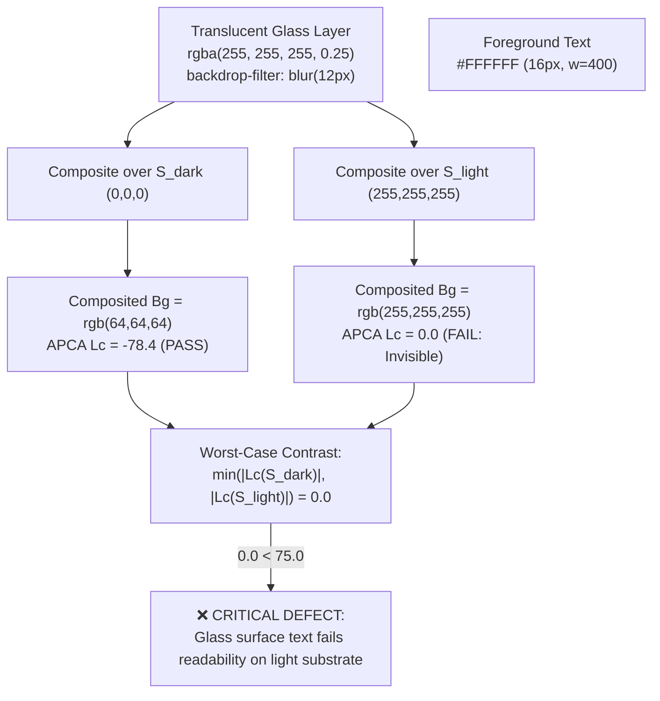

# APCA Perceptual Contrast Engine

[Reference Home](../index.md) > [Verification Engines](./index.md) > APCA Perceptual Contrast Engine

---

[⏮️ Previous: 10 AST Static Lint Rules](17-02-ten-ast-static-lint-rules.md) | [📂 Chapter Index](index.md) | [📚 All Chapters Index](../index.md) | [⏭️ Next: Binary PNG IHDR Chunk Engine](17-04-png-ihdr-binary-chunk-engine.md)
---

The **Accessible Perceptual Contrast Algorithm (APCA)** engine evaluates human visual readability and text legibility using spatial psychophysics, non-linear photopic luminance, polarity asymmetry power curves, and multi-substrate glass layer physics.

Unlike legacy WCAG 2.x ratio formulas ($\frac{L_1 + 0.05}{L_2 + 0.05}$) which suffer from severe perceptual distortions in dark mode and fail to account for spatial frequency (font size and weight), the OLT APCA engine models actual human retinal response.

Implemented in [`olt/scripts/src/capture/validator/mechanical/apca.ts`](file:///Users/onurseckinsenoglu/repos/skills/olt/scripts/src/capture/validator/mechanical/apca.ts) and [`olt/scripts/src/heuristics/glass-surfaces/evaluator.ts`](file:///Users/onurseckinsenoglu/repos/skills/olt/scripts/src/heuristics/glass-surfaces/evaluator.ts), the engine evaluates DOM element styles and glass overlay surfaces against mathematical readability thresholds.

---

## 🧮 1. Mathematical Formulation & Calculation Pipeline

```text
       [Raw Foreground & Background Colors: Hex, RGB, RGBA, HSL]
                                 │
                                 ▼
              ┌─────────────────────────────────────┐
              │ 1. Strict Color Parsing & RGBA Norm │
              │    parseColorToRgba(colorStr)       │
              └─────────────────────────────────────┘
                                 │
                                 ▼
              ┌─────────────────────────────────────┐
              │ 2. sRGB Gamma Linearization         │
              │    C_lin = (C / 255)^2.4            │
              └─────────────────────────────────────┘
                                 │
                                 ▼
              ┌─────────────────────────────────────┐
              │ 3. CIE 1931 Photopic Luminance (Y)  │
              │    Y = 0.2126729*R + 0.7151522*G    │
              │        + 0.0721750*B                │
              └─────────────────────────────────────┘
                                 │
                                 ▼
              ┌─────────────────────────────────────┐
              │ 4. Retinal Flare Soft Black Toe Lift│
              │    If Y < 0.022:                    │
              │    Y = Y + (0.022 - Y)^1.414        │
              └─────────────────────────────────────┘
                                 │
                                 ▼
              ┌─────────────────────────────────────┐
              │ 5. Polarity Asymmetry Power Curves  │
              │    Dark on Light vs Light on Dark   │
              └─────────────────────────────────────┘
                                 │
                                 ▼
              ┌─────────────────────────────────────┐
              │ 6. Noise Floor Clamp & Output Scale │
              │    Compute Lightness Contrast Lc    │
              └─────────────────────────────────────┘
                                 │
                                 ▼
              ┌─────────────────────────────────────┐
              │ 7. Spatial Frequency Verification   │
              │    Font Size (px) & Weight (w) Check│
              └─────────────────────────────────────┘
```

---

## 🔬 2. Step-by-Step Mathematical Derivations

### 2.1 Step 1: Color Parsing & Normalization

The engine parses all standard CSS color representations:

- **Hex**: `#RGB`, `#RGBA`, `#RRGGBB`, `#RRGGBBAA`
- **RGB/RGBA**: `rgb(r, g, b)`, `rgba(r, g, b, a)`, percentages `rgb(100%, 0%, 0%)`
- **HSL/HSLA**: `hsl(h, s%, l%)`, `hsla(h, s%, l%, a)`
- **Named Literals**: `white`, `black`, `transparent`

### 2.2 Step 2: sRGB Gamma Linearization

Raw 8-bit digital color channels ($C \in [0, 255]$) are non-linear due to display gamma encoding ($\gamma \approx 2.4$). The engine linearizes each channel into normalized optical intensity:

$$R_{\text{lin}} = \left(\frac{R}{255}\right)^{2.4}, \quad G_{\text{lin}} = \left(\frac{G}{255}\right)^{2.4}, \quad B_{\text{lin}} = \left(\frac{B}{255}\right)^{2.4}$$

### 2.3 Step 3: CIE 1931 Photopic Relative Luminance ($Y$)

Linear optical channels are converted into human photopic luminance ($Y \in [0, 1]$) using CIE 1931 standard spectral sensitivity coefficients:

$$Y = 0.2126729 \cdot R_{\text{lin}} + 0.7151522 \cdot G_{\text{lin}} + 0.0721750 \cdot B_{\text{lin}}$$

Let $Y_{\text{txt}}$ be the relative luminance of foreground text, and $Y_{\text{bg}}$ be the relative luminance of the background substrate.

### 2.4 Step 4: Soft Black Flare Toe Clipping

Human retinas and electronic displays experience stray light scattering (flare) at near-black luminance levels. When $Y < 0.022$, black levels are lifted by an exponential toe function:

$$\text{If } Y < 0.022 \implies Y \leftarrow Y + (0.022 - Y)^{1.414}$$

### 2.5 Step 5: Polarity Asymmetry Power Curves

Human vision exhibits higher perceptual contrast sensitivity when viewing dark text on a light background (positive polarity) than light text on a dark background (negative polarity). APCA models this asymmetry via distinct power exponents:

- **Positive Polarity (Dark Text on Light Background, $Y_{\text{bg}} > Y_{\text{txt}}$)**:
  $$C_{\text{raw}} = \left(Y_{\text{bg}}^{0.56} - Y_{\text{txt}}^{0.57}\right) \times 1.14$$

- **Negative Polarity (Light Text on Dark Background, $Y_{\text{bg}} \le Y_{\text{txt}}$)**:
  $$C_{\text{raw}} = \left(Y_{\text{bg}}^{0.65} - Y_{\text{txt}}^{0.62}\right) \times 1.14$$

### 2.6 Step 6: Noise Floor Clamping & Lightness Contrast ($L_c$)

Contrast values below the human sub-threshold visual noise floor ($|C_{\text{raw}}| < 0.1$) are clamped to 0. Above the threshold, an offset ($0.027$) is applied and scaled by $100$:

$$ L_c = \begin{cases}
0.0 & \text{if } |C_{\text{raw}}| < 0.1 \\
(C_{\text{raw}} - 0.027) \times 100 & \text{if } C_{\text{raw}} > 0 \quad (\text{Dark text on Light bg}) \\
(C_{\text{raw}} + 0.027) \times 100 & \text{if } C_{\text{raw}} < 0 \quad (\text{Light text on Dark bg})
\end{cases}$$

> [!NOTE]
> The sign of $L_c$ denotes polarity:
> - **Positive $L_c > 0$**: Dark text on a light background.
> - **Negative $L_c < 0$**: Light text on a dark background.
> Legibility compliance is determined by the absolute magnitude: $|L_c| \ge L_{c,\text{required}}$.

---

## 📊 3. Spatial Frequency & Typography Hierarchy Thresholds

Readability is fundamentally a function of **spatial frequency**: smaller glyphs or thinner stroke weights require significantly higher lightness contrast to achieve identical legibility.

```text
┌──────────────────────────────────────────────────────────────────────────────────────────────────┐
│                             APCA SPATIAL FREQUENCY COMPLIANCE MATRIX                             │
├──────────────────────────┬──────────────────────────┬───────────────────┬──────────────┬─────────┤
│ Typography Hierarchy     │ Font Size (px)           │ Font Weight       │ Min Required │ Severity│
│                          │                          │                   │ |Lc| Value   │ Level   │
├──────────────────────────┼──────────────────────────┼───────────────────┼──────────────┼─────────┤
│ Small / Micro Text       │ < 16px                   │ < 700 (Regular)   │ |Lc| >= 90   │ CRITICAL│
├──────────────────────────┼──────────────────────────┼───────────────────┼──────────────┼─────────┤
│ Small Bold Text          │ < 16px                   │ >= 700 (Bold)     │ |Lc| >= 75   │ SERIOUS │
├──────────────────────────┼──────────────────────────┼───────────────────┼──────────────┼─────────┤
│ Standard Body Text       │ 16px – 23px              │ 400 – 600         │ |Lc| >= 75   │ SERIOUS │
├──────────────────────────┼──────────────────────────┼───────────────────┼──────────────┼─────────┤
│ Large Body / Subheadings │ >= 24px (or >=18px bold) │ >= 400 (or >=700) │ |Lc| >= 60   │ SERIOUS │
├──────────────────────────┼──────────────────────────┼───────────────────┼──────────────┼─────────┤
│ Display Headlines        │ >= 36px bold             │ >= 700            │ |Lc| >= 45   │ MODERATE│
├──────────────────────────┼──────────────────────────┼───────────────────┼──────────────┼─────────┤
│ Interactive Badges/Icons │ Non-text UI indicators   │ Any               │ |Lc| >= 45   │ SERIOUS │
├──────────────────────────┼──────────────────────────┼───────────────────┼──────────────┼─────────┤
│ Sub-Threshold / Illegible│ Any text element         │ Any               │ |Lc| < 45    │ HARD FAIL│
└──────────────────────────┴──────────────────────────┴───────────────────┴──────────────┴─────────┘
```

```typescript
export function getRequiredApcaLc(fontSize: number = 16, fontWeight: number = 400): number {
  const isBold = fontWeight >= 700;
  if (fontSize >= 24 || (fontSize >= 18 && isBold)) {
    return 60;
  }
  if (fontSize >= 16) {
    return 75;
  }
  return 90;
}
```

> [!CAUTION]
> **Hard Invariant ($|L_c| \ge 45$)**: Any text element with $|L_c| < 45$ is considered completely unreadable and triggers an immediate `CRITICAL` defect severity regardless of font size.

---

## 🧊 4. Multi-Substrate Translucent & Frosted Glass Physics

Modern user interfaces frequently place text over translucent, frosted glass (`backdrop-filter: blur()`) surfaces. Because the substrate behind translucent glass can dynamically change (e.g. user scrolling from a dark photo to a white content area), the APCA engine evaluates contrast across both extreme ambient substrate bounds:

```text
Substrate 1: Pure Black S_dark  = RGB(0, 0, 0)
Substrate 2: Pure White S_light = RGB(255, 255, 255)
```



### 4.1 Porter-Duff Alpha Compositing

For a glass layer with foreground color $C_{\text{fg}} = (R_{\text{fg}}, G_{\text{fg}}, B_{\text{fg}}, \alpha_{\text{fg}})$ placed over background substrate $C_{\text{sub}} = (R_{\text{sub}}, G_{\text{sub}}, B_{\text{sub}}, \alpha_{\text{sub}})$:

$$\alpha_{\text{out}} = \alpha_{\text{fg}} + \alpha_{\text{sub}} \cdot (1 - \alpha_{\text{fg}})$$

$$C_{\text{out}} = \frac{C_{\text{fg}} \cdot \alpha_{\text{fg}} + C_{\text{sub}} \cdot \alpha_{\text{sub}} \cdot (1 - \alpha_{\text{fg}})}{\alpha_{\text{out}}}$$

### 4.2 Worst-Case Substrate Compliance Rule

$$\text{Glass Compliance} \iff \min\left(|L_c(S_{\text{dark}})|, \, |L_c(S_{\text{light}})|\right) \ge L_{c,\text{required}}$$

### 4.3 Gaussian Convolution Effective Backdrop Blur

When multiple translucent glass surfaces are stacked:
$$\text{Cumulative Effective Blur} = \sqrt{\sum_{i=1}^{n} \text{blur}_i^2}$$

- **Blur Overdraw Invariant**: Glass surface stack depth must not exceed 3 layers ($n \le 3$).
- **Transparency Washout Invariant**: Cumulative effective alpha must satisfy $\alpha_{\text{accum}} \ge 0.15$ to prevent luminosity blowout.

---

## 💻 5. CLI Invocation & Audit Specification

```bash
bun olt/scripts/harness.ts defect:audit --apca [--run <capsule-path>]
```

### 5.1 JSON Defect Payload Schema

When a visual contrast violation is detected during auditing, the engine emits a structured defect payload:

```json
{
  "id": "mech-apca-4",
  "pillar": "mechanical",
  "category": "apca-contrast",
  "elementSelector": "button.secondary-action > span",
  "message": "APCA contrast Lc=38.2 is below required threshold Lc=75 for fontSize=14px fontWeight=400.",
  "severity": "critical",
  "remediations": [
    "Increase text color contrast against background substrate.",
    "Increase font-weight to 700 or font-size above 18px to reduce required Lc threshold.",
    "Add a semi-opaque background card or text-shadow backdrop."
  ],
  "metadata": {
    "actualLc": 38.2,
    "requiredLc": 75,
    "fontSize": 14,
    "fontWeight": 400
  }
}
```

---
[⏮️ Previous: 10 AST Static Lint Rules](17-02-ten-ast-static-lint-rules.md) | [📂 Chapter Index](index.md) | [📚 All Chapters Index](../index.md) | [⏭️ Next: Binary PNG IHDR Chunk Engine](17-04-png-ihdr-binary-chunk-engine.md)
---
$$
