```mermaid
flowchart LR
    subgraph Sig ["Bytes 0..7: PNG Magic"]
        S["0x89 50 4E 47 0D 0A 1A 0A"]
    end
    subgraph IHDR_Meta ["Bytes 8..15: Chunk Descriptor"]
        L["Length: 13 Bytes (uint32BE)"]
        T["Type: 'IHDR' (0x49 48 44 52)"]
    end
    subgraph IHDR_Data ["Bytes 16..28: Image Header Data"]
        W["Width (uint32BE)"]
        H["Height (uint32BE)"]
        B["Bit Depth: 8"]
        C["Color Type: 6 (RGBA)"]
        M["Comp: 0 | Filt: 0 | Inter: 0"]
    end
    subgraph IHDR_CRC ["Bytes 29..32: Integrity"]
        CRC["CRC-32 Checksum"]
    end

    Sig --> IHDR_Meta
    IHDR_Meta --> IHDR_Data
    IHDR_Data --> IHDR_CRC
```

# Binary PNG IHDR Chunk Engine

[Reference Home](../index.md) > [Verification Engines](./index.md) > PNG IHDR Binary Chunk Engine

---

[⏮️ Previous: APCA Perceptual Contrast Engine](17-03-apca-perceptual-contrast-engine.md) | [📂 Chapter Index](index.md) | [📚 All Chapters Index](../index.md) | [⏭️ Next: Merkle Hash & Gate Prove Engines](17-05-merkle-hash-and-gate-prove-engines.md)
---

The **Binary PNG IHDR Chunk Engine** inspects rasterized visual evidence by directly parsing raw binary byte streams from disk. The engine validates PNG signatures, extracts physical pixel dimensions from `IHDR` chunks, verifies color types and bit depths, and computes Shannon information entropy across compressed `IDAT` chunks to reject blank, uniform, or synthetic mock placeholder images.

Implemented in [`olt/scripts/src/capture/runners/png-ihdr-validator.ts`](file:///Users/onurseckinsenoglu/repos/skills/olt/scripts/src/capture/runners/png-ihdr-validator.ts), [`olt/scripts/src/validation/dual-channel-analyzer/cross-proof.ts`](file:///Users/onurseckinsenoglu/repos/skills/olt/scripts/src/validation/dual-channel-analyzer/cross-proof.ts), and [`olt/scripts/src/summary/assets/asset-measure.ts`](file:///Users/onurseckinsenoglu/repos/skills/olt/scripts/src/summary/assets/asset-measure.ts), this engine forms the mechanical foundation for visual proof certification.

---

## 📦 1. PNG Binary Chunk Architecture & Byte Layout

A valid Portable Network Graphics (PNG) file begins with an immutable 8-byte signature followed by a series of structured chunks. The first chunk in every valid PNG stream **must** be the `IHDR` (Image Header) chunk.

```text
┌────────────────────────────────────────────────────────────────────────────────────────────────────────┐
│                                       PNG BINARY HEADER LAYOUT                                         │
├───────────────┬──────────────┬───────────────────────────────┬─────────────────────────────────────────┤
│ Byte Offset   │ Length (B)   │ Field Name                    │ Canonical Value / Encoding              │
├───────────────┼──────────────┼───────────────────────────────┼─────────────────────────────────────────┤
│ `00 .. 07`    │ 8            │ PNG Magic Signature           │ `0x89 0x50 0x4E 0x47 0x0D 0x0A 0x1A 0x0A│
│ `08 .. 11`    │ 4            │ IHDR Chunk Data Length        │ `0x00 0x00 0x00 0x0D` (Exact 13 bytes)  │
│ `12 .. 15`    │ 4            │ IHDR Chunk Type ASCII         │ `0x49 0x48 0x44 0x52` (`"IHDR"`)        │
│ `16 .. 19`    │ 4            │ Image Width ($W$)             │ `uint32BE` ($1 \le W \le 2^{31}-1$)     │
│ `20 .. 23`    │ 4            │ Image Height ($H$)            │ `uint32BE` ($1 \le H \le 2^{31}-1$)     │
│ `24`          │ 1            │ Bit Depth                     │ `uint8` ($1, 2, 4, 8, 16$)              │
│ `25`          │ 1            │ Color Type                    │ `uint8` ($0, 2, 3, 4, 6$)               │
│ `26`          │ 1            │ Compression Method            │ `0x00` (Deflate/Inflate)                │
│ `27`          │ 1            │ Filter Method                 │ `0x00` (Adaptive filtering)             │
│ `28`          │ 1            │ Interlace Method              │ `0x00` (None) or `0x01` (Adam7)         │
│ `29 .. 32`    │ 4            │ IHDR CRC-32 Checksum          │ `uint32BE` over chunk type + data       │
└───────────────┴──────────────┴───────────────────────────────┴─────────────────────────────────────────┘
```



---

## 🔍 2. Binary Validation & Dimension Extraction

The engine extracts physical pixel dimensions through low-level binary buffer inspection without loading full raster decoding libraries:

```typescript
export const PNG_SIGNATURE = Object.freeze([0x89, 0x50, 0x4e, 0x47, 0x0d, 0x0a, 0x1a, 0x0a]);
const IHDR_CHUNK_TYPE = Object.freeze([0x49, 0x48, 0x44, 0x52]); // "IHDR"

export function extractPngDimensions(buffer: Buffer | Uint8Array): PngDimensions | null {
  if (!buffer || buffer.byteLength < 24) {
    return null;
  }

  // 1. Verify 8-byte PNG signature
  for (let i = 0; i < 8; i++) {
    if (buffer[i] !== PNG_SIGNATURE[i]) {
      return null;
    }
  }

  const view = new DataView(buffer.buffer, buffer.byteOffset, buffer.byteLength);

  // 2. Verify IHDR data length (must be exactly 13 bytes)
  const ihdrLength = view.getUint32(8, false);
  if (ihdrLength !== 13) {
    return null;
  }

  // 3. Verify chunk type matches "IHDR"
  for (let i = 0; i < 4; i++) {
    if (buffer[12 + i] !== IHDR_CHUNK_TYPE[i]) {
      return null;
    }
  }

  // 4. Extract Width and Height (uint32 Big-Endian)
  const width = view.getUint32(16, false);
  const height = view.getUint32(20, false);

  // 5. Bounds validation (1 <= dimension <= 2^31 - 1)
  if (width === 0 || height === 0 || width > 0x7fffffff || height > 0x7fffffff) {
    return null;
  }

  return { width, height };
}
```

---

## 🎨 3. Color Type & Bit Depth Specification

The PNG standard defines five legal color type combinations at byte offset 25. The engine validates that captured UI screenshots use standard 8-bit truecolor or alpha channels:

| Color Type Code | Canonical Name         | Allowed Bit Depths | Channels per Pixel | Description                                  |
| :-------------- | :--------------------- | :----------------- | :----------------- | :------------------------------------------- |
| **`0`**         | Grayscale              | 1, 2, 4, 8, 16     | 1                  | Monochrome luminance pixels.                 |
| **`2`**         | RGB Truecolor          | 8, 16              | 3 ($R, G, B$)      | Standard 24-bit truecolor images.            |
| **`3`**         | Indexed-Color          | 1, 2, 4, 8         | 1 (Palette index)  | PLTE palette indexed bitmaps.                |
| **`4`**         | Grayscale + Alpha      | 8, 16              | 2 ($G, A$)         | Luminance with alpha transparency.           |
| **`6`**         | RGBA Truecolor + Alpha | 8, 16              | 4 ($R, G, B, A$)   | Standard 32-bit truecolor with transparency. |

> [!CAUTION]
> UI screenshot captures in OLT are required to be **Color Type 2 (RGB)** or **Color Type 6 (RGBA)** at **Bit Depth 8**. Any image encoding with color types 0, 1, or 3 for UI verification is flagged for manual review.

---

## 📐 4. Viewport Matrix & Device Pixel Ratio (DPR) Cross-Proof

To prevent agents from fabricating metadata while submitting mismatched screenshot files, the engine cross-verifies measured binary dimensions against canonical viewport presets scaled by the Device Pixel Ratio (DPR $\in [1, 4]$):

```text
┌────────────────────────────────────────────────────────────────────────────────────────────────────────┐
│                                 CANONICAL VIEWPORT RESOLUTION MATRIX                                   │
├──────────────┬──────────────────┬─────────────────┬─────────────────┬─────────────────┬────────────────┤
│ Viewport     │ CSS Logical Dims │ 1x Raster (px)  │ 2x Retina (px)  │ 3x Mobile (px)  │ 4x Ultra (px)  │
├──────────────┼──────────────────┼─────────────────┼─────────────────┼─────────────────┼────────────────┤
│ `desktop`    │ $1920 \times 1080$│ $1920 \times 1080$│ $3840 \times 2160$│ $5760 \times 3240$│ $7680 \times 4320$│
│ `laptop`     │ $1440 \times 900$ │ $1440 \times 900$ │ $2880 \times 1800$│ $4320 \times 2700$│ $5760 \times 3600$│
│ `tablet`     │ $768 \times 1024$ │ $768 \times 1024$ │ $1536 \times 2048$│ $2304 \times 3072$│ $3072 \times 4096$│
│ `mobile`     │ $390 \times 844$  │ $390 \times 844$  │ $780 \times 1688$ │ $1170 \times 2532$│ $1560 \times 3376$│
└──────────────┴──────────────────┴─────────────────┴─────────────────┴─────────────────┴────────────────┘
```

### 4.1 Tolerance & Ratio Matching Invariant

```typescript
export function selfReportedDimensionsWithinTolerance(
  measuredWidth: number,
  measuredHeight: number,
  claimedWidth: number | undefined,
  claimedHeight: number | undefined,
): boolean {
  if (typeof claimedWidth !== "number" || typeof claimedHeight !== "number") return false;
  if (claimedWidth <= 0 || claimedHeight <= 0) return false;

  for (let scale = 1; scale <= MAX_DEVICE_SCALE_FACTOR; scale++) {
    if (measuredWidth === claimedWidth * scale && measuredHeight === claimedHeight * scale) {
      return true; // Match at integer Device Pixel Ratio
    }
  }
  return false;
}
```

If a screenshot claims viewport `desktop` ($1920 \times 1080$) but its binary IHDR contains $800 \times 600$, the engine rejects the evidence with an `invalid_screenshot_size` defect finding.

---

## 📉 5. Shannon Entropy Calculation for Anti-Mocking

Synthetic or mock screenshots generated by LLMs or empty browser initializations often consist of uniform white, gray, or solid-color rectangles. While their IHDR dimensions may nominally match $1920 \times 1080$, their information density is near zero.

The engine computes the **Shannon Entropy** ($H$) across the byte frequency distribution of the compressed `IDAT` chunks:

$$H(X) = -\sum_{i=0}^{255} P(x_i) \log_2 P(x_i)$$

Where:

- $N$ is the total number of bytes analyzed in the raster payload.
- $P(x_i) = \frac{\text{count}(x_i)}{N}$ is the empirical probability of byte value $x_i \in [0, 255]$.

```text
┌────────────────────────────────────────────────────────────────────────────────────────────────────────┐
│                                   SHANNON ENTROPY FIDELITY THRESHOLDS                                  │
├────────────────────┬─────────────────────────────┬─────────────────────────────────────────────────────┤
│ Entropy Range (H)  │ Classification              │ Engine Action & Verification Invariant              │
├────────────────────┼─────────────────────────────┼─────────────────────────────────────────────────────┤
│ $H < 0.5$ bits/B   │ **Blank / Uniform Image**   │ **HARD REJECTION**: Solid color canvas or blank page│
│ $0.5 \le H < 2.0$  │ **Synthetic Mock Card**     │ **HARD REJECTION**: Placeholder geometric shape/box │
│ $2.0 \le H < 3.5$  │ **Sparse Wireframe**        │ **WARNING**: Low-complexity diagram or sparse text  │
│ $H \ge 3.5$ bits/B │ **Genuine Rendered UI**     │ **ACCEPTED**: Real rich UI typography & styling     │
└────────────────────┴─────────────────────────────┴─────────────────────────────────────────────────────┘
```

```typescript
export function calculateShannonEntropy(buffer: Buffer | Uint8Array): number {
  if (buffer.length === 0) return 0;

  const frequencies = new Uint32Array(256);
  for (let i = 0; i < buffer.length; i++) {
    frequencies[buffer[i]!]!++;
  }

  let entropy = 0;
  const total = buffer.length;
  for (let i = 0; i < 256; i++) {
    const count = frequencies[i]!;
    if (count > 0) {
      const p = count / total;
      entropy -= p * Math.log2(p);
    }
  }
  return entropy;
}
```

---

## 🚫 6. Error Findings & Diagnostic Messages

When binary image verification fails, the engine produces structured findings in the verification report:

```json
{
  "finding_id": "invalid_screenshot_size",
  "severity": "error",
  "message": "Anti-Mocking Invariant Violation: Screenshot 'desktop_login.png' claims viewport 'desktop' but its real measured pixel dimensions (800x600) do not match canonical 'desktop' viewport (1920x1080, up to 4x device pixel ratio).",
  "remediation": "Capture genuine 'desktop' viewport evidence at 1920x1080 rather than an arbitrary sized mock placeholder.",
  "viewport": "desktop"
}
```

---

[⏮️ Previous: APCA Perceptual Contrast Engine](17-03-apca-perceptual-contrast-engine.md) | [📂 Chapter Index](index.md) | [📚 All Chapters Index](../index.md) | [⏭️ Next: Merkle Hash & Gate Prove Engines](17-05-merkle-hash-and-gate-prove-engines.md)
---
