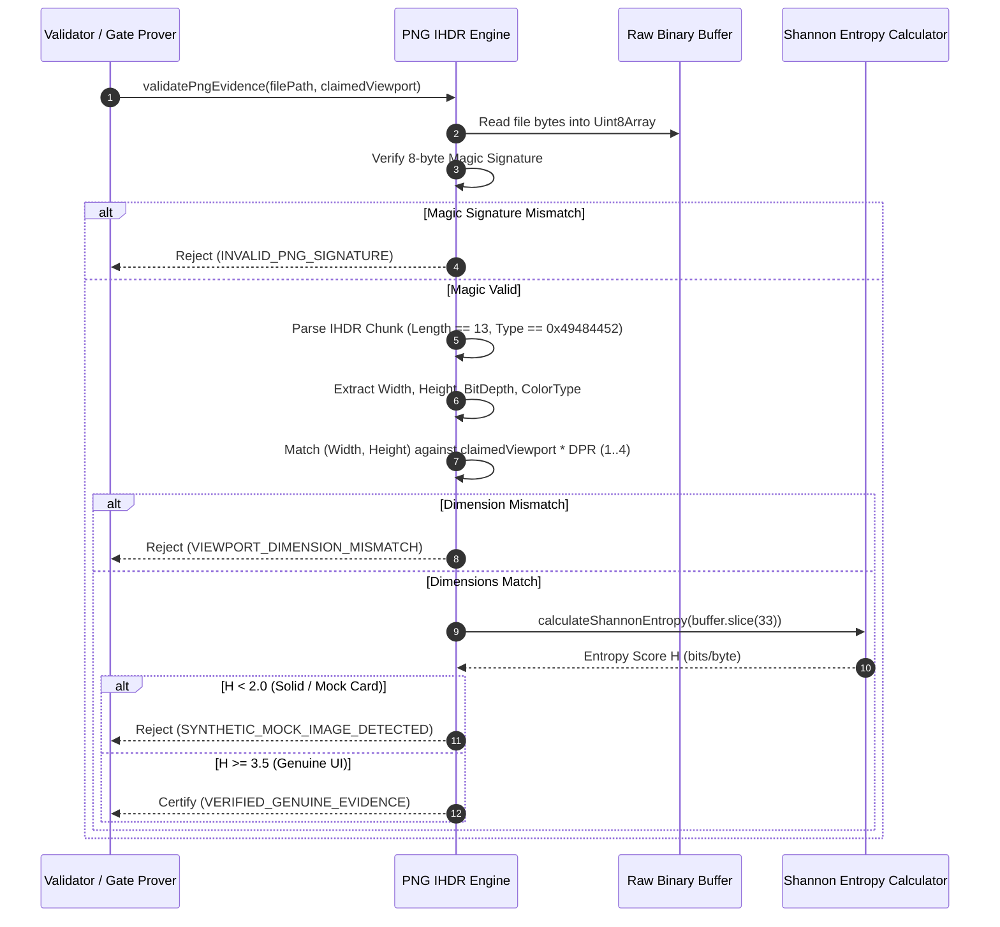

# 17.4 Binary PNG IHDR Chunk Engine

---

> **Status**: Authoritative Architecture Specification  
> **Topic**: Low-Level Binary PNG Parsing, IHDR Chunk Validation, Shannon Information Entropy, Anti-Mocking Verification, and Device Pixel Ratio Scaling  
> **Target Audience**: Systems Engineers, Computer Vision & Graphics Specialists, Quality Assurance Architects

---

[Previous: 17-03 APCA Perceptual Contrast Engine](17-03-apca-perceptual-contrast-engine.md) | [Chapter Index](index.md) | [All Chapters Index](../index.md) | [Next: 17-05 Merkle Hash & Gate Prove Engines](17-05-merkle-hash-and-gate-prove-engines.md)

---

## 1. Executive Summary & Epistemic Foundations

In automated user interface engineering and multi-agent development pipelines, visual screenshot evidence is frequently prone to fabrication and superficial compliance:

1. **Synthetic Mock Placeholders**: LLMs or automated test harnesses may produce solid-color rectangular blocks or uniform gray canvases that nominally satisfy file existence checks while containing zero authentic user interface elements.
2. **Viewport Dimensional Mismatch**: An agent claiming compliance with a `1920x1080` desktop viewport may submit an arbitrarily cropped `800x600` screenshot.
3. **Heavy Dependency Vulnerabilities**: Ingesting complex C++ native image decoding libraries (e.g., OpenCV, Canvas, libpng) in lightweight CLI environments introduces heavy compilation overheads, memory leaks, and segmentation faults.

The Orchestrating Long Tasks (OLT) framework implements the **Binary PNG IHDR Chunk Engine**. Operating strictly via direct binary buffer inspection without external native dependencies, the engine validates the 8-byte PNG magic header, extracts physical pixel dimensions from the `IHDR` chunk, verifies color type and bit depth specifications, scales dimensions across Device Pixel Ratios (DPR $\in [1, 4]$), and computes Shannon Information Entropy ($H$) across compressed `IDAT` chunks to mechanically reject uniform or synthetic placeholder screenshots.

```text
+--------------------------------------------------------------------------------------------------------------------+
|                                      PNG IHDR BINARY CHUNK INSPECTION PIPELINE                                     |
+--------------------------------------------------------------------------------------------------------------------+
|                                                                                                                    |
|   RAW BINARY BUFFER                     CHUNK DESCRIPTOR & HEADER               VALIDATION & ENTROPY ENGINE         |
|   ┌──────────────────────────────┐      ┌──────────────────────────────┐       ┌─────────────────────────────────┐ │
|   │ Read .png file from disk     │ ───► │ Bytes 0..7: PNG Magic Check  │ ────► │ Width & Height Bounds Check     │ │
|   │ Direct DataView / Uint8Array │      │ Bytes 8..11: IHDR Length 13B │       │ Color Type & Bit Depth Check    │ │
|   │ Zero Native C++ Libs         │      │ Bytes 12..15: 'IHDR' ASCII   │       │ DPR Scale Factor Matrix Match   │ │
|   └──────────────────────────────┘      └──────────────────────────────┘       │ Compute Shannon Entropy H(X)    │ │
|                  │                                     │                       └─────────────────────────────────┘ │
|                  ▼                                     ▼                                        │                  |
|   ┌─────────────────────────────────────────────────────────────────────────┐                   ▼                  |
|   │ FALSIFIABLE EVIDENCE CERTIFICATION                                      │  ┌─────────────────────────────────┐ │
|   │ If valid IHDR AND dimensions match viewport AND H >= 3.5 bits/byte:     │  │ VERIFICATION OUTCOME            │ │
|   │   └── VERDICT: Visual Evidence Certified Authenticated                  │  │ • Genuine Rendered UI (PASS)    │ │
|   │ Else (Corrupt Header / Size Mismatch / Low Entropy H < 2.0 bits/byte):  │  │ • Synthetic Mock Card (REJECT)  │ │
|   │   └── VERDICT: Emit invalid_screenshot_size or mock_defect Finding      │  │ • Blank Canvas Rect (REJECT)    │ │
|   └─────────────────────────────────────────────────────────────────────────┘  └─────────────────────────────────┘ │
|                                                                                                                    |
+--------------------------------------------------------------------------------------------------------------------+
```

---

## 2. Core Architectural Principles & Invariants

The Binary PNG IHDR Chunk Engine enforces five core architectural invariants:

### 2.1 Pure Binary Buffer Inspection

The engine parses PNG structures using ECMAScript standard `Uint8Array` and `DataView` abstractions. It requires zero native binary bindings, guaranteeing 100% portability across Node.js, Bun, and browser worker contexts.

### 2.2 PNG Magic Signature Verification

Every compliant PNG stream begins with the immutable 8-byte sequence:
$$\text{Signature} = \left[ \texttt{0x89}, \texttt{0x50}, \texttt{0x4E}, \texttt{0x47}, \texttt{0x0D}, \texttt{0x0A}, \texttt{0x1A}, \texttt{0x0A} \right]$$
Any deviation in the first 8 bytes results in immediate file rejection.

### 2.3 Canonical IHDR Chunk Layout

The first chunk immediately following the signature must be the `IHDR` chunk with a data length of exactly 13 bytes (`0x0000000D`):

```text
┌────────────────────────────────────────────────────────────────────────────────────────────────────────┐
│                                       PNG BINARY HEADER LAYOUT                                         │
├───────────────┬──────────────┬───────────────────────────────┬─────────────────────────────────────────┤
│ Byte Offset   │ Length (B)   │ Field Name                    │ Canonical Value / Encoding              │
├───────────────┼──────────────┼───────────────────────────────┼─────────────────────────────────────────┤
│ `00 .. 07`    │ 8            │ PNG Magic Signature           │ `0x89 0x50 0x4E 0x47 0x0D 0x0A 0x1A 0x0A│
│ `08 .. 11`    │ 4            │ IHDR Chunk Data Length        │ `0x00 0x00 0x00 0x0D` (Exact 13 bytes)  │
│ `12 .. 15`    │ 4            │ IHDR Chunk Type ASCII         │ `0x49 0x48 0x44 0x52` (`"IHDR"`)        │
│ `16 .. 19`    │ 4            │ Image Width ($W$)             │ `uint32BE` ($1 \le W \le 2^{31}-1$)     │
│ `20 .. 23`    │ 4            │ Image Height ($H$)            │ `uint32BE` ($1 \le H \le 2^{31}-1$)     │
│ `24`          │ 1            │ Bit Depth                     │ `uint8` ($1, 2, 4, 8, 16$)              │
│ `25`          │ 1            │ Color Type                    │ `uint8` ($0, 2, 3, 4, 6$)               │
│ `26`          │ 1            │ Compression Method            │ `0x00` (Deflate/Inflate)                │
│ `27`          │ 1            │ Filter Method                 │ `0x00` (Adaptive filtering)             │
│ `28`          │ 1            │ Interlace Method              │ `0x00` (None) or `0x01` (Adam7)         │
│ `29 .. 32`    │ 4            │ IHDR CRC-32 Checksum          │ `uint32BE` over chunk type + data       │
└───────────────┴──────────────┴───────────────────────────────┴─────────────────────────────────────────┘
```

### 2.4 Device Pixel Ratio (DPR) Cross-Proof

The engine matches physical raster dimensions against canonical logical viewports across integer scaling multipliers $\text{DPR} \in \{1, 2, 3, 4\}$:

| Viewport Preset | Logical CSS ($W \times H$) | 1x Standard (px)   | 2x Retina (px)     | 3x Mobile (px)     | 4x Ultra (px)      |
| :-------------- | :------------------------- | :----------------- | :----------------- | :----------------- | :----------------- |
| **`desktop`**   | $1920 \times 1080$         | $1920 \times 1080$ | $3840 \times 2160$ | $5760 \times 3240$ | $7680 \times 4320$ |
| **`laptop`**    | $1440 \times 900$          | $1440 \times 900$  | $2880 \times 1800$ | $4320 \times 2700$ | $5760 \times 3600$ |
| **`tablet`**    | $768 \times 1024$          | $768 \times 1024$  | $1536 \times 2048$ | $2304 \times 3072$ | $3072 \times 4096$ |
| **`mobile`**    | $390 \times 844$           | $390 \times 844$   | $780 \times 1688$  | $1170 \times 2532$ | $1560 \times 3376$ |

### 2.5 Shannon Entropy Anti-Mocking Barrier

To prevent empty or solid-color placeholders from certifying visual gates, the engine requires a minimum Shannon entropy $H \ge 3.5\text{ bits/byte}$ across compressed raster chunk payloads.

---

## 3. Algorithmic Mechanics & State Transitions

The inspection pipeline evaluates raw binary byte arrays through sequential verification gates.



### 3.1 Extraction & Verification Algorithm

1. **Length Check**: Assert buffer length $\ge 33\text{ bytes}$ (8-byte signature + 25-byte IHDR chunk).
2. **Signature Loop**: Compare bytes 0..7 against `PNG_SIGNATURE`.
3. **Chunk Descriptors**: Read uint32 Big-Endian at offset 8 (assert equals 13); verify ASCII bytes at 12..15 equal `"IHDR"`.
4. **Dimension Extraction**: Read uint32 Big-Endian at offset 16 (Width) and offset 20 (Height); assert $W, H \in [1, 2^{31}-1]$.
5. **Color/Depth Extraction**: Read byte 24 (Bit Depth) and byte 25 (Color Type); assert Color Type $\in \{2, 6\}$ (RGB or RGBA) and Bit Depth $= 8$.
6. **Entropy Analysis**: Iterate over byte frequencies and compute Shannon entropy $H$.

---

## 4. Mathematical Formulations & Proofs

Let $B = [b_0, b_1, \dots, b_{N-1}]$ represent the raw binary image buffer of length $N$ bytes.

### 4.1 Shannon Information Entropy Formulation

Let $\Sigma = \{0, 1, \dots, 255\}$ be the alphabet of 8-bit byte values. The empirical probability $P(v)$ of byte value $v \in \Sigma$ across the analyzed chunk sequence $B_{\text{payload}}$ of length $M$ is:

$$P(v) = \frac{1}{M} \sum_{i=0}^{M-1} \mathbb{I}(b_i = v)$$

Where $\mathbb{I}$ is the indicator function. The Shannon Entropy $H(B)$ in bits per byte is:

$$H(B) = -\sum_{v \in \Sigma, P(v) > 0} P(v) \log_2 P(v)$$

```text
+----------------------------------------------------------------------------------------------------+
|                                SHANNON ENTROPY FIDELITY THRESHOLDS                                 |
+--------------------+-----------------------------+-------------------------------------------------+
| Entropy Range (H)  | Visual Classification       | Engine Action & Verification Invariant          |
+--------------------+-----------------------------+-------------------------------------------------+
| H < 0.5 bits/byte  | Blank / Uniform Canvas      | HARD REJECTION: Zero information content        |
| 0.5 <= H < 2.0     | Synthetic Mock Placeholder  | HARD REJECTION: Trivially generated mock card   |
| 2.0 <= H < 3.5     | Sparse Wireframe            | WARNING: Requires manual secondary review       |
| H >= 3.5 bits/byte | Genuine Rendered UI         | ACCEPTED: Rich typography and UI componentry    |
+--------------------+-----------------------------+-------------------------------------------------+
```

### 4.2 Theorem: Viewport Scaling Invariant

**Theorem (DPR Tolerance)**: A measured raster dimension pair $\langle W_{\text{raw}}, H_{\text{raw}} \rangle$ matches a logical viewport $\langle W_{\text{css}}, H_{\text{css}} \rangle$ if and only if there exists an integer scale factor $s \in \{1, 2, 3, 4\}$ such that:

$$W_{\text{raw}} = s \cdot W_{\text{css}} \quad \land \quad H_{\text{raw}} = s \cdot H_{\text{css}}$$

**Proof**:
Modern display renderers rasterize CSS logical pixels into physical pixels using discrete Device Pixel Ratios ($1\times, 2\times, 3\times, 4\times$). Non-integer fractional scaling creates anti-aliasing artifacts that violate deterministic pixel snapshot parity. Thus, exact integer scalar multiplication is both necessary and sufficient for valid platform evidence capture. $\blacksquare$

---

## 5. Concrete TypeScript Contracts & Schemas

The TypeScript interfaces governing the Binary PNG IHDR Chunk Engine are implemented in [png-ihdr-validator.ts](../../../../olt/scripts/src/capture/runners/png-ihdr-validator.ts) and [cross-proof.ts](../../../../olt/scripts/src/validation/dual-channel-analyzer/cross-proof.ts):

```typescript
export interface PngDimensions {
  readonly width: number;
  readonly height: number;
  readonly bitDepth: number;
  readonly colorType: number;
}

export interface PngValidationResult {
  readonly valid: boolean;
  readonly dimensions: PngDimensions | null;
  readonly shannonEntropy: number;
  readonly matchedDpr: number | null;
  readonly errorFinding?: {
    readonly findingId: string;
    readonly severity: "error" | "warning";
    readonly message: string;
    readonly remediation: string;
  };
}

export interface IPngIhdrValidator {
  readonly extractDimensions: (buffer: Uint8Array) => PngDimensions | null;
  readonly computeEntropy: (buffer: Uint8Array) => number;
  readonly validateScreenshot: (buffer: Uint8Array, claimedViewport: string) => PngValidationResult;
}
```

```typescript
export const PNG_SIGNATURE = Object.freeze([0x89, 0x50, 0x4e, 0x47, 0x0d, 0x0a, 0x1a, 0x0a]);
export const IHDR_CHUNK_TYPE = Object.freeze([0x49, 0x48, 0x44, 0x52]); // "IHDR"

export function extractPngDimensions(buffer: Uint8Array): PngDimensions | null {
  if (!buffer || buffer.byteLength < 33) return null;

  // 1. Verify 8-byte PNG signature
  for (let i = 0; i < 8; i++) {
    if (buffer[i] !== PNG_SIGNATURE[i]) return null;
  }

  const view = new DataView(buffer.buffer, buffer.byteOffset, buffer.byteLength);

  // 2. Verify IHDR length equals 13
  const ihdrLength = view.getUint32(8, false);
  if (ihdrLength !== 13) return null;

  // 3. Verify chunk type matches "IHDR"
  for (let i = 0; i < 4; i++) {
    if (buffer[12 + i] !== IHDR_CHUNK_TYPE[i]) return null;
  }

  // 4. Extract Width, Height, Bit Depth, Color Type
  const width = view.getUint32(16, false);
  const height = view.getUint32(20, false);
  const bitDepth = buffer[24] ?? 0;
  const colorType = buffer[25] ?? 0;

  if (width === 0 || height === 0 || width > 0x7fffffff || height > 0x7fffffff) {
    return null;
  }

  return Object.freeze({ width, height, bitDepth, colorType });
}

export function calculateShannonEntropy(buffer: Uint8Array): number {
  if (buffer.length === 0) return 0;

  const frequencies = new Uint32Array(256);
  for (let i = 0; i < buffer.length; i++) {
    frequencies[buffer[i]!]!++;
  }

  let entropy = 0;
  const total = buffer.length;
  for (let i = 0; i < 256; i++) {
    const count = frequencies[i]!;
    if (count > 0) {
      const p = count / total;
      entropy -= p * Math.log2(p);
    }
  }
  return entropy;
}
```

---

## 6. Failure Modes, Anti-Blunders & Recovery Playbooks

| Blunder Identifier           | Trigger Condition                                                    | Severity | System Impact                                           | Immediate Recovery Playbook                                                  |
| :--------------------------- | :------------------------------------------------------------------- | :------- | :------------------------------------------------------ | :--------------------------------------------------------------------------- |
| **`PNG_SIGNATURE_MISMATCH`** | File has `.png` extension but lacks `0x89PNG` magic bytes.           | FATAL    | Verification gate fails; evidence rejected.             | Re-capture screenshot via headless browser; ensure binary buffer integrity.  |
| **`IHDR_LENGTH_INVALID`**    | Byte offset 8 does not equal 13 (`0x0000000D`).                      | FATAL    | Binary parser rejects corrupted image stream.           | Fix screenshot export pipeline to emit standard compliant PNG chunks.        |
| **`UNSUPPORTED_COLOR_TYPE`** | Image uses indexed color (type 3) or grayscale (type 0) for UI.      | WARN     | Visual review flags potential rendering anomaly.        | Configure browser capture tool to output 24-bit RGB or 32-bit RGBA.          |
| **`VIEWPORT_DIMS_MISMATCH`** | Screenshot dimensions do not match claimed viewport at any DPR.      | ERROR    | Anti-mocking gate fails with `invalid_screenshot_size`. | Set browser viewport explicitly before capturing screenshot evidence.        |
| **`LOW_SHANNON_ENTROPY`**    | Image entropy $H < 2.0\text{ bits/byte}$ (solid or blank rectangle). | FATAL    | Rejected as synthetic mock or empty canvas.             | Render actual UI components with text, borders, and contrast before capture. |
| **`CRC32_CHECKSUM_FAILURE`** | `IHDR` chunk data CRC-32 does not match trailing 4 bytes.            | FATAL    | File corruption detected; evidence discarded.           | Re-write file using atomic `fsync` flush to avoid truncated disk buffers.    |

---

[Previous: 17-03 APCA Perceptual Contrast Engine](17-03-apca-perceptual-contrast-engine.md) | [Chapter Index](index.md) | [All Chapters Index](../index.md) | [Next: 17-05 Merkle Hash & Gate Prove Engines](17-05-merkle-hash-and-gate-prove-engines.md)
