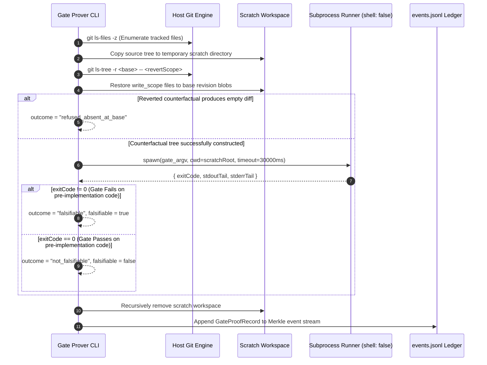

# 17.5 Merkle Hash & Gate Prove Engines

---

> **Status**: Authoritative Architecture Specification  
> **Topic**: Forward-Secure SHA-256 Merkle Chains, RFC 8785 Canonical JSON Normalization, Torn-Tail Recovery, and Counterfactual Mutation Gate Proving  
> **Target Audience**: Cryptographic Systems Engineers, Verification Architects, Platform Integrity Specialists

---

[Previous: 17-04 Binary PNG IHDR Chunk Engine](17-04-png-ihdr-binary-chunk-engine.md) | [Chapter Index](index.md) | [All Chapters Index](../index.md) | [Next: Chapter 17 Index](index.md)

---

## 1. Executive Summary & Epistemic Foundations

In autonomous multi-agent developer frameworks, historical execution telemetry and test verification gates face two primary vulnerabilities:

1. **Retroactive Log Tampering & Split-Brain Drift**: When task states are stored as mutable documents or unchained log lines, crashed processes or compromised workers can alter previous events or generate divergent historical timelines without detection.
2. **Tautological Test Fallacies**: Autonomous agents frequently write tautological tests (e.g., tests that pass unconditionally regardless of implementation state, mock assertions that test the mock itself, or vacuous boolean checks). Standard green exit codes fail to prove that the test actually exercises the intended code paths.

The Orchestrating Long Tasks (OLT) framework resolves these vulnerabilities through two cryptographic and falsification subsystems:

- **The Cryptographic Merkle Hash Chain Engine**: Chains every state transition event in `.olt/capsules/<slug>/events.jsonl` using forward-secure SHA-256 Merkle linkage, enforcing RFC 8785 Canonical JSON determinism and automatic torn-tail recovery.
- **The Gate Falsifiability Prover Engine (`gate:prove`)**: Executes candidate test gates against counterfactual mutated scratch trees where task implementation changes are reverted back to base blobs, certifying that the test fails non-zero on pre-implementation code.

```text
+--------------------------------------------------------------------------------------------------------------------+
|                                  CRYPTOGRAPHIC MERKLE CHAIN & GATE PROVING TOPOLOGY                                |
+--------------------------------------------------------------------------------------------------------------------+
|                                                                                                                    |
|   APPEND-ONLY MERKLE EVENT LEDGER                                 COUNTERFACTUAL GATE PROVER (gate:prove)          |
|   ┌──────────────────────────────────────────────┐                ┌──────────────────────────────────────────────┐ │
|   │ Event 1 (Genesis): H_1 = SHA256(C(E_1) || 0) │                │ Isolate Scratch Tree: mkdtemp(/tmp/gate-*)   │ │
|   │ Event 2: H_2 = SHA256(C(E_2) || H_1)         │ ─────────────► │ Revert write_scope to Git Base (HEAD)        │ │
|   │ Event 3: H_3 = SHA256(C(E_3) || H_2)         │                │ Execute gate_argv with shell: false          │ │
|   │ (Strict RFC 8785 Canonical JSON Encoding)    │                │ Assert Exit Code != 0 (Falsifiable)          │ │
|   └──────────────────────────────────────────────┘                └──────────────────────────────────────────────┘ │
|                          │                                                                │                        |
|                          ▼                                                                ▼                        |
|   ┌──────────────────────────────────────────────┐                ┌──────────────────────────────────────────────┐ │
|   │ TORN-TAIL CRASH RECOVERY (doctor:repair)     │                │ PROOF VERDICT INTEGRITY                      │ │
|   │ Scan chain from offset 0 ──► Detect fragment │                │ • Falsifiable: true ──► Gate Certified Valid │ │
|   │ Quarantine torn tail ──► Truncate to offset  │                │ • Falsifiable: false ─► TRAP: TAUTOLOGY REJECT│ │
|   └──────────────────────────────────────────────┘                └──────────────────────────────────────────────┘ │
|                                                                                                                    |
+--------------------------------------------------------------------------------------------------------------------+
```

---

## 2. Core Architectural Principles & Invariants

The Merkle Hash and Gate Prove engines operate under five non-negotiable architectural invariants:

### 2.1 Forward-Secure SHA-256 Hash Chaining

Every event $E_i$ appended to `events.jsonl` incorporates the SHA-256 digest of the immediately preceding event $H_{i-1}$. Any historical modification, insertion, deletion, or reordering invalidates all downstream hash pointers, rendering tampering immediately detectable.

### 2.2 RFC 8785 Canonical JSON Serialization

To eliminate platform-specific formatting divergence across JavaScript runtimes (V8, Bun, JavaScriptCore), event payloads are serialized using strict RFC 8785 Canonical JSON:

- Object keys are sorted lexicographically by UTF-16 code units.
- Whitespace between tokens is strictly prohibited.
- Numbers are formatted in standard IEEE 754 decimal representations without trailing exponents.

### 2.3 Counterfactual Scratch Tree Isolation

Mutation testing executed by `gate:prove` takes place in isolated temporary scratch directories created via `mkdtempSync()`. Worktree and repository source trees are never mutated in place during falsifiability probing.

### 2.4 Direct Argv Array Grammar

All gate execution commands are declared as explicit string arrays (`string[]`), such as `["bun", "test", "tests/unit/auth.test.ts"]`. Shell metacharacters (`&&`, `||`, `;`, `|`, `>`, `<`) trigger immediate `INVALID_ARGUMENT` harness exceptions.

### 2.5 Formal Evidence Hierarchy (Classes 1–4)

Requirements satisfaction requires evidence mapped to the formal four-tier evidence hierarchy:

| Class       | Evidence Identifier | Verification Method                                    | Proof Bundle Inclusion                              |
| :---------- | :------------------ | :----------------------------------------------------- | :-------------------------------------------------- |
| **Class 1** | `harness_observed`  | SHA-256 command receipt blob with exit code 0          | **Authoritative (Mandatory for core requirements)** |
| **Class 2** | `host_reported`     | Verified Git commit SHA or POSIX file stat             | **Platform (Required for environment bounds)**      |
| **Class 3** | `derived`           | Deterministic mathematical calculation (APCA, entropy) | **Derived (Computed from Class 1 evidence)**        |
| **Class 4** | `agent_reported`    | Uncorroborated prose claim in review markdown          | **Rejected as sole proof**                          |

---

## 3. Algorithmic Mechanics & State Transitions

The verification lifecycle coordinates Merkle stream validation, torn-tail quarantine, and counterfactual gate execution.



### 3.1 Torn-Tail Crash Recovery Protocol

When an abnormal runtime termination leaves an incomplete line at the end of `events.jsonl`:

```text
Crash Recovery Pipeline (doctor:repair)
    │
    ├── 1. Read events.jsonl sequentially from byte offset 0
    │
    ├── 2. Verify hash chaining: H_i === SHA-256(CanonicalJSON(E_i) || H_{i-1})
    │
    ├── 3. Locate clean byte offset of the last fully verified event line
    │
    ├── 4. If trailing unparseable fragment exists:
    │       ├── Extract fragment bytes
    │       ├── Write to quarantine/recovery-torn-<timestamp>.fragment (mode 0400)
    │       ├── Call ftruncateSync(fd, cleanOffset)
    │       └── Issue fsyncSync(fd) barrier
    │
    └── 5. Re-project state.json from verified event sequence
```

---

## 4. Mathematical Formulations & Proofs

Let $\mathcal{E} = [E_1, E_2, \dots, E_N]$ represent the sequence of events in `events.jsonl`.

### 4.1 Merkle Recurrence Formulation

Let $\mathcal{C}: \text{JsonObject} \to \text{string}$ denote the RFC 8785 Canonical JSON transformation, and let $\mathcal{H}: \text{string} \to \{0, 1\}^{256}$ denote the SHA-256 hash function.

The forward-secure Merkle hash chain is defined by the recurrence:

$$ H_i = \begin{cases}
\mathcal{H}\left( \mathcal{C}(E_1 \setminus \{H_1\}) \parallel \texttt{"0"}^{64} \right) & \text{if } i = 1 \\
\mathcal{H}\left( \mathcal{C}(E_i \setminus \{H_i\}) \parallel H_{i-1} \right) & \text{if } i > 1
\end{cases}$$

Where $\parallel$ denotes byte sequence concatenation.

### 4.2 Falsifiability Counterfactual Theorem

Let $G$ denote a test gate command vector, $T_{\text{head}}$ denote the repository worktree containing task changes, and $T_{\text{base}}$ denote the counterfactual scratch worktree reverted to base ref:

$$\text{Diff}(T_{\text{head}}, T_{\text{base}}) = \Delta_{\text{task}} \neq \emptyset$$

Let $\text{Exec}(G, T) \in \mathbb{Z}$ denote the exit status of executing $G$ on worktree tree $T$.

**Theorem (Gate Non-Tautology)**: A test gate $G$ is a falsifiable proof of implementation $\Delta_{\text{task}}$ if and only if:

$$\text{Exec}(G, T_{\text{head}}) = 0 \quad \land \quad \text{Exec}(G, T_{\text{base}}) \neq 0$$

**Proof**:
1. If $\text{Exec}(G, T_{\text{head}}) \neq 0$, the gate fails on the current code; the task is incomplete.
2. If $\text{Exec}(G, T_{\text{base}}) = 0$, the gate succeeds even when $\Delta_{\text{task}}$ is completely absent. Thus, the gate does not depend on $\Delta_{\text{task}}$ and constitutes a tautological proof.
3. Therefore, $\text{Exec}(G, T_{\text{base}}) \neq 0$ is necessary and sufficient to prove causal dependence on $\Delta_{\text{task}}$. $\blacksquare$

---

## 5. Concrete TypeScript Contracts & Schemas

The TypeScript interfaces governing Merkle ledger verification and Gate Proving are implemented in [gate-proof.ts](../../../../olt/scripts/src/graph/gate-proof.ts), [event-stream.ts](../../../../olt/scripts/src/engine/store/events/event-stream.ts), and [durable-write.ts](../../../../olt/scripts/src/core/durable-write.ts):

```typescript
export interface MerkleEventHeader {
  readonly sequence: number;
  readonly timestamp: string;
  readonly runId: string;
  readonly actorId: string;
  readonly eventType: string;
  readonly previousHash: string | null;
  readonly hash: string;
}

export interface GateProofRecord {
  readonly taskId: string;
  readonly gateArgv: readonly string[];
  readonly writeScope: readonly string[];
  readonly baseRef: string;
  readonly falsifiable: boolean;
  readonly exitCode: number | null;
  readonly timedOut: boolean;
  readonly provedAt: string;
  readonly actor: string;
  readonly outcome: "falsifiable" | "not_falsifiable" | "refused_absent_at_base";
  readonly restoredPaths: readonly string[];
  readonly stdoutTail: string;
  readonly stderrTail: string;
}

export interface IGateProverEngine {
  readonly proveGateFalsifiability: (
    repoRoot: string,
    taskId: string,
    gateArgv: readonly string[],
    writeScope: readonly string[],
    baseRef?: string,
    timeoutMs?: number,
  ) => Promise<GateProofRecord>;
}
```

```typescript
export function computeEventHash(
  payload: Record<string, unknown>,
  previousHash: string | null,
): string {
  // Strip existing hash field before computing digest
  const { hash: _discarded, ...dataToHash } = payload;
  const canonicalJson = serializeCanonicalJson(dataToHash);
  const chainInput = `${canonicalJson}|${previousHash ?? "0".repeat(64)}`;

  return createHash("sha256").update(chainInput, "utf8").digest("hex");
}

export function assertValidMerkleChain(events: readonly MerkleEventHeader[]): void {
  for (let i = 0; i < events.length; i++) {
    const current = events[i]!;
    const expectedPrev = i === 0 ? null : events[i - 1]!.hash;

    if (current.previousHash !== expectedPrev) {
      throw new HarnessError(
        "MERKLE_CHAIN_BROKEN",
        `Merkle linkage broken at sequence ${current.sequence}: expected prev '${expectedPrev}', found '${current.previousHash}'`,
      );
    }

    const calculatedHash = computeEventHash(
      current as unknown as Record<string, unknown>,
      current.previousHash,
    );
    if (current.hash !== calculatedHash) {
      throw new HarnessError(
        "MERKLE_HASH_MISMATCH",
        `Hash verification failed at sequence ${current.sequence}: computed '${calculatedHash}', recorded '${current.hash}'`,
      );
    }
  }
}
```

---

## 6. Failure Modes, Anti-Blunders & Recovery Playbooks

| Blunder Identifier | Trigger Condition | Severity | System Impact | Immediate Recovery Playbook |
| :--- | :--- | :--- | :--- | :--- |
| **`MERKLE_HASH_MISMATCH`** | Historical event line edited or truncated in `events.jsonl`. | FATAL | Ledger verification halts; state re-projection blocked. | Restore ledger from immutable git backup or execute `doctor:repair`. |
| **`TORN_TAIL_FRAGMENT`** | Process killed mid-write leaving partial trailing event line. | ERROR | Next harness invocation fails chain check. | Run `doctor:repair` to automatically quarantine fragment and truncate clean. |
| **`GATE_NOT_FALSIFIABLE`** | Gate command exits 0 on reverted base scratch tree. | FATAL | Gate rejected as a tautology; task cannot complete. | Author a targeted test assertion that genuinely exercises new functionality. |
| **`GATE_ARGV_SHELL_OPERATOR`** | Gate command contains `&&`, `||`, or `|` operators. | ERROR | Harness rejects command grammar with `INVALID_ARGUMENT`. | Split chained commands into direct single-binary argv arrays. |
| **`SCRATCH_TREE_DIRTY`** | Temporary scratch tree directory fails cleanup after probe. | WARN | Disk storage accumulates orphaned temporary trees. | Run `doctor:hygiene` to purge lingering `/tmp/gate-prove-*` directories. |
| **`REFUSED_ABSENT_AT_BASE`** | File under test did not exist at base ref; diff is empty. | WARN | Mutation prover notes absence of pre-existing counterfactual. | Verify base ref points to correct parent branch commit. |

---

[Previous: 17-04 Binary PNG IHDR Chunk Engine](17-04-png-ihdr-binary-chunk-engine.md) | [Chapter Index](index.md) | [All Chapters Index](../index.md) | [Next: Chapter 17 Index](index.md)
$$
