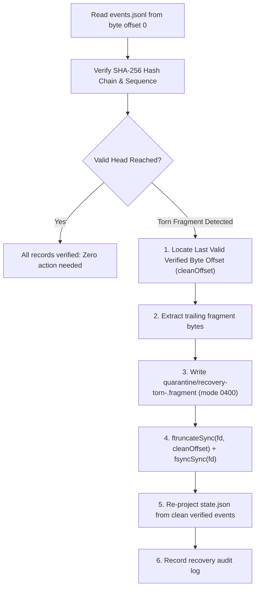
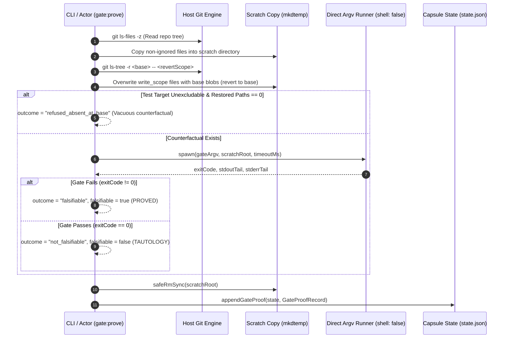

# Merkle Hash & Gate Prove Engines

[Reference Home](../index.md) > [Verification Engines](./index.md) > Merkle Hash & Gate Prove Engines

---

[Previous: Binary PNG IHDR Chunk Engine](17-04-png-ihdr-binary-chunk-engine.md) | [Chapter Index](index.md) | [All Chapters Index](../index.md) | [Next: OLT Documentation Hub](../../README.md)
---

This document specifies the cryptographic and falsification engines in the OLT verification subsystem:

1. **The Cryptographic Merkle Hash Chain Engine**: Guarantees immutable, tamper-evident auditability across `.olt/capsules/<slug>/events.jsonl` with torn-tail crash recovery.
2. **The Gate Falsifiability Prover Engine (`gate:prove`)**: Executes mutation counterfactual tests on isolated scratch trees to prevent tautological tests from falsely certifying broken implementations.
3. **The Evidence Validation Framework**: Mechanically certifies proof bundles against formal Classes 1–4 evidence hierarchies.

Implemented in [`olt/scripts/src/graph/gate-proof.ts`](file:///Users/onurseckinsenoglu/repos/skills/olt/scripts/src/graph/gate-proof.ts) and [`olt/scripts/src/core/durable-write.ts`](file:///Users/onurseckinsenoglu/repos/skills/olt/scripts/src/core/durable-write.ts).

---

## 1. Cryptographic Merkle Hash Chain Engine

All state mutations in OLT are recorded as discrete, immutable events appended to `events.jsonl`. Integrity and causal order are guaranteed through a forward-secure SHA-256 cryptographic hash chain.

```text
┌────────────────────────────────────────────────────────────────────────────────────────────────────────┐
│                                  CRYPTOGRAPHIC SHA-256 HASH CHAINING                                   │
├────────────────────────────────────────────────────────────────────────────────────────────────────────┤
│                                                                                                        │
│   EVENT 1 (Genesis)                                                                                    │
│   ├── sequence: 1                                                                                      │
│   ├── previous_hash: null                                                                              │
│   ├── payload: { "run_id": "run-001", "type": "run:init" }                                            │
│   └── hash: "e3b0c44298fc1c149afbf4c8996fb92427ae41e4649b934ca495991b7852b855" ─────────┐             │
│                                                                                           │             │
│                                                                                           ▼             │
│   EVENT 2                                                                                               │
│   ├── sequence: 2                                                                                      │
│   ├── previous_hash: "e3b0c44298fc1c149afbf4c8996fb92427ae41e4649b934ca495991b7852b855" ◄──────┘             │
│   ├── payload: { "task_id": "t-1", "type": "task:claim" }                                              │
│   └── hash: "41512719d9b62e49c7f999981a79f3ec3df985c5dc07cae125c11d6159670d8a" ─────────┐             │
│                                                                                           │             │
│                                                                                           ▼             │
│   EVENT 3                                                                                               │
│   ├── sequence: 3                                                                                      │
│   ├── previous_hash: "41512719d9b62e49c7f999981a79f3ec3df985c5dc07cae125c11d6159670d8a" ◄──────┘             │
│   ├── payload: { "task_id": "t-1", "type": "task:submit" }                                             │
│   └── hash: "bd5aaed259ebca324b91959fb1a9f0e2617df924e2c2f90a9829f04128f729f2"                       │
│                                                                                                        │
└────────────────────────────────────────────────────────────────────────────────────────────────────────┘
```

### 1.1 Hash Chaining Formulation

For every event $E_i$ in the stream with monotonic index $i \ge 1$:

$$H_i = \text{SHA-256}\left(\text{CanonicalJSON}(E_i \setminus \{H_i\}) \parallel E_i.\text{previous\_hash}\right)$$

$$E_i.\text{previous\_hash} = \begin{cases} \text{null}, & \text{if } i = 1 \\ H_{i-1}, & \text{if } i > 1 \end{cases}$$

### 1.2 Canonical JSON Encoding Rules

To ensure platform-independent cryptographic determinism across runtimes (Node.js, Bun, V8), JSON payloads must be formatted according to strict RFC 8785 Canonical JSON rules:

1. **Sorted Keys**: Object keys are sorted lexicographically by Unicode code point order.
2. **Whitespace Stripping**: Zero whitespace characters outside of string literals.
3. **Float Standardization**: Numbers are encoded using shortest standard IEEE 754 representations without trailing exponential zeroes.
4. **UTF-8 Byte Encoding**: String values are serialized as standard UTF-8 without non-standard escape sequences.

### 1.3 Torn-Tail Quarantine Protocol (`doctor:repair`)

If a harness process crashes mid-write due to a power loss or kernel kill (`SIGKILL`), a partial event line may remain at the end of `events.jsonl`. The hash chain verifier detects this defect and executes the **Torn-Tail Quarantine Protocol**:



---

## 2. Falsification & Gate Prover Engine (`gate:prove`)

To prevent tautological "always-green" test scripts from certifying broken code, the **Gate Falsifiability Prover** ([`olt/scripts/src/graph/gate-proof.ts`](file:///Users/onurseckinsenoglu/repos/skills/olt/scripts/src/graph/gate-proof.ts)) validates task gates by executing them against counterfactual mutated scratch trees.



### 2.1 Mutation Testing Protocol Steps

1. **Scratch Isolation**: Creates an isolated throwaway directory via `mkdtempSync(join(tmpdir(), "gate-prove-"))`.
2. **File Tree Replication**: Copies tracked, non-ignored repository files into the scratch tree (`copyIntoScratch`) including `node_modules/`.
3. **Effective Revert Scope Calculation**: Identifies implementation files in the task's `write_scope` while preserving the test files that the gate is about to execute:
   ```typescript
   function effectiveRevertScope(
     writeScope: readonly string[],
     gateArgv: readonly string[],
   ): EffectiveRevertScope {
     const isBunTest = gateArgv.length >= 2 && gateArgv[0] === "bun" && gateArgv[1] === "test";
     // Filter out test paths matching the gate command so the gate actually tests the reverted implementation
     // ...
   }
   ```
4. **Write Scope Reversion**: Reverts all files inside `effectiveRevertScope` back to `--base` (default `HEAD`) using raw Git blobs from `git ls-tree` and `git show`.
5. **Execution & Failure Assertion**: Runs the task's gate argv directly inside the mutated scratch root with `shell: false`.
6. **Verdict Certification**:
   - **`falsifiable: true` (PASS)**: Gate exits non-zero ($> 0$), proving that without the task's implementation changes, the gate fails.
   - **`falsifiable: false` (FAIL)**: Gate exits 0 on the reverted tree, proving the gate is a tautology.
   - **`refused_absent_at_base`**: The target did not exist at base ref; there was no prior counterfactual to test against.

### 2.2 Strict Direct Argv Grammar

Gate commands MUST be formatted as direct string argument arrays (`string[]`), never shell strings executed via `/bin/sh -c`.

```json
// [PASS] VALID: Direct argv array
["bun", "test", "tests/unit/auth.test.ts"]
["pytest", "tests/test_api.py", "-k", "test_login"]

// [FAIL] INVALID: Shell operators (triggers immediate INVALID_ARGUMENT error)
["sh", "-c", "bun test && git status"]
["bun", "test", "tests/auth.test.ts", "|", "grep", "pass"]
```

> [!WARNING]
> Shell operators (`&&`, `||`, `;`, `|`, `>`, `<`) in gate argument arrays trigger an immediate `INVALID_ARGUMENT` `HarnessError` at the execution boundary.

---

## 3. Gate Proof Record Schema

Gate proof results are appended to `state.json` under `gate_proofs`:

```typescript
export interface GateProofRecord extends JsonObject {
  task_id: string;
  gate_argv: string[];
  write_scope: string[];
  base: string;
  falsifiable: boolean;
  exit_code: number | null;
  timed_out: boolean;
  proved_at: string;
  actor: string;
  outcome?: "falsifiable" | "not_falsifiable" | "refused_absent_at_base";
  restored_paths?: string[];
  deleted_paths?: string[];
  reverted_scope?: string[];
  stdout_tail?: string;
  stderr_tail?: string;
}
```

### 3.1 JSON Exemplar

```json
{
  "task_id": "task-impl-auth-tokens",
  "gate_argv": ["bun", "test", "tests/unit/token-manager.test.ts"],
  "write_scope": ["src/auth/token-manager.ts", "tests/unit/token-manager.test.ts"],
  "base": "HEAD",
  "falsifiable": true,
  "exit_code": 1,
  "timed_out": false,
  "proved_at": "2026-08-29T02:50:00.000Z",
  "actor": "coordinator_worker_01",
  "outcome": "falsifiable",
  "restored_paths": ["src/auth/token-manager.ts"],
  "deleted_paths": [],
  "reverted_scope": ["src/auth/token-manager.ts"],
  "stdout_tail": "FAIL tests/unit/token-manager.test.ts > TokenManager > generates valid token\nerror: parseHeader is not defined",
  "stderr_tail": ""
}
```

---

## 4. Evidence Validation Matrix (Classes 1–4)

To satisfy task and run completion criteria, every requirement in `requirements.json` must be backed by valid evidence mapped to its formal evidence class:

```text
┌────────────────────────────────────────────────────────────────────────────────────────────────────────┐
│                                 EVIDENCE CLASS VALIDATION RULES                                        │
├─────────┬──────────────────────┬──────────────────────────────┬────────────────────────────────────────┤
│ Class   │ Identifier           │ Evidence Validation Method   │ Allowed in Final Proof Bundle?         │
├─────────┼──────────────────────┼──────────────────────────────┼────────────────────────────────────────┤
│ Class 1 │ `harness_observed`   │ SHA-256 command receipt blob │ **YES (Authoritative)**                │
│         │                      │ matching exit code 0.        │ Required for all core requirements.    │
├─────────┼──────────────────────┼──────────────────────────────┼────────────────────────────────────────┤
│ Class 2 │ `host_reported`      │ Verified Git commit SHA or   │ **YES (Platform)**                     │
│         │                      │ POSIX file system stat check.│ Used for environment verification.     │
├─────────┼──────────────────────┼──────────────────────────────┼────────────────────────────────────────┤
│ Class 3 │ `derived`            │ Deterministically computed   │ **YES (Derived)**                      │
│         │                      │ formula (APCA Lc, entropy).  │ Verified from underlying Class 1 data. │
├─────────┼──────────────────────┼──────────────────────────────┼────────────────────────────────────────┤
│ Class 4 │ `agent_reported`     │ Uncorroborated prose claim.  │ **NO (Rejected as Sole Proof)**        │
│         │                      │                              │ Must be backed by Class 1/3 evidence.  │
└─────────┴──────────────────────┴──────────────────────────────┴────────────────────────────────────────┘
```

### 4.1 CLI Command Specification

```bash
bun olt/scripts/harness.ts gate:prove --run <capsule-path> --task <task-id> --actor <actor-name> [--base <git-ref>] [--wall-timeout-ms <ms>]
```

---

[Previous: Binary PNG IHDR Chunk Engine](17-04-png-ihdr-binary-chunk-engine.md) | [Chapter Index](index.md) | [All Chapters Index](../index.md) | [Next: OLT Documentation Hub](../../README.md)
---
