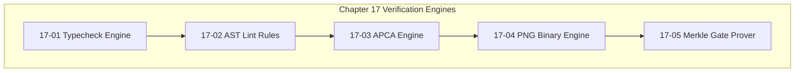

# Chapter 17: Verification Engines & Gate Provers

---

[Previous: Chapter 16 Index](../16-error-catalog-and-blunders/index.md) | [Chapter Index](index.md) | [All Chapters Index](../index.md) | [Next: 17-01 Typecheck Engine](17-01-typecheck-engine.md)

---

## 1. Chapter Overview & Verification Architecture

Welcome to Chapter 17 of the OLT Architecture Book. This chapter details the technical implementations and algorithmic mechanics of the five internal **Verification Engines** that enforce code correctness, type purity, perceptual rendering, and cryptographic truth across the **OLT (Orchestrating Long Tasks)** engine.

Verification in OLT is not a superficial post-processing step; it is an active mechanical interlock integrated into every state transition. Chapter 17 provides the complete implementation details for the Typecheck Engine, the 10 AST Static Lint Rules, the APCA Perceptual Contrast Engine, the PNG IHDR Binary Chunk Engine, and the Merkle Hash Gate Prover.

```text
┌──────────────────────────────────────────────────────────────────────────────────────────────────┐
│                             CHAPTER 17: VERIFICATION ENGINES TOPOLOGY                            │
├──────────────────────────────────────────────────────────────────────────────────────────────────┤
│                                                                                                  │
│    ┌───────────────────────────┐                    ┌───────────────────────────┐                │
│    │ 17-01: TypeScript         │                    │ 17-02: Ten AST Static     │                │
│    │ Typecheck Engine          │ ══════════════════►│ Lint Purity Rules         │                │
│    └─────────────┬─────────────┘                    └─────────────┬─────────────┘                │
│                  │                                                │                              │
│                  ▼                                                ▼                              │
│    ┌───────────────────────────┐                    ┌───────────────────────────┐                │
│    │ 17-03: APCA Perceptual    │                    │ 17-04: PNG IHDR Binary    │                │
│    │ Contrast Engine           │ ══════════════════►│ Chunk & Entropy Engine    │                │
│    └─────────────┬─────────────┘                    └─────────────┬─────────────┘                │
│                  │                                                │                              │
│                  ▼                                                ▼                              │
│    ┌────────────────────────────────────────────────────────────────────────────┐                │
│    │ 17-05: Merkle Hash & Gate Prove Mechanical Verification Engines            │                │
│    └────────────────────────────────────────────────────────────────────────────┘                │
│                                                                                                  │
└──────────────────────────────────────────────────────────────────────────────────────────────────┘
```

---

## 2. Chapter Table of Contents & Learning Path

```text
+--------------------------------------------------+--------------+--------------------------------+
│ Document                                         │ Classification│ Core Architectural Focus       │
+--------------------------------------------------+--------------+--------------------------------+
│ 17-01 Typecheck Engine                           │ Engine       │ Compiler diagnostics & AST     │
│ 17-02 Ten AST Static Lint Rules                  │ Rules        │ Strict type rules & line caps  │
│ 17-03 APCA Perceptual Contrast Engine            │ Mathematics  │ Luminance curves & L_c bounds  │
│ 17-04 PNG IHDR Binary Chunk Engine               │ Binary       │ Header parsing & Shannon math  │
│ 17-05 Merkle Hash & Gate Prove Engines           │ Cryptography │ SHA-256 proofs & gate:prove    │
+--------------------------------------------------+--------------+--------------------------------+
```

### [17-01: Typecheck Engine](17-01-typecheck-engine.md)

Deconstructs the hermetic TypeScript compiler invocation engine: parsing diagnostics, resolving monorepo path aliases, and ensuring zero compiler errors across isolation boundaries.

### [17-02: Ten AST Static Lint Rules](17-02-ten-ast-static-lint-rules.md)

Detailed architectural breakdown of the 10 AST rules: `ZERO_ANY_TYPES`, `ZERO_SUPPRESSIONS`, `PHYSICAL_LINE_BUDGET` ($\le 300$), `DIRECTORY_FANOUT_BUDGET` ($\le 10$), `EXPLICIT_EXPORT_FACADES`, and `NON_EMPTY_TEST_BODIES`.

### [17-03: APCA Perceptual Contrast Engine](17-03-apca-perceptual-contrast-engine.md)

Explains the mathematical implementation of WCAG 3.0 APCA contrast calculation, soft-clipping power transformations, and real-time palette validation.

### [17-04: PNG IHDR Binary Chunk Engine](17-04-png-ihdr-binary-chunk-engine.md)

Details the DataView-based binary PNG parser, chunk CRC validation, dimensions verification, and Shannon information entropy calculation ($H(X) \ge 3.0$).

### [17-05: Merkle Hash & Gate Prove Mechanical Engines](17-05-merkle-hash-and-gate-prove-engines.md)

Deconstructs the `gate:prove` mechanical execution flow, canonical JSON serialization, Merkle root verification, and terminal run seal generation.

---

## 3. Core Verification Equations Table

$$ \begin{array}{|l|l|l|}
\hline
\textbf{Engine} & \textbf{Core Mathematical Equation} & \textbf{Acceptance Boundary} \\ \hline
\text{AST Purity} & |\text{Errors}| = \sum_{r=1}^{10} \text{Violations}(r) & |\text{Errors}| \equiv 0 \\ \hline
\text{APCA Contrast} & L_c = (Y_{\text{txt}}^{0.56} - Y_{\text{bg}}^{0.56}) \times 1.14 \times 100 & |L_c| \ge 60.0 \text{ (Body)}, \ge 75.0 \text{ (Code)} \\ \hline
\text{Shannon Entropy} & H(X) = -\sum_{i=0}^{255} P(x_i) \log_2 P(x_i) & H(X) \ge 3.0 \text{ bits/byte} \\ \hline
\text{Merkle Root} & h_N = \text{SHA256}(h_{N-1} \mathbin{\Vert} \text{Canon}(e_N)) & \text{Hash chain continuous to } h_0 \\ \hline
\end{array}$$



---

## 4. Summary & Transition

The five verification engines detailed in Chapter 17 form the mechanical bedrock that guarantees 100% code purity, visual readability, and cryptographic integrity across the entire OLT repository.

Proceed to [17-01: Typecheck Engine](17-01-typecheck-engine.md) or return to the [Master Architecture Index](../index.md).

---

[Previous: Chapter 16 Index](../16-error-catalog-and-blunders/index.md) | [Chapter Index](index.md) | [All Chapters Index](../index.md) | [Next: 17-01 Typecheck Engine](17-01-typecheck-engine.md)

---
$$
