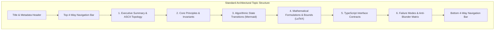

# OLT Architecture Book Authoring & Engineering Charter

---

[Previous: Architecture Index](index.md) | [Chapter Index](index.md) | [All Chapters Index](index.md) | [Next: Chapter 01 Foundations](01-foundations/index.md)

---

## 1. Executive Charter & Architecture Pedagogy

The **OLT Architecture Book (`docs/olt/architecture/`)** constitutes the theoretical, algorithmic, and mathematical bedrock of the OLT (Orchestrating Long Tasks) documentation ecosystem.

In accordance with Daniele Procida's **Diátaxis Documentation Framework** and the **Open Agent Skills Standard (`agentskills.io`)**, the Architecture Book is strictly **Understanding-Oriented (Explanation)**. It does not provide basic step-by-step how-to recipes (which belong in `docs/olt/reference/`), but instead deconstructs the foundational invariants, state machine proofs, concurrency mathematics, graph scheduling algorithms, and cryptographic durability protocols that make autonomous multi-agent engineering mathematically predictable and fail-closed.

```text
+--------------------------------------------------------------------------------------------------+
│                             ARCHITECTURE BOOK PEDAGOGY MATRIX                                    │
+--------------------------------------------------------------------------------------------------+
│                                                                                                  │
│   CORE OBJECTIVE: Explain WHY the system is engineered this way and PROVE its invariants.         │
│                                                                                                  │
│   MANDATORY ELEMENTS ACROSS EVERY CHAPTER TOPIC (250-800 Lines Envelope):                         │
│   1. Executive Summary & Epistemic Motivation                                                    │
│   2. High-Density Box-Drawing ASCII System / Topology Diagram                                    │
│   3. Formal Mathematical Specification (LaTeX Formulations, Recurrences, Bounds)                 │
│   4. Algorithmic Flowcharts & State Transitions (Mermaid Charts)                                 │
│   5. Concrete TypeScript Engine Interface Contracts & Schemas                                    │
│   6. Empirical Failure Modes, Cognitive Blunders & Mechanical Mitigations Table                  │
│   7. Non-Negotiable Architectural Invariants & Verification Receipts                             │
│   8. Universal Clean 4-Way Navigation Mesh (Zero Emojis)                                         │
│                                                                                                  │
+--------------------------------------------------------------------------------------------------+
```

---

## 2. Document Sizing Envelope & Information Density

Every architectural document across the 17 chapters must satisfy rigorous information density criteria:

```text
+-------------------+-------------------+----------------------------------------------------------+
| Classification    | Line Range        | Policy & Architectural Enforcement                       |
+-------------------+-------------------+----------------------------------------------------------+
| Shallow Stub      | < 100 lines       | STRICTLY FORBIDDEN. Merge into cohesive thematic topics. |
| Target Envelope   | 250 - 800 lines   | OPTIMAL SIZING. Deep theoretical prose & rich diagrams.  |
| Upper Catalog     | 800 - 1,200 lines | ACCEPTABLE for exhaustive CLI / schema dictionaries.     |
| Monolith Dump     | > 1,200 lines     | STRICTLY FORBIDDEN. Decompose into modular subtopics.    |
+-------------------+-------------------+----------------------------------------------------------+
```

---

## 3. Structural Taxonomy & Chapter Layout Pattern

Every architectural topic document (`01-01` through `17-05`) follows a standardized 8-section layout:

1. **Title & Document Frontmatter**: Status, topic scope, audience, and target lineage.
2. **Top Clean 4-Way Navigation Bar**: Bidirectional relative links with zero emojis.
3. **Section 1: Executive Summary & Epistemic Foundations**: Theoretical motivation, problem statement, and high-density ASCII box-drawing system topology.
4. **Section 2: Core Architectural Principles & Invariants**: Non-negotiable system guarantees, mathematical definitions, and state invariants.
5. **Section 3: Algorithmic Mechanics & State Transitions**: Step-by-step state diagrams, sequence flows, and process charts in Mermaid.
6. **Section 4: Mathematical Formulations & Proofs**: LaTeX formulas for bounds, complexity orders, hash chains, or convergence properties.
7. **Section 5: Concrete TypeScript Contracts & Schemas**: Type-safe interfaces with `readonly` properties and 0 `any`.
8. **Section 6: Failure Modes, Anti-Blunders & Recovery Playbooks**: Structured error tables with empirical mitigations.
9. **Bottom Clean 4-Way Navigation Bar**: Mirror of top navigation bar with exact relative links.



---

## 4. Strict Style, Diagram & Formatting Invariants

1. **Zero Emojis**: Emojis are strictly banned from navigation bars, section headers, tables, diagrams, and prose across all architecture chapters.
2. **Clean 4-Way Navigation Mesh**: Exactly ONE clean navigation bar at the top (under H1) and ONE at the bottom.
3. **Symbolic Code Links**: All file and symbol references must provide clickable markdown links (e.g. [`topological-scheduler.ts`](file:///Users/onurseckinsenoglu/repos/skills/olt/scripts/src/graph/topological-scheduler.ts)).
4. **Reflog Durability**: Execute `git add -A` upon completing every chapter milestone to guarantee loose Git blob persistence in `.git/objects/`.
5. **Relative Link Integrity**: 100% of relative links must resolve on disk without broken references.

---

## 5. Reviewer Quality & Cognitive Verification Checklist

Before certifying any architectural document as converged, verify:

- [ ] Does the document fall within the 250 to 800 line sizing envelope (or 100-250 lines for index files)?
- [ ] Are all Unicode emojis completely eliminated from the text?
- [ ] Does the document contain at least one high-density ASCII box topology?
- [ ] Does the document contain at least one valid Mermaid diagram?
- [ ] Are all mathematical concepts formalized with LaTeX equations?
- [ ] Are all TypeScript interfaces strict, typed, and free of `any`?
- [ ] Do top and bottom navigation bars match and resolve to valid on-disk files?

---

[Previous: Architecture Index](index.md) | [Chapter Index](index.md) | [All Chapters Index](index.md) | [Next: Chapter 01 Foundations](01-foundations/index.md)

---
