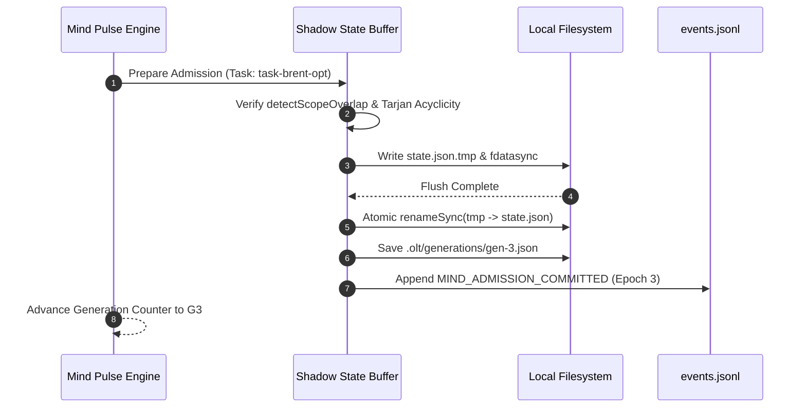

# Atomic Admission Chaining: Generational Lineage, Transactional State Transitions & Rollback Safety

> **Status**: Authoritative Architecture Specification  
> **Topic**: Generational Graph Lineage, Mind Pulse Transaction Cadence, and Two-Phase Atomic DAG Admission  
> **Audience**: Autonomous Mind Engine Developers, Distributed Transaction Specialists, Core Platform Architects

---

## 1. Executive Summary & Conceptual Overview

In long-running autonomous workflows, execution is not static. The OLT Mind Engine continuously pulses (`mind:pulse`), analyzing execution bottlenecks, test gaps, and forensic anomalies to synthesize new self-evolution candidate tasks (`mind:candidate`).

However, dynamically injecting new tasks into an active, running Directed Acyclic Graph (DAG) is fraught with risk:

- **Torn Graph States**: Injecting a task partially can leave broken dependency pointers.
- **Race Conditions**: Admitting a task whose write scope collides with an actively leased worker causes dirty writes.
- **Span Regression**: Admitting poorly structured tasks can artificially bottleneck the critical path, violating Brent Work/Span scaling.

OLT solves this through **Atomic Admission Chaining**: a transactional, two-phase commit protocol governing generational lineage ($G_0 \to G_1 \to \dots \to G_k$). Every admission is validated in memory on a shadow graph, written to disk atomically via rename swaps, recorded in `events.jsonl`, and backed by generational rollback guarantees.

```
       [Mind Pulse Discovers Self-Evolution Candidate Tasks]
                               │
                               ▼
     ┌───────────────────────────────────────────────────┐
     │  Phase 1: Shadow State Staging (In-Memory)        │
     │  - Graph Expansion: $G' = G \cup \Delta G$        │
     │  - Scope Overlap Matrix: `detectScopeOverlap`     │
     │  - Brent Work/Span Re-calculation: $P = \lceil W/S\rceil$ │
     │  - Invariant Verification: Acyclicity & Invariant C6 │
     └─────────────────────────┬─────────────────────────┘
                               │ (All Invariants Passed)
                               ▼
     ┌───────────────────────────────────────────────────┐
     │  Phase 2: Atomic Commit & Epoch Bump              │
     │  - Acquire State Lock (`state.json.lock`)         │
     │  - Write Temp Shadow State + `fdatasync`          │
     │  - Atomic POSIX Rename: `state.json.tmp` -> `state.json` │
     │  - Append `MIND_ADMIT` Event to `events.jsonl`    │
     │  - Snapshot Generation: `.olt/generations/gen-G.json` │
     │  - Advance Epoch: $G_{k+1} \leftarrow G_k + 1$    │
     └───────────────────────────────────────────────────┘
```

---

## 2. Generational Lineage Architecture

The execution lifecycle progresses through discrete generational epochs $G \in \mathbb{N}_0$.

### 2.1 Formal Definition of Generational State

Let the global state at epoch $G_k$ be defined as:
$$\mathcal{S}_k = \langle G_k, \, \mathcal{V}_k, \, \mathcal{E}_k, \, \mathcal{L}_k, \, \mathcal{H}_k \rangle$$
where:

- $G_k \in \mathbb{N}$ is the monotonically increasing generation counter.
- $\mathcal{V}_k$ is the set of all known task definitions at epoch $k$.
- $\mathcal{E}_k$ is the set of active dependency edges.
- $\mathcal{L}_k$ is the active worker lease map.
- $\mathcal{H}_k = \text{SHA-256}(\mathcal{S}_{k-1} \parallel \Delta \mathcal{S}_k)$ is the generational lineage hash.

```
  Epoch G0 (Initial Run Plan)
  └── Epoch G1 (Admitted: task-auth-hardening, ParentHash: 4f8a...12)
      └── Epoch G2 (Admitted: task-perf-brent-opt, ParentHash: c9b2...88)
          └── Epoch G3 (Admitted: task-ui-apca-repair, ParentHash: 71e3...05)
```

Every generation snapshot is preserved in `.olt/generations/gen-{epoch}.json`. This provides an immutable historical audit trail and allows instantaneous point-in-time recovery.

---

## 3. Two-Phase Atomic Admission Protocol

Dynamic admission (`mind:admit`) follows a strict Two-Phase Commit (2PC) pattern to prevent graph corruption.

### 3.1 Phase 1: Prepare & Shadow State Staging (Dry-Run)

During Phase 1, the engine executes purely in memory without modifying persistent state files:

1. **Expansion Calculation**: Compute the candidate graph extension $G' = (V \cup \Delta V, E \cup \Delta E)$.
2. **Scope Overlap Verification**: Check proposed scopes $\Omega(\Delta V)$ against all currently active worker leases $\mathcal{L}_k$:
   $$\forall T_{\text{new}} \in \Delta V, \, \forall T_{\text{leased}} \in \mathcal{L}_k, \quad \text{detectScopeOverlap}(\Omega(T_{\text{new}}), \Omega(T_{\text{leased}})) = \emptyset$$
3. **Brent Work/Span Bounds**: Recompute $W', S', P'$. If the candidate task increases critical span $S' > S_{\text{budget}}$ without proportional work increase, the admission is rejected for schedule bloat.
4. **Graph Invariant Audit**: Validate that $G'$ contains 0 cycles (Tarjan SCC), 0 redundant transitive bypasses, and 100% justified edges (Invariant C6).

If any check fails, Phase 1 aborts. The running DAG and all active leases continue uninterrupted with zero side effects.

---

### 3.2 Phase 2: Atomic Commit & Epoch Promotion

If Phase 1 passes all invariants, Phase 2 commits the transition:

```typescript
export async function commitAdmissionTransaction(
  runRoot: string,
  currentEpoch: number,
  shadowState: GlobalState,
  candidateBatch: readonly CandidateTask[],
): Promise<number> {
  const statePath = join(runRoot, "state.json");
  const tempPath = join(runRoot, `state.json.tmp.${Date.now()}`);
  const lockPath = join(runRoot, "state.json.lock");
  const genPath = join(runRoot, ".olt", "generations", `gen-${currentEpoch + 1}.json`);

  // 1. Acquire exclusive POSIX lock
  const lockFd = openSync(lockPath, "w");
  flockSync(lockFd, "exclusive");

  try {
    // 2. Prepare new generation metadata
    const nextEpoch = currentEpoch + 1;
    const committedState: GlobalState = {
      ...shadowState,
      generation: nextEpoch,
      lastCommittedAt: new Date().toISOString(),
    };

    // 3. Write temp state and flush to physical storage
    const statePayload = JSON.stringify(committedState, null, 2);
    writeFileSync(tempPath, statePayload, "utf-8");
    const tempFd = openSync(tempPath, "r");
    fdatasyncSync(tempFd);
    closeSync(tempFd);

    // 4. Atomic POSIX rename (Atomic swap guarantee on POSIX/APFS)
    renameSync(tempPath, statePath);

    // 5. Write generational snapshot archive
    writeFileSync(genPath, statePayload, "utf-8");

    // 6. Record transaction in immutable event ledger
    atomicAppendEvent(runRoot, {
      id: generateEventId("evt_admit"),
      type: "MIND_ADMISSION_COMMITTED",
      epoch: nextEpoch,
      admittedTasks: candidateBatch.map((c) => c.id),
      timestamp: new Date().toISOString(),
    });

    return nextEpoch;
  } finally {
    // 7. Release lock
    flockSync(lockFd, "unlock");
    closeSync(lockFd);
  }
}
```

```
               [Atomic Rename POSIX Invariant]

     Directory Inode Table (APFS / ext4)
     ┌────────────────────────┐
     │ "state.json"           │ ───> [ Inode 1042: Epoch G1 ] (Active)
     └────────────────────────┘
     ┌────────────────────────┐
     │ "state.json.tmp.1742"  │ ───> [ Inode 1043: Epoch G2 ] (Dirty Write)
     └────────────────────────┘
                 │
                 ▼  renameSync("state.json.tmp.1742", "state.json")
     ┌────────────────────────┐
     │ "state.json"           │ ───> [ Inode 1043: Epoch G2 ] (Atomic Switch)
     └────────────────────────┘
     (Zero-window vulnerability: Readers never observe partial state)
```

---

## 4. Rollback Safety & Crash Resilience

Distributed autonomous agents can encounter hardware faults, token limit terminations, or runtime errors. OLT guarantees complete rollback safety:

### 4.1 Crash Recovery Scenarios

| Failure Point                                     | System State Observed                                    | Recovery Action                                                                       |
| :------------------------------------------------ | :------------------------------------------------------- | :------------------------------------------------------------------------------------ |
| **Crash during Phase 1** (In-memory verification) | `state.json` is at epoch $G_k$; no temp files exist.     | **Zero Recovery Needed**: In-memory shadow state discarded automatically.             |
| **Crash during temp file write**                  | `state.json.tmp.*` exists, but `state.json` is at $G_k$. | **Safe Cleanup**: Engine unlinks orphan `tmp` file; state remains valid at $G_k$.     |
| **Crash after atomic rename**                     | `state.json` is at $G_{k+1}$; event append pending.      | **Deterministic Replay**: Replayer reads $G_{k+1}$ state and emits sync ledger event. |

---

### 4.2 Reversion Mechanics (`mind:rollback`)

If an admitted batch of tasks is determined to be suboptimal or redundant during downstream validation, the supervisor can roll back the entire generation:

```bash
bun olt/scripts/harness.ts mind:rollback --generation 2
```

The rollback engine:

1. Re-loads snapshot `.olt/generations/gen-2.json`.
2. Cancels any unleased tasks introduced in generations $> 2$.
3. Preserves all completed task artifacts and CAS receipts from subsequent generations without re-running finished work.
4. Atomically commits the restored state as generation $G_{\text{new}} = G_{\text{current}} + 1$.



---

## 5. CLI Invocations & Verification Commands

### Triggering Mind Pulse Cadence & Candidate Review

```bash
bun olt/scripts/harness.ts mind:pulse --run .olt/capsules/35-comprehensive-olt-documentation-overhaul
```

### Admitting Candidate Tasks Atomically

```bash
bun olt/scripts/harness.ts mind:admit --candidate cand-perf-opt-01 --rationale "Optimizes critical span S by decoupling documentation waves"
```

### Inspecting Generational Lineage & Snapshots

```bash
bun olt/scripts/harness.ts mind:lineage
```

#### Sample Output

```text
=== Generational DAG Lineage ===
Epoch G0: 8 tasks (Initial Run Blueprint) [Hash: 3f8a91b2]
Epoch G1: +2 tasks (Admitted: task-docs-architecture, task-docs-api) [Hash: c9b20412]
Epoch G2: +1 task  (Admitted: task-brent-optimizer) [Hash: 71e3d09a] (ACTIVE)

Current State: EPOCH 2 | 11 Total Tasks | 0 Cycle Defects | 0 Scope Collisions
```

---

## 6. Summary of Core Invariants

> [!IMPORTANT]
>
> 1. **ACID Admission Invariant**: Dynamic DAG modifications must execute via two-phase shadow staging and atomic rename swaps.
> 2. **Scope Overlap Prohibition**: No task may be admitted if its write scope intersects with any actively leased worker.
> 3. **Generational Preservation**: Every state modification must increment epoch $G$ and archive an immutable snapshot in `.olt/generations/`.
> 4. **Rollback Determinism**: Rolling back to a previous epoch restores topology without corrupting completed CAS evidence blobs.
