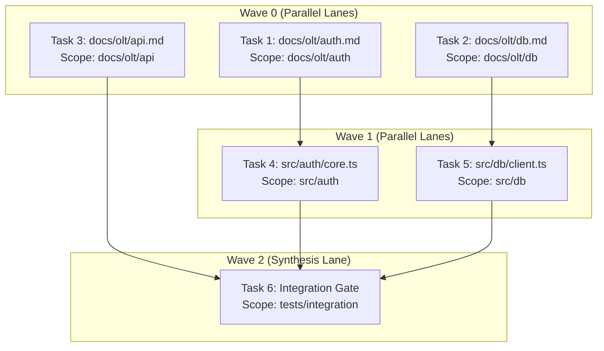

# Brent's Work/Span Concurrency Model & Dynamic Wave Decoupling

> **Status**: Authoritative Architecture Specification  
> **Topic**: Computational DAG Scheduling, Dynamic Wave Decoupling, and Work/Span Scaling Bounds  
> **Audience**: Core Engine Developers, Distributed Systems Architects, Autonomous Swarm Engineers

---

## 1. Executive Summary & Conceptual Overview

Modern multi-agent autonomous engineering frameworks frequently suffer from two opposing failure modes: **artificial serialization** (where independent tasks are scheduled sequentially due to naive linear pipelines) and **unbounded race conditions** (where parallel agents mutate overlapping file scopes simultaneously).

The OLT (Orchestrated Lifecycle Topology) engine solves this fundamental tension through the rigorous application of **Brent's Work/Span Theorem** paired with **Dynamic Wave Decoupling (`detectScopeOverlap`)**. Rather than relying on heuristic task queues or static pipeline stages, OLT compiles agent execution plans into a Directed Acyclic Graph (DAG) of discrete tasks, computes exact Work/Span metrics, and schedules tasks into disjoint topological execution waves.

```
       [Task DAG with Work W and Span S]
                       │
                       ▼
      ┌─────────────────────────────────┐
      │   Topological Graph Compiler    │
      │    - Tarjan SCC Cycle Check     │
      │    - Transitive Reduction       │
      │    - Work/Span Metric Analysis  │
      └─────────────────────────────────┘
                       │
                       ▼
      ┌─────────────────────────────────┐
      │     Dynamic Wave Decoupler      │
      │   `detectScopeOverlap` Matrix   │
      │    Conflict Graph Coloring      │
      └─────────────────────────────────┘
                       │
        ┌──────────────┴──────────────┐
        ▼                             ▼
  ┌───────────┐                 ┌───────────┐
  │  Wave 0   │                 │  Wave 1   │
  │ Lane 1: T1│ (Disjoint Scopes│ Lane 1: T3│
  │ Lane 2: T2│  P = ⌈W/S⌉ ≤ 40)│ Lane 2: T4│
  └───────────┘                 └───────────┘
```

By decoupling tasks with non-overlapping write scopes, OLT maximizes parallel cognition up to $P \le 40$ concurrent execution lanes while guaranteeing deterministic, race-free filesystem mutation.

---

## 2. Theoretical Foundations: Brent's Work/Span Theorem

### 2.1 Formal Definitions

Let an execution plan be modeled as a Directed Acyclic Graph $G = (V, E)$, where:

- $V = \{v_1, v_2, \dots, v_n\}$ represents the set of tasks.
- $E \subseteq V \times V$ represents causal dependency edges: $(u, v) \in E \iff u \prec v$ ($u$ must complete before $v$ can begin).
- Each node $v_i \in V$ has an execution duration (or cognitive effort weight) $t(v_i) \in \mathbb{R}^+$.

We define two fundamental scalar quantities:

#### Total Work ($W$)

The total computational time required to execute all tasks sequentially on a single processor ($P=1$):
$$W = \sum_{i=1}^{n} t(v_i)$$

#### Critical Span ($S$ or $T_\infty$)

The execution time required on an idealized machine with infinitely many processors ($P = \infty$). This corresponds directly to the weight of the **critical path** (the longest directed path from any source node to any sink node):
$$S = \max_{p \in \mathcal{P}(G)} \sum_{v \in p} t(v)$$
where $\mathcal{P}(G)$ denotes the set of all directed paths in graph $G$.

#### Available Parallelism ($P_{\text{ideal}}$)

The average number of independent parallel tasks ready for execution at any instant:
$$P_{\text{ideal}} = \frac{W}{S}, \quad \text{Discrete Optimal Concurrency: } P = \left\lceil \frac{W}{S} \right\rceil$$

---

### 2.2 Brent's Scheduling Theorem

**Brent's Theorem (1974)** states that if a computation graph $G$ with total work $W$ and critical span $S$ is executed on $P$ parallel processors using a greedy schedule (one where no processor is kept arbitrarily idle if a task is ready), the total execution time $T_P$ is bounded above and below:

#### Lower Bound

$$T_P \ge \max\left(\left\lceil \frac{W}{P} \right\rceil, S\right)$$

#### Upper Bound

$$T_P \le \left\lfloor \frac{W - S}{P} \right\rfloor + S$$

```
Execution Time (Tp)
 ^
 │   Lower Bound: max(⌈W/P⌉, S)
 │   Upper Bound: ⌊(W - S)/P⌋ + S
 │
 │   |\
 │   | \
 │   |  \
 │   |   \_________  Upper Bound: ⌊(W-S)/P⌋ + S
 │   |    \________  Lower Bound: max(⌈W/P⌉, S)
 │   |             \____________________ Critical Span S (Asymptote)
 └─────────────────────────────────────────> Processors (P)
     1     2    ...   P=⌈W/S⌉        40
```

#### Analytical Estimation in OLT Forensics

The OLT scheduler computes estimated completion time $T_P$, speedup $S_P$, and parallel efficiency $E_P$ across processor configurations $P \in [1, 40]$:

$$T_P \approx \max\left(\left\lceil \frac{W}{P} \right\rceil, \min\left(\left\lfloor \frac{W - S}{P} \right\rfloor + S, \left\lfloor \frac{W}{P} + S\left(1 - \frac{1}{P}\right) \right\rfloor\right)\right)$$

$$\text{Speedup } S_P = \frac{W}{T_P}, \qquad \text{Parallel Efficiency } E_P = \frac{W}{P \cdot T_P} = \frac{S_P}{P}$$

> [!NOTE]
> When $P = 1$, $T_1 = W$ and efficiency $E_1 = 1.0$ (100%).  
> When $P \to \infty$, $T_\infty = S$. Adding more processors beyond $P = \lceil W / S \rceil$ yields diminishing returns ($E_P < 0.5$) because execution is strictly bounded by the critical path span $S$.

---

## 3. Dynamic Wave Decoupling Algorithm

### 3.1 The Scope Overlap Problem

In multi-agent code generation, parallel tasks that write to overlapping directory trees or identical files produce merge conflicts, non-deterministic state corruption, and race conditions. Conversely, forcing all tasks into a single sequential queue inflates the critical span $S \to W$, reducing parallelism to $P = 1$.

OLT implements dynamic write-scope analysis via `detectScopeOverlap`.

### 3.2 Formal Definition of `detectScopeOverlap`

Let $\mathcal{F}$ be the set of all normalized filesystem paths in the repository. Each task $T_i$ declares an assigned write scope $\Omega(T_i) \subseteq \mathcal{F}$, represented as a set of file paths, directory prefixes, or glob patterns:
$$\Omega(T_i) = \{p_{i,1}, p_{i,2}, \dots, p_{i,m}\}$$

Two tasks $T_a$ and $T_b$ are **disjoint** if and only if their write scopes do not intersect:
$$\Omega(T_a) \cap \Omega(T_b) = \emptyset$$

```typescript
export function detectScopeOverlap(
  scopeA: readonly string[],
  scopeB: readonly string[],
): readonly ScopeOverlapConflict[] {
  const conflicts: ScopeOverlapConflict[] = [];

  for (const pathA of scopeA) {
    const normA = normalizePath(pathA);
    for (const pathB of scopeB) {
      const normB = normalizePath(pathB);

      // Case 1: Exact path match
      if (normA === normB) {
        conflicts.push({ pathA, pathB, reason: "EXACT_PATH_MATCH" });
        continue;
      }

      // Case 2: Parent-child directory containment
      if (normA.startsWith(normB + "/") || normB.startsWith(normA + "/")) {
        conflicts.push({ pathA, pathB, reason: "DIR_ANCESTRY_COLLISION" });
        continue;
      }

      // Case 3: Glob intersection
      if (globIntersects(normA, normB)) {
        conflicts.push({ pathA, pathB, reason: "GLOB_PATTERN_INTERSECTION" });
      }
    }
  }
  return conflicts;
}
```

```
                       [Scope Conflict Resolution Matrix]

     Task A Scope               Task B Scope              Conflict Result
  ┌─────────────────┐       ┌─────────────────┐       ┌───────────────────────┐
  │ src/auth/login  │   vs  │ src/db/schema   │  ───> │ DISJOINT (Wave Lane)  │
  └─────────────────┘       └─────────────────┘       └───────────────────────┘
  ┌─────────────────┐       ┌─────────────────┐       ┌───────────────────────┐
  │ src/auth/login  │   vs  │ src/auth/       │  ───> │ OVERLAP (Serial Edge) │
  └─────────────────┘       └─────────────────┘       └───────────────────────┘
  ┌─────────────────┐       ┌─────────────────┐       ┌───────────────────────┐
  │ src/api/*.ts    │   vs  │ src/api/user.ts │  ───> │ OVERLAP (Serial Edge) │
  └─────────────────┘       └─────────────────┘       └───────────────────────┘
```

---

### 3.3 Dynamic Wave Formulation & Conflict Graph Coloring

Given a DAG $G = (V, E)$, the scheduler partitions tasks into sequential execution **waves** $W_0, W_1, \dots, W_k$ such that:

1. **Causal Prerequisite Invariant**: For every task $v \in W_m$, all predecessors $\text{Pred}(v) = \{u \mid (u, v) \in E\}$ must belong to earlier waves:
   $$\forall u \in \text{Pred}(v), \quad \text{wave}(u) < \text{wave}(v)$$
2. **Disjoint Scope Invariant**: For any two distinct tasks $u, v \in W_m$ executed concurrently in the same wave:
   $$\text{detectScopeOverlap}(\Omega(u), \Omega(v)) = \emptyset$$



---

## 4. Concurrency Model Comparison: Amdahl vs Gustafson vs Brent

Distributed LLM multi-agent orchestration exhibits fundamentally different scaling dynamics compared to classical parallel processing.

| Metric / Dimension      | Amdahl's Law                                                       | Gustafson's Law                                                     | Brent's Work/Span (OLT)                                                         |
| :---------------------- | :----------------------------------------------------------------- | :------------------------------------------------------------------ | :------------------------------------------------------------------------------ |
| **Primary Formula**     | $S_{\text{latency}} = \frac{1}{(1-p) + \frac{p}{s}}$               | $S_{\text{scaled}} = s - \alpha(s - 1)$                             | $T_P \le \frac{W - S}{P} + S$                                                   |
| **Workload Assumption** | Fixed problem size; serial fraction $\alpha = 1-p$ limits scaling. | Scaled problem size; serial work remains constant as problem grows. | Dynamic DAG of discrete cognitive steps with non-uniform weights.               |
| **Limiting Factor**     | Latency asymptote at $\frac{1}{1-p}$.                              | Scale bounded only by available memory / processors.                | Bounded strictly by Critical Span $S = \text{max path}$.                        |
| **LLM Agent Reality**   | Inaccurate: Problem decomposed dynamically across waves.           | Inaccurate: Context limits prevent unbounded problem expansion.     | **Accurate**: Computes exact lane saturation based on write-scope disjointness. |

```
Speedup (Sp)
 ^
 │                                  / Gustafson's Scaled Linear
 │                                 /
 │                  ==============/== Brent Bound: Sp ≤ W / max(⌈W/P⌉, S)
 │                /              /
 │              /               /
 │            /  _____________ /_____ Amdahl's Asymptote: 1/(1-p)
 │          /   /
 │         /   /
 └─────────────────────────────────────────> Processors / Lanes (P)
     1     2    ...   P=⌈W/S⌉        40
```

---

## 5. Parallel Lane Scaling Bounds ($\le 40$ Lanes)

OLT enforces a mechanical upper bound of **40 parallel lanes** per coordinator wave. This bound is derived from empirical telemetry and distributed resource constraints:

1. **Subagent Host FD / Memory Limits**: 40 concurrent Bun/Node subprocesses stay well within OS file descriptor limits (`ulimit -n 4096`) and subagent host memory budgets (approx. 150MB per worker $\approx 6\text{GB}$ total).
2. **Provider Rate Limit Thresholds**: LLM API providers enforce Tier 4/5 rate limits of 10,000–30,000 RPM. A 40-lane parallel burst consumes approximately 40 concurrent prompt streams without triggering `429 Too Many Requests`.
3. **Lockless Merge Overhead**: Beyond 40 disjoint directory partitions, filesystem metadata contention (APFS / ext4 directory inodes) begins to introduce non-linear lock wait times during simultaneous file writes.

$$\text{Optimal Lane Dispatch: } P_{\text{dispatched}} = \min\left(40, \left\lceil \frac{W}{S} \right\rceil, |W_{\text{ready}}|\right)$$

---

## 6. Anti-Serialization Enforcement: `FALSE_SERIALIZATION_BLUNDER`

When the DAG contains $N \ge 2$ ready tasks in the current wave with mutually disjoint write scopes, the coordinator is **mechanically prohibited** from dispatching them sequentially.

```
       Coordinator Receives Ready Wave: [Task-A, Task-B, Task-C]
                               │
                Is Scope(A) ∩ Scope(B) ∩ Scope(C) = ∅?
                               │
               ┌───────────────┴───────────────┐
              YES                              NO
               │                               │
    Did Coordinator dispatch       Group overlapping tasks into
      single subagent?              sequential dependent waves
               │
      ┌────────┴────────┐
     YES                NO
      │                 │
      ▼                 ▼
  [ERROR: FALSE_    [PASS: Full Parallel Batch]
   SERIALIZATION_    Dispatch Subagents: [A, B, C]
   BLUNDER]
```

If a coordinator attempts single-threaded simulation, the OLT harness raises a fatal defect:

```text
[FALSE_SERIALIZATION_BLUNDER] Wave 2 contains 3 ready disjoint lanes (task-auth, task-billing, task-ui).
You MUST invoke all 3 subagents in parallel via Subagents: [...].
Single-thread sequential simulation is prohibited.
```

---

## 7. Concrete CLI Workflows & Telemetry

### Inspecting DAG Work/Span Metrics

To analyze the Work ($W$), Span ($S$), Ideal Concurrency ($P$), and Brent speedup curves for any active run:

```bash
bun olt/scripts/harness.ts dag:forensics --run .olt/capsules/35-comprehensive-olt-documentation-overhaul
```

#### Sample Output

```text
=== Work/Span Analysis & Brent Bounds ===
Total Work (W): 48.0 min (8 tasks)
Critical Span (S): 12.0 min (Critical Path: task-1 -> task-4 -> task-8)
Ideal Parallelism (P = ⌈W/S⌉): 4 lanes

Brent Bounds Across Processors:
  P=1:  Tp=48.0m, Speedup=1.00x, Efficiency=100.0%
  P=2:  Tp=30.0m, Speedup=1.60x, Efficiency=80.0%
  P=4:  Tp=21.0m, Speedup=2.29x, Efficiency=57.1% (Optimal Brent Coordinate)
  P=8:  Tp=16.0m, Speedup=3.00x, Efficiency=37.5%
  P=40: Tp=12.0m, Speedup=4.00x, Efficiency=10.0% (Span Bound S=12m reached)
```

### Viewing Topological Parallel Waves

```bash
bun olt/scripts/harness.ts dag:view --run .olt/capsules/35-comprehensive-olt-documentation-overhaul
```

---

## 8. Summary of Core Invariants

> [!IMPORTANT]
>
> 1. **Brent Work/Span Invariant**: Every DAG must calculate $W = \sum t_i$, $S = \text{span}$, and $P = \lceil W / S \rceil$ before task leasing.
> 2. **Disjoint Scope Invariant**: Concurrent tasks within any wave must satisfy $\text{detectScopeOverlap}(\Omega_a, \Omega_b) = \emptyset$.
> 3. **Anti-Serialization Invariant**: Ready disjoint wave lanes must be dispatched simultaneously in parallel arrays; single-thread simulation triggers `FALSE_SERIALIZATION_BLUNDER`.
> 4. **40-Lane Bound**: Dynamic wave width is bounded by $P \le 40$ to preserve system stability and rate limit headroom.
